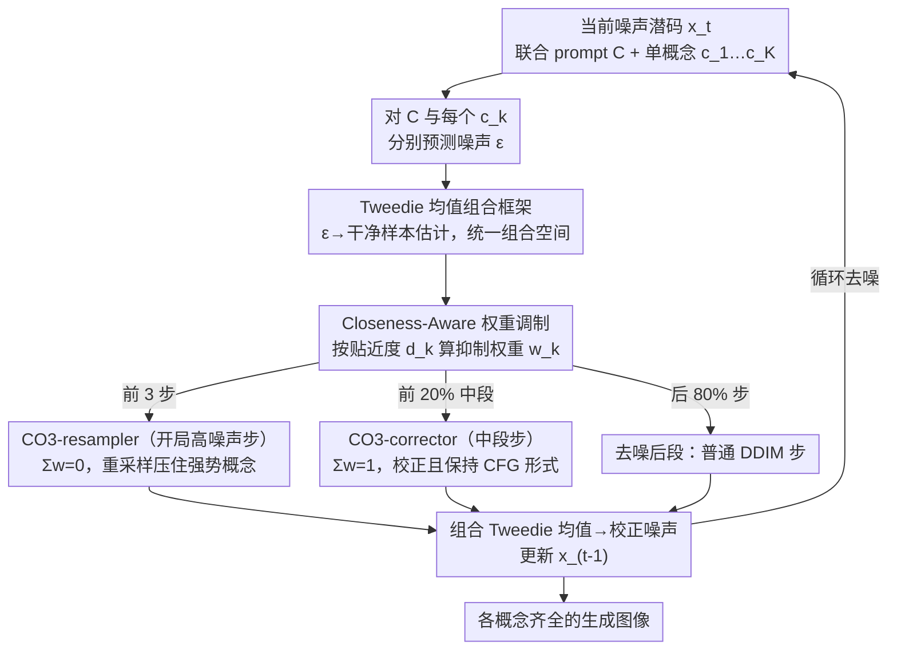

# Steer Away From Mode Collisions: Improving Composition In Diffusion Models

**会议**: ICLR 2026  
**arXiv**: [2509.25940](https://arxiv.org/abs/2509.25940)  
**代码**: [https://github.com/debottam-dutta7/co3](https://github.com/debottam-dutta7/co3)  
**领域**: 扩散模型 / 组合生成  
**关键词**: 组合生成, Mode Collision, Tweedie Mean 组合, 无梯度校正, 即插即用  

## 一句话总结

针对扩散模型多概念 prompt 中的概念缺失/碰撞问题，提出"模式碰撞"假说（联合分布与单概念分布的模式重叠），设计 CO3（Concept Contrasting Corrector）通过在 Tweedie 均值空间中组合校正分布 $\tilde{p}(x|C) \propto p(x|C) / \prod_i p(x|c_i)$ 来远离退化模式，实现即插即用、无梯度、模型无关的组合生成改进。

## 研究背景与动机

**领域现状**：扩散模型在文本到图像生成方面取得巨大突破，但即使是简单的多概念 prompt（如"a cat and a dog"），也时常出现概念缺失、模糊或不自然融合的问题。

**现有痛点**：
   - 基于优化的校正方法（Attend-Excite, SynGen, ToMe）需要对模型做梯度计算，是模型相关的
   - 可组合扩散方法（Composable Diffusion）模型无关但效果差，因为线性分数组合在 $t>0$ 时不对应正确的前向分布
   - 两者各有长短但无统一框架

**核心矛盾**：多概念 prompt 的联合分布 $p(x|C)$ 存在"问题模式"——这些模式与单概念分布 $p(x|c_i)$ 高度重叠，导致生成偏向某个强势概念。

**本文目标** (i) 理论上分析并统一现有方法（校正 vs 组合扩散）；(ii) 设计一个无训练、无梯度、模型无关的采样校正策略来改善多概念组合。

**切入角度**：提出"模式碰撞"假说——当 $p(x|C)$ 的某些模式与 $p(x|c_i)$ 重叠时，采样会倾向该单概念。解决思路是设计一个校正分布来抑制这些重叠区域。

**核心 idea**：通过 $\tilde{p}(x|C) \propto p(x|C) / \prod_i p(x|c_i)$ 远离单概念主导的退化模式，并证明 Tweedie 均值组合是一个统一框架。

## 方法详解

### 整体框架

CO3（Concept Contrasting Corrector）要解决的是「a cat and a dog」这类多概念 prompt 里某个概念把别的概念吞掉的问题。它不动模型、不算梯度，而是在标准 DDIM 采样的去噪循环里插一个校正器：每一步先对联合 prompt $C$ 和各单概念 $c_1,\dots,c_K$ 分别跑一次噪声预测，把它们都映射到同一个 **Tweedie 均值空间**里组合；组合时各概念的负权重由当前样本和它的「贴近度」动态算出；再按当前处于哪个去噪阶段切换两种组合规则——开局高噪声步用 **CO3-resampler**（权重和为 0）先把强势概念压下去，中段步用 **CO3-corrector**（权重和为 1）做精细校正，去噪后段则退回普通 DDIM。整个校正只发生在去噪的前 20% 步骤内，输出是一张各概念都没缺失的图像。

### 关键设计

**1. Tweedie 均值组合框架：把分布组合从分数空间挪到 Tweedie 均值空间，统一两类方法**

可组合扩散直接在分数（噪声预测）空间做线性组合，问题是在 $t>0$ 时这种组合并不对应任何合法的前向分布，于是样本被推出分布、出伪影。CO3 改在 Tweedie 均值空间组合：每个条件的噪声预测先映射成对干净样本的估计 $\hat{x}_{\text{tweedie}}[\epsilon_t^{\lambda,c}] = x_t - \sigma_t \epsilon_t^{\lambda,c}$，再按权重叠加

$$\tilde{x}_{\text{tweedie}} = w_0 \hat{x}_{\text{tweedie}}[\epsilon_t^{\lambda,C}] + \sum_{k=1}^K w_k \hat{x}_{\text{tweedie}}[\epsilon_t^{\lambda,c_k}].$$

这个框架的价值在于 Proposition 1 揭示的权重约束：当 $\sum_k w_k = 1$ 时，组合后的 Tweedie 均值仍是一个合法的 Tweedie 均值，对应后面的 CO3-corrector；当 $\sum_k w_k = 0$ 时它退化成加权噪声，对应 CO3-resampler（这一支只在 $t=T$ 处有严格理论保证）。正是这一个约束把已有的校正方法和可组合扩散统一进同一张图里——后面两个去噪阶段不过是这套框架在不同权重和下的两种实例。

**2. Closeness-Aware 概念权重调制：离当前样本越近的概念，抑制得越狠**

各单概念该用多大的负权重不应固定，而要看它此刻有多「主导」。CO3 计算当前联合噪声预测 $\epsilon^C$ 与每个概念噪声 $\epsilon^{c_k}$ 的贴近度（距离）$d_k$，用指数核 $a_k = \exp(-\beta d_k)$ 把距离转成亲和度——越近亲和度越高，归一化后取负作为该概念的抑制权重

$$w_k = -\,a_k \Big/ \sum_j a_j.$$

于是离当前生成方向最近、最容易吞掉别人的那个概念会被压得最重，实现一种随采样动态平衡的抑制。这组权重同时喂给下面两个阶段的组合规则。

**3. CO3-resampler：在开局高噪声步重采样起始噪声，先把强势概念压下去**

去噪最前面的几步噪声占主导，此时直接把当前 $x_t$ 替换成各概念噪声的加权组合（权重和为 0），相当于从一个「概念已被抑制」的分布里重新采样起点。实验发现重采样在 $t$ 越大时收益越明显，所以它专门负责开局阶段，把「a cat and a dog」里某个概念一上来就吞掉另一个的倾向先扳回来。

**4. CO3-corrector：在中段步校正 Tweedie 均值，并保持 CFG 形式不外溢**

开局之后切换到权重和为 1 的校正：联合 prompt 给正权重 $w_0 > 0$，各单概念给上一步算出的负权重 $w_1,\dots,w_K < 0$ 起抑制作用。关键在于这样组合出来的噪声预测仍然写得回 CFG 的标准形式

$$\tilde{\epsilon}_t^{\tilde{\lambda},C} = \epsilon_t^\phi + \lambda\Big(\sum_k w_k \epsilon_t^{c_k} - \epsilon_t^\phi\Big),$$

也就是无条件项与条件项的比例没有被破坏。可组合扩散用的是任意 $\lambda_i$ 的线性组合，会打乱这个比例从而把样本推到分布之外；CO3-corrector 通过 $\sum w_k = 1$ 锁住 CFG 结构，既做了概念抑制又不产生 OOD 伪影。

### 损失函数 / 训练策略

无训练方法。基于 SDXL，50步 DDIM 采样，guidance scale $\lambda=5.0$，校正应用在前 20% 步骤中，前 3 步用 resampler，后续用 corrector。$\beta=0.8$。

## 实验关键数据

### 主实验（两概念 prompt，Attend-Excite 基准）

| 方法 | 无训练 | 无梯度 | 模型无关 | ImageReward (A-A) | ImageReward (A-O) | ImageReward (O-O) |
|------|--------|--------|---------|----------|----------|----------|
| SDXL | ✓ | ✓ | - | 0.782 | 1.547 | 0.679 |
| Attend-Excite | ✓ | ✗ | ✗ | 0.824 | 1.238 | 0.874 |
| InitNO | ✓ | ✗ | ✓ | 1.008 | 1.393 | 1.138 |
| Tweediemix | ✓ | ✓ | ✓ | 1.002 | 1.313 | 0.796 |
| **CO3 (ours)** | ✓ | ✓ | ✓ | **1.234** | **1.674** | **1.016** |

### 消融实验（逐步加入组件）

| 配置 | ImageReward Avg | BLIP-VQA Avg |
|------|----------------|-------------|
| SDXL base | 0.843 | — |
| + Resampling | 0.944 | — |
| + Corrector | 0.946 | — |
| + Weight modulation | **1.012** | — |

### 关键发现

- CO3 在是唯一同时满足无训练、无梯度、模型无关三个属性的高性能方法，但在所有指标上匹敌或超过需要梯度的方法
- 权重和为 1 的约束至关重要——它保持了 CFG 形式，而任意权重的可组合扩散容易产生分布外样本
- Resampler 和 Corrector 发挥互补作用：resampler 在高噪声阶段有效，corrector 在中间阶段生效
- 权重调制贡献显著（Avg 从 0.946→1.012），说明自适应抑制比固定权重更有效
- 在复杂 prompt（T2ICompBench）和稀有概念（RareBench）上也优于专门设计的方法（如 R2F）

## 亮点与洞察

- **理论统一性强**：Proposition 1 将现有的校正方法和可组合扩散统一到 Tweedie 均值组合框架下，揭示了权重约束的关键作用（$\sum w_k = 1$ 保持 CFG 形式 vs $\sum w_k = 0$ 做重采样）。这个统一视角本身就很有价值
- **模式碰撞假说**：用 $p(x|C) / \prod_i p(x|c_i)$ 抑制与单概念重叠的退化模式，直觉清晰且有实验支持。实验结果间接验证了这个假说
- **完全即插即用**：不需要修改模型、不需要梯度、不需要额外训练，可直接应用到任何扩散模型上

## 局限与展望

- 每个去噪步需要对 $K+1$ 个条件分别运行噪声预测，推理开销随概念数线性增长
- 仅在 SDXL 上验证，虽然声称模型无关但未在 DiT 架构（Flux/SD3）上测试
- CO3-resampler 在 $t < T$ 时理论上不严格成立，虽然实验中 $t \approx 0.9T$ 前有效但缺乏严格保证
- 权重调制中的 $\beta$ 参数和校正步数比例需要手动设定
- 概念分解依赖于 prompt 解析，对复杂自然语言 prompt 的分解质量未讨论

## 相关工作与启发

- **vs Attend-Excite**: AE 通过注意力图优化来绑定属性，需要梯度且架构相关；CO3 从模式层面解决问题，理论视角更高
- **vs Composable Diffusion**: 同样是模型无关的分数组合，但可组合扩散用任意权重的线性组合，CO3 证明了权重约束是关键
- **vs Tweediemix**: 同样在 Tweedie 空间操作，但 Tweediemix 需要 LoRA 微调阶段，CO3 纯采样时间校正
- 模式碰撞假说可能启发对扩散模型训练动态的更深入理解

## 评分

- 新颖性: ⭐⭐⭐⭐ 模式碰撞假说新颖，Tweedie 均值组合的统一理论有洞察力
- 实验充分度: ⭐⭐⭐⭐ 多基准（简单/复杂/稀有 prompt），消融完整，人工评估
- 写作质量: ⭐⭐⭐⭐ 理论推导清晰，但符号较多，阅读门槛较高
- 价值: ⭐⭐⭐⭐ 即插即用的组合生成改进有很高实用价值

<!-- RELATED:START -->

## 相关论文

- [\[ICLR 2026\] Compose Your Policies! Improving Diffusion-based or Flow-based Robot Policies via Test-time Distribution-level Composition](compose_your_policies_improving_diffusion-based_or_flow-based_robot_policies_via.md)
- [\[ICLR 2026\] Self-Improving Loops for Visual Robotic Planning](self-improving_loops_for_visual_robotic_planning.md)
- [\[ICLR 2026\] Improving Discrete Diffusion Unmasking Policies Beyond Explicit Reference Policies (UPO)](improving_discrete_diffusion_unmasking_policies_beyond_explicit_reference_polici.md)
- [\[ICCV 2025\] Less is More: Improving Motion Diffusion Models with Sparse Keyframes](../../ICCV2025/image_generation/less_is_more_improving_motion_diffusion_models_with_sparse_keyframes.md)
- [\[CVPR 2026\] Editing Away the Evidence: Diffusion-Based Image Manipulation and the Failure Modes of Robust Watermarking](../../CVPR2026/image_generation/editing_away_the_evidence_diffusion-based_image_manipulation_and_the_failure_mod.md)

<!-- RELATED:END -->
