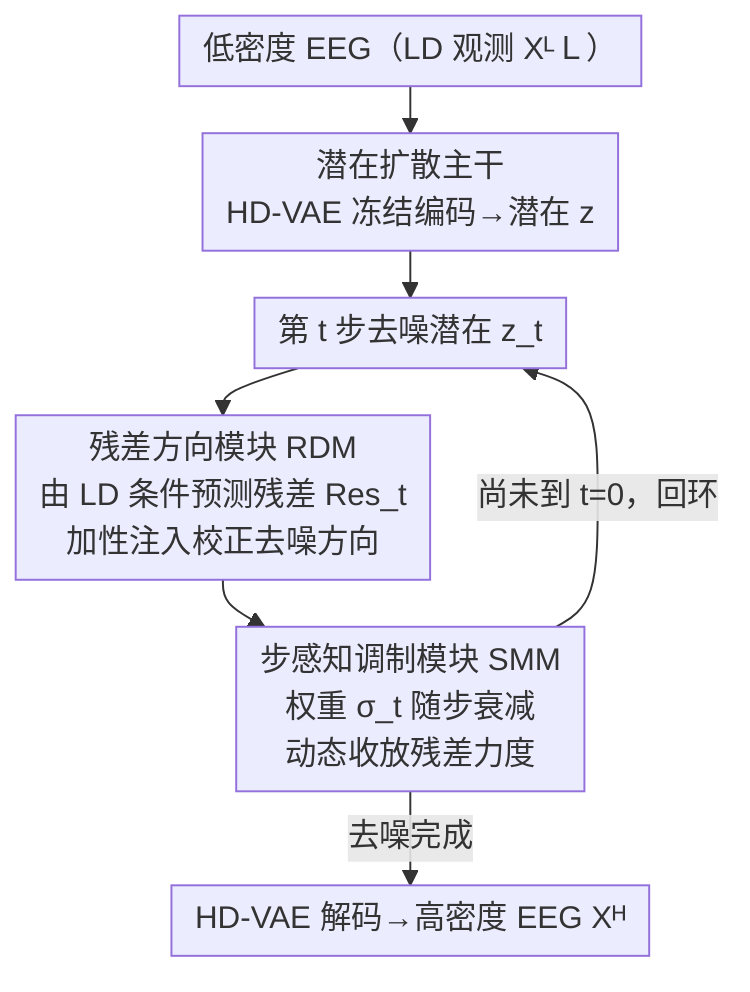

# Step-Aware Residual-Guided Diffusion for EEG Spatial Super-Resolution

**会议**: ICLR 2026  
**arXiv**: [2510.19166](https://arxiv.org/abs/2510.19166)  
**代码**: [GitHub](https://github.com/DhrLhj/ICLR2026SRGDiff)  
**领域**: 扩散模型 / 脑电信号 / 超分辨率  
**关键词**: EEG超分辨率, 残差引导扩散, 步感知调制, 脑机接口, 条件生成

## 一句话总结

提出 SRGDiff，一种步感知残差引导的扩散模型，将 EEG 空间超分辨率重新定义为动态条件生成任务，通过每步残差方向校正和步依赖仿射调制实现高保真重建。

## 研究背景与动机

EEG（脑电图）是无创脑活动监测技术，广泛应用于脑机接口、癫痫诊断、情感识别等领域。然而：

**空间分辨率受限**：高密度（HD）系统成本高、佩戴不便；低密度（LD）系统（8-16电极）实用但采样偏差严重

**现有超分辨率方法的问题**：
   - 直接特征映射方法（CNN/Transformer）过度简化非线性依赖，结果平滑
   - 基于GAN的方法需大量数据和计算
   - 扩散模型的静态条件策略导致分布偏移与失真的折中

**核心挑战**：保真度（fidelity，生成HD-like内容）与一致性（consistency，与LD观测一致）之间的矛盾。

## 方法详解

### 整体框架

SRGDiff 把 EEG 空间超分辨率（从低密度 $X^L\in\mathbb{R}^{C_L\times Length}$ 恢复高密度 $X^H\in\mathbb{R}^{C_H\times Length}$，$C_H>C_L$）放到潜在扩散空间里做：先用一个在 HD EEG 上预训练好的 VAE 把信号压进潜在空间，再让一个残差引导的去噪网络以 LD 观测为条件逐步还原 HD 潜在。它的关键不是把 LD 当成一个静态条件塞进去，而是在每一步去噪时都预测一个"该往哪个方向修"的残差，并用一个随时间步变化的调制因子动态控制这个残差的力度，从而在保真度和与 LD 观测的一致性之间逐步取得平衡。整套流程是「冻结 VAE 编码 → 残差引导的逐步去噪（RDM 定方向、SMM 调力度，回环迭代）→ VAE 解码」。

### 关键设计

**1. 潜在扩散主干：把超分挪到压缩潜在空间**

EEG 原始波形长且噪声大，直接在信号域做扩散既慢又难稳定。SRGDiff 先在 HD EEG 上训练一个 VAE 编码器-解码器，训练损失同时含逐点重建项、STFT 频谱保真项和 KL 正则项——频谱项的加入是为了保住 EEG 在频域的节律结构，而不只是把波形拟合平。VAE 收敛后参数冻结，后续扩散全部在它给出的潜在 $z$ 上进行，既压缩了维度也提供了一个对频谱友好的表示空间。

**2. 残差方向模块（RDM）：给每一步去噪提供方向性校正**

普通条件扩散只把 LD 信息当背景，去噪方向完全交给网络自己学，容易偏离真实 HD 内容。RDM 的做法是显式学习"当前噪声潜在离干净潜在还差多少"：定义残差标签 $\delta z_t = z_0 - z_t$，即 HD 干净潜在与第 $t$ 步噪声化潜在之差，再用一个轻量卷积预测器 $R_\phi$ 从 LD 条件 $c$ 和步嵌入 $\tau(t)$ 预测这个残差 $Res_t = R_\phi(\tau(t), c)$，并以 $\mathcal{L}_{res}=\sum_t\|Res_t-\delta z_t\|_2^2$ 监督。预测出的残差通过加性方式注入去噪结果 $\hat{z}_t^{RDM}=\text{LayerNorm}(\hat{z}_t)+Res_t$。这样每一步去噪都被一个明确指向 HD 真值的方向拉一把，而不是单纯依赖 LD 作静态先验。

**3. 步感知调制模块（SMM）：让残差的影响随去噪进程动态收放**

残差校正在扩散早期（高噪声、结构未定）应该强一些以确立大致形态，在后期（细节阶段）则应让出空间给逐点去噪，否则会反过来引入失真。SMM 先把 LD 特征 $h_t$ 与时间步嵌入 $e_t$ 用一个随步线性衰减的权重 $\sigma_t$ 融合成 $\widetilde{h}_t=\sigma_t h_t+(1-\sigma_t)e_t$，再据此预测通道级的仿射缩放与偏置，对 RDM 的输出做调制 $\hat{z}_t^{SMM}=\gamma_t\odot\hat{z}_t^{RDM}+\beta_t^c$。由于 $\sigma_t$ 随时间步衰减，残差条件的话语权也随之从强到弱，正好对应"先定形、后修细"的去噪节奏，把保真度与一致性的折中显式地编排进了每一步。

### 损失函数 / 训练策略

训练分两阶段：第一阶段只用 HD 数据预训练 VAE 并冻结；第二阶段在冻结潜在空间上训练残差引导扩散，总损失把标准去噪项、残差监督项和 SMM 正则项合在一起：

$$\mathcal{L}_{\text{Stage 2}} = \mathbb{E}[\|\epsilon - \epsilon_\theta(z_t, t, c)\|_2^2] + \lambda_{res}\sum_t\|R_\varphi(c,t) - (z_0 - z_t)\|_2^2 + \lambda_{SMM}(\|\gamma_t - 1\|_2^2 + \|\beta_t\|_2^2)$$

其中残差项对齐 RDM 的预测方向，SMM 正则把缩放 $\gamma_t$ 拉向 1、偏置 $\beta_t$ 拉向 0，避免调制过度而破坏扩散的稳定性。

## 实验

### 数据集
- **SEED**：62通道，1000Hz，情绪识别（正/中/负）
- **SEED-IV**：62通道，4种情绪
- **Localize-MI**：256通道，8000Hz，癫痫刺激

### 主要结果（Localize-MI）

| 方法 | 2× SNR | 4× SNR | 8× SNR | 16× SNR |
|------|--------|--------|--------|---------|
| SaSDim | 5.74 | 4.38 | 3.55 | 2.77 |
| SADI | 5.75 | 4.37 | 3.55 | 2.89 |
| RDPI | 5.73 | — | — | — |
| ESTformer | 基线 | 基线 | 基线 | 基线 |
| STAD | 基线+ | 基线+ | 基线+ | 基线+ |
| **SRGDiff** | **最佳** | **最佳** | **最佳** | **最佳** |

### 关键改进
- 在最具挑战性的8×设置中，相对SNR提升约75%
- 地形图可视化和EEG-FID指标均显著改善
- 有效缓解了低密度-高密度录制间的空间-频谱偏移

### 三级评估协议
1. **信号级**：SNR、NMSE、PCC（时间一致性、频谱保真、空间拓扑）
2. **特征级**：EEG-FID（表示质量）
3. **下游级**：分类精度

### 消融实验

| 组件 | SNR变化 |
|------|--------|
| 无 RDM | 显著下降 |
| 无 SMM | 中等下降 |
| 静态条件（拼接/交叉注意力） | 低于动态条件 |
| 完整 SRGDiff | 最佳 |

## 亮点

1. **动态条件生成范式**：将 LD 前向噪声轨迹与 HD 逆向去噪轨迹耦合
2. **残差引导方向**：不同于静态条件，每步提供方向性校正
3. **全面的三级评估**：超越逐点误差，涵盖信号、特征和下游任务
4. **跨数据集和跨尺度的鲁棒性**

## 局限性

1. 需要预训练 VAE 和两阶段训练，流程较复杂
2. 依赖于 LD 通道与 HD 通道的空间对应关系
3. 扩散模型的推理速度限制了实时 BCI 应用
4. 在极端超分辨率倍数（如16×）下精度仍有提升空间

## 相关工作

- **EEG超分辨率**：EEGSR-GAN、ESTformer、STAD、DDPM-EEG
- **时间序列扩散**：Diffusion-TS、SaSDim、SADI
- **残差扩散**：PET-MRI残差合成、事件驱动视频残差重建

## 评分

- **创新性**: ⭐⭐⭐⭐ — 残差引导+步感知调制在EEG领域新颖
- **实用性**: ⭐⭐⭐⭐ — 对低成本BCI设备有重要价值
- **实验**: ⭐⭐⭐⭐⭐ — 三级评估协议设计全面
- **写作**: ⭐⭐⭐⭐ — 方法描述清晰，消融充分

<!-- RELATED:START -->

## 相关论文

- [\[CVPR 2026\] Physics-Consistent Diffusion for Efficient Fluid Super-Resolution via Multiscale Residual Correction](../../CVPR2026/image_generation/physics-consistent_diffusion_for_efficient_fluid_super-resolution_via_multiscale.md)
- [\[AAAI 2026\] Mixture of Ranks with Degradation-Aware Routing for One-Step Real-World Image Super-Resolution](../../AAAI2026/image_generation/mixture_of_ranks_with_degradation-aware_routing_for_one-step_real-world_image_su.md)
- [\[AAAI 2026\] Realism Control One-step Diffusion for Real-World Image Super-Resolution](../../AAAI2026/image_generation/realism_control_one-step_diffusion_for_real-world_image_super-resolution.md)
- [\[CVPR 2026\] DUO-VSR: Dual-Stream Distillation for One-Step Video Super-Resolution](../../CVPR2026/image_generation/duo-vsr_dual-stream_distillation_for_one-step_video_super-resolution.md)
- [\[ICML 2026\] Let EEG Models Learn EEG](../../ICML2026/image_generation/let_eeg_models_learn_eeg.md)

<!-- RELATED:END -->
