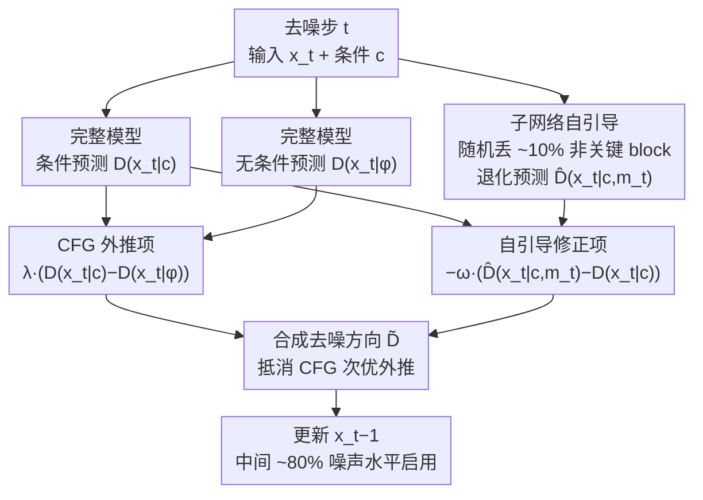

# Stochastic Self-Guidance for Training-Free Enhancement of Diffusion Models

**会议**: ICLR2026  
**arXiv**: [2508.12880](https://arxiv.org/abs/2508.12880)  
**代码**: [项目页](https://s2guidance.github.io/)  
**领域**: 图像生成  
**关键词**: 扩散模型, Classifier-Free Guidance, 子网络, 随机block-dropping, 自引导, 文生图, 文生视频

## 一句话总结

本文提出S²-Guidance，通过在去噪过程中**随机丢弃transformer block激活子网络**作为弱模型进行自引导，无需额外训练即可修正CFG的次优预测，在文生图和文生视频任务上一致超越CFG及其他高级引导策略。

## 背景与动机

1. **CFG是条件生成的基石**：Classifier-Free Guidance通过外推条件与无条件预测来增强生成质量，已成为扩散模型的标准做法。
2. **CFG存在固有缺陷**：实证分析表明CFG产生的结果与真实分布存在偏差，导致语义不一致和细节丢失。
3. **弱模型引导方向有前景**：Autoguidance等工作发现用退化版模型引导可改善CFG，但需要额外训练弱模型，对大规模预训练模型不可行。
4. **手动修改网络结构泛化性差**：SEG等方法通过修改attention区域模拟弱模型，但依赖经验性的超参调节，且针对特定任务设计。
5. **Transformer block存在大量冗余**：DiT等主流架构中不同block的输出高度相似，暗示子网络可替代完整模型进行功能性预测。
6. **需要通用的免训练改进方案**：现有方法要么需训练弱模型、要么依赖任务特定修改，缺乏一种简洁通用的方案。

## 方法详解

### 整体框架

S²-Guidance 想解决的是：Classifier-Free Guidance（CFG）虽能把生成拉向条件分布，却伴随分布模式偏移与坍缩，使结果偏离真实分布、丢细节。它的思路是不引入任何外部弱模型，而是在每个去噪步把当前 DiT **随机丢掉一小撮 transformer block**，得到一个"自身退化版"的子网络预测，再用完整模型与该子网络预测的差作为额外的**自引导修正项**，去抵消 CFG 的次优外推。整套流程纯推理期完成：每一步并行算出无条件预测、条件预测、子网络预测三路，前两路组成常规 CFG 外推项，后者与条件预测的差组成自引导修正项，两项合成最终去噪方向。相比标准 CFG，只多算一次带掩码的前向。

### 关键设计

**1. 子网络自引导：用模型自己的退化版当弱模型**

CFG 把生成拉向条件分布的同时会带来模式偏移（mode shift）与坍缩——在高斯混合 toy example 上样本会散布到非目标区域，CIFAR-10 的 t-SNE 也证实了这种坍缩。Autoguidance 一类方法靠训练一个退化弱模型来纠偏，但对大规模预训练模型不现实。本文转而利用 DiT 中不同 block 输出高度相似的冗余性：用二值掩码 $\mathbf{m}$ 随机丢弃部分 block 得到子网络预测 $\hat{D}_\theta(x_t|c,\mathbf{m})$，它与完整预测 $D_\theta(x_t|c)$ 的偏差恰好刻画了"被丢掉的能力"，反向减去这个偏差即可把结果推离次优区域。原始（naive）形式对每步采样 $N$ 个掩码取平均以稳定信号：

$$\tilde{D}_\theta^\lambda(x_t|c) = D_\theta(x_t|\phi) + \lambda(D_\theta(x_t|c) - D_\theta(x_t|\phi)) - \frac{\omega}{N}\sum_{i=1}^N(\hat{D}_\theta(x_t|c, \mathbf{m}_i) - D_\theta(x_t|c))$$

其中 $\lambda$ 为 CFG 强度、$\omega$（S²Scale）控制自引导强度。

**2. 单次随机 dropping：把 N 次前向砍成一次**

naive 形式每步要算 $N$ 个子网络，开销过大。作者发现在合理的 drop 范围内，丢哪些 block 都能一致地把模型拉向理想分布，于是把每步的多次采样简化为**仅一次**随机 block-dropping：

$$\tilde{D}_\theta^\lambda(x_t|c) = D_\theta(x_t|\phi) + \lambda(D_\theta(x_t|c) - D_\theta(x_t|\phi)) - \omega(\hat{D}_\theta(x_t|c, \mathbf{m}_t) - D_\theta(x_t|c))$$

由于掩码 $\mathbf{m}_t$ 随时间步变化，跨步累积起来仍保留了 naive 形式的多样性，但单步只需一次额外前向，显存也不增加（子网络与完整模型顺序执行）。

**3. block-dropping 的工程约束：哪儿丢、丢多少、何时丢**

随机性需要被约束才稳定。首先**保护关键 block**，排除首 block 等结构关键层，只在非关键 block 里随机丢弃，避免破坏基本生成能力；其次 **drop 比例约 10%**，实验中这一比例性能最佳，太多会让子网络退化过度、太少则引导信号过弱；最后限定**应用区间**为去噪过程中间约 80% 的噪声水平，跳过首尾极端时间步。三者叠加上"每步独立采样掩码"的动态多样性，使得方法比固定丢弃某个 block 的静态弱模型更鲁棒。

## 实验关键数据

### 表1：文生图HPSv2.1与T2I-CompBench对比

| 模型 | 方法 | HPSv2.1 Avg↑ | Color↑ | Shape↑ | Texture↑ | Qalign(HPSv2.1)↑ |
|------|------|:---:|:---:|:---:|:---:|:---:|
| SD3 | CFG | 30.48 | 53.61 | 51.20 | 52.45 | 4.66 |
| SD3 | CFG-Zero | 30.78 | 52.70 | 52.84 | 53.37 | 4.66 |
| SD3 | SEG | 30.39 | 58.20 | 57.68 | 57.17 | 4.33 |
| SD3 | **S²-Guidance** | **31.09** | **59.63** | **58.71** | 56.77 | **4.65** |
| SD3.5 | CFG | 30.82 | 51.29 | 47.71 | 47.39 | 4.63 |
| SD3.5 | **S²-Guidance** | **31.56** | 57.57 | 51.23 | 50.13 | **4.70** |

在HPSv2.1所有维度上均取得最佳，T2I-CompBench的Color和Shape上大幅领先。

### 表2：ImageNet 256×256 类条件生成

| 方法 | IS↑ | FID↓ |
|------|:---:|:---:|
| Baseline | 125.13 | 9.41 |
| CFG | 258.09 | 2.15 |
| CFG-Zero | 258.87 | 2.10 |
| **S²-Guidance** | **259.12** | **2.03** |

### 表3：VBench文生视频对比（Wan模型）

| 模型 | 方法 | Total↑ | Quality↑ | Semantic↑ |
|------|------|:---:|:---:|:---:|
| Wan-1.3B | CFG | 80.29 | 84.32 | 64.16 |
| Wan-1.3B | CFG-Zero | 80.71 | 84.51 | 65.53 |
| Wan-1.3B | **S²-Guidance** | **80.93** | **84.74** | **65.70** |
| Wan-14B | CFG | 82.65 | 84.88 | 73.76 |
| Wan-14B | **S²-Guidance** | **82.84** | **84.89** | **74.65** |

在1.3B和14B模型上均取得最高总分，验证了方法的通用性。

### 计算开销

- 运行时间：相比CFG增加约40%（29.2s → 40.2s）
- 峰值显存：不变（子网络与完整模型顺序执行）
- S²-Guidance 20步的HPS Score超过CFG 60步，性能-效率前沿更优

## 亮点

- **免训练、即插即用**：无需额外训练弱模型，直接利用模型自身的子网络redundancy，适配任意DiT架构。
- **理论直觉清晰**：从Gaussian mixture的闭式分析出发，逐步过渡到真实数据，论证链条完整。
- **方法极简高效**：每步仅需一次额外前向传播（drop约10% block），显存无增加。
- **覆盖多模态任务**：在类条件图像生成、T2I、T2V三大任务上均一致提升，跨SD3/SD3.5/Wan等多个模型验证。
- **动态多样性优于固定策略**：随机drop的时变多样性自然避免了固定弱模型贯穿整个去噪过程的局限。

## 局限与展望

- **40%计算开销**：虽然显存不变，但每步额外一次前向传播在大规模部署中仍有成本。
- **超参ω需手动设定**：S²Scale的最优值可能因模型和任务不同而变化，较大ω会导致过度调整。
- **block-dropping启发式设计**：排除关键block和确定drop范围仍依赖经验分析，缺乏自动化选择机制。
- **对非DiT架构的适用性未验证**：主要在Transformer-based扩散模型上测试，UNet等架构是否适用存疑。
- **提升幅度在强模型上收敛**：Wan-14B相比1.3B的提升更小，离SOTA越近边际收益递减。

## 与相关工作的对比

| 方法 | 需训练? | 通用性 | 核心机制 | 与S²-Guidance对比 |
|------|:---:|--------|---------|------------------|
| CFG | × | 高 | 条件-无条件外推 | 存在mode shift和分布坍缩 |
| Autoguidance | ✓ | 低 | 训练退化版弱模型 | 需额外训练，选择弱模型困难 |
| SEG | × | 中 | 修改attention区域 | 任务特定，超参敏感，美学分数下降 |
| CFG++ | × | 高 | 流形约束 | 部分指标反而低于原始CFG |
| CFG-Zero | × | 高 | 零初始化校正 | 表现接近但未触及弱模型引导方向 |
| **S²-Guidance** | **×** | **高** | **随机block-dropping自引导** | **通用、免训练、效果最优** |

## 评分

- 新颖性: ⭐⭐⭐⭐ — 随机block-dropping作为弱模型的洞察新颖且自然
- 实验充分度: ⭐⭐⭐⭐⭐ — toy example→ImageNet→T2I→T2V全面覆盖，消融充分
- 写作质量: ⭐⭐⭐⭐ — 从toy到real的论证层层递进，图示直观
- 价值: ⭐⭐⭐⭐ — 即插即用的通用扩散模型增强方案，实用性强

<!-- RELATED:START -->

## 相关论文

- [\[AAAI 2026\] Self-NPO: Data-Free Diffusion Model Enhancement via Truncated Diffusion Fine-Tuning](../../AAAI2026/image_generation/self-npo_data-free_diffusion_model_enhancement_via_truncated_diffusion_fine-tuni.md)
- [\[NeurIPS 2025\] Training-Free Safe Text Embedding Guidance for Text-to-Image Diffusion Models](../../NeurIPS2025/image_generation/training-free_safe_text_embedding_guidance_for_text-to-image_diffusion_models.md)
- [\[CVPR 2026\] C$^2$FG: Control Classifier-Free Guidance via Score Discrepancy Analysis](../../CVPR2026/image_generation/c2fg_control_classifier-free_guidance_via_score_discrepancy_analysis.md)
- [\[CVPR 2026\] CFG-Ctrl: Control-Based Classifier-Free Diffusion Guidance](../../CVPR2026/image_generation/cfg-ctrl_control-based_classifier-free_diffusion_guidance.md)
- [\[CVPR 2026\] Ani3DHuman: Photorealistic 3D Human Animation with Self-guided Stochastic Sampling](../../CVPR2026/image_generation/ani3dhuman_photorealistic_3d_human_animation_with_self-guided_stochastic_samplin.md)

<!-- RELATED:END -->
