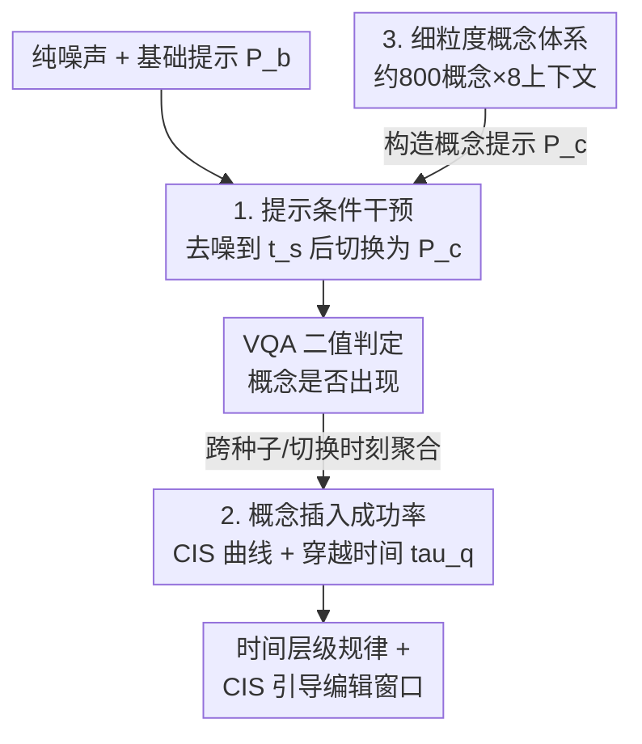

# Temporal Concept Dynamics in Diffusion Models via Prompt-Conditioned Interventions

**会议**: ICLR 2026  
**arXiv**: [2512.08486](https://arxiv.org/abs/2512.08486)  
**代码**: [PCI Framework](https://github.com/agoerguen/PCI)  
**领域**: 扩散模型 / 可解释性 / 图像编辑  
**关键词**: 概念时间动力学, 提示条件干预, 概念插入成功率, 扩散可解释性, 训练免费编辑

## 一句话总结

提出 PCI（Prompt-Conditioned Intervention）框架，通过在去噪轨迹不同时间步切换文本提示，量化概念何时在扩散模型中锁定，并将此发现应用于时间感知的图像编辑。

## 研究背景与动机

扩散模型通常仅通过最终输出评估，但生成过程是沿轨迹展开的动态过程：

**时间动态被忽视**：现有可解释性方法大多关注"哪里"（归因图）或"什么"（概念瓶颈），而非"何时"

**静态分析的不足**：
   - 归因图定位概念但不回答概念何时出现
   - 概念瓶颈模型需额外训练且不忠实于原始模型
   - 稀疏自编码器在单一时间步评估

**编辑缺乏时间感知**：现有编辑方法不知道何时干预最有效

**核心问题**：噪声何时变成特定概念（如年龄、天气），并在去噪轨迹中锁定？

## 方法详解

### 整体框架

PCI 把"概念何时锁定"这个问题转化成一个可测量的扰动实验：先用不含目标概念的基础提示走一段去噪轨迹，在某个时间步突然把提示换成含概念的版本，再看最终图像里概念有没有"长出来"。对大量随机种子和切换时刻做统计，就得到一条概念插入成功率（CIS）曲线，曲线的形状直接刻画了该概念在轨迹上的时间动力学；再从曲线读出几个穿越时间标量，就能横向比较不同概念、不同模型，并反过来指导"该在哪个时间步动手编辑"。整个过程训练免费、模型无关，只动文本条件、不碰权重也不读模型内部激活。

### 关键设计

**1. 提示条件干预：用"中途换提示"探测概念的可塑窗口**

要知道概念在哪个时间步定型，最直接的办法是看"过了这个点再加它还来不来得及"。PCI 先用基础提示 $P_b$ 从纯噪声去噪到中间状态 $\mathbf{x}_{t_s} = \text{Denoise}(\mathbf{x}_T, P_b)$，然后在切换时刻 $t_s$ 把条件替换成概念提示 $P_c$（基础提示拼上目标概念），继续完成剩余去噪 $\mathbf{x}_0(P_b \xrightarrow{t_s} P_c) = \text{Denoise}(\mathbf{x}_{t_s}, P_c)$。若 $t_s$ 很早概念几乎总能插入成功，越晚成功率越低，说明轨迹早已对这一概念失去可塑性。整个干预只动文本条件、不碰权重也不读模型内部激活，因此能直接套用在任何文生图扩散/整流流模型上。每次干预后用一个 VQA 模型（Qwen-VL-3B）对生成图做二值判定，回答"概念在不在"，把昂贵的概念检测变成一次问答。

**2. 概念插入成功率与过渡窗口：把曲线压成可比较的标量**

单次干预只有"成功/失败"，噪声很大，所以把概念插入成功率（CIS）定义为在时间步 $t_s$ 插入概念后、它最终出现在图像中的概率，并对多种随机种子和基础提示求平均，压掉单次噪声。CIS 关于 $t_s$ 单调非递减，于是任意水平 $q$ 都有一个定义良好的穿越时间 $\tau_q$——曲线首次达到 $q$ 的时间步。论文用 $\tau_{50}$、$\tau_{70}$ 标定概念"开始定型"和"基本锁死"两个节点，并用过渡窗口宽度 $W_{70 \to 50} = |\tau_{70} - \tau_{50}|$ 量化锁定的快慢：窗口窄说明概念在很短一段轨迹内就从可塑变僵化（如全局风格），窗口宽则意味着较长的可编辑余量（如细节配饰）。这几个标量让不同概念、不同模型之间可以横向比较，也直接给出编辑应该落在哪段时间。

**3. 细粒度概念体系：让结论覆盖面足够广而非个案**

单看几个概念得到的时间规律可能是偶然，因此论文构建了约 800 个细粒度概念描述，横跨人口统计（性别、种族、年龄组）、物体（动物、人造物品、自然元素）、人类属性（衣着、配饰、体貌特征）以及动作、属性、环境因素、风格等类别。每个概念还被放进 8 种不同上下文中评估，从而把"上下文是否影响锁定时间"也纳入测量——这正是后面发现"OOD 概念-上下文组合锁定更早"的数据基础。规模化的概念体系把零散观察沉淀成可统计的时间层级规律。

## 实验

### 评估模型
SD 2.1, SDXL, SD 3.5, PixArt-alpha, FLUX.1-dev

### 核心发现

#### 跨类别时间层级

| 概念类型 | 锁定时间 | 特点 |
|---------|---------|------|
| 全局因素（风格、时间、天气、季节、颜色） | **早期** | 过渡窗口窄 |
| 人类属性（年龄、性别） | **中期** | 中等窗口 |
| 细节属性（配饰） | **中后期** | 较宽窗口 |
| 非分布概念（客厅里的马） | **异常早期** | 窗口窄且脆弱 |

#### 跨模型差异

| 模型类型 | 特点 |
|---------|------|
| 扩散模型（SD 2.1, SDXL） | 保持更多后期灵活性 |
| 整流流模型（SD 3.5, FLUX） | 概念锁定更早，过渡更陡 |
| PixArt-alpha (DiT) | 介于两者之间 |

#### 上下文依赖性

- 同一概念在不同上下文中插入时间显著不同
- 例：婴儿在"游乐场"比"公交站"锁定更晚（更自然的上下文）
- 例：穿手术服在"医院"比"街道"锁定更晚
- **OOD概念锁定更早**：不常见的概念-上下文组合导致更早锁定

### 图像编辑应用

| 方法 | CLIP_img↑ | CLIP_txt↑ | CLIP_dir↑ |
|------|-----------|-----------|-----------|
| NTI+P2P | 0.867 | 0.222 | 0.098 |
| Stable Flow | 0.832 | 0.215 | 0.063 |
| PCI-$\tau_{50}$ | 0.889 | **0.224** | **0.139** |
| PCI-$\tau_{60}$ | 0.863 | **0.229** | **0.153** |
| PCI-$\tau_{70}$ | 0.835 | **0.234** | **0.168** |

CIS 引导的编辑窗口 $[\tau_{50}, \tau_{70}]$ 在所有指标上实现最佳的编辑-保持平衡。

### 消融实验

| 设置 | 效果 |
|------|------|
| 不同 VQA 模型 | 结果一致 |
| 提示措辞变化 | 鲁棒 |
| 种子数量 | 平均后种子噪声被压制 |

## 亮点

1. **开创性的时间维度分析工具**：将扩散时间变为可解释的分析轴
2. **发现丰富的时间行为模式**：全局→人类→细节的锁定层级
3. **跨模型对比揭示架构影响**：整流流 vs 扩散模型的时间差异
4. **实用的编辑应用**：CIS引导的编辑在所有指标上超越SOTA
5. **零训练、零成本**：整个框架无需任何训练

## 局限性

1. CIS 依赖 VQA 模型（Qwen-VL-3B），可能引入评估偏差
2. 概念的二值判定（是/否）可能过于粗糙
3. 分析主要针对文本到图像模型，视频扩散的时间动态未探索
4. 多概念交互分析仍较初步
5. CIS引导编辑的自动化（自动选择最优 $\tau$）需要先运行完整CIS曲线

## 相关工作

- **静态可解释性**：归因图 (Tang 2022)、概念瓶颈 (Ismail 2024)
- **动态可解释性**：P2P (Hertz 2023)、稀疏自编码器 (Tinaz 2025)
- **扩散编辑**：NTI+P2P、Stable Flow、SDEdit

## 评分

- **创新性**: ⭐⭐⭐⭐⭐ — 全新的时间维度分析范式
- **实用性**: ⭐⭐⭐⭐ — 编辑应用实用，分析洞察有价值
- **实验**: ⭐⭐⭐⭐⭐ — 800+概念描述，5个模型，分析极其全面
- **写作**: ⭐⭐⭐⭐⭐ — 结构清晰，发现有趣且表达精准

<!-- RELATED:START -->

## 相关论文

- [\[ICLR 2026\] Intention-Conditioned Flow Occupancy Models](intention-conditioned_flow_occupancy_models.md)
- [\[ICLR 2026\] SPEED: Scalable, Precise, and Efficient Concept Erasure for Diffusion Models](speed_scalable_precise_and_efficient_concept_erasure_for_diffusion_models.md)
- [\[AAAI 2026\] Mass Concept Erasure in Diffusion Models with Concept Hierarchy](../../AAAI2026/image_generation/mass_concept_erasure_in_diffusion_models_with_concept_hierarchy.md)
- [\[ICLR 2026\] Pareto-Conditioned Diffusion Models for Offline Multi-Objective Optimization](pareto-conditioned_diffusion_models_for_offline_multi-objective_optimization.md)
- [\[ICLR 2026\] Concept-TRAK: Understanding how diffusion models learn concepts through concept-level attribution](concept-trak_understanding_how_diffusion_models_learn_concepts_through_concept-l.md)

<!-- RELATED:END -->
