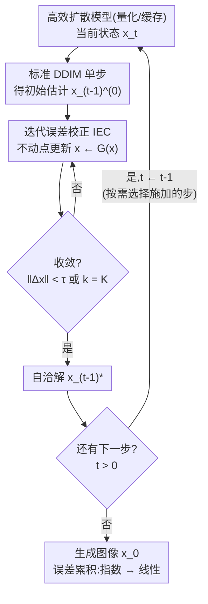

# Test-Time Iterative Error Correction for Efficient Diffusion Models

**会议**: ICLR 2026  
**arXiv**: [2511.06250](https://arxiv.org/abs/2511.06250)  
**代码**: [GitHub](https://github.com/zysxmu/IEC)  
**领域**: 扩散模型 / 模型效率 / 测试时优化  
**关键词**: 迭代误差校正, 测试时增强, 量化扩散, 特征缓存, 误差传播

## 一句话总结

提出 IEC（Iterative Error Correction），一种测试时的即插即用方法，通过迭代修正高效扩散模型的推理误差，将误差累积从指数增长降低为线性增长。

## 研究背景与动机

**领域现状**：为了把扩散模型塞进手机、边缘设备这类资源受限场景，网络量化（把权重/激活降到低比特，同时缩小模型并加速）和特征缓存（跨时间步复用中间特征、省去重复计算）成了两条主流提效路线，二者都能显著压缩推理开销。

**核心痛点**：提效是有代价的——量化和缓存都会让高效模型的输出和原始全精度模型之间产生近似误差，而本文的分析进一步揭示，这种误差会沿采样时间步**指数级累积**，最终严重劣化生成质量。

**部署后无法回头**：现有的缓解手段（时间步级量化参数、非均匀缓存策略等）都是**部署前**方案，需要重新跑一遍模型提效流水线、甚至需要原始全精度模型。但模型一旦部署到边缘/生产环境，这些前提往往不成立：重跑流水线工程成本高、设备上的模型常因存储限制或部署策略而不可改，原始高精度权重也可能早已丢失、无法重新量化。

**本文切入点**：受测试时缩放（test-time scaling）思路启发——在推理阶段调整模型行为而不重训——作者提出核心问题：**能否在不重复提效流水线的前提下，直接提升一个已部署高效扩散模型的质量？** IEC 就是对这个问题的回答。

## 方法详解

### 整体框架

IEC 要解决的是「高效扩散模型部署后误差失控」这个具体问题，整体思路分两步：**先把误差为什么会失控分析清楚，再给出对症的测试时补丁**。分析揭示 DDIM 采样里相邻时间步的误差是级联耦合的，一步的小误差会被后续步骤反复放大成指数累积；对症的解法是在每个采样步**内部**插入一个轻量的不动点迭代循环，让当前步先收敛到自洽解再往下走，从而切断误差在时间步之间的传递。整套方法不碰权重、不改架构、不需要原始模型，纯粹是推理时的即插即用补丁，而且可以只在部分时间步上施加来换取额外开销。

### 关键设计

**1. 误差传播分析：定位"指数爆炸"的病灶**

DDIM 的确定性单步更新可以整理成线性形式 $x_{t-1} = A_t x_t + B_t \epsilon_\theta(x_t, t)$，其中 $A_t, B_t$ 是只和噪声调度有关的系数。量化或缓存会在每一步引入两类误差：上一步传下来的状态误差 $\delta_t$，以及网络预测本身被扰动出的误差 $\epsilon_\theta^\delta$。把它们代入并对网络做一阶 Taylor 展开，得到误差的递推关系 $\delta_{t-1} = (A_t + B_t J_t)\delta_t + B_t \epsilon_\theta^\delta$，其中 $J_t$ 是噪声预测网络对输入的 Jacobian。把递推从第 $T$ 步展开到第 0 步，累积误差为

$$\delta_0 = \sum_{i=1}^{T} \Big(\prod_{j=i+1}^{T}(A_j + B_j J_j)\Big)(B_i \epsilon_\theta^\delta).$$

问题的根源就在这个矩阵连乘项：作者在 CIFAR-10 上实测谱范数 $\|A_t + B_t J_t\| > 1$ 在所有时间步都成立，意味着每一步都在放大误差，早期的小扰动会被后续步骤反复乘大，最终呈指数级累积。这一节不给解法，但把"误差耦合在相邻时间步之间"这个病灶精确定位出来——后面的设计正是冲着切断这个连乘去的。

**2. 迭代误差校正：每步内部用不动点迭代逼到自洽**

既然误差靠时间步之间的耦合放大，IEC 的做法就是在每个时间步**内部**反复修正，直到当前步的预测和它自己的输出一致。先用标准 DDIM 算出初始估计 $x_{t-1}^{(0)}$，再固定 $x_t$、对 $x_{t-1}$ 迭代

$$x_{t-1}^{(k+1)} = x_{t-1}^{(k)} + \lambda\big(A_t x_t + B_t \epsilon_\theta(x_{t-1}^{(k)}, t) - x_{t-1}^{(k)}\big),$$

步长 $\lambda$ 控制每次修正幅度，迭代到相邻两次之差小于阈值为止。这等价于求映射 $G(x) = (1-\lambda)x + \lambda\big(A_t x_t + B_t \epsilon_\theta(x, t)\big)$ 的不动点 $x_{t-1}^* = G(x_{t-1}^*)$。直觉上，原本一次性的单步预测会把近似误差直接写进 $x_{t-1}$ 带向下一步，而迭代到自洽解相当于让这一步内部先"自我纠偏"，不把未消化的误差外溢。

迭代要成立，$G$ 必须是压缩映射。它的 Jacobian 为 $\nabla G(x) = (1-\lambda)I + \lambda B_t J_t$，对应 Lipschitz 常数 $L = \|(1-\lambda)I + \lambda B_t J_t\|$；由 Banach 不动点定理，只要 $L < 1$ 迭代就唯一收敛。关键观察是 DDIM 中 $B_t < 0$，所以取一个适当的正 $\lambda$ 能让 $\lambda B_t J_t$ 项把 $L$ 压进单位球内。作者实测 $\lambda \in [0.1, 0.7]$ 时 $\|\nabla G(x)\| < 1$ 对所有时间步都成立，实践中取 $\lambda = 0.5$——这把"启发式修正"坐实成了有理论保证的收敛过程。

**3. 从指数到线性：切断时间步耦合的核心收益**

收敛之后，每一步的残余误差被压到有界范围 $\|\delta_{t-1}^{(\infty)}\| \leq \frac{C}{1-L}$（其中 $C$ 是与迭代无关的有界常数）。更关键的是，因为每一步都被独立逼到自洽解，IEC 切断了 $\delta_{t-1}$ 对前一步 $\delta_t$ 的依赖——总累积误差不再是设计 1 里那个矩阵连乘项，而退化成各步独立误差的简单求和 $\delta_0^{\text{IEC}} = \sum_{j=1}^{T}\delta_j^x$。这正是 IEC 的核心价值：误差累积从指数增长被根治为线性增长，与设计 1 的分析首尾呼应。

**4. 选择性施加：一次额外前向就够，且能细粒度权衡**

落地时迭代成本极低：最大迭代次数取 $K=1$（实际只需 1 次额外前向传递），阈值 $\tau = 10^{-5}$ 做早停，作者验证再多迭代（$K=2,3$）只有边际收益。施加位置可以灵活选：量化方法在每个时间步都用，缓存方法只在非缓存时间步用（缓存步本身没有重算误差），Stable Diffusion 上甚至只在第一步用就够。由于设计 1 的分析显示首尾时间步的 $\|A_t + B_t J_t\|$ 最大，只在首尾各若干步施加 IEC 就能拿到大部分收益。这种选择性应用让用户在质量与额外开销之间细粒度权衡，完全不施加则保持原模型性能。

## 实验

### 设置
- 模型：DDPM、LDM、Stable Diffusion
- 提效技术：时间步级量化（W4A8 / W8A8）、DeepCache、CacheQuant（量化+缓存混合）
- 数据集：CIFAR-10、LSUN-Churches、LSUN-Bedrooms、ImageNet、MS-COCO
- 指标：FID、IS、CLIP Score；硬件 NVIDIA 3090，DDIM 采样 T=100

### 量化 + IEC（Table 1，FID↓）

| 数据集 | 全精度基线 | 精度 | 基线 FID | +IEC FID |
|--------|-----------|------|---------|---------|
| CIFAR-10 | DDIM 4.19 | W8A8 | 4.32 | **3.76** |
| CIFAR-10 | | W4A8 | 6.82 | **5.96** |
| LSUN-Churches | LDM-8 3.99 | W8A8 | 3.57 | **3.29** |
| LSUN-Churches | | W4A8 | 6.27 | **6.10** |
| LSUN-Bedrooms | LDM-4 3.37 | W8A8 | 8.97 | **7.78** |

IEC 在所有量化设置上都拉低了 FID，W8A8 上提升尤其明显（CIFAR-10 4.32→3.76、LSUN-Bedrooms 8.97→7.78），把量化模型的质量明显往全精度基线方向拉回。

### 缓存 + IEC（Table 2，DeepCache，FID↓）

| 数据集 | 缓存档位 | 基线 FID | +IEC FID |
|--------|---------|---------|---------|
| CIFAR-10 | N=10 | 9.74 | **7.77** |
| CIFAR-10 | N=15 | 17.21 | **14.58** |
| LSUN-Churches | N=10 | 14.81 | **13.17** |
| LSUN-Bedrooms | N=5 | 14.28 | **9.20** |

**关键发现**：缓存越激进（N 越大）近似误差越大，而 IEC 的修正幅度也越大——LSUN-Bedrooms 在 N=5 下直接从 14.28 降到 9.20，说明误差越严重的场景 IEC 收益越高。

### 混合方案与 Stable Diffusion
- **CacheQuant（量化+缓存）**：在 8/8、4/8 多个缓存档位上 IEC 一致改善 FID，如 CIFAR-10 8/8 N=10 从 8.19→6.47、LSUN-Churches 8/8 N=15 从 9.47→6.90。
- **Stable Diffusion / MS-COCO**：仅在第一步施加 IEC，W8A8 N=10 下 FID 23.65→23.36、IS 36.71→37.02、CLIP Score 26.41→26.45；N=5 下 FID 23.74→22.83、IS 39.81→40.91，质量与文图对齐同步提升。

### 消融：施加多少时间步（Fig. 3）
- 全部时间步施加效果最好（W8A8 上 FID 达 3.76）。
- 只在首尾 1/10 或 1/20 时间步施加仍有明显收益：量化上分别带来约 0.44 / 0.35 的 FID 改善，缓存上全步施加改善约 1.97。
- **关键发现**：误差集中在 $\|A_t+B_t J_t\|$ 最大的首尾时间步，所以预算有限时优先在首尾施加 IEC 性价比最高；再增加迭代次数（K=2/3）只有边际提升，印证单步校正（K=1）已足够。

## 亮点与洞察

1. **理论严谨**：从误差传播分析到收敛性证明的完整理论链
2. **即插即用**：无需重训、无需架构修改、无需原始模型
3. **广泛适用**：跨不同效率技术（量化、缓存、混合）均有效
4. **灵活可控**：用户可自由选择应用程度来权衡效率与质量
5. **测试时方法的新思路**：借鉴测试时缩放理念应用于生成模型

## 局限与展望

1. 每次 IEC 迭代需要额外的前向传递，增加推理时间
2. 理论分析基于 DDIM，对其他采样器（如 DPM-Solver）的适用性需进一步验证
3. $\lambda$ 的最优值可能因模型和数据而异
4. 对于误差极大的极低位量化（如 W2），IEC 的改善可能有限
5. 未讨论与测试时训练方法的关系

## 相关工作

- **扩散模型量化**：PTQ4DM、Q-Diffusion、TDQ
- **特征缓存**：DeepCache、CacheQuant
- **测试时缩放**：TTT (Snell 2024)、REPA
- **高效采样**：DDIM、DPM-Solver、一致性模型

## 评分

- **创新性**: ⭐⭐⭐⭐ — 指数到线性的误差抑制，理论贡献清晰
- **实用性**: ⭐⭐⭐⭐⭐ — 部署后优化，真正的即插即用
- **实验**: ⭐⭐⭐⭐ — 跨模型、跨技术、跨数据集验证
- **写作**: ⭐⭐⭐⭐ — 理论推导严谨，实验设置合理

<!-- RELATED:START -->

## 相关论文

- [\[ICLR 2026\] VFScale: Intrinsic Reasoning through Verifier-Free Test-time Scalable Diffusion Model](vfscale_intrinsic_reasoning_through_verifier-free_test-time_scalable_diffusion_m.md)
- [\[ICLR 2026\] Compose Your Policies! Improving Diffusion-based or Flow-based Robot Policies via Test-time Distribution-level Composition](compose_your_policies_improving_diffusion-based_or_flow-based_robot_policies_via.md)
- [\[ICML 2026\] Linearizing Vision Transformer with Test-Time Training](../../ICML2026/image_generation/linearizing_vision_transformer_with_test-time_training.md)
- [\[CVPR 2026\] Test-Time Alignment of Text-to-Image Diffusion Models via Null-Text Embedding Optimisation](../../CVPR2026/image_generation/test-time_alignment_of_text-to-image_diffusion_models_via_null-text_embedding_op.md)
- [\[ICML 2026\] Quantifying Error Propagation and Model Collapse in Diffusion Models](../../ICML2026/image_generation/quantifying_error_propagation_and_model_collapse_in_diffusion_models.md)

<!-- RELATED:END -->
