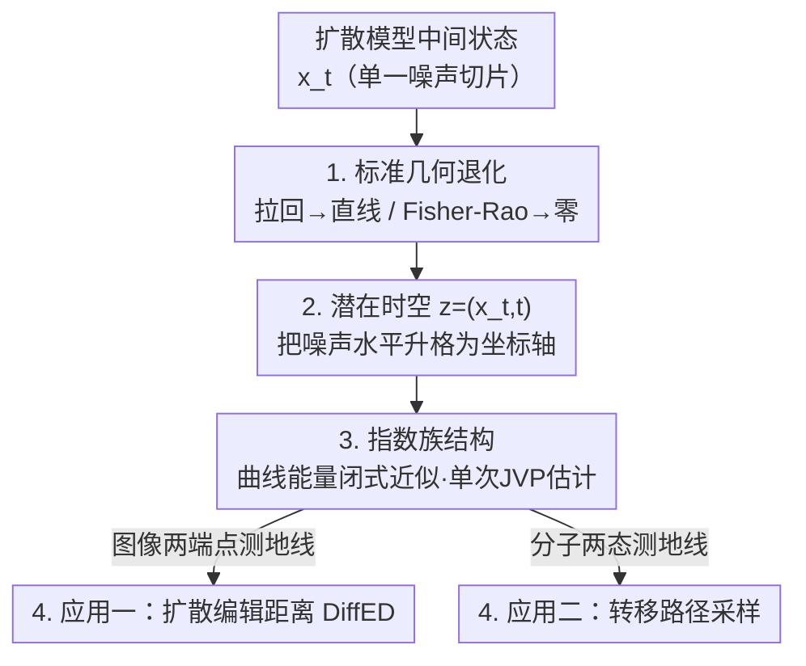

# The Spacetime of Diffusion Models: An Information Geometry Perspective

**会议**: ICLR 2026 Oral  
**arXiv**: [2505.17517](https://arxiv.org/abs/2505.17517)  
**代码**: [GitHub](https://github.com/rafalkarczewski/spacetime-geometry)  
**领域**: 扩散模型 / 信息几何 / 理论分析  
**关键词**: 时空几何, Fisher-Rao度量, 拉回几何, 扩散编辑距离, 转移路径采样

## 一句话总结

从信息几何视角提出扩散模型的"时空"概念，证明标准拉回几何在扩散模型中退化为直线，转而引入 Fisher-Rao 度量的时空几何，并导出可实际计算的散度编辑距离（DiffED）和转移路径采样方法。

## 研究背景与动机

理解扩散模型中间噪声状态 $\mathbf{x}_t$ 的信息演化是一个开放问题：

**拉回几何的失败**：在生成模型中，通常通过拉回环境度量来研究数据的内在几何。然而在扩散模型中，这一方法存在根本问题

**缺乏对中间状态几何结构的理解**：现有工作主要聚焦采样和训练，对信息如何在噪声流程中演化缺乏分析

**需要原则性的距离和路径概念**：现有的图像相似度指标（LPIPS等）缺乏生成过程的几何基础

## 方法详解

### 整体框架

本文要解决的问题是：扩散模型的中间噪声状态 $\mathbf{x}_t$ 里到底编码了什么几何信息，又该用什么距离去度量它？作者先做一件"破"的事——证明研究生成模型几何的两种标准套路（沿确定性解码器拉回环境度量、用随机解码器的 Fisher-Rao 度量）在扩散模型里都会退化成平凡结构；再做一件"立"的事——把一直被当成参数的噪声水平 $t$ 显式抬进坐标轴，构造 $(D+1)$ 维的"潜在时空" $\mathbf{z}=(\mathbf{x}_t,t)$。在这个时空里，整族去噪分布恰好构成指数族，使曲线能量有闭式近似、单次前向即可估计，于是"两点间最经济的几何路径（测地线）"第一次变得可算。最后把这套机制落到两个应用上：图像间的扩散编辑距离 DiffED、分子两态间的转移路径采样。

### 关键设计

**1. 诊断标准几何为何退化：两条自然路径都死在"只看单一噪声切片"**

要研究 $\mathbf{x}_t$ 的内在几何，最直接的两条路都走不通，作者把这件事证清楚，是为了说明"时空"不是花哨包装而是必需。第一条路是沿确定性 PF-ODE 解码器 $\mathbf{x}_T\mapsto\mathbf{x}_0(\mathbf{x}_T)$ 拉回环境度量，得到拉回度量

$$\mathbf{G}_{\text{PB}}(\mathbf{x}_T) = \left(\frac{\partial \mathbf{x}_0}{\partial \mathbf{x}_T}\right)^\top \left(\frac{\partial \mathbf{x}_0}{\partial \mathbf{x}_T}\right)$$

本文证明它会让所有测地线在数据空间里解码成**直线段**——因为扩散模型的潜在空间和数据空间同维，解码器始终在环境空间里操作，没有机会编码流形的内在弯曲，几何信息被抹平。第二条路换随机解码器（逆 SDE），用 Fisher-Rao 度量

$$\mathbf{G}_{\text{IG}}(\mathbf{x}_T) = \mathbb{E}_{\mathbf{x}_0 \sim p(\mathbf{x}_0|\mathbf{x}_T)}[\nabla_{\mathbf{x}_T}\log p(\mathbf{x}_0|\mathbf{x}_T)\, \nabla_{\mathbf{x}_T}\log p(\mathbf{x}_0|\mathbf{x}_T)^\top]$$

它看似能捕获概率流形曲率，但在最大噪声水平 $\mathbf{x}_T$ 处前向过程已"忘光"了数据（$p(\mathbf{x}_T|\mathbf{x}_0)\approx p_T(\mathbf{x}_T)$），去噪分布几乎不随 $\mathbf{x}_T$ 变化，度量整体塌缩为零。两条路败因相同：都只盯着**单一噪声水平的切片**，信息要么被抹直、要么被噪声淹没——这正提示出路在被忽略的时间维度上。

**2. 潜在时空：把噪声水平从参数升格为坐标轴**

针对设计 1 暴露的"切片视角"病根，核心创新是不再固定某个 $t$，而是引入 $(D+1)$ 维时空 $\mathbf{z}=(\mathbf{x}_t,t)\in\mathbb{R}^D\times(0,T]$，让一个点同时携带状态和它所处的噪声水平。这样整族去噪分布 $\{p(\mathbf{x}_0|\mathbf{x}_t)\}$ 被同一套坐标索引起来，干净数据 $\mathbf{x}$ 被识别为时空底面上的点 $(\mathbf{x},0)$；沿时间轴移动相当于在不同噪声尺度间切换观察。几何因此重新非退化——设计 1 里"被抹平/被塌缩"的信息，本就是被压进了被丢掉的时间维度，显式加回来就恢复了。这是全篇的支点：所有可计算性和应用都建立在这个坐标重构之上。

**3. 指数族结构与可计算能量：让抽象测地线真的能算**

时空若只是个漂亮概念却算不动就没用。关键观察是去噪分布沿时空曲线 $\boldsymbol\gamma$ 形成一个**指数族**，于是曲线能量有闭式近似

$$\mathcal{E}(\boldsymbol{\gamma}) \approx \frac{N-1}{2}\sum_{n=0}^{N-2}(\boldsymbol{\eta}(\mathbf{z}_{n+1}) - \boldsymbol{\eta}(\mathbf{z}_n))^\top(\boldsymbol{\mu}(\mathbf{z}_{n+1}) - \boldsymbol{\mu}(\mathbf{z}_n))$$

其中自然参数 $\boldsymbol{\eta}(\mathbf{x}_t,t)=\left(\tfrac{\alpha_t}{\sigma_t^2}\mathbf{x}_t,\,-\tfrac{\alpha_t^2}{2\sigma_t^2}\right)$、期望参数 $\boldsymbol{\mu}(\mathbf{x}_t,t)=\left(\mathbb{E}[\mathbf{x}_0|\mathbf{x}_t],\,\mathbb{E}[\|\mathbf{x}_0\|^2|\mathbf{x}_t]\right)$ 都能直接从去噪器读出：用 Tweedie 公式拿一阶矩、用 Hutchinson 技巧估二阶矩，整条曲线能量只需单次 Jacobian-向量积（JVP）即可**无模拟**地估计。这把"求测地线"从解积分-微分方程降成了优化一个可微的离散和，是抽象几何能落地的根本原因。

**4. 两个应用：同一条测地线既是图像编辑距离、也是分子转移路径**

可算能量一旦到手，测地线就能直接服务两个看似无关的任务。其一是**扩散编辑距离 DiffED**：定义两图距离为连接时空点 $(\mathbf{x}^a,0)$ 与 $(\mathbf{x}^b,0)$ 的测地线长度

$$\text{DiffED}(\mathbf{x}^a, \mathbf{x}^b) = \ell(\boldsymbol{\gamma})$$

这条测地线对应一段最经济的编辑序列——先加噪忘掉 $\mathbf{x}^a$ 的专有信息、再去噪引入 $\mathbf{x}^b$ 的专有信息，长度量化沿途去噪分布的总变化量，因此衡量的是结构级"改写成本"而非 LPIPS 那种感知相似度（越不像的两图，测地线要爬到越高噪声水平才能完成迁移）。其二是**转移路径采样**：在 Boltzmann 分布 $q(\mathbf{x})\propto\exp(-U(\mathbf{x}))$ 的两个低能态之间，先用时空测地线当"骨架"，再沿骨架跑退火 Langevin 动力学采样具体过渡路径；该框架天然支持加约束（低方差、回避指定区域），只需在求测地线时加入约束、无需重训模型，从而把图像里推出的几何机制平移到了分子构象转移上。

## 实验

### 采样轨迹比较
- PF-ODE 路径与能量最小化测地线非常相似
- 测地线在早期采样阶段弯曲稍少

### 扩散编辑距离

| 性质 | 结果 |
|------|------|
| 与 LPIPS 相关性 | ~-7%（捕获不同信息） |
| 与 SSIM 相关性 | ~53% |
| 端点越不相似 | 中间噪声越强 |

DiffED 捕获的是结构级编辑成本，而非感知相似度。

### 转移路径采样（丙氨酸二肽）

| 方法 | MaxEnergy↓ | 能量评估次数↓ |
|------|-----------|-------------|
| MCMC-固定长度 | 42.54±7.42 | 1.29B |
| MCMC-变长 | 58.11±18.51 | 21.02M |
| Doob's Lagrangian | 66.24±1.01 | 38.4M |
| **时空测地线（本文）** | **37.36±0.60** | **16M (+16M)** |
| 下界 | 36.42 | — |

本文方法最接近下界，且能量评估次数少几个数量级。

### 约束路径
- 生成的路径有效避免高能区域
- 不像 Doob's Lagrangian 那样坍缩到单一路径

## 亮点

1. **深刻的理论洞察**：证明拉回几何在扩散模型中的根本失败
2. **时空概念的优雅性**：统一所有噪声水平的几何结构
3. **可计算**：利用指数族性质推导无模拟估计器
4. **多领域应用**：编辑距离+分子动力学
5. **计算效率**：能量估计仅需单次JVP

## 局限性

1. 时空测地线不能作为替代采样方法（需要提前知道端点）
2. 在高维数据上 Hutchinson 估计器可能引入方差
3. DiffED 的计算成本仍高于简单距离度量
4. 依赖于去噪器的质量（$\hat{\mathbf{x}}_0$ 的近似误差）
5. 转移路径采样需要已知能量函数

## 相关工作

- **黎曼几何+生成模型**：Arvanitidis (2018/2022)、Park (2023)
- **扩散模型几何**：Domingo-Enrich (2025)无记忆性分析
- **转移路径采样**：Holdijk (2023)、Doob's Lagrangian (Du 2024)
- **信息几何**：Fisher-Rao度量、Amari (2016)

## 评分

- **创新性**: ⭐⭐⭐⭐⭐ — 时空几何概念极具深度和原创性
- **实用性**: ⭐⭐⭐⭐ — DiffED和转移路径有实际价值
- **实验**: ⭐⭐⭐⭐ — 理论验证充分，分子动力学结果强
- **写作**: ⭐⭐⭐⭐⭐ — 理论优雅，表达精准

<!-- RELATED:START -->

## 相关论文

- [\[ICLR 2026\] Learning a Distance Measure from the Information-Estimation Geometry of Data](learning_a_distance_measure_from_the_information-estimation_geometry_of_data.md)
- [\[ICLR 2026\] Continual Unlearning for Text-to-Image Diffusion Models: A Regularization Perspective](continual_unlearning_for_text-to-image_diffusion_models_a_regularization_perspec.md)
- [\[ICML 2026\] Geometry-Aware Tabular Diffusion](../../ICML2026/image_generation/geometry-aware_tabular_diffusion.md)
- [\[ICML 2026\] Enhancing Membership Inference Attacks on Diffusion Models from a Frequency-Domain Perspective](../../ICML2026/image_generation/enhancing_membership_inference_attacks_on_diffusion_models_from_a_frequency-doma.md)
- [\[ICML 2026\] Information-Geometric Adaptive Sampling for Graph Diffusion](../../ICML2026/image_generation/information-geometric_adaptive_sampling_for_graph_diffusion.md)

<!-- RELATED:END -->
