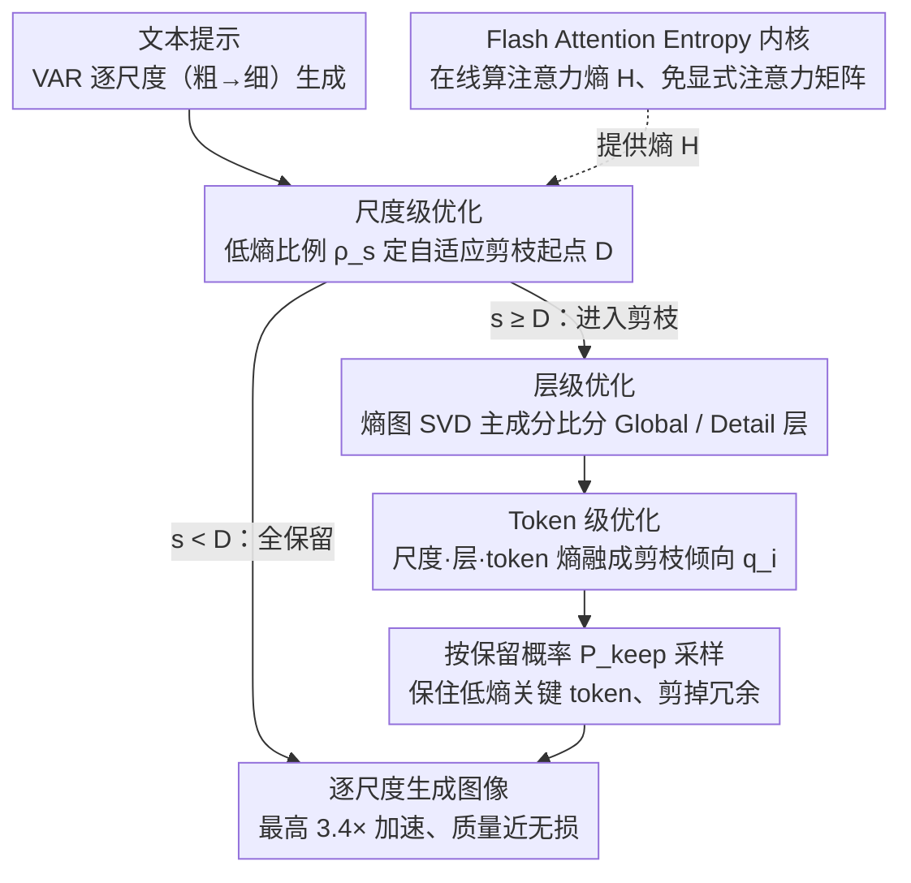

# ToProVAR: Efficient Visual Autoregressive Modeling via Tri-Dimensional Entropy-Aware Semantic Analysis and Sparsity Optimization

## 元信息
- **会议**: ICLR 2026
- **arXiv**: [2602.22948](https://arxiv.org/abs/2602.22948)
- **代码**: 即将公开
- **领域**: 其他
- **关键词**: VAR, attention entropy, token 剪枝, 模型加速, 三维稀疏性优化

## 一句话总结

提出 ToProVAR 框架，利用注意力熵统一分析 VAR 模型的 token/层/尺度三个维度的稀疏性，实现最高 3.4× 加速且图像质量几乎无损，显著优于 FastVAR 和 SkipVAR。

## 研究背景与动机

视觉自回归 (VAR) 模型将图像生成从"逐 token 预测"改为"逐分辨率预测"（从粗到细），首次让 GPT 风格的 AR 模型在图像质量上超越扩散模型。然而核心问题是：**token 数量随分辨率指数增长，后期阶段计算效率极低**。

现有加速方法的局限：
- **FastVAR**：在 token 维度保留固定比例的高频 token → 低频但语义关键的 token 被剪掉 → **语义丧失**
- **SkipVAR**：在尺度维度跳过某些 scale 或替换无条件分支 → **细节坍塌**
- 两者都基于**单维度稀疏分析**，无法捕捉 token 间复杂的相对关系

核心挑战：(1) 需要细粒度的稀疏分析防止信息丢失；(2) 需要多维度表征评估 token 重要性；(3) 分析本身需高效，不能引入过多开销。

## 方法详解

### 整体框架

ToProVAR 要解决的是 VAR 模型"后期尺度 token 数指数膨胀、算力浪费"的痛点。它把注意力熵 $\mathcal{H}(q_i) = -\sum_{j=1}^{N} \alpha_{i,j} \log \alpha_{i,j}$ 当作贯穿全局的统一度量——低熵意味着注意力集中在少数目标、语义选择性强，高熵意味着注意力均匀铺开、语义聚焦弱。围绕这一个量，框架在**尺度、层、token 三个维度**逐级判断"哪些计算是冗余的"：先在尺度维度定出"从哪个尺度起开始剪"，再在层维度区分"哪些层可剪"，最后在 token 维度把三维信息融成每个 token 的去留概率。而要让这套熵分析真正落地，关键在于一个改写过的 FlashAttention 内核（Flash Attention Entropy），它把熵的在线计算成本压到几乎为零，从而在**不重新训练**的前提下对 VAR 生成做细粒度剪枝。

### 关键设计

**1. 尺度级优化：用低熵比例自动判断该从哪一层尺度开始剪**

VAR 是从粗到细逐尺度生成的，但不同图像需要的深度并不一样——"赛博狐狸"这类复杂对象要靠深尺度堆细节，而字母"W"在浅尺度就已经稳定。ToProVAR 在每个尺度 $s$ 统计低于该尺度平均熵的 token 占比 $\rho_s = \frac{|\{i \mid H_i^s < \bar{H}^s\}|}{N_s}$，并取第一个让占比超过阈值的尺度作为剪枝起点 $D = \min\{s \mid \rho_s \geq \tau\}$。当生成趋于收敛时 $\rho_s$ 会稳定下来，意味着大量 token 已进入"低熵已定型"状态，此后的计算多为冗余；阈值 $\tau$ 通过一次预采样实验标定，于是剪枝起点对每张图都是自适应的，而非一刀切的固定比例。

**2. 层级优化：用熵图的主成分比把层分成可剪与不可剪两类**

把熵的视角从单个 token 扩展到整层的 token 分布后，会看到两种结构截然不同的层：Global Layer 呈均匀网格状注意力、主成分突出，负责全局空间关系；Detail Layer 是语义驱动的局部注意力、主成分不突出，只在精炼局部纹理。区分二者的办法是对熵图做 SVD，算主成分比 $\varrho^{(l,s)} = \sigma_1^{(l,s)} / \sigma_2^{(l,s)}$，再映射成层表征得分 $\mathcal{R}^{(l,s)} = \exp(-\beta(\varrho^{(l,s)}-1))$：得分趋近 1 的是 Detail Layer，可放心剪；趋近 0 的是 Global Layer，必须保留。这一划分有实测依据——压缩 Global Layer 超过 50% 就会严重降质，而 Detail Layer 即便压掉 90% 仍保持高保真，所以层级得分直接决定了每层能承受多大的稀疏度。

**3. Token 级优化：把三维信息融成单个剪枝倾向，再据此采样保留**

前两步给出了"从哪个尺度起剪"和"哪些层可剪"，token 级则把尺度因子、层得分和归一化 token 熵乘到一起，得到统一的剪枝倾向 $q_i^{(s,l)} = \phi(s) \cdot \mathcal{R}^{(l,s)} \cdot \hat{H}_i^{(s,l)}$，其中 $\phi(s) = s / S_{\max}$ 是随尺度单调增长的因子（越靠后的尺度越敢剪）。最终的保留概率为

$$P_{\text{keep}}(i|s,l) = \begin{cases} 1, & s < D \\ 1 - \text{clip}\big(\alpha_{\min} + (\alpha_{\max}-\alpha_{\min})\,q_i^{(s,l)},\ 0,\ 1\big), & \text{otherwise} \end{cases}$$

即剪枝起点之前的尺度全部保留，之后则按倾向 $q_i$ 在 $[\alpha_{\min}, \alpha_{\max}]$ 之间线性映射出剪枝强度。这样一来高熵、靠后尺度、Detail Layer 上的 token 最容易被剪掉，而低熵的语义关键 token 即便频率不高也会被保住——正好补上 FastVAR 只看频率而误删低频关键 token 的短板。

**4. Flash Attention Entropy：让熵的在线计算不再依赖显式注意力矩阵**

直接按定义算熵需要把 $N \times N$ 的注意力矩阵显式构造出来，这和 FlashAttention 的分块累积内核天然冲突，会让前面三步的分析开销失控。ToProVAR 借助代数恒等式 $kx\log(kx) = kx\log x + (\log k)\cdot xk$，把熵拆成几个可以随分块在线累加的统计量，直接塞进 FlashAttention 内核里算，而不必落地完整矩阵。代价仅约 0.17ms（对比朴素计算在 scale=10 时的 12.06ms，降低约 90%），正是这一步把"三维熵分析"从理论上可行变成了端到端真正能用的加速方案。

## 实验

### 主要结果（GenEval + DPG）

| 方法 | GenEval Overall ↑ | DPG Overall ↑ | 延迟(s) ↓ | 加速比 |
|------|-------------------|---------------|----------|--------|
| Infinity-2B | 0.69 | 83.41 | 2.10 | 1.0× |
| +FastVAR | 0.68 | 83.39 | 0.80 | 2.6× |
| +SkipVAR | 0.67 | 82.94 | 1.10 | 2.0× |
| **+ToProVAR** | **0.69** | 83.07 | **0.61** | **3.4×** |
| Infinity-8B | 0.83 | 86.68 | 4.86 | 1.0× |
| +FastVAR | 0.81 | 86.50 | 2.01 | 2.4× |
| +SkipVAR | 0.82 | 86.44 | 2.11 | 2.3× |
| **+ToProVAR** | **0.83** | **86.70** | **1.78** | **2.7×** |

### 人类偏好基准（HPSv2 + ImageReward）

Infinity-8B 上 ToProVAR 延迟降低 67%，ImageReward 保持一致（1.04 vs 1.04），HPSv2 仅降 0.41。

### MJHQ30K 感知质量

People 类别 FID 甚至从 58.91 降至 58.84（边加速边提升），Landscape 和 Food 类别 FID 几乎无变化。

### 消融实验

| 配置 | 延迟(s) | 加速比 | GenEval ↑ |
|------|---------|--------|-----------|
| 仅 Scale Depth | 0.47 | 4.5× | 0.477 |
| + Layer Repr. | 0.57 | 3.7× | 0.679 |
| + Token Pruning（完整） | 0.61 | 3.4× | **0.690** |

- 单用尺度深度定位加速最激进但质量严重下降
- 逐步加入层级和 token 级优化逐渐恢复质量
- Flash Attention Entropy 是效率关键：无 FAE 版本延迟 1.10s vs 有 FAE 0.61s

### 计算开销分析

- FAE 在 scale=10 仅增加 0.17ms（vs 朴素计算的 12.06ms，降低 ~90%）
- 层级 SVD 分析总计 49.84ms，占端到端延迟 < 3%

## 亮点

- 注意力熵作为统一度量，优雅地连接三个维度的稀疏性分析
- Flash Attention Entropy 工程贡献突出，使在线熵计算实际可行
- 在 Infinity-2B 上 3.4× 加速且质量无损（GenEval 不变），在 8B 上 2.7× 加速且 DPG 略有提升
- 可视化对比清晰展示了语义丧失/结构扭曲/细节坍塌问题的解决

## 局限性

- 仅在 Infinity-2B/8B（VAR 架构）上验证，未测试其他 VAR 变体
- 阈值 $\tau$ 和超参数 $\alpha_{\min}, \alpha_{\max}$ 需要预采样标定
- 三维分析虽然高效但仍引入了约 3% 额外开销
- 未探索训练时与推理时联合优化的方案
- 仅关注图像生成，未扩展到视频或多模态生成

## 相关工作

- **VAR 模型**：Tian et al. (VAR), Infinity (Han et al.) — 逐尺度预测范式
- **VAR 加速**：FastVAR（频率剪枝）、SkipVAR（尺度跳过）、SparseVAR（token 稀疏）、CoDe（协同解码）
- **扩散模型加速**：蒸馏、量化、剪枝、特征缓存 — 不直接适用于 VAR
- **KV Cache 优化**：HACK、ScaleKV — 互补方向

## 评分

- **新颖性**: ⭐⭐⭐⭐⭐ — 三维注意力熵分析框架是全新的
- **技术深度**: ⭐⭐⭐⭐⭐ — 理论分析 + 工程实现（FAE）均扎实
- **实验充分度**: ⭐⭐⭐⭐ — 多基准多指标，消融详尽
- **实用价值**: ⭐⭐⭐⭐⭐ — 3.4× 加速无损质量，直接可用

<!-- RELATED:START -->

## 相关论文

- [\[NeurIPS 2025\] InfinityStar: Unified Spacetime AutoRegressive Modeling for Visual Generation](../../NeurIPS2025/image_generation/infinitystar_unified_spacetime_autoregressive_modeling_for_v.md)
- [\[AAAI 2026\] Hierarchical Schedule Optimization for Fast and Robust Diffusion Model Sampling](../../AAAI2026/image_generation/hierarchical_schedule_optimization_for_fast_and_robust_diffusion_model_sampling.md)
- [\[ICLR 2026\] Intention-Conditioned Flow Occupancy Models](intention-conditioned_flow_occupancy_models.md)
- [\[ICCV 2025\] Timestep-Aware Diffusion Model for Extreme Image Rescaling](../../ICCV2025/image_generation/timestep-aware_diffusion_model_for_extreme_image_rescaling.md)
- [\[ICCV 2025\] EDiT: Efficient Diffusion Transformers with Linear Compressed Attention](../../ICCV2025/image_generation/edit_efficient_diffusion_transformers_with_linear_compressed_attention.md)

<!-- RELATED:END -->
