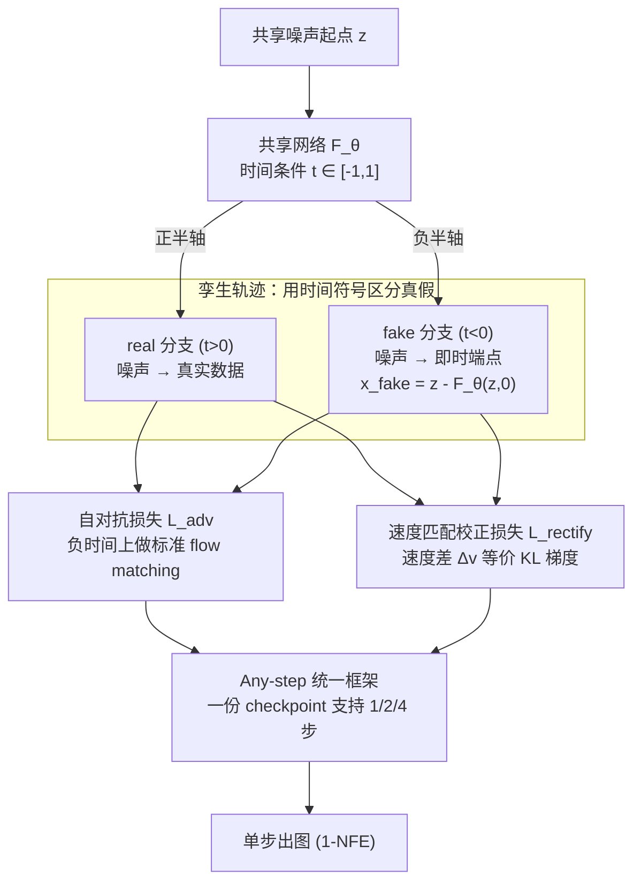

# TwinFlow: Realizing One-step Generation on Large Models with Self-adversarial Flows

**会议**: ICLR 2026  
**arXiv**: [2512.05150](https://arxiv.org/abs/2512.05150)  
**代码**: [https://github.com/inclusionAI/TwinFlow](https://github.com/inclusionAI/TwinFlow)  
**领域**: 扩散模型 / 单步生成 / 大模型加速  
**关键词**: one-step generation, self-adversarial, flow matching, 20B scaling, no auxiliary models

## 一句话总结

提出 TwinFlow：通过将 flow matching 时间区间从 $[0,1]$ 扩展到 $[-1,1]$，构造"孪生轨迹"形成自对抗信号，使模型无需判别器或冻结教师即可实现单步生成。首次将 1-NFE 生成能力扩展到 20B 参数的 Qwen-Image 模型，1-NFE GenEval 0.86 逼近原始 100-NFE 的 0.87，推理成本降低 100×。

## 研究背景与动机

扩散/流匹配模型生成质量出色，但推理需要 40–100 步 NFE，在大模型时代推理成本远超一次性训练成本，亟需少步/单步生成方案。

**现有方法的瓶颈**：

| 方法类别 | 辅助训练模型 | 冻结教师 | 核心问题 |
|---------|:---------:|:------:|---------|
| GAN | 1（判别器） | 0 | 训练不稳定，难扩展到大模型 |
| 扩散蒸馏 | 0 | 1 | 需冻结教师占用额外显存 |
| DMD/DMD2 | 1–2（fake score + 判别器） | 1 | 复杂度最高，20B 模型直接 OOM |
| 一致性模型（LCM/PCM） | 0 | 0–1 | NFE < 4 时质量急剧下降 |
| **TwinFlow（本文）** | **0** | **0** | **无额外组件，20B 可训练** |

**核心矛盾**：大模型单步加速需要极简且显存高效的框架，但所有高质量少步方法都依赖辅助组件（判别器/教师），在 20B 规模直接 OOM。

**切入点**：能否让模型"自己教自己"？模型多步输出质量高于单步输出——这个质量差本身就是可用的自监督信号，不需要外部教师。

## 方法详解

### 整体框架

TwinFlow 把标准 flow matching 的时间区间从 $[0,1]$ 扩展到 $[-1,1]$，让同一个网络 $F_\theta$ 同时学两条共用噪声起点的"孪生轨迹"——正半轴 $t\in(0,1]$ 是噪声到真实数据的 real 轨迹，负半轴 $t\in[-1,0)$ 是噪声到模型自身单步输出（fake 数据）的 fake 轨迹。模型用 $\mathbf{x}^{\text{fake}} = \mathbf{z} - F_\theta(\mathbf{z}, 0)$ 现场生成 fake 端点，再用两项自监督损失把两条轨迹拉到一起：自对抗损失 $\mathcal{L}_{\text{adv}}$ 在负时间上把 fake 轨迹学成标准 flow matching，速度匹配校正损失 $\mathcal{L}_{\text{rectify}}$ 让 real/fake 速度场对齐、把 fake 分布往 real 分布推。整套流程不需要判别器、不需要冻结教师，最后由 any-step 公式让同一个 checkpoint 支持 1/2/4 步推理。

### 关键设计

**1. 孪生轨迹：用时间符号区分真假，把外部教师内化**

高质量少步方法之所以都依赖判别器或冻结教师，是因为单步输出需要一个"什么才算好"的参照，而这些辅助组件在 20B 规模会直接 OOM。TwinFlow 的破局点是让模型自己充当参照：正半轴 $t\in(0,1]$ 承载真实分布的 real 分支，负半轴 $t\in[-1,0)$ 承载模型当前 fake 分布的 fake 分支，两条分支共享同一网络 $F_\theta$、仅靠时间条件的正负号切换。fake 端点 $\mathbf{x}^{\text{fake}} = \mathbf{z} - F_\theta(\mathbf{z}, 0)$ 由当前模型即时给出，意味着参照随训练一起演化（self-play），既省掉了额外模型副本，又避免了冻结教师带来的固定目标偏差。

**2. 自对抗损失 $\mathcal{L}_{\text{adv}}$：在负时间上做标准 flow matching**

有了 fake 分支后，直接对它套用标准 flow matching 目标即可——教网络在负时间条件下学会从噪声映射到 fake 数据。这一步让"对抗"完全发生在单一网络内部：模型既要拟合真实数据（正半轴），又要刻画自己当前的生成分布（负半轴），二者的张力构成对抗信号，无需任何独立判别器参与。

**3. 速度匹配校正损失 $\mathcal{L}_{\text{rectify}}$：把 KL 梯度转写成可优化的速度差**

仅有自对抗还不足以把 fake 分布往 real 分布推。本文的核心数学洞察是：在同一中间点 $\mathbf{x}_t$ 上，最小化 real/fake 两条轨迹的速度场差异

$$\Delta_\mathbf{v}(\mathbf{x}_t) = \mathbf{v}_{\text{real}}(\mathbf{x}_t, t) - \mathbf{v}_{\text{fake}}(\mathbf{x}_t, -t)$$

等价于最小化 $D_{\text{KL}}(p_{\text{fake}} \,\|\, p_{\text{real}})$。这样就不必像 DMD 那样显式训练一个 score 估计器，而是通过 stop-gradient 把这个速度差转化为可直接反传的损失，让 fake 分布沿 KL 梯度方向收敛到 real 分布。

**4. Any-step 统一框架：一份 checkpoint 支持 1/2/4 步**

训练基于 RCGM 的 any-step 公式，使同一模型同一 checkpoint 在推理时可灵活选 1/2/4/… 步，部署时按质量与速度需求动态权衡，而不必为不同步数各训一版。

### 损失函数 / 训练策略

总目标在标准 any-step flow matching 基线上叠加 TwinFlow 的两项自监督损失：

$$\mathcal{L}(\theta) = \mathcal{L}_{\text{base}} + \underbrace{(\mathcal{L}_{\text{adv}} + \mathcal{L}_{\text{rectify}})}_{\mathcal{L}_{\text{TwinFlow}}}$$

其中 $\mathcal{L}_{\text{base}}$ 是 $N=2$ 的 any-step flow matching，目标时间 $r$ 随机采样自 $[0,1]$；$\mathcal{L}_{\text{TwinFlow}}$ 则把目标时间固定在 $r=0$ 专攻单步。两类损失在每个 mini-batch 内按超参 $\lambda$ 划分样本比例，实验中 $\lambda\approx 1/3$ 最优——过大过小都会破坏 base 与 TwinFlow 的平衡。整套框架对 Qwen-Image-20B 既支持约 40GB 显存的 LoRA 微调，也支持全参数训练。

值得强调的是它为何不像同规模的 Qwen-Image-Lightning（基于 DMD2 去掉 GAN loss）那样模式坍缩：$\mathcal{L}_{\text{base}}$ 保留了随机目标时间采样，迫使模型持续学习完整轨迹而非塌缩到单一映射；同时 fake 轨迹随训练共同演化，避免了冻结教师的固定目标偏差。实测 Qwen-Image-Lightning 同一 prompt 换噪声几乎生成相同图，而 TwinFlow 无此退化。

## 实验结果

### 统一多模态模型对比（Qwen-Image-20B, LoRA）

| 方法 | NFE ↓ | GenEval ↑ | DPG-Bench ↑ | WISE ↑ |
|------|:-----:|:---------:|:-----------:|:------:|
| Qwen-Image 原始 | 100 | 0.87 | 88.32 | 0.62 |
| Qwen-Image-Lightning | 1 | 0.85 | 87.79 | 0.51 |
| Qwen-Image-RCGM | 1 | 0.52 | 59.50 | 0.30 |
| **Qwen-Image-TwinFlow** | **1** | **0.86** | **86.52** | **0.54** |
| **Qwen-Image-TwinFlow** | **2** | **0.87** | **87.64** | **0.57** |
| BLIP3-o-8B | 60+ | 0.84 | 81.60 | 0.62 |
| Bagel | 100 | 0.82 | — | 0.52 |
| MetaQuery-XL | 60 | 0.78 | 81.10 | 0.55 |

重点：1-NFE 即超过大多数 40–100 NFE 的统一多模态模型（Bagel/MetaQuery/BLIP3-o），2-NFE 完全追平原始 100-NFE。

### 20B 全参数训练对比

| 方法 | NFE | GenEval ↑ | DPG-Bench ↑ | WISE ↑ | 备注 |
|------|:---:|:---------:|:-----------:|:------:|------|
| VSD / DMD / SiD（原始） | — | OOM | OOM | OOM | 需 3 份模型副本 |
| VSD（LoRA fake score） | 1 | 0.67 | 84.44 | 0.22 | 质量差 |
| DMD | 1 | 0.81 | 84.31 | 0.47 | 模式坍缩⭐ |
| sCM（JVP-free） | 8 | 0.60 | 85.54 | 0.45 | 8 步仍低 |
| MeanFlow（JVP-free） | 8 | 0.49 | 83.81 | 0.37 | 8 步仅 0.49 |
| **TwinFlow** | **1** | **0.85** | **85.44** | **0.51** | — |
| **TwinFlow** | **2** | **0.86** | **86.35** | **0.55** | — |
| **TwinFlow（更长训练）** | **1** | **0.89** | **87.54** | **0.57** | 全参数持续提升 |

重点：VSD/DMD/SiD 在 20B 原始配置直接 OOM；sCM/MeanFlow 即使 8-NFE 也远不如 TwinFlow 的 1-NFE。更长训练后 1-NFE GenEval 达到 0.89，超过原始 100-NFE 的 0.87。

### 专用 T2I 模型对比（SANA 骨干）

| 方法 | NFE | 参数量 | GenEval ↑ | DPG-Bench ↑ |
|------|:---:|:-----:|:---------:|:-----------:|
| SANA-Sprint-1.6B | 1 | 1.6B | 0.76 | 80.1 |
| RCGM-1.6B | 1 | 1.6B | 0.78 | 76.5 |
| FLUX-Schnell | 1 | 12B | 0.69 | — |
| SDXL-DMD2 | 1 | 0.9B | 0.59 | — |
| **TwinFlow-0.6B** | **1** | **0.6B** | **0.83** | **78.9** |
| **TwinFlow-1.6B** | **1** | **1.6B** | **0.81** | **79.1** |
| SANA-1.5 | 40 | 4.8B | 0.81 | 84.7 |

重点：TwinFlow-0.6B 的 1-NFE（0.83）超过 SANA-1.5-4.8B 的 40-NFE（0.81），参数量仅 1/8、推理快 40×。

### 消融实验要点

- **$\lambda$ 的影响**：$\lambda = 1/3$ 最优，过大过小均下降，印证了 base loss 与 TwinFlow loss 的平衡重要性
- **$\mathcal{L}_{\text{TwinFlow}}$ 的通用性**：在 OpenUni、SANA、Qwen-Image 三种架构上，加入 $\mathcal{L}_{\text{TwinFlow}}$ 后 1-NFE DPG-Bench 分别提升约 3/2/27 个百分点，Qwen-Image 提升最显著（59.50→86.52）
- **训练步数 vs NFE**：训练越长，最优 NFE 越少——1-NFE 和 few-step 同时获益

## 亮点与洞察

- **极简设计是最大卖点**：0 辅助模型 + 0 冻结教师，对比其他方法在 20B 直接 OOM，TwinFlow 是目前唯一可行方案
- **数学优雅**：将时间区间扩展到 $[-1,1]$ 后，real/fake 速度差自然等价于 KL 散度梯度，不需要显式训练 score 估计器
- **工程意义**：首次证明 20B 模型可以 1-step 出图且质量不垮，对大模型部署成本有直接影响
- **Any-step 灵活性**：同一 checkpoint 支持 1/2/4 步推理，部署时按质量/速度需求动态选择

## 局限性与改进方向

- 自对抗的理论收敛保证不充分——虽然实验上未坍缩，但缺乏严格的稳定性分析
- 缺少 FID/IS 等传统分布质量指标，仅用 GenEval/DPG-Bench/WISE 评估
- 仅验证了文生图任务，视频生成、音频生成等模态的适用性未知
- 图像编辑仅做了初步实验（15K 数据 4-NFE），尚不充分

## 相关工作对比

- **vs DMD/DMD2**：DMD 需 fake score 估计器 + 冻结教师（共 3 份模型显存），20B 直接 OOM；TwinFlow 仅 1 份模型
- **vs sCM/MeanFlow**：同属无辅助模型方法，但这两者在 20B 全参训练下 8-NFE 仍仅约 0.5 GenEval，远不如 TwinFlow 的 1-NFE 0.85
- **vs SANA-Sprint**：Sprint 使用 GAN loss + 冻结教师，在大模型规模不可行；TwinFlow 去掉 GAN loss 但 1-NFE GenEval 高 7–11 个百分点
- **vs Qwen-Image-Lightning**：同为 20B 少步模型，但 Lightning 存在严重模式坍缩，TwinFlow 无此问题

## 评分

- 新颖性: ⭐⭐⭐⭐ 孪生轨迹 + 速度匹配校正的公式推导优雅，但核心直觉（自己的多步输出当教学信号）并不复杂
- 实验充分度: ⭐⭐⭐⭐⭐ 从 0.6B 到 20B、LoRA 到全参、3 个 benchmark + 详尽消融 + 与 7 种基线对比
- 写作质量: ⭐⭐⭐⭐ 结构清晰，数学推导完整，表格丰富
- 价值: ⭐⭐⭐⭐⭐ 首次在 20B 模型实现高质量 1-step 生成，对大模型推理成本有直接且显著的实际影响

<!-- RELATED:START -->

## 相关论文

- [\[ICML 2026\] Adversarial Flow Models](../../ICML2026/image_generation/adversarial_flow_models.md)
- [\[CVPR 2026\] Temporal Equilibrium MeanFlow: Bridging the Scale Gap for One-Step Generation](../../CVPR2026/image_generation/temporal_equilibrium_meanflow_bridging_the_scale_gap_for_one-step_generation.md)
- [\[CVPR 2026\] Self-Evaluation Unlocks Any-Step Text-to-Image Generation](../../CVPR2026/image_generation/self-evaluation_unlocks_any-step_text-to-image_generation.md)
- [\[NeurIPS 2025\] FALCON: Few-step Accurate Likelihoods for Continuous Flows](../../NeurIPS2025/image_generation/falcon_few-step_accurate_likelihoods_for_continuous_flows.md)
- [\[ICML 2025\] Revisiting Diffusion Models: From Generative Pre-training to One-Step Generation](../../ICML2025/image_generation/revisiting_diffusion_models_from_generative_pre-training_to_one-step_generation.md)

<!-- RELATED:END -->
