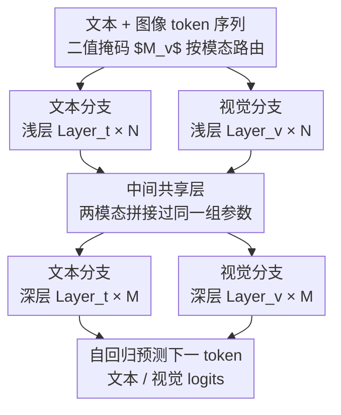

# Uni-X: Mitigating Modality Conflict with a Two-End-Separated Architecture for Unified Multimodal Models

**会议**: ICLR 2026  
**arXiv**: [2509.24365](https://arxiv.org/abs/2509.24365)  
**代码**: [https://github.com/CURRENTF/Uni-X](https://github.com/CURRENTF/Uni-X)  
**领域**: 图像生成  
**关键词**: 统一多模态模型, 梯度冲突, 模态分离, 自回归生成, 图像生成与理解

## 一句话总结
Uni-X提出一种两端分离、中间共享的X型架构来缓解统一多模态模型（UMM）中视觉与文本模态的梯度冲突，通过将浅层和深层设为模态专属、中间层共享参数，3B参数即可匹配或超越7B AR-UMM在图像生成和多模态理解上的性能。

## 研究背景与动机

**领域现状**：统一多模态模型（UMM）旨在单一框架中同时支持图像理解和生成。自回归（AR）方式通过VQ将视觉token化为"外语"，架构简洁但性能受限。复杂设计（如MoT、AR+Diffusion混合、任务分支）虽有效但牺牲了参数共享和扩展性。

**现有痛点**：完全模态共享的Transformer在联合训练时存在严重的梯度冲突。作者首次将多任务学习中的梯度冲突概念迁移到UMM，发现视觉和文本梯度在浅层和深层方向严重冲突。

**核心矛盾**：图像token序列的条件熵远高于自然语言（英语、德语、中文），意味着视觉序列内在更难预测，需要建模更长距离的空间纠缠依赖。当共享Transformer同时处理低熵文本和高熵视觉时，浅层和深层被迫调和冲突的低级分布。

**本文目标**：如何在保持纯AR架构简洁性的同时，有效缓解模态间梯度冲突？

**切入角度**：通过梯度冲突的经验分析发现冲突在中间层减弱（抽象语义对齐），据此设计层级结构。

**核心 idea**：浅层和深层做模态专属处理（处理不同低级统计分布），中间层共享参数（利用高级语义对齐），形成X型分离-共享架构。

## 方法详解

### 整体框架
Uni-X 想解决的是：纯自回归（AR）的统一多模态模型一旦让所有 Transformer 层在文本和图像之间完全共享参数，联合训练时两个模态的梯度会互相打架，性能被拖累。它的破局点不是堆模块，而是改层级结构——把一个预训练 LLM 的 $L$ 层 $\{\text{Layer}_t^i\}_{i=0}^{L-1}$ 切成三段：最前面 $N$ 层和最后面 $M$ 层设为"分离层"，中间剩下的层保持"共享层"。在两端的分离层里额外引入一组并行的视觉专用层 $\{\text{Layer}_v^i\}$，和原始文本层并排放置；前向传播时用一个二值掩码 $M_v$ 把视觉 token 路由到视觉分支、文本 token 走文本分支。整体形状两头宽（模态各走各的）、中间细（一起走），所以叫 X 型。而这套层级划分本身不是拍脑袋决定的——它由一套"先量化冲突、再按冲突分布切层、最后用信息论解释为什么冲突长这样"的分析链条逐步推出来。

### 关键设计

**1. 梯度冲突量化：先把"模态在打架"这件事测出来**

设计的出发点是一个没人量化过的现象：完全共享的 Transformer 在联合训练时，文本和图像的更新方向会互相抵消。Uni-X 把多任务学习里的梯度冲突概念搬进 UMM，用一个可计算的指标把它钉死。具体做法是分别求出纯文本 batch 的梯度 $g_{\text{text}}$ 和图文 batch 的梯度 $g_{\text{img}}$，算它们的余弦相似度 $S_{\text{inter}}$；但余弦相似度本身有个混淆项——即便同模态、不同 batch 之间也不会完全对齐，所以再把同一份数据随机切两半算出基线相似度 $S_{\text{base}}$，把这部分"天然噪声"扣掉。冲突最终定义为 $c_g = -(S_{\text{inter}} - S_{\text{base}})$，值越大说明跨模态梯度越对着干。逐层测下来发现一个清晰的规律：冲突在浅层和深层最严重，越往中间越弱——这正是后面把两端拆开、中间留共享的直接依据。

**2. 两端分离架构：让结构去匹配冲突的分布，而不是硬扛**

既然冲突集中在两端、中间最弱，那就让两端各走各的、中间一起走。前向传播按层位置分流：当 $l < N$ 或 $l \geq L-M$（落在两端的分离层）时，模态 $x$ 自己走自己的层 $H_x^{l+1} = \text{Layer}_x^l(H_x^l)$，视觉和文本互不干扰；否则进入中间共享层，两模态拼在一起过同一层 $H_x^{l+1} = [\text{Layer}_t^l(H^l)]_x$。关键约束是分离块内严格隔离、不做任何跨模态交互，逼着模型先把各自的单模态表示学扎实，再到中间层去对齐语义。这背后的逻辑是让网络结构对齐模态特征本身——浅层和深层负责的是低级统计分布，两个模态在这层的分布差异最大、最该分开处理；中间层做的是高级语义抽象，此处文本和图像反而能共享，于是把参数省在该共享的地方。

**3. 信息论解释：为什么"视觉是更难的外语"**

前两点解释了怎么测、怎么分，这一点回答更深的问题——冲突的根源到底是什么。Uni-X 用 n-gram 条件熵做分析，发现把图像 VQ 成离散 token 后，图像序列的条件熵远高于自然语言（英语、德语、中文都更低）。条件熵高意味着给定前文也难预测下一个 token，序列内部存在更长距离的空间纠缠依赖。这就把梯度冲突落到了实处：当一个共享的浅层/深层被迫同时拟合低熵的文本分布和高熵的视觉分布时，两种复杂度迥异的序列对低级处理的需求根本不一样，调和它们必然产生方向相反的梯度。换句话说，"视觉是一门更难的外语"不是比喻，而是有熵差支撑的——也正因为难在低级分布，所以分离层放在两端、而不是中间。

### 训练目标
全程用标准自回归交叉熵损失 $\mathcal{L} = -\sum_{i=1}^T \log P(s_i | s_{<i})$，不引入任何额外的扩散或语义对齐目标。视觉侧用 Chameleon 的 VQGAN tokenizer 把 512×512 图像编码成 32×32 的离散 token（码本大小 8192），和文本 token 拼成一条序列统一预测。生成时 CFG 统一设为 4.0。

## 实验关键数据

### 文本性能

| 模型 | 参数 | ARC-E | ARC-C | WinoG | BoolQ | MMLU | Avg |
|------|------|-------|-------|-------|-------|------|-----|
| Chameleon | 7B | 76.1 | 46.5 | 70.4 | 81.4 | 52.1 | 65.3 |
| Liquid | 7B | 75.6 | 49.0 | 72.7 | 81.0 | 56.0 | 66.9 |
| **Uni-X** | **3B/4.5B** | **79.0** | 47.9 | 68.9 | **82.2** | **57.6** | **67.1** |

### 图像生成与多模态理解

| 模型 | 参数 | GenEval | DPG | MME | POPE | MMB | SEED |
|------|------|---------|-----|-----|------|-----|------|
| EMU3 | 8B | 66 | 80.6 | 1243.8 | 85.2 | 58.5 | 68.2 |
| Liquid | 7B | 68 | 79.8 | 1107.2 | 81.1 | — | — |
| Janus-Pro | 7B | 80 | 84.1 | — | 87.4 | 79.2 | 72.1 |
| **Uni-X** | **3B/4.5B** | **82** | 79.8 | 1158.3 | 83.6 | 59.3 | 60.2 |

### 关键发现
- 3B参数的Uni-X在GenEval上达到82分，超越大多7B AR-UMM，包括Chameleon（39）、EMU3（66）、Liquid（68）
- Uni-X不使用语义编码器（CLIP/SigLIP），纯AR架构，表明梯度冲突才是限制性能的关键瓶颈
- 梯度冲突分析显示，Uni-X不仅避免了两端冲突，还进一步缓解了中间共享层的残余冲突
- 在相同训练条件下，Uni-X的训练效率优于全共享基线

## 亮点与洞察
- **问题发现比解决方案更重要**：首次在UMM中量化梯度冲突并追溯到信息论根源（熵差异），这一分析框架可广泛应用于其他多模态/多任务系统
- **简洁性的胜利**：相比MoT、AR+Diffusion混合等复杂设计，Uni-X仅通过层级划分就达到竞争性能，保持了纯AR的扩展性优势
- **参数效率**：3B匹配7B的性能意味着架构设计可替代蛮力缩放
- **信息论视角新颖**：用条件熵解释"视觉是更难的外语"，直观且有说服力

## 局限与展望
- 当前仅处理非交错的多模态输入，交错序列（图文混排）场景未验证
- N和M（分离层数量）的选择似乎需要经验调节，缺乏原则性指导
- 分离层内严格隔离可能限制早期跨模态信息交流
- 可以探索动态/自适应的层分配策略

## 相关工作与启发
- **vs Chameleon**：完全共享架构导致严重冲突，7B参数GenEval仅39分；Uni-X 3B达82分
- **vs MoT/UniFork**：这些方法通过增加模块复杂性缓解冲突，但牺牲参数共享；Uni-X保持简洁
- **vs Janus-Pro**：使用额外语义编码器达到80分GenEval；Uni-X无需额外编码器达到82分

## 补充细节
- 预训练数据：72B文本tokens + 65B视觉tokens，来自CCI3-H、DCLM、Fineweb-Edu等
- SFT阶段使用3B tokens，包括MiniGemini、FineVision、OpenOrca等
- 消融在Qwen2.5-1.5B上进行，缩放到Qwen2.5-3B
- 分离层数量 $N$ 和 $M$ 通过消融确定最佳配置
- 训练使用Flash Attention 2和DeepSpeed ZeRO2加速

## 评分
- 新颖性: ⭐⭐⭐⭐ 梯度冲突分析+信息论解释+X型架构的组合有新意
- 实验充分度: ⭐⭐⭐⭐ 文本、生成、理解全面评估，消融充分
- 写作质量: ⭐⭐⭐⭐⭐ 动机清晰，从分析到设计逻辑严密
- 价值: ⭐⭐⭐⭐ 为UMM设计提供了实用的架构指导原则

<!-- RELATED:START -->

## 相关论文

- [\[ICLR 2026\] When One Modality Rules Them All: Backdoor Modality Collapse in Multimodal Diffusion Models](when_one_modality_rules_them_all_backdoor_modality_collapse_in_multimodal_diffus.md)
- [\[NeurIPS 2025\] Mitigating Intra- and Inter-modal Forgetting in Continual Learning of Unified Multimodal Models](../../NeurIPS2025/image_generation/mitigating_intra-_and_inter-modal_forgetting_in_continual_learning_of_unified_mu.md)
- [\[ICLR 2026\] Draw-In-Mind: Rebalancing Designer-Painter Roles in Unified Multimodal Models Benefits Image Editing](draw-in-mind_rebalancing_designer-painter_roles_in_unified_multimodal_models_ben.md)
- [\[ICLR 2026\] Detecting and Mitigating Memorization in Diffusion Models through Anisotropy of the Log-Probability](detecting_and_mitigating_memorization_in_diffusion_models_through_anisotropy_of_.md)
- [\[ICML 2026\] Conflict-Aware Additive Guidance for Flow Models under Compositional Rewards](../../ICML2026/image_generation/conflict-aware_additive_guidance_for_flow_models_under_compositional_rewards.md)

<!-- RELATED:END -->
