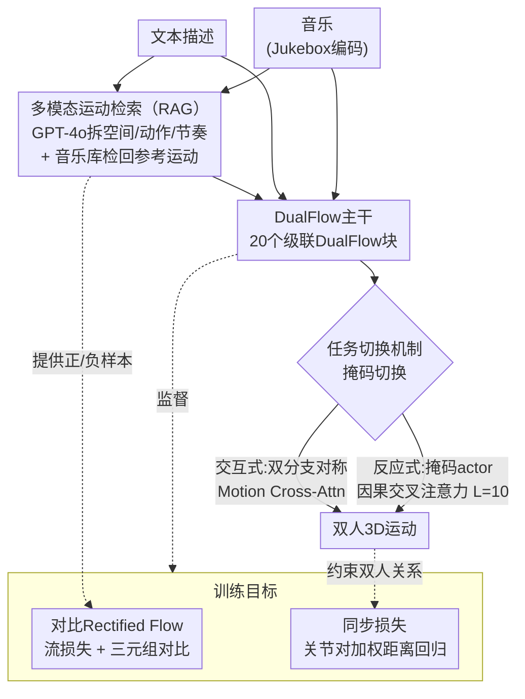

# Unified Multi-Modal Interactive & Reactive 3D Motion Generation via Rectified Flow

**会议**: ICLR 2026  
**arXiv**: [2509.24099](https://arxiv.org/abs/2509.24099)  
**代码**: [https://gprerit96.github.io/dualflow-page](https://gprerit96.github.io/dualflow-page)  
**领域**: 3D运动生成  
**关键词**: 双人运动生成, Rectified Flow, 检索增强生成, 对比学习, 多模态条件

## 一句话总结
DualFlow提出首个统一框架，通过Rectified Flow和检索增强生成（RAG）实现文本+音乐多模态条件下的双人交互/反应式3D运动生成，引入对比流匹配和同步损失，在MDD数据集上FID提升2.5%、R-precision提升76%，推理速度提升2.5倍。

## 研究背景与动机

**领域现状**：两人运动生成在VR/AR、游戏AI、人机协作中至关重要。现有方法将交互式（双人同步生成）和反应式（根据A的运动生成B的运动）作为独立任务处理，架构不兼容。

**现有痛点**：(1) 交互式和反应式模型使用不同架构和训练目标，无法无缝切换；(2) 现有方法仅支持单模态条件（文本或音乐），无法联合条件化；(3) 基于扩散的方法需要50+去噪步骤，推理速度慢。

**核心矛盾**：双人运动需要同时建模两人间的相互响应、物理合理性和多模态信号对齐，但现有方法缺乏统一建模能力。

**本文目标**：如何在单一架构中统一交互式和反应式运动生成，同时支持文本+音乐多模态条件？

**切入角度**：利用Rectified Flow的直线传输路径实现快速推理，通过对称/非对称掩码机制切换任务，RAG提供语义引导。

**核心 idea**：通过级联DualFlow块的双分支架构实现任务统一切换，结合对比Rectified Flow和LLM分解的RAG模块实现多模态语义对齐。

## 方法详解

### 整体框架
DualFlow要解决的是一个看似割裂的问题：双人运动里，「交互式」是两人同步一起生成，「反应式」是已知A的动作去补B的动作，过去这两件事各用一套架构、互不相通。DualFlow把它们塞进同一个网络里——主干是20个级联的DualFlow块，处理双人的运动潜变量；条件来自文本（CLIP-L/14编码）和音乐（Jukebox编码）。送进主干前，检索增强（RAG）先按文本/音乐检回若干参考运动，给生成提供语义锚点；主干内部靠任务切换机制决定怎么转——要做交互时两条分支对称激活、彼此用Motion Cross-Attention协调，要做反应时只激活反应者那条分支、用因果交叉注意力把actor的运动当条件喂进去，同一套权重靠掩码切换就完成任务转换。训练侧则用对比式流匹配和同步损失，分别把「语义对齐」和「双人空间关系」拉紧。

### 关键设计

**1. 多模态运动检索（RAG）：用LLM分解文本，给生成提供精准的语义锚点**

直接拿一句原始文本去检索参考运动，会丢掉交互动作里那些细腻的维度——两人之间是靠近还是远离、各自身体在做什么、节奏怎么走，这些信息混在一句话里很难被单一检索捕捉。DualFlow让GPT-4o把文本描述拆成三个维度：空间关系、身体动作、节奏，分别建立CLIP检索库 $(D^S, D^B, D^R)$，再加一个用Jukebox特征建的音乐检索库 $D^M$。检索打分同时看语义和时长是否兼容：

$$s_i^q = \langle f_i^q, f_p^q \rangle \cdot e^{-\lambda \cdot \frac{|l_i - l_p|}{\max\{l_i, l_p\}}}$$

前一项是查询特征 $f_p^q$ 与库内特征 $f_i^q$ 的内积相似度，后一项是一个随长度差 $|l_i - l_p|$ 衰减的因子，避免检回来一段时长完全对不上的参考。分维度检索比整句检索质量更高，正是因为它能分别对齐到运动的不同侧面。

**2. 任务切换机制：靠掩码和注意力替换，一套网络切两种任务**

统一框架的关键就在这里——交互式和反应式过去要各维护一套模型，DualFlow让它们共用主干、只靠掩码切换。交互设置下，两条分支对称激活，由Motion Cross-Attention在两人之间协调运动；反应设置下，actor分支被掩码，原来的运动交叉注意力被替换成带Look-Ahead $L=10$ 的因果交叉注意力——只让反应者看到actor当前及未来有限步的动作，模拟真实反应里「边看边应」的因果性。无需改架构、无需重训两套模型，掩码一换就完成切换。

**3. 对比Rectified Flow：在流匹配里加三元组对比，让生成更贴合语义**

光靠流匹配回归速度场，模型容易学到「能动起来」但和文本/风格对不齐的运动。DualFlow在标准流损失之外叠了一个三元组对比损失。流损失本身是直线传输路径的速度回归：

$$\mathcal{L}_{\text{flow}} = \mathbb{E}[\|\mathbf{v}_\theta(\mathbf{x}_t, t, c) - (\mathbf{x}_0 - \epsilon)\|_2^2]$$

对比项则约束预测速度 $\hat{\mathbf{v}}$ 在嵌入空间里靠近正样本、远离负样本：

$$\mathcal{L}_{\text{triplet}} = \mathbb{E}[\max(0, d(\hat{\mathbf{v}}, \mathbf{v}^+) - d(\hat{\mathbf{v}}, \mathbf{v}^-) + m)]$$

正负样本怎么挑？直接复用了上面RAG的层次结构：正样本取相同风格、相似文本描述的运动，负样本取风格差异大、或文本相似度低于0.6的运动。这样RAG不只在推理时提供参考，还在训练时为对比学习提供天然的样本对来源。

**4. 同步损失：按关节对加权，强约束两人之间的空间关系**

双人运动的难点在于两人不是各动各的，关节之间存在稳定的空间约束（牵手、对位、托举），单纯回归各自的运动很容易让两人「貌合神离」。同步损失直接对双人关节间距离做加权回归：

$$\mathcal{L}_{\text{sync}} = \sum_{j_1,j_2} w_d(j_1,j_2) w_j(j_1,j_2) \|d_p(j_1,j_2) - d_{gt}(j_1,j_2)\|^2$$

其中 $d_p$ 是预测的两人关节对距离、$d_{gt}$ 是真值距离。两个权重各管一件事：距离权重 $w_d$ 给那些本来就该靠得近的关节对更高权重，解剖权重 $w_j$ 则区分手部、上肢、下肢等部位的重要性。这样误差不会被大量无关紧要的远距离关节对稀释，模型会优先把真正发生交互的部位对齐好。

### 损失函数
总损失把上述各项组合起来：

$$\mathcal{L}_{\text{total}} = \mathcal{L}_{\text{CRF}} + \lambda_{\text{geo}} \mathcal{L}_{\text{geo}} + \lambda_{\text{inter}} \mathcal{L}_{\text{inter}}$$

其中对比流匹配项 $\mathcal{L}_{\text{CRF}} = \mathcal{L}_{\text{flow}} + \lambda_{\text{triplet}} \mathcal{L}_{\text{triplet}}$；几何项 $\mathcal{L}_{\text{geo}}$ 包含脚接触、关节速度、骨骼长度三类损失，约束单人运动的物理合理性；交互项 $\mathcal{L}_{\text{inter}}$ 包含距离图、相对朝向和上面的同步损失，约束双人之间的空间关系。

## 实验关键数据

### MDD数据集主实验（Duet任务）

| 方法 | R-Prec@3↑ | FID↓ | MMDist↓ | BAS↑ |
|------|-----------|------|---------|------|
| MDM(Both) | 0.163 | 1.739 | 2.244 | 0.190 |
| InterGen(Both) | 0.302 | 0.426 | 1.532 | 0.185 |
| **DualFlow(Both)** | **0.513** | **0.415** | **0.513** | 0.200 |
| GT | 0.522 | 0.065 | 0.077 | 0.170 |

### 反应式任务

| 方法 | FID↓ | MMDist↓ | R-Prec@3↑ |
|------|------|---------|-----------|
| DuoLando(Both) | — | — | — |
| **DualFlow(Both)** | **0.686** | **1.056** | **最佳** |

### 关键发现
- DualFlow仅需20推理步（vs 50-DDIM标准），速度提升2.5倍
- 交互任务：FID提升2.5%，R-precision提升76%，MMDist提升3倍
- 反应任务：FID提升1.7%，R-precision提升2.5倍
- 对比损失和RAG模块的消融证明两者均有显著贡献
- 同步损失有效改善双人间时间协调性

## 亮点与洞察
- **首个统一双人运动生成框架**：通过掩码机制在交互和反应任务间无缝切换，消除了维护两套系统的需求
- **RAG适应双人场景的创新**：LLM分解文本为空间关系/身体动作/节奏三维度是处理交互描述的巧妙方案
- **Rectified Flow的实用优势**：20步推理即可达到优质结果，适合实时应用

## 局限与展望
- 依赖GPT-4o进行文本分解，增加计算成本和API依赖
- 当前仅支持双人场景，多人（>2）场景需要架构扩展
- 运动质量评估依赖自动指标，主观感知质量需更多用户研究
- 可以探索将DualFlow扩展到手部精细运动生成

## 相关工作与启发
- **vs InterGen**：基于扩散的双人模型需50去噪步，DualFlow仅需20步且性能更优
- **vs MDM**：单人扩散模型直接扩展到双人效果差，缺乏交互建模
- **首创双人RAG**：区别于现有单人运动RAG，引入交互感知的检索机制

## 评分
- 新颖性: ⭐⭐⭐⭐ 统一交互/反应+多模态条件+双人RAG的组合首创
- 实验充分度: ⭐⭐⭐⭐ 三个数据集、多种设置、消融充分
- 写作质量: ⭐⭐⭐⭐ 结构清晰，但部分细节过于密集
- 价值: ⭐⭐⭐⭐ 对双人运动生成领域有明确推动

<!-- RELATED:START -->

## 相关论文

- [\[ICLR 2026\] Free Lunch for Stabilizing Rectified Flow Inversion](free_lunch_for_stabilizing_rectified_flow_inversion.md)
- [\[CVPR 2025\] OmniFlow: Any-to-Any Generation with Multi-Modal Rectified Flows](../../CVPR2025/image_generation/omniflow_any-to-any_generation_with_multi-modal_rectified_flows.md)
- [\[CVPR 2025\] JanusFlow: Harmonizing Autoregression and Rectified Flow for Unified Multimodal Understanding and Generation](../../CVPR2025/image_generation/janusflow_harmonizing_autoregression_and_rectified_flow_for_unified_multimodal_u.md)
- [\[ICLR 2026\] Image Can Bring Your Memory Back: A Novel Multi-Modal Guided Attack against Image Generation Model Unlearning](image_can_bring_your_memory_back_a_novel_multi-modal_guided_attack_against_image.md)
- [\[ICLR 2026\] Laplacian Multi-scale Flow Matching for Generative Modeling](laplacian_multi-scale_flow_matching_for_generative_modeling.md)

<!-- RELATED:END -->
