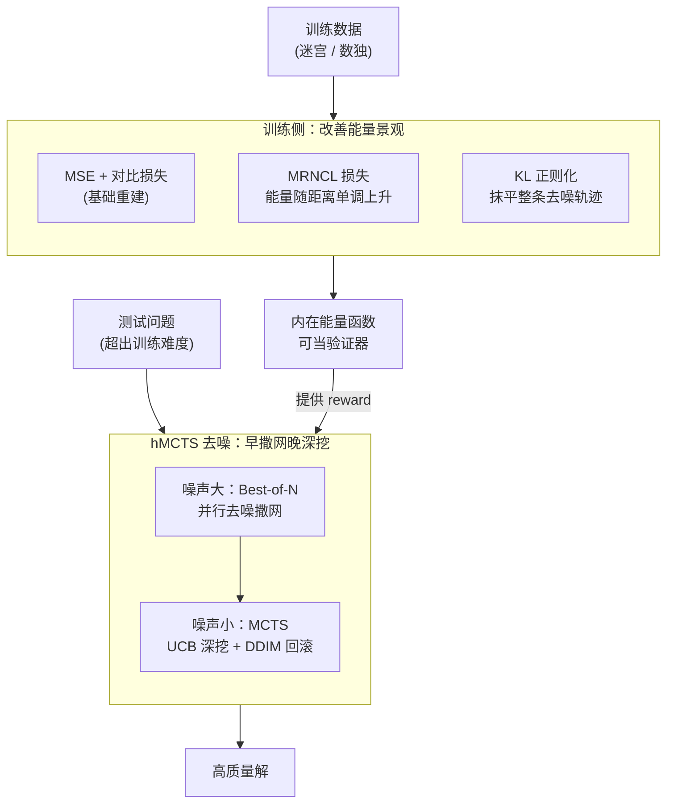

# VFScale: Intrinsic Reasoning through Verifier-Free Test-time Scalable Diffusion Model

**会议**: ICLR 2026  
**arXiv**: [2502.01989](https://arxiv.org/abs/2502.01989)  
**代码**: [https://github.com/AI4Science-WestlakeU/VFScale](https://github.com/AI4Science-WestlakeU/VFScale)  
**领域**: 扩散模型/推理  
**关键词**: 测试时缩放, 无验证器, 能量函数, 蒙特卡洛树搜索, 扩散模型推理

## 一句话总结
VFScale提出无需外部验证器的测试时可缩放扩散模型，通过MRNCL损失和KL正则化改善能量景观使其内在能量函数可作为验证器，结合混合MCTS去噪实现高效搜索，在6×6训练的迷宫模型能解决88%的15×15迷宫，而标准扩散模型完全失败。

## 研究背景与动机

**领域现状**：受人类System 2思维启发，LLM通过Chain-of-Thought在复杂推理中表现优秀。扩散模型通过迭代细化也适合推理任务，但在问题难度超出训练分布时性能急剧下降。

**现有痛点**：(1) 简单增加采样步数很快饱和（Du et al. 2024）；(2) 通过增加样本数量的测试时缩放依赖外部验证器提供密集评分信号，但推理任务的验证器难以获取；(3) 人类能进行无外部反馈的内省推理，现有方法与此有明显差距。

**核心矛盾**：扩散模型的能量函数本身可以作为验证器（因为score function是能量梯度的负数），但现有能量景观质量不足，低能量不一定对应高质量解（performance-energy consistency差）。

**本文目标**：如何利用扩散模型的内在能量函数替代外部验证器，实现无验证器的测试时缩放？

**切入角度**：双管齐下——训练侧改善能量景观，推理侧改善搜索效率。

**核心 idea**：通过MRNCL损失对齐能量值与样本质量的单调关系，通过hMCTS在去噪过程中平衡探索与利用。

## 方法详解

### 整体框架
VFScale 想让扩散模型在不依赖外部验证器的情况下也能做测试时缩放，关键是让模型自己的能量函数变成可信的"质量打分器"。它分两条线推进：训练侧在标准的 MSE 重建损失和对比损失之上，补上 MRNCL 损失（把能量值和样本质量的单调关系对齐）与 KL 正则化（把能量景观抹平），让低能量真正对应高质量解；推理侧则用混合 MCTS 去噪，在去噪早期噪声大时广撒网、晚期噪声小时深挖，用模型自己的能量当 reward 来引导搜索。训练侧产出一个可信的内在能量函数，推理侧再把它当验证器驱动搜索，两条线接力完成无验证器的测试时缩放。

### 关键设计

**1. MRNCL 损失：让"离正确答案越远、能量越高"成为硬约束**

能量景观质量差的根子在于：原始对比损失只要求正样本是局部能量最小值，却完全不管两个负样本之间谁该能量更高，于是出现"低能量却不是好解"的不一致。MRNCL（Monotonic-Regression Negative Contrastive Learning）针对的就是这个序关系缺失。具体做法是对每个正样本 $x_0$ 额外造两个负样本 $x_0^-$ 和 $x_0^{--}$，后者离正样本更远；加噪之后拿到三个点的能量值 $(0, E_t^+)$、$(l_{2,0}^-, E_t^-)$、$(l_{2,0}^{--}, E_t^{--})$，横轴是到正样本的 $\ell_2$ 距离、纵轴是能量，对这三点做线性回归求出斜率 $k_t$ 和截距 $b_t$。损失为

$$\mathcal{L}_{\text{MRNCL}} = \mathbb{E}\big[\max(0, \gamma - k_t) + \sum \|E - \hat{E}\|_2^2\big]$$

前一项用 hinge 逼斜率 $k_t$ 大于阈值 $\gamma$（保证能量随距离单调上升），后一项让三点尽量贴合回归直线（保证关系平滑）。这样训练出来的能量函数才能在测试时充当验证器：能量低的就是离正确答案近的好解。

**2. KL 正则化：把整条去噪轨迹上的能量景观都抹平**

光有单调性还不够，能量景观若坑坑洼洼仍会误导搜索。KL 正则项

$$\mathcal{L}_{\text{KL}} = \mathbb{E}_{t, p_{\theta,t}}[E_{\text{stop-grad}(\theta)}(x)] + \mathbb{E}_{t, p_{\theta,t}}[\log p_{\theta,t}(x)]$$

第一项压低样本能量、把分布往低能量区拉，第二项是熵最大化、鼓励采样多样性以免坍缩。和 Du et al. 2021 只在终端施加正则不同，这里在每个去噪步 $t$ 上都施加，使整条轨迹的能量都被平滑，搜索时每一步的能量打分才都可靠。

**3. 混合 MCTS 去噪（hMCTS）：按噪声大小切换搜索策略，把内在能量当 reward**

测试时缩放还需要一个高效的搜索器。hMCTS 的核心观察是去噪过程中噪声从大到小，应当匹配不同搜索强度：早期噪声大、路径前景未明，用 Best-of-$N$ 撒网——$L$ 个初始噪声并行去噪，避免过早淘汰有潜力的分支；后期噪声小、路径逐渐确定，切到 MCTS 深挖。MCTS 的四步里，Selection 用 UCB 平衡探索利用，

$$\text{UCB}(x_t, a_t) = Q(x_t, a_t) + c\sqrt{\frac{\ln N_i}{n_i}}$$

Expansion 对当前节点单步去噪并叠加不同高斯噪声，分出 $K$ 个子分支；Simulation 用 DDIM 快速采样直达 $x_0$，再用模型自己的能量 $E_\theta(\hat{x}_0)$ 作为 reward——这正是"无需外部验证器"的关键，打分信号全部来自训练好的内在能量；Backpropagation 把这个 reward 回传更新路径上所有节点的值。DDIM 的子序列采样特性让每次 simulation 都能跳步直达终点，使得整个回滚足够廉价、MCTS 才跑得起来。

### 损失函数 / 训练策略
训练侧四项损失联合优化，前两项保证基本生成质量、后两项专门塑形能量景观：

$$\mathcal{L} = \mathcal{L}_{\text{MSE}} + \mathcal{L}_{\text{Contrast}} + \mathcal{L}_{\text{MRNCL}} + \mathcal{L}_{\text{KL}}$$

## 实验关键数据

### 基础泛化能力（N=1推理）

| 方法 | Maze 6×6 | Maze 10×10 | Maze 15×15 | Sudoku D=33 | Sudoku D=25 |
|------|----------|------------|------------|-------------|-------------|
| Original | 1.000 | 0.578 | 0.063 | 0.320 | 0.023 |
| VFScale tr. | 1.000 | 0.775 | 0.281 | 0.195 | 0.008 |

### 测试时缩放（Maze 15×15）

| 方法 | N=1 | N=11 | N=41 | N=161 |
|------|-----|------|------|-------|
| Original BoN (Energy) | 0.063 | 0.047 | 0.078 | 0.109 |
| Original BoN (GT) | 0.063 | 0.125 | 0.133 | 0.172 |
| VFScale tr. BoN (GT) | 0.250 | 0.508 | 0.656 | 0.742 |
| **VFScale tr. hMCTS** | **0.281** | — | — | **0.880** |

### 关键发现
1. **原始训练方法的测试时缩放完全失败**：即使用ground truth验证器引导BoN，Maze 15×15成功率仅从6%提到17%
2. **能量景观质量是瓶颈**：原始模型performance-energy consistency仅约70%
3. **VFScale训练显著提升可缩放性**：同等BoN预算下，GT引导的成功率从17%提升到74%
4. **hMCTS进一步释放缩放潜力**：最终达到88%成功率（6×6训练→15×15测试）
5. **MRNCL和KL正则化互补**：去掉任一都会降低性能

## 亮点与洞察
- **范式创新**：将扩散模型的内在能量函数用作验证器，真正实现"无外部反馈的内省推理"
- **MRNCL的洞察深刻**：对比学习约束正负样本关系但忽略负样本间序关系，这是能量景观质量差的根本原因
- **hMCTS的设计精巧**：早期BoN宽搜+后期MCTS深搜，完美匹配去噪过程中噪声从大到小的特性
- **惊人的泛化能力**：6×6训练→88% 15×15测试，展示了测试时缩放的真正潜力

## 局限与展望
- MCTS的计算开销随分支数 $K$ 和回滚次数 $N_r$ 增长，需要仔细平衡
- 目前仅在网格/数独等结构化推理任务上验证，语言推理等更复杂场景待探索
- MRNCL中线性回归的选择可能不是最优的单调约束
- 可以探索自适应的BoN→MCTS切换点

## 相关工作与启发
- **vs Du et al. 2024**：他们的能量扩散模型在测试时缩放上饱和，VFScale解决了根本原因
- **vs Ma et al. 2025**：他们依赖外部验证器进行样本数缩放，VFScale完全内在化
- **vs AlphaGo/AlphaZero**：借鉴MCTS的核心思想但适配扩散去噪过程

## 评分
- 新颖性: ⭐⭐⭐⭐⭐ 无验证器测试时缩放的概念、MRNCL、hMCTS均为创新
- 实验充分度: ⭐⭐⭐⭐ Maze和Sudoku充分验证，但任务类型较单一
- 写作质量: ⭐⭐⭐⭐⭐ 动机→分析→解决方案的展开逻辑清晰
- 价值: ⭐⭐⭐⭐⭐ 为扩散模型的推理能力和测试时缩放开辟新方向

<!-- RELATED:START -->

## 相关论文

- [\[ICLR 2026\] Test-Time Iterative Error Correction for Efficient Diffusion Models](test-time_iterative_error_correction_for_efficient_diffusion_models.md)
- [\[ICLR 2026\] Compose Your Policies! Improving Diffusion-based or Flow-based Robot Policies via Test-time Distribution-level Composition](compose_your_policies_improving_diffusion-based_or_flow-based_robot_policies_via.md)
- [\[ICML 2026\] Linearizing Vision Transformer with Test-Time Training](../../ICML2026/image_generation/linearizing_vision_transformer_with_test-time_training.md)
- [\[CVPR 2026\] From Scale to Speed: Adaptive Test-Time Scaling for Image Editing](../../CVPR2026/image_generation/from_scale_to_speed_adaptive_test-time_scaling_for_image_editing.md)
- [\[CVPR 2026\] Progress by Pieces: Test-Time Scaling for Autoregressive Image Generation](../../CVPR2026/image_generation/progress_by_pieces_test-time_scaling_for_autoregressive_image_generation.md)

<!-- RELATED:END -->
