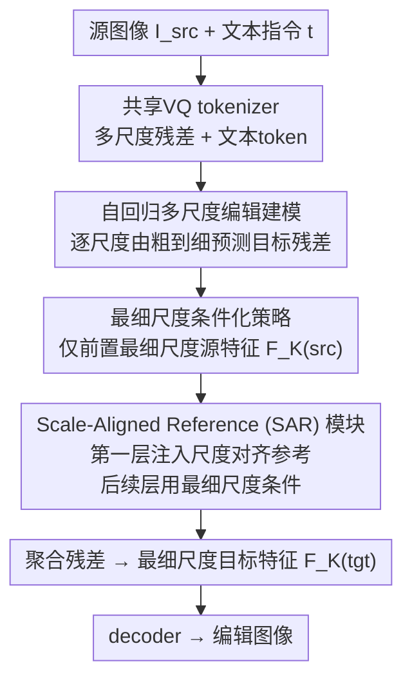

# Visual Autoregressive Modeling for Instruction-Guided Image Editing

**会议**: ICLR 2026  
**arXiv**: [2508.15772](https://arxiv.org/abs/2508.15772)  
**代码**: [GitHub](https://github.com/HiDream-ai/VAREdit)  
**领域**: 图像生成  
**关键词**: 图像编辑, 视觉自回归, 多尺度预测, 指令引导, 尺度对齐

## 一句话总结

提出VAREdit，将指令引导的图像编辑重新定义为多尺度预测问题，通过Scale-Aligned Reference模块解决最细尺度条件化的尺度失配问题，在编辑遵循度和效率上大幅超越扩散模型方法。

## 研究背景与动机

1. **领域现状**: 指令引导图像编辑主要由扩散模型主导（InstructPix2Pix等），通过channel-wise拼接源图和目标图进行联合去噪。

2. **现有痛点**: 扩散模型的全局去噪过程天然将编辑区域与整幅图像耦合，导致：(1) 非编辑区域出现虚假修改（"bleeding"问题）；(2) 编辑指令遵循度不足；(3) 多步迭代去噪的计算代价高。

3. **核心矛盾**: 扩散模型的优势（全局一致性建模）恰恰是编辑任务的劣势——编辑需要精准的局部修改与全局保留的分离。自回归模型的因果性和组合性天然适合编辑，但VAR范式在图像编辑中尚未被探索。

4. **本文目标**: 将视觉自回归（VAR）的多尺度预测范式引入指令引导图像编辑。

5. **切入角度**: 发现VAR编辑的核心挑战在于源图像条件化策略——全尺度条件太贵（$O(n^2)$），最细尺度条件高效但存在尺度失配。通过分析注意力热力图发现失配仅影响第一个自注意力层。

6. **核心 idea**: 仅在第一个自注意力层注入尺度对齐的参考特征，其余层使用最细尺度条件，兼顾效率和编辑质量。

## 方法详解

### 整体框架

VAREdit基于预训练Infinity模型，把指令编辑重写成条件多尺度预测：给定源图像 $\mathbf{I}^{(src)}$ 与文本指令 $\mathbf{t}$，模型自回归地生成目标图像的K层残差图 $\mathbf{R}_{1:K}^{(tgt)}$，逐尺度由粗到细补出编辑结果。源图像信息以最细尺度特征 $\mathbf{F}_K^{(src)}$ 为主要条件注入，并只在第一个自注意力层额外补一份尺度对齐的参考特征来纠正失配。

### 关键设计

**1. 自回归多尺度编辑建模：把"局部改、全局留"交给因果生成**

扩散模型的全局去噪天然把编辑区域和整幅图耦合，非编辑区域容易出现"bleeding"式的虚假改动；VAREdit换一条路，把编辑分解为K个尺度上的残差预测，并按因果顺序逐尺度生成：$p(\mathbf{R}_{1:K}^{(tgt)}\mid\mathbf{I}^{(src)},\mathbf{t}) = \prod_{k=1}^K p(\mathbf{R}_k^{(tgt)}\mid\mathbf{F}_{1:k-1}^{(tgt)},\mathbf{F}_K^{(src)},\mathbf{t})$。文本指令经交叉注意力进入每一步，源图与目标图的token靠2D-RoPE区分位置。这种因果组合性让模型可以"沿用前面已生成的不变区域、只在需要处补残差"，从机制上把保留与修改分离开，比扩散的整图重绘更贴合编辑任务。

**2. 最细尺度条件化策略：用一份高频特征换掉全尺度的平方代价**

自然的做法是把全部K个尺度的源特征都前置到目标序列里做条件，但自注意力是 $O(n^2)$ 复杂度，序列一长开销迅速膨胀。VAREdit只前置最细尺度（最高分辨率）特征 $\mathbf{F}_K^{(src)}$ 一份，序列长度大幅缩短，推理速度因此能压到秒级。之所以单选最细尺度，是因为它承载了最丰富的高频细节，对"改哪里、改成什么样"的引导最关键——粗尺度提供的主要是已被残差结构覆盖的布局信息。

**3. Scale-Aligned Reference (SAR) 模块：只在第一层补尺度对齐特征，修掉失配又不丢效率**

最细尺度条件虽快，却带来尺度失配：目标序列在粗尺度k上的空间维度 $(h_k, w_k)$ 和最细尺度的 $(H, W)$ 对不上，注意力难以建立正确对应。注意力热力图分析揭示一个关键现象——失配只严重影响第一个自注意力层，它负责建立全局布局和长距离依赖（需要尺度匹配的条件），而深层主要做局部细化（最细尺度条件已够用）。据此SAR把最细尺度特征下采样成与每个目标尺度同维的参考 $\mathbf{F}_k^{(ref)} = \text{Down}(\mathbf{F}_K^{(src)}, (h_k, w_k))$，并仅在第一层让尺度k的query同时attend到这份对齐参考和已生成的目标历史，后续层仍只用最细尺度条件。消融显示把SAR推广到所有层反而掉点，正印证了"失配集中在第一层"的判断，也让SAR几乎不增加额外开销。

### 损失函数 / 训练策略

使用bitwise分类器损失优化目标残差token的索引预测，遵循Infinity的训练方案。VAREdit-2B两阶段训练：256²分辨率8k步 + 512²分辨率7k步。VAREdit-8B直接在512²训练60k步。推理使用CFG强度 $\eta=4$，logits温度 $\tau=0.5$。

## 实验关键数据

### 主实验

EMU-Edit和PIE-Bench上的定量对比：

| 方法 | 参数量 | GPT-Balance(EMU)↑ | GPT-Balance(PIE)↑ | 时间 |
|------|--------|-------------------|-------------------|------|
| InstructPix2Pix | 1.1B | 2.923 | 4.034 | 3.5s |
| UltraEdit | 7.7B | 4.541 | 5.580 | 2.6s |
| ICEdit | 17B | 4.785 | 4.933 | 8.4s |
| **VAREdit-2B** | 2.2B | 5.662 | 6.996 | **0.7s** |
| **VAREdit-8B** | 8.4B | **7.892** | **8.105** | 1.2s |
| Step1X-Edit | 21B | 7.081 | 7.351 | 12.8s |

512×512编辑：VAREdit-8B仅需1.2秒，比同规模UltraEdit快**2.2倍**。

### 消融实验

| 条件化策略 | CLIP-Out.↑ | GPT-Suc.↑ | GPT-Over.↑ | GPT-Bal.↑ |
|-----------|-----------|-----------|-----------|----------|
| 全尺度条件 | 0.275 | 5.781 | 7.087 | 5.346 |
| 最细尺度条件 | 0.264 | 4.926 | 7.077 | 4.584 |
| 最细尺度+SAR(第1层) | **0.271** | **6.210** | **7.055** | **5.662** |
| SAR在所有层 | 0.269 | 5.884 | 7.036 | 5.352 |
| SAR在前3层 | 0.269 | 5.894 | 7.048 | 5.297 |

### 关键发现

- VAREdit-8B的GPT-Balance比最强扩散基线（ICEdit）高**64.9%**（EMU-Edit）和**45.3%**（PIE-Bench）
- SAR仅在第一层应用效果最佳——在所有层应用反而性能下降，验证了注意力分析的洞察
- 在最成功编辑（GPT-Suc.≥9）的子集中，VAREdit的区域保留得分甚至超过OmniGen，证明非保守的真正保留
- 开源模型中，VAREdit-8B的GPT-Balance超越了参数量更大的Step1X-Edit（21B）和FLUX.1 Kontext（12B）

## 亮点与洞察

- **范式创新**: 首次将VAR的多尺度预测成功引入指令引导编辑，突破了扩散模型主导的现状
- **分析驱动设计**: SAR模块的设计完全来自对注意力热力图的系统分析，而非直觉猜测
- **效率与质量兼得**: 2.2B模型在0.7秒内完成512²编辑，质量超越17B的ICEdit
- **自回归范式对编辑的天然优势**: 因果生成机制自然支持区域选择性修改

## 局限与展望

- 依赖离散visual tokenizer，其重建质量限制了编辑的上限
- 目前最大模型为8B，更大规模的scaling效果待验证
- 未支持交互式编辑和多轮对话式编辑
- 可探索与mask引导的结合以进一步提升区域控制精度

## 相关工作与启发

- VAR (Tian et al., 2024) 和 Infinity 为多尺度自回归生成奠定基础，VAREdit将其扩展到编辑
- InstructPix2Pix建立了指令编辑的标准范式，但扩散模型的局限推动了本工作的AR探索
- 启发: 不同于"修补"扩散模型的不足，转换到自回归范式可能是更根本的解决方案

## 评分

- 新颖性: ⭐⭐⭐⭐⭐ 首次将VAR范式引入图像编辑，SAR设计有数据驱动的支撑
- 实验充分度: ⭐⭐⭐⭐⭐ 四个benchmark、多种指标、与frontier模型对比
- 写作质量: ⭐⭐⭐⭐ 分析清晰，从问题到解决方案的逻辑链完整
- 价值: ⭐⭐⭐⭐⭐ 性能大幅超越SOTA，开创编辑新范式

<!-- RELATED:START -->

## 相关论文

- [\[ICLR 2026\] EditReward: A Human-Aligned Reward Model for Instruction-Guided Image Editing](editreward_a_human-aligned_reward_model_for_instruction-guided_image_editing.md)
- [\[ICLR 2026\] MVAR: Visual Autoregressive Modeling with Scale and Spatial Markovian Conditioning](mvar_visual_autoregressive_modeling_with_scale_and_spatial_markovian_conditionin.md)
- [\[CVPR 2026\] Depth Adaptive Efficient Visual Autoregressive Modeling](../../CVPR2026/image_generation/depthvar_depth_adaptive_var.md)
- [\[ICML 2026\] Visual Implicit Autoregressive Modeling](../../ICML2026/image_generation/visual_implicit_autoregressive_modeling.md)
- [\[CVPR 2026\] FVAR: Next-Focus Prediction for Visual Autoregressive Modeling](../../CVPR2026/image_generation/fvar_next-focus_prediction_for_visual_autoregressive_modeling.md)

<!-- RELATED:END -->
