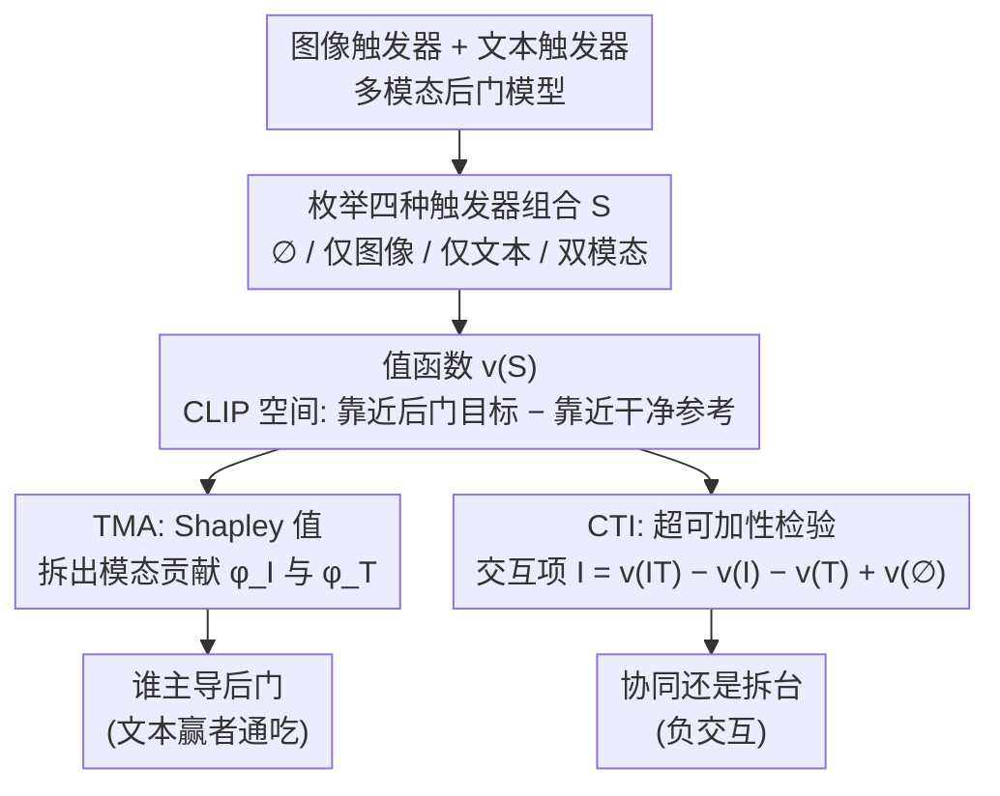

# When One Modality Rules Them All: Backdoor Modality Collapse in Multimodal Diffusion Models

**会议**: ICLR 2026  
**arXiv**: [2603.06508](https://arxiv.org/abs/2603.06508)  
**代码**: 无  
**领域**: 图像生成  
**关键词**: backdoor attack, 模态坍缩, 多模态扩散, Shapley值, 触发器交互

## 一句话总结
首次揭示并系统研究多模态扩散模型中的"后门模态坍缩"现象——多模态后门攻击中后门效果退化为仅依赖单一模态（通常是文本），提出TMA和CTI两个基于Shapley值的新指标量化模态贡献和跨模态交互，发现"赢者通吃"动态和负交互。

## 研究背景与动机

**领域现状**：扩散模型的后门攻击已成为重要研究方向。现有工作（BadDiffusion、VillanDiffusion等）已展示在单模态和多模态场景中注入后门的可行性。

**现有痛点**：(1) 直觉假设同时攻击多个模态应产生更强后门，但缺乏验证；(2) 受多模态学习中"模态坍缩"启发，后门攻击中可能存在同样问题；(3) 现有评估仅关注整体攻击成功率，未分解各模态贡献。

**核心矛盾**：高攻击成功率可能掩盖一个关键事实——后门实际上仅依赖于部分模态。这意味着防御者可能低估了攻击的简单性（只需操纵文本prompt即可触发）。

**本文目标**：多模态扩散后门中是否存在模态坍缩？如何量化各模态的后门贡献和跨模态交互？

**切入角度**：利用合作博弈论的Shapley值框架，将模态视为"玩家"，后门偏移量视为"收益"，进行精确的贡献分解。

**核心 idea**：通过Shapley值分解各模态对后门激活的边际贡献（TMA），并通过超可加性检验量化跨模态交互（CTI），揭示"赢者通吃"的坍缩特性。

## 方法详解

### 整体框架

本文不提新攻击，而是搭一套把"后门到底靠哪个模态触发"量化出来的诊断框架。在图像 $I$ + 文本 $T$ 的二模态设定下，把模态集 $\mathcal{M}=\{I,T\}$ 视为合作博弈的两个玩家，后门激活强度视为收益。整条诊断流水线只有三步：先枚举 $\emptyset$、$\{I\}$、$\{T\}$、$\{I,T\}$ 四种触发器组合，对每种组合用一个 **值函数 $v(S)$** 把"后门被触发了多少"压成一个可加减的标量；再分两路读这四个数——一路用 **TMA**（Shapley 值）把后门收益按模态拆开、看谁主导，一路用 **CTI**（超可加性检验）看两个触发器是协同还是互相拆台。两个指标合起来就能定量刻画"赢者通吃"的模态坍缩。

### 关键设计

**1. 值函数 $v(S)$：把"后门被触发了多少"变成一个可加减的标量**

要做归因，首先得给每种触发器组合 $S$ 定义一个收益。直接用攻击成功率会丢掉样本级信息，作者改在 CLIP 嵌入空间上度量：设 $\mathbf{z}_S$ 是组合 $S$ 下生成结果的嵌入，$\mathbf{z}_{\text{tr}}$、$\mathbf{z}_{\text{cl}}$ 分别是后门目标与干净参考的嵌入，值函数取二者余弦相似度之差 $v(S)=\cos(\mathbf{z}_S,\mathbf{z}_{\text{tr}})-\cos(\mathbf{z}_S,\mathbf{z}_{\text{cl}})$。$v(S)$ 越大表示组合 $S$ 越能把输出推向后门目标。关键在于它是连续标量，能直接代入下面两个指标做边际差分，而 ASR 这种 0/1 判定做不到。

**2. TMA：用 Shapley 值给每个模态分配"它该负多少责任"**

知道四个 $v(S)$ 后，Trigger Modality Attribution 按 Shapley 公式算出每个模态在所有加入顺序上的平均边际贡献：$\phi_I=\frac12\big(v(\{I\})-v(\emptyset)\big)+\frac12\big(v(\{I,T\})-v(\{T\})\big)$，文本侧 $\phi_T$ 对称。二模态下加入顺序只有两种，所以四次评估就能精确求解，无需蒙特卡洛近似。Shapley 值满足效率公理 $\phi_I+\phi_T=v(\{I,T\})-v(\emptyset)$，意味着两个模态的归因恰好瓜分了联合触发带来的全部后门收益，因此 $\phi_I$ 与 $\phi_T$ 的相对大小能直接读出"谁在主导后门"——这正是诊断模态坍缩要的那把尺子。

**3. CTI：判断两个触发器是协同还是互相拆台**

TMA 只说了各模态分到多少，但联合触发究竟比单模态之和更强还是更弱，需要单独的超可加性检验。Cross-Trigger Interaction 定义交互项 $\mathcal{I}=v(\{I,T\})-v(\{I\})-v(\{T\})+v(\emptyset)$：$\mathcal{I}>0$ 说明双模态一起上比各自相加还强，是真正的协同；$\mathcal{I}<0$ 则说明存在干扰或冗余，多放一个触发器反而帮倒忙。在验证集上取均值 $\bar{\mathcal{I}}=\frac{1}{|\mathcal{D}_{\text{val}}|}\sum_x \mathcal{I}(x)$ 即得数据集级别的交互强度。它和 TMA 互补：TMA 回答"谁主导"，CTI 回答"合起来有没有 1+1>2"，两者一起才能刻画"赢者通吃"的坍缩动态。

整套诊断在 InstructPix2Pix + CelebA 上展开，覆盖三对触发器（White-box+mignneko、Eyeglasses+anonymous、Stop-sign+latte coffee）、两种投毒协议（OR 把触发器分别投进各自子集、AND 仅对联合输入投毒）和 1%/5%/10% 三种投毒比例。

## 实验关键数据

### TMA和CTI关键结果

| 触发器对 | 协议 | 比例 | $\bar{\phi}_I$ (TMA-I) | $\bar{\phi}_T$ (TMA-T) | $\bar{\mathcal{I}}$ (CTI) |
|----------|------|------|------------------------|------------------------|---------------------------|
| White-box+mignneko | OR | 5% | 0.0060 | 0.9743 | -0.0089 |
| White-box+mignneko | AND | 5% | 0.0045 | 0.9532 | -0.0086 |
| Eyeglasses+anonymous | OR | 5% | 0.1200 | 0.7376 | -0.2174 |
| Eyeglasses+anonymous | AND | 5% | 0.1063 | 0.8907 | -0.2185 |
| Stop-sign+latte coffee | OR | 5% | 0.0043 | 0.9280 | -0.0094 |
| Stop-sign+latte coffee | AND | 5% | 0.0048 | 1.0033 | -0.0101 |

### 关键发现

1. **模态主导性（Modality Dominance）**：
    - 文本模态TMA几乎总是 > 0.7，图像模态TMA几乎总是 < 0.15
    - White-box+mignneko 5% AND：$\bar{\phi}_T = 0.9532$ vs $\bar{\phi}_I = 0.0045$→文本几乎完全接管
    - 后门本质上退化为单模态文本后门

2. **负交互（Negative Interaction）**：
    - 所有配置的CTI均为负值或接近零
    - 最严重：Eyeglasses+anonymous的CTI达到-0.22
    - 联合触发不产生协同效应，反而存在干扰

3. **投毒协议的影响**：
    - AND投毒理论上应更强调联合触发，但TMA仍显示文本主导
    - OR投毒的模态分布更均匀（因为有单模态投毒子集），但文本仍主导

4. **投毒比例的影响**：
    - 1%-10%范围内，坍缩模式一致
    - 文本主导特性不随投毒比例变化

5. **安全启示**：
    - 攻击者只需操纵文本prompt（如添加稀有token）即可触发后门
    - 图像端触发器基本多余——降低了攻击部署门槛
    - 防御应优先关注文本模态的异常检测

## 亮点与洞察
- **首次揭示的重要安全现象**：后门模态坍缩改变了我们对多模态后门威胁模型的理解
- **理论工具引入恰当**：Shapley值作为唯一满足效率/对称/虚player/可加性的归因方法，是分解模态贡献的最佳选择
- **负交互的反直觉发现**：挑战了"多模态=更强攻击"的假设，对防御设计有重要指导
- **实用安全启示**：防御者应意识到，高ASR的多模态后门可能仅需文本侧检测

## 局限与展望
- 仅在InstructPix2Pix上验证，更大/更新的多模态扩散模型待测试
- 二模态设定，三+模态场景中的Shapley计算需要蒙特卡洛近似
- 未提出防御方案，仅做分析（但分析本身对设计防御有重要价值）
- 可以探索模态坍缩的形成动态（训练过程中何时发生）

## 相关工作与启发
- **vs VillanDiffusion**：他们评估整体ASR但不分解模态贡献，可能得出"多模态更强"的错误结论
- **vs 多模态学习中的模态坍缩**：首次将此概念从训练优化迁移到后门攻击领域
- **vs 强弱模态平衡方法**：提示了后门场景中可能也需要类似的模态平衡策略

## 评分
- 新颖性: ⭐⭐⭐⭐⭐ 后门模态坍缩是全新概念，TMA/CTI指标的提出有据可循
- 实验充分度: ⭐⭐⭐⭐ 三组触发器×两种协议×三种比例的全面覆盖
- 写作质量: ⭐⭐⭐⭐⭐ 问题定义和形式化清晰，博弈论框架应用自然
- 价值: ⭐⭐⭐⭐ 对AI安全社区的多模态后门研究有重要方向性指引

<!-- RELATED:START -->

## 相关论文

- [\[ICLR 2026\] Uni-X: Mitigating Modality Conflict with a Two-End-Separated Architecture for Unified Multimodal Models](uni-x_mitigating_modality_conflict_with_a_two-end-separated_architecture_for_uni.md)
- [\[ICLR 2026\] SeMoBridge: Semantic Modality Bridge for Efficient Few-Shot Adaptation of CLIP](semobridge_semantic_modality_bridge_for_efficient_few-shot_adaptation_of_clip.md)
- [\[AAAI 2026\] Enhancing Multimodal Misinformation Detection by Replaying the Whole Story from Image Modality Perspective](../../AAAI2026/image_generation/enhancing_multimodal_misinformation_detection_by_replaying_the_whole_story_from_.md)
- [\[CVPR 2026\] All-in-One Slider for Attribute Manipulation in Diffusion Models](../../CVPR2026/image_generation/all_in_one_slider_attribute_manipulation.md)
- [\[CVPR 2026\] When Local Rules Create Global Order: Self-Organized Representation Learning for Latent Diffusion Models](../../CVPR2026/image_generation/when_local_rules_create_global_order_self-organized_representation_learning_for_.md)

<!-- RELATED:END -->
