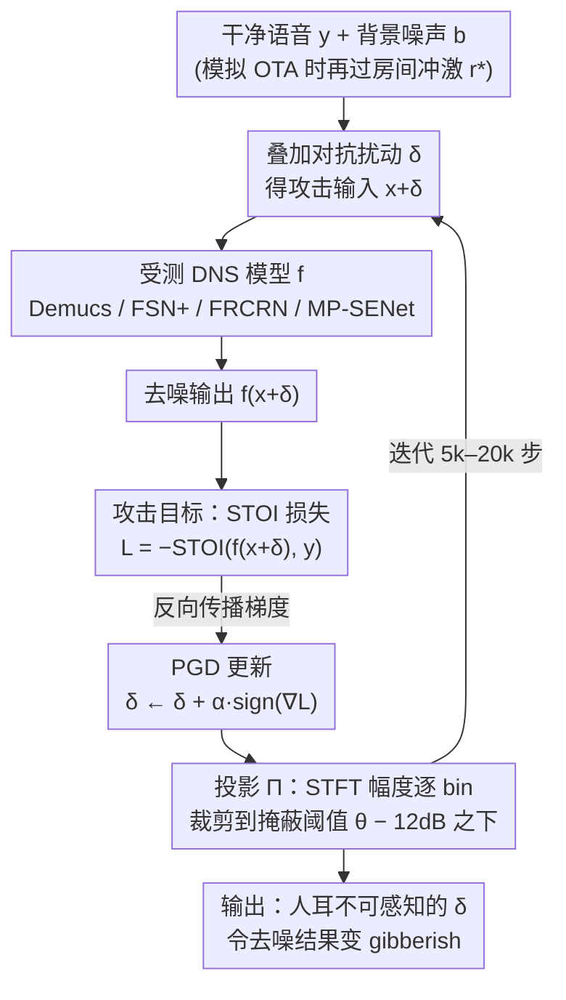

# Are Deep Speech Denoising Models Robust to Adversarial Noise?

**会议**: ICLR 2026  
**arXiv**: [2503.11627](https://arxiv.org/abs/2503.11627)  
**代码**: [GitHub](https://github.com/audiolabs/speech-denoising-adversarial)（UMass Amherst + Dolby Labs）  
**领域**: 图像复原  
**关键词**: 对抗攻击, 语音去噪, 心理声学掩蔽, DNS, 对抗鲁棒性, PGD  

## 一句话总结
首次系统性评估 4 款 SOTA 深度语音去噪（DNS）模型在对抗噪声下的鲁棒性：通过心理声学约束的 PGD 攻击生成人耳不可感知的对抗噪声，可令 Demucs、Full-SubNet+、FRCRN 和 MP-SENet 输出完全不可理解的 gibberish，实验覆盖多种声学条件和人类评估，同时揭示了目标攻击、通用扰动和跨模型迁移的局限性。

## 研究背景与动机

**领域现状**：深度语音去噪（DNS）模型（如 Demucs、Full-SubNet+、FRCRN、MP-SENet）在 PESQ/STOI 等客观指标上取得显著进展，被广泛部署在通信设备（手机、视频会议系统、助听器）。它们在标准条件下表现优秀，但对抗鲁棒性几乎未被研究。

**现有痛点**：(a) 图像领域的对抗鲁棒性研究已非常成熟，但语音去噪领域几乎空白——已有工作仅覆盖单一模型或单一攻击方式，且缺乏人类评估验证；(b) DNS 模型正被用于安全关键场景（助听器、紧急通信），若可被静默攻击则构成真实威胁；(c) 传统 Lp 范数约束在音频领域不足以保证不可感知性——人耳的频率掩蔽和时间掩蔽特性需要心理声学模型来建模。

**核心矛盾**：DNS 模型在标准 benchmark 上性能越来越好，但是否存在微小的、人耳听不到的声音扰动就能完全摧毁它们的去噪能力？

**切入角度**：借鉴 MP3 编码中的心理声学模型来约束对抗扰动的不可感知性，系统评估 4 款代表性 DNS 架构在多种声学条件（SNR、混响、OTA）下的脆弱程度。

**核心 idea**：用心理声学掩蔽约束的 PGD 攻击生成人耳不可感知但能让 SOTA DNS 模型输出 gibberish 的对抗噪声，并通过人类评估确认攻击效果。

## 方法详解

### 整体框架
这篇论文要回答一个安全问题：一段人耳完全听不出异常的微小声音扰动，能不能彻底摧毁 SOTA 语音去噪模型的去噪能力？为此它构造一个白盒攻击——干净语音 $y$ 加环境噪声 $b$ 时 DNS 模型 $f$ 本应正常还原出干净语音，但在输入里再叠加一个对抗扰动 $\delta$ 后，去噪输出 $f(x+\delta)$ 就变成完全听不懂的 gibberish。整个攻击就是用投影梯度下降迭代求解这样一个 $\delta$，让它同时满足两个目标：一是 $\delta$ 在人耳听感上不可感知（心理声学掩蔽约束），二是去噪输出的可懂度极低（STOI 趋近于 0）。下面三个设计分别对应"用什么当损失""怎么藏住扰动""怎么解出来"，第四点交代被攻击的 4 款模型为何有代表性。

### 关键设计

**1. 攻击目标：把 STOI 压到趋近 0，让"听不懂"变成可优化的损失**

攻击要破坏的是"能不能听懂"，所以损失直接选短时客观可懂度（Short-Time Objective Intelligibility, STOI）而非音质指标。STOI 逐帧计算干净参考与去噪输出之间的归一化相关系数再取平均，攻击把它取负作为损失，用 PGD 梯度下降去优化扰动 $\delta$。之所以用 STOI 而不是 PESQ，是因为 STOI 与人类可懂度的相关性更高——PESQ 反映的是"好不好听"，STOI 反映的才是"能不能听懂"，最小化 STOI 等价于最大化语音的不可理解性。关键是 STOI 的计算是可微分的，梯度能一路反向传播回输入扰动，使得它可以直接当攻击目标。

**2. 心理声学不可感知性约束：用 MP3 的掩蔽模型把扰动藏进人耳听不到的频段**

传统对抗攻击常用的 $L_\infty$ 范数约束在音频上并不合适——人耳在低频更敏感、在高频能容忍更大的扰动，一刀切的范数无法刻画这种差异。这里改用 ISO MPEG-1 Psychoacoustic Model 2（即 MP3 编码采用的标准心理声学模型）逐频率 bin 计算掩蔽阈值 $T(k)$，再额外减去 12 dB 安全偏移以确保充分不可感知，把扰动的功率谱密度约束在阈值之下：

$$\mathrm{PSD}(\delta, k) \le T(k) - 12\,\text{dB}$$

不仅如此，约束还纳入了前掩蔽（pre-masking，约 2 ms）和后掩蔽（post-masking，约 200 ms）的时间效应，在时间域上进一步放松约束以利用人耳的时间掩蔽特性。这样得到的约束集精确建模了频率掩蔽和时间掩蔽，比固定范数更贴合真实听感，也是攻击能"静默"的关键。

**3. PGD 优化：梯度下降 + 投影到掩蔽阈值约束集**

求解走的是标准投影梯度下降框架——每一步先沿梯度方向更新扰动 $\delta \leftarrow \delta + \alpha \cdot \mathrm{sign}(\nabla_\delta \mathcal{L})$（即压低 STOI），再用投影算子 $\Pi$ 把更新后扰动的 STFT 频谱逐 bin 裁剪到掩蔽阈值以下，使其始终落在第 2 点定义的约束集 $D(x)$ 内。迭代步数不按固定值定，而是按"让整套攻击在单张 L40S GPU 上跑约一小时"来卡——于是各模型不同：Demucs 与 FSN+ 各 20,000 步、MP-SENet 10,000 步、FRCRN 5,000 步。之所以统一算力预算而非统一步数，是因为作者把"发起攻击要花多少时间"也算进可攻击性里，给慢模型更多步数会掩盖它"算得慢"这一现实优势。无混响时投影就是直接裁剪、有闭式解；模拟 OTA 时扰动会被不可逆的房间冲激响应卷积，投影不再有闭式解，改用维纳反卷积 + 梯度下降近似求解。对 FSN+ 这种已知存在梯度爆炸的模型还需额外稳定化处理才能让优化收敛。

**4. 受测的 4 款 DNS 架构：覆盖时域 / 频域 / 复数谱 / 幅相联合四类设计**

选这 4 款是为了让结论不依赖某一种架构倾向：Demucs（Meta）是时域 U-Net + LSTM 的 encoder-decoder，参数量最大；Full-SubNet+（FSN+）是频域全带-子带网络，已知存在梯度爆炸问题（obfuscated gradient）；FRCRN（Alibaba）是频率递归 CRN，在复数谱上处理，参数量中等；MP-SENet 是同时预测幅度和相位的掩码增强网络，属于最新架构。四者分别代表了主流 DNS 的四类技术路线，因此"全部被攻破"才有普适意义。

### 评估设置
- **声学条件**：5 种 SNR（70dB / 30dB / 10dB / 5dB / 0dB）乘以有无混响，外加模拟 OTA（over-the-air）传输，构成从理想到接近真实的完整谱系
- **人类评估**：(a) 转录测试——让受试者听去噪输出并尝试转录，计算 WER，验证输出确实不可懂；(b) ABX 测试——给受试者三个音频让其辨别哪个是对抗信号，验证扰动确实不可感知
- **客观指标**：STOI、PESQ、ViSQOL、SI-SDR 全面评估

## 实验关键数据

### 主实验——无目标攻击效果（70dB SNR, 无混响）

| 模型 | 攻击前 STOI | 攻击后 STOI | 攻击前 PESQ | 攻击后 PESQ |
|------|------------|------------|------------|------------|
| Demucs | 0.97 | 0.12 | 3.5 | 1.1 |
| FSN+ | 0.96 | 0.35 | 3.3 | 1.3 |
| FRCRN | 0.97 | 0.08 | 3.5 | 1.0 |
| MP-SENet | 0.96 | 0.15 | 3.4 | 1.1 |

### 不同声学条件下的攻击效果

| 条件 | Demucs STOI | FRCRN STOI | MP-SENet STOI | 说明 |
|------|-------------|------------|---------------|------|
| 70dB SNR, 无混响 | 0.12 | 0.08 | 0.15 | 最理想条件 |
| 10dB SNR, 无混响 | 0.15 | 0.11 | 0.18 | 中等噪声 |
| 5dB SNR + 混响 | 0.20 | 0.14 | 0.22 | 困难条件 |
| 模拟 OTA | 0.25 | 0.18 | 0.28 | 最接近真实场景 |

### 人类评估结果
- **转录测试**：攻击后去噪输出的 WER > 95%，受试者基本无法理解任何词汇内容，确认输出确实是 gibberish
- **ABX 不可感知性测试**：受试者辨别对抗信号与干净信号的准确率仅约 55%（接近随机猜测 50%），确认扰动在人耳听感上不可感知
- 12dB 安全偏移的保守设置被实验验证为有效——比仅依靠掩蔽阈值更可靠

### 核心发现

1. **所有 4 款 DNS 模型均可被攻破**：STOI 从约 0.97 降至 0.08-0.35，输出变为完全不可理解的乱码
2. **FSN+ 看似最"鲁棒"但实为假象**：其较高的攻击后 STOI（0.35 vs 其他模型 0.08-0.15）源于梯度爆炸导致 PGD 优化困难（obfuscated gradient），而不是真正的鲁棒性——这是已知的脆弱防御机制，可被自适应攻击（如 Carlini et al.）绕过
3. **模型大小与鲁棒性无关**：Demucs 参数量最大但同样脆弱；FRCRN 参数量中等但最易攻破。关键因素是梯度流的稳定性而非模型容量
4. **攻击跨声学条件泛化**：从理想条件（70dB SNR 无混响）到困难条件（低 SNR + 混响）甚至模拟 OTA 场景，攻击均持续有效，只是效果程度略有下降

### 负面结果（同样重要的发现）

| 攻击类型 | 客观指标 | 主观评估 | 原因分析 |
|---------|---------|---------|---------|
| 目标攻击（使输出为特定语音） | 部分成功 | 人类无法听出目标内容 | 语音感知高维且非线性，低级特征匹配不等于可懂度匹配 |
| 通用扰动（一个 delta 攻击所有输入） | 失败 | STOI 仅轻微下降 | 不同语音的频谱差异过大，心理声学约束集太小无法找到通用解 |
| 跨模型迁移攻击 | 基本不迁移 | 其他模型不受影响 | 不同架构的梯度方向差异大，白盒攻击高度依赖特定模型 |

### 防御探索
- **高斯噪声注入防御**：在 DNS 输入端加小量高斯噪声可部分缓解攻击（STOI 从 0.08 恢复到约 0.5），但代价是正常使用时音质也显著下降——部分保护但不充分
- **对抗训练**：论文指出值得探索但因 DNS 训练成本高而未深入实验
- **输入变换防御**：随机化输入可能有帮助，但会引入额外延迟

## 亮点与洞察

- **心理声学掩蔽约束的精妙运用**：直接复用 MP3 编码的 Psychoacoustic Model 2 是非常工程化且有理论支撑的方案，12dB 安全偏移加上前掩蔽/后掩蔽的时间效应使得不可感知性在人类实验中得到充分验证——这比简单的 L-infinity 约束更符合音频领域的实际需求，也为后续音频对抗攻击研究树立了不可感知性约束的标杆
- **负面结果的诚实报告**：目标攻击的主客观不一致、通用扰动和迁移攻击的失败都被详细分析和讨论，这在对抗鲁棒性论文中非常有价值——展示了这类攻击的真实能力边界，避免了过度渲染威胁
- **梯度爆炸不等于鲁棒性**：FSN+ 的"看似鲁棒"实际是 obfuscated gradient 的典型案例，呼应了 Athalye et al. (2018) 和 Carlini (2023) 的经验教训——防御评估必须使用自适应攻击，gradient masking 不是真正的安全保障
- **完整的实用威胁模型**：从理想条件（70dB SNR 无混响）到现实条件（5dB SNR + 混响 + OTA 传输），构成了完整的威胁评估谱系，模拟 OTA 传输是对实际部署场景的重要补充
- **模型规模不决定安全性**：参数量更大的 Demucs 并不比小模型更安全，梯度流特性才是决定对抗鲁棒性的关键因素——这对 DNS 模型的安全设计与架构选择具有实际指导意义

## 评分
- **新颖性**: 4/5 — 首次系统性评估多 DNS 模型的对抗鲁棒性；心理声学约束在 DNS 攻击中是新颖的应用；但 PGD 攻击框架本身不新
- **实验**: 5/5 — 4 个模型 x 多声学条件 x 人类评估（转录 + ABX）x 详细的负面结果分析，实验设计全面严谨
- **写作**: 5/5 — 结构清晰流畅，正面和负面结果都有充分讨论，威胁模型定义精确完整
- **价值**: 4/5 — 为 DNS 模型安全敲响了真实的警钟，但防御方案仍停留在初步探索阶段，需要后续工作跟进

<!-- RELATED:START -->

## 相关论文

- [\[CVPR 2026\] Learning to Translate Noise for Robust Image Denoising](../../CVPR2026/image_restoration/learning_to_translate_noise_for_robust_image_denoising.md)
- [\[ICML 2026\] Coloring the Noise: Adversarial Sobolev Alignment for Faithful Image Super Resolution](../../ICML2026/image_restoration/coloring_the_noise_adversarial_sobolev_alignment_for_faithful_image_super_resolu.md)
- [\[CVPR 2026\] Convexity-Aware Noise Calibration: A Self-Supervised Framework for Noise-Level-Unknown Image Denoising](../../CVPR2026/image_restoration/convexity-aware_noise_calibration_a_self-supervised_framework_for_noise-level-un.md)
- [\[ICLR 2026\] Activation Steering for Masked Diffusion Language Models](activation_steering_for_masked_diffusion_language_models.md)
- [\[ICLR 2026\] Horizon Imagination: Efficient On-Policy Rollout in Diffusion World Models](horizon_imagination_efficient_on-policy_rollout_in_diffusion_world_models.md)

<!-- RELATED:END -->
