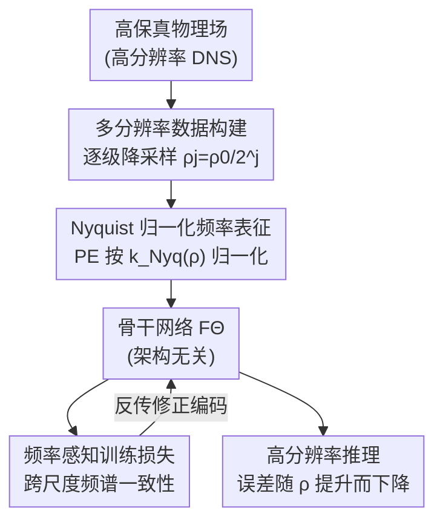

# Breaking Scale Anchoring: Frequency Representation Learning for Accurate High-Resolution Inference from Low-Resolution Training

**会议**: ICLR 2026  
**arXiv**: [2512.05132](https://arxiv.org/abs/2512.05132)  
**代码**: 待确认  
**领域**: 目标检测（时空预测/零样本超分辨率）  
**关键词**: scale anchoring, frequency representation, zero-shot super-resolution, spatiotemporal forecasting, Nyquist frequency

## 一句话总结

定义了"Scale Anchoring"新问题（低分辨率训练导致高分辨率推理误差锚定），并提出架构无关的频率表征学习（FRL），通过 Nyquist 归一化频率编码使误差随分辨率提升而下降，在 8 种主流架构上验证有效。

## 研究背景与动机

**零样本超分辨率时空预测（ZS-SR STF）**：用低分辨率数据训练深度学习模型，在高分辨率上做推理——因为高分辨率 DNS 模拟的训练成本过高

**现有误解**：现有方法认为跨分辨率误差比（RMSE_Ratio）接近 1 即为"成功泛化"。然而对于 p 阶数值求解器，α 倍分辨率提升应使误差降低 $\alpha^p$ 倍

**Scale Anchoring 的根源**：低分辨率训练数据的 Nyquist 频率限制了模型能学到的物理规律频率上界。在高分辨率推理时，模型无法处理训练时从未见过的高频分量，导致误差锚定在训练分辨率

**与已知现象的本质区别**：
   - **vs 谱偏置（SB）**：SB 是训练频段内低频到高频的学习偏好问题；SA 是训练频段之外的信息论限制
   - **vs 离散化不匹配（DME）**：DME 来自架构/优化选择，可通过设计消除；SA 来自 Shannon-Nyquist 采样定理的硬限制

**关键理论**：
   - **定理 1（频率盲区）**：在训练分辨率 $\rho_0$ 上训练的网络频率响应在 $\omega > \rho_0/2$ 处未定义/错误
   - **定理 2（高频误差主导）**：高分辨率推理误差主要来自 $[\rho_0/2, \rho/2]$ 的频率分量

## 方法详解

### 整体框架

频率表征学习（FRL）是一套架构无关的"插件"流程，挂在任意骨干网络 $F_\Theta$ 的前后两端：前端把训练数据按多个采样率铺开，并把网络对空间频率的编码从"随分辨率漂移"改成"按 Nyquist 频率归一化"；后端再用一个频域一致性损失，锁住模型在不同尺度下的频谱行为。三个环节里只有 **Nyquist 归一化频率表征** 是真正打破 Scale Anchoring 的关键，**多分辨率数据构建** 为它提供"同一频率、不同分辨率"的对照样本，**频率感知训练损失** 则防止归一化编码在优化中学偏——后两者是脚手架，单独使用都无法改变误差锚定。

### 关键设计

**1. 多分辨率数据构建：让模型同时见到多个采样率**

从原始高保真数据出发，逐级降采样生成一组分辨率版本 $\rho_j = \rho_0/2^j$，让同一物理场以不同采样密度同时进入训练。这一步本身是成熟的多尺度训练技术，单独使用并不能改变误差锚定——消融中只开这一项时 RMSE_Ratio 仍停在 $\sim 1.0$。它的真正作用是为下一步提供"同一频率、不同分辨率"的配对样本，让 Nyquist 归一化有跨尺度的对照可学。

**2. Nyquist 归一化频率表征：解开频率与分辨率的耦合**

这是全文唯一的方法论创新，也是打破 Scale Anchoring 的核心。常规频率编码直接用离散波数 $k$，于是同一个物理频率在不同分辨率下会被映射成不同的编码值，模型把"频率"和"训练分辨率"绑死，到了高分辨率推理就失效。FRL 改成按该分辨率的 Nyquist 频率 $k_{Nyq}(\rho)$ 做归一化：

$$PE_{freq}(x, k, \rho) = \sin\!\big(2\pi k \cdot x / k_{Nyq}(\rho)\big)$$

这样相同的物理频率无论在哪个分辨率下都得到一致的表征值，网络学到的是与采样率无关的物理频率结构，而不是某个固定网格上的离散模式。正因如此，频率响应带宽才能从训练时的 Nyquist 频率附近扩展到全频段，误差随分辨率提升而下降而非锚定。消融里单独只加这一项就能把 RMSE_Ratio 压到 $0.3$–$0.4$——有效但不充分，仍需另外两步配合。

**3. 频率感知训练损失：锁住跨尺度的频谱一致性**

在标准回归损失外再加一项频域一致性损失，约束模型预测 $F_\Theta$ 与目标 $\hat{u}$ 在频谱上对齐：

$$\mathcal{L} = \mathcal{L}_{std} + \lambda \cdot \|F_\Theta - \hat{u}\|^2_{freq}$$

它把跨分辨率的频谱一致性显式写进优化目标，防止归一化编码学偏。和 Step 1 一样，这是标准的频谱正则化手段，单独使用同样停在 $\sim 1.0$；只有当三步合在一起（完整 FRL）时，RMSE_Ratio 才落到 $0.135$–$0.181$，真正打破 Scale Anchoring。

## 实验关键数据

### 3D 流体模拟（训练 32³，测试到 129³）

| 方法 | RMSE_Ratio 原始 → +FRL | 高分辨率 RMSE 降低 |
|------|----------------------|----------------|
| GNN | 1.018 → **0.175** | 5.82× |
| CNN | 1.060 → **0.137** | 7.74× |
| NO | 1.017 → **0.135** | 7.53× |
| Transformer | 1.021 → **0.165** | 6.19× |
| Diffusion | 1.041 → **0.181** | 5.75× |

### ERA5 天气预报（训练 180×90，推理到 1440×721）

| 架构 | RMSE_Ratio → +FRL | ACC 提升 |
|------|-------------------|---------|
| Transformer | 1.053 → 0.708 | 0.44→0.65 |
| CNN | 1.066 → 0.662 | 0.42→0.68 |

### 消融实验

| 配置 | RMSE_Ratio | 说明 |
|------|-----------|------|
| 仅 Step 1（多分辨率训练） | ~1.0 | 不打破 SA |
| 仅 Step 3（频率损失） | ~1.0 | 不打破 SA |
| **Step 1+2+3（完整 FRL）** | **0.135-0.181** | 成功打破 SA |
| 仅 Step 2 | 0.3-0.4 | 有效但不充分 |

### 关键发现

- 所有 8 种主流架构（GNN/Transformer/CNN/扩散/NO/Neural ODE/Mamba/NN）都存在 Scale Anchoring
- FRL 使频率响应带宽从训练 Nyquist 频率附近扩展到全频段
- 高 Reynolds 数湍流等极端系统中 FRL 效果退化——频谱关系不光滑

## 亮点与洞察

- **问题定义价值极高**：首次将 Scale Anchoring 与 SB/DME 严格区分，理论分析完整
- **架构无关性**：对 8 种代表性架构均有效，说明 SA 是数据驱动模型的普遍限制
- **诚实讨论局限**：作者自述失效模式并建议引入 Kolmogorov 频谱约束
- **跨领域验证**：流体模拟 + 天气预报两个完全不同的物理领域

## 局限与展望

- 不保证严格收敛阶——深度学习模型终究不等于数值求解器
- 高 Reynolds 数湍流/间断问题中频谱关系不光滑，FRL 外推能力退化
- 多分辨率训练带来额外计算和内存开销（约 2-3×）
- 仅验证了时空预测任务，对图像超分辨率等应用场景的适用性未知

## 相关工作与启发

- **FNO/PINO**：改善分辨率泛化但未显式解决 Nyquist 频率限制
- **反谱偏置方法**：学习训练频段内的高频，SA 是训练频段之外的问题
- **多分辨率训练/频谱正则化**：FRL 的 Step 1&3 借鉴了这些标准技术

## 评分

- 新颖性: ⭐⭐⭐⭐⭐ 定义新问题 + 严格理论分析 + 实验验证
- 实验充分度: ⭐⭐⭐⭐⭐ 8种架构 × 2个物理领域 + 完整消融
- 写作质量: ⭐⭐⭐⭐ 结构清晰，诚实讨论失效模式
- 价值: ⭐⭐⭐⭐ 对科学机器学习社区有深刻启发意义

<!-- RELATED:START -->

## 相关论文

- [\[ICLR 2026\] Skip to the Good Part: Representation Structure & Inference-Time Layer Skipping in Diffusion vs. Autoregressive LLMs](skip_to_the_good_part_representation_structure_inference-time_layer_skipping_in_.md)
- [\[CVPR 2026\] Event-Illumination Collaborative Low-light Image Enhancement with a High-resolution Real-world Dataset](../../CVPR2026/image_restoration/event-illumination_collaborative_low-light_image_enhancement_with_a_high-resolut.md)
- [\[ECCV 2024\] Rethinking Image Super-Resolution from Training Data Perspectives](../../ECCV2024/image_restoration/rethinking_image_super-resolution_from_training_data_perspectives.md)
- [\[ICLR 2026\] Trust but Verify: Adaptive Conditioning for Reference-Based Diffusion Super-Resolution](trust_but_verify_adaptive_conditioning_for_reference-based_diffusion_super-resol.md)
- [\[CVPR 2026\] LRHDR: Learning Representation-enhanced HDR Video Reconstruction](../../CVPR2026/image_restoration/lrhdr_learning_representation-enhanced_hdr_video_reconstruction.md)

<!-- RELATED:END -->
