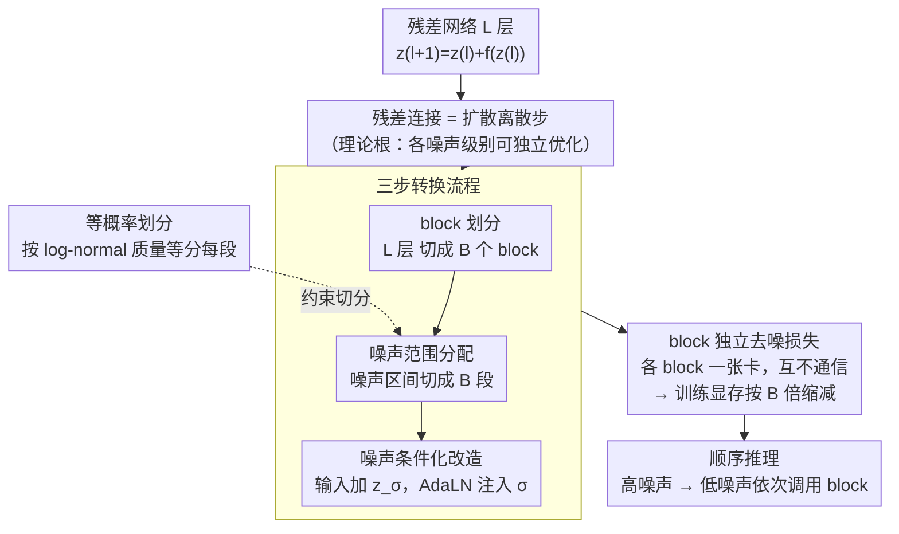

# DiffusionBlocks: Block-wise Neural Network Training via Diffusion Interpretation

**会议**: ICLR2026  
**arXiv**: [2506.14202](https://arxiv.org/abs/2506.14202)  
**代码**: [SakanaAI/DiffusionBlocks](https://github.com/SakanaAI/DiffusionBlocks)  
**领域**: 图像复原  
**关键词**: block-wise training, diffusion models, score matching, memory efficiency, residual networks

## 一句话总结

提出 DiffusionBlocks，将残差网络的逐层更新解释为连续时间扩散过程的离散化步骤，从而将网络切分为可完全独立训练的 block，在保持端到端训练性能的同时按 block 数 B 倍减少训练显存。

## 背景与动机

- 端到端反向传播需要存储所有层的中间激活值，显存随网络深度线性增长，严重制约模型规模和实际部署
- 已有的 block-wise 训练方法（如 Forward-Forward、greedy layer-wise training）依赖临时性的局部目标函数，缺乏理论保证，且基本仅在分类任务上验证，无法自然扩展到生成任务
- Score-based diffusion models 的去噪目标天然具有"各噪声级别可独立优化"的性质——这恰好为 block-wise 训练提供了缺失的理论基础
- 残差连接（ResNet、Transformer 等）的更新规则 $\mathbf{z}_{\ell+1} = \mathbf{z}_\ell + f_{\theta_\ell}(\mathbf{z}_\ell)$ 可对应扩散过程 probability flow ODE 的 Euler 离散化

## 核心问题

如何为基于 Transformer 的网络设计一种**有理论根据**的 block-wise 训练框架，使得：

1. 每个 block 可以**完全独立**训练（不需要其他 block 的梯度或激活值）
2. 与端到端训练保持竞争力
3. 能通用于分类和生成等多种任务/架构

## 方法详解

### 整体框架

DiffusionBlocks 的出发点是一个被忽视的对应关系：残差网络逐层叠加的更新，本质上就是一条连续时间扩散过程的离散化轨迹。顺着这个视角，它把 $L$ 层网络切成 $B$ 个 block，让每个 block 只负责扩散过程中某一段噪声级别的去噪。具体落地分三步：先把网络切成 $B$ 个连续 block，再把噪声区间 $[\sigma_{\min}, \sigma_{\max}]$ 按等概率切成 $B$ 段一一分配给各 block，最后给每个 block 做噪声条件化改造，使它能在自己那段噪声里独立去噪。改造完成后，$B$ 个 block 各自拥有一个完整、互不通信的去噪损失——训练时无需在 block 之间传递梯度或激活，任何时刻只缓存一个 block 的激活，显存随之按 $B$ 倍下降；推理时再从高噪声到低噪声依次调用各 block 还原目标。

### 关键设计

**1. 残差连接 = 扩散过程离散步：为 block 独立训练找到理论根**

block-wise 训练之所以一直缺乏理论保证，是因为没人能说清"局部目标"为什么等价于全局目标。本文在 Variance Exploding (VE) 扩散框架下给出了答案：给定噪声级别序列 $\sigma_0 > \sigma_1 > \cdots > \sigma_T$，对 probability flow ODE 做 Euler 离散化得到更新式

$$\mathbf{z}_{\sigma_\ell} = \mathbf{z}_{\sigma_{\ell-1}} + \frac{\Delta\sigma_\ell}{\sigma_{\ell-1}}\left(\mathbf{z}_{\sigma_{\ell-1}} - D_\theta(\mathbf{z}_{\sigma_{\ell-1}}, \sigma_{\ell-1})\right),$$

它与残差网络的 skip connection 更新规则 $\mathbf{z}_\ell = \mathbf{z}_{\ell-1} + f_{\theta_\ell}(\mathbf{z}_{\ell-1})$ 形式完全一致。一旦把每一层（每个 block）看成扩散轨迹上的一段，score matching 自带的"各噪声级别可独立优化"性质就被继承下来——block 独立训练不再是启发式拼凑，而是有去噪目标背书的等价分解。后面所有设计都是把这个对应关系落到具体架构上的工程化步骤。

**2. 三步转换流程：把任意残差网络改造成可分块的扩散去噪器**

在上面的对应关系之上，本文用三步把现成架构改造成 DiffusionBlocks，对应框架图里的 `CONV` 子图。先做 **block 划分**，把 $L$ 层网络切成 $B$ 个连续 block $\mathcal{F}_1, \ldots, \mathcal{F}_B$；再做 **噪声范围分配**，定义噪声分布 $p_{\text{noise}}$（推荐 log-normal），把区间 $[\sigma_{\min}, \sigma_{\max}]$ 切成 $B$ 段 $\{[\sigma_b, \sigma_{b-1}]\}_{b=1}^B$，让第 $b$ 个 block 专门负责这一段噪声的去噪；最后做 **噪声条件化改造**，把每个 block 的输入扩展为 $\tilde{\mathbf{x}} = (\mathbf{x}, \mathbf{z}_\sigma)$，其中 $\mathbf{z}_\sigma = \mathbf{y} + \sigma\epsilon$，并通过 AdaLN 等机制注入当前噪声级别条件，使同一组参数能在所负责的噪声区间内连续工作。三步走完后，每个 block 都变成一个只看自己那段噪声、独立预测干净目标 $\mathbf{y}$ 的小去噪器。

**3. block 独立的去噪损失：显存与推理同时按 $B$ 倍缩减**

改造后第 $b$ 个 block 的损失写成

$$\mathcal{L}_b(\theta_b) = \mathbb{E}_{(\mathbf{x},\mathbf{y}),\, \sigma\sim p_{\text{noise}}^{(b)},\, \epsilon\sim\mathcal{N}(0,I)}\left[w(\sigma)\cdot\|f_{\theta_b|\sigma}(\mathbf{x}, \mathbf{y}+\sigma\epsilon) - \mathbf{y}\|_2^2\right],$$

即在自己负责的噪声子分布 $p_{\text{noise}}^{(b)}$ 上做加权去噪回归。关键在于期望只对本 block 的噪声区间取，所以 $B$ 个损失彼此完全解耦：可以各放一张卡、各自反向传播、互不等待，而它们的噪声区间拼起来又恰好覆盖整条扩散轨迹，合起来等价于训练完整网络。这正是训练显存按 $B$ 倍缩减的来源——任何时刻只需缓存一个 block 的激活。推理时则从高噪声到低噪声依次调用各 block，对 diffusion model 而言每个去噪步只需把对应 block 载入显存，于是推理也拿到 $B$ 倍的显存/调度优势；代价是各 block 必须按序执行、无法并行化去噪步骤。

**4. 等概率划分：让每个 block 承担等量去噪难度**

噪声区间怎么切，直接决定各 block 的负载是否均衡，因此框架图里用 `等概率划分` 这条约束去指导"噪声范围分配"那一步。若按 $\sigma$ 均匀划分，高噪声和低噪声两端会分到大量样本稀疏、信息量低的区域，白白浪费容量。本文改用按 log-normal 累积概率质量等分，即让每段满足 $\int_{\sigma_{b-1}}^{\sigma_b} p_{\text{noise}}(\sigma)\,d\sigma = 1/B$。这样每个 block 都处理等量的训练分布，自动在去噪最难、样本最密的中间噪声级别切出更细的区间，把容量用在刀刃上。实验里这一步贡献明显：CIFAR-10 上等概率划分把 FID 从均匀划分的 43.53 压到 38.03。

## 实验关键数据

| 任务 / 架构 | 数据集 | 端到端基线 | DiffusionBlocks | Block 数 / 显存缩减 |
|---|---|---|---|---|
| ViT 分类 | CIFAR-100 | 60.25% Acc | 59.30% Acc | B=3 / 3× |
| DiT 图像生成 | CIFAR-10 | 32.84 FID | 30.59 FID | B=3 / 3× |
| DiT 图像生成 | ImageNet 256 | 12.09 FID | 10.63 FID | B=3 / 3× |
| Masked Diffusion 文本 | text8 | 1.56 BPC | 1.45 BPC | B=3 / 3× |
| AR Transformer 文本 | LM1B | 0.50 MAUVE | 0.71 MAUVE | B=4 / 4× |
| AR Transformer 文本 | OpenWebText | 0.85 MAUVE | 0.82 MAUVE | B=4 / 4× |
| Huginn (recurrent-depth) | LM1B | 0.49 MAUVE | 0.70 MAUVE | 消除 32 次迭代 |

- Forward-Forward 在 CIFAR-100 上仅达 7.85% 准确率，远逊于 DiffusionBlocks
- ImageNet 上 B=2 时 FID=9.90，**优于**端到端训练 (12.09)，适度划分反而提升性能
- 等概率划分在所有层分配方案下均显著优于均匀划分（CIFAR-10 FID: 38.03 vs 43.53）

## 亮点

1. **理论基础扎实**：从 score matching 的噪声级别独立性出发，自然推导出 block 独立训练目标，非启发式拼凑
2. **通用性极强**：一套三步转换流程适用于 ViT、DiT、AR Transformer、Masked Diffusion、Recurrent-depth 共五类架构
3. **等概率划分**是简洁而关键的设计——让每个 block 承担等量去噪难度，无需手工调整层分配
4. **多重效率收益**：训练 $B$ 倍显存缩减；diffusion model 推理 $B$ 倍加速；recurrent-depth 模型省去 BPTT
5. **部分场景超越端到端**：ImageNet B=2/3 的 FID 优于不分 block 的端到端训练，说明适度专业化有正收益

## 局限与展望

- 实验中 ViT 分类仅在 CIFAR-100 上验证（60.25→59.30），大规模 ImageNet 分类未测试
- 推理时仍需按序调用各 block，无法并行化推理步骤
- 噪声条件化改造（AdaLN 等）增加了少量参数和工程复杂度
- B 过大时性能下降（B=6 时 FID 14.43），block 粒度有下限
- 主要面向 Transformer 类残差架构，对无残差连接的网络适用性未讨论

## 与相关工作的对比

| 方法 | 理论基础 | 任务通用性 | 连续时间 | Block 独立 |
|---|---|---|---|---|
| Forward-Forward | 对比目标 | 仅分类 | ✗ | ✓ |
| NoProp | 扩散相关 | 仅分类 | ✓(CT) 或 ✗(DT) | ✗(CT) 或 ✓(DT) |
| DiffusionBlocks | Score matching | 分类+生成 | ✓ | ✓ |

- NoProp 与自定义 CNN 架构捆绑，无法直接迁移到 Transformer；DiffusionBlocks 在 NoProp 的架构上也优于其所有变体（46.88 vs 46.06/21.31/37.57）
- 与 stage-specific diffusion models (eDiff-I 等) 的区别在于：后者是联合训练或从共享参数微调，DiffusionBlocks 各 block **完全隔离**

## 启发与关联

- "残差连接 ≈ 扩散离散化步骤"的视角可进一步推广：任何具有残差结构的深层模型都可能受益于这种分块独立训练
- 等概率划分思想可迁移到其他需要"分段处理不同难度子任务"的场景（如课程学习、多尺度训练）
- 对 recurrent-depth 模型消除 BPTT 的能力值得关注——随着 universal transformer / Huginn 等模型兴起，该方法可降低其训练成本
- 结合模型并行（每个 block 放不同 GPU），可实现更激进的深度扩展

## 评分
- 新颖性: ⭐⭐⭐⭐⭐ — 将扩散独立性引入 block-wise 训练是原创性极高的理论贡献
- 实验充分度: ⭐⭐⭐⭐ — 五类架构覆盖面广，但分类任务规模偏小
- 写作质量: ⭐⭐⭐⭐⭐ — 数学推导清晰，三步流程直观易懂
- 价值: ⭐⭐⭐⭐ — 为大模型训练显存瓶颈提供了有理论保证的新范式

<!-- RELATED:START -->

## 相关论文

- [\[ECCV 2024\] Efficient Diffusion Transformer with Step-wise Dynamic Attention Mediators](../../ECCV2024/image_restoration/efficient_diffusion_transformer_with_step-wise_dynamic_attention_mediators.md)
- [\[NeurIPS 2025\] Encoder-Decoder Diffusion Language Models for Efficient Training and Inference](../../NeurIPS2025/image_restoration/encoder-decoder_diffusion_language_models_for_efficient_training_and_inference.md)
- [\[CVPR 2026\] Disentanglement-wise Image Dehazing through Cross-Domain Manifold Consensus](../../CVPR2026/image_restoration/disentanglement-wise_image_dehazing_through_cross-domain_manifold_consensus.md)
- [\[ICML 2026\] Semi-Supervised Neural Super-Resolution for Mesh-Based Simulations](../../ICML2026/image_restoration/semi-supervised_neural_super-resolution_for_mesh-based_simulations.md)
- [\[CVPR 2026\] The Surprising Effectiveness of Noise Pretraining for Implicit Neural Representations](../../CVPR2026/image_restoration/the_surprising_effectiveness_of_noise_pretraining_for_implicit_neural_representa.md)

<!-- RELATED:END -->
