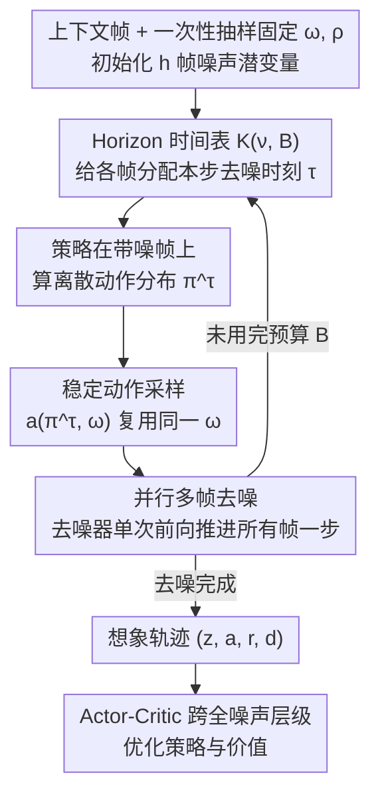

# Horizon Imagination: Efficient On-Policy Rollout in Diffusion World Models

**会议**: ICLR 2026  
**arXiv**: [2602.08032](https://arxiv.org/abs/2602.08032)  
**代码**: [https://github.com/leor-c/horizon-imagination](https://github.com/leor-c/horizon-imagination)  
**领域**: 图像复原  
**关键词**: 扩散世界模型, on-policy rollout, 强化学习, 样本效率, Atari

## 一句话总结
提出 Horizon Imagination (HI)：让扩散世界模型在单次前向里**并行去噪**多帧未来观测，配合**稳定动作采样**抑制带噪帧上动作的无谓翻转、**Horizon 时间表**把去噪节奏与总预算解耦，从而在每帧不足一步去噪（sub-frame 预算）、算力减半下仍保持 on-policy 想象的控制性能。

## 研究背景与动机

**领域现状**：世界模型通过学习环境动力学来生成模拟数据，扩散世界模型（如 DIAMOND）因出色的生成保真度受到关注，但多步去噪开销巨大。

**现有痛点**：on-policy 想象需要在每步生成后根据当前策略采样动作决定下一步，形成严格串行依赖，无法利用扩散模型的并行去噪能力。

**核心矛盾**：扩散生成质量高但计算量大，而 on-policy RL 的串行需求进一步放大了这个问题。

**本文目标**：在保持 on-policy 想象质量的同时大幅降低扩散世界模型的计算开销。

**切入角度**：观察到 on-policy 想象不必逐帧串行——可以让去噪器在一次前向里并行推进多帧，并在每个去噪步之前直接在仍带噪的帧上查询策略，拿到远期帧所需的动作。

**核心 idea**：用"只抽一次的均匀样本做一致逆变换采样"稳住带噪帧上的动作、用解耦预算与衰减跨度的 Horizon 时间表把总去噪步数压到每帧不足一步。

## 方法详解

### 整体框架
HI 要解决的是扩散世界模型做 on-policy 想象太慢的问题：标准做法把"多步去噪生成一帧 → 在清晰帧上采样动作 → 动作再决定下一帧怎么去噪"串成一条严格的链，每帧都要独立跑完整套去噪、帧与帧只能顺序生成，算力和时延都被这条串行链锁死。

HI 的整体思路是把这条串行链改成一次**并行推进**多帧的去噪过程。它一次性初始化未来 $h$ 帧的噪声潜变量，让去噪器在**单次前向传播**里同时把所有帧往前推一步；为了在远期帧还没去噪干净时就拿到它依赖的未来动作，策略被要求在**每个去噪步之前**、直接在当前仍带噪的潜变量上预测动作分布。难点在于：在带噪帧上反复重新采样动作会让动作频繁跳变、进而扰动后续帧的动力学、把整个去噪过程带崩。HI 用两件东西托住这个并行过程——**稳定动作采样**保证动作只在策略分布真正变化时才改，**Horizon 时间表**把"去噪节奏"和"总去噪预算"解耦、让总预算能压到每帧不足一步（sub-frame budget）。整套流程跑完得到一条想象轨迹，再用 actor-critic 在其上优化策略。

### 关键设计

**1. 并行多帧去噪：把逐帧串行的生成压成一次前向**

串行想象慢的根源是每帧都要独立跑完整套去噪、且必须等上一帧出结果。HI 改用一个动作条件化的因果扩散器（causal DiT），把未来 $h$ 帧的潜变量打包，每帧带各自的去噪时刻 $\tau_t$，在**一次前向传播里并行**输出所有帧的去噪方向（rectified flow 的速度场 $v_\theta$），并通过因果约束保证第 $t$ 帧只看到 $\le t$ 的信息。这样一来，原本 $h$ 帧 × 每帧多步的算力被摊进少数几次"全帧一起走一步"的前向里，时延和算力都大幅下降。

**2. 稳定动作采样：让带噪帧上的动作不要乱跳，托住并行去噪的稳定性**

并行去噪意味着远期帧在近期帧还没干净时就要被去噪，而去噪远期帧又需要它对应时刻的动作（见训练目标），于是策略不得不在**仍带噪**的中间潜变量上、在每个去噪步前预测一个逐步变清晰的离散动作分布 $\pi^\tau$。问题是：若每步都从 $\pi^\tau$ 里独立重采一个动作，哪怕策略本身没变、只要分布熵高，采样噪声就会让动作频繁翻转；动作一变，后续帧的动力学就变，进而又触发策略与帧的连锁更新，把去噪带崩（论文 Figure 1 展示了这种崩坏）。

HI 借鉴逆变换采样解决这个问题：在去噪开始时**只抽一次**一个均匀向量 $\omega \sim \mathcal{U}([0,1))^{N-1}$ 和一个动作排列 $\rho$，之后每个去噪时刻都用同一个 $\omega$ 经确定映射 $a^\tau = a(\pi^\tau, \omega)$（式 2）把演化中的分布映成动作。它有两条被证明的性质：(i) 对任一分布 $\pi$，$a(\pi,\omega)$ 的边缘分布仍精确等于 $\pi$——采样无偏；(ii) 相邻两步分布 $p,q$ 下动作发生改变的概率被夹在总变差 $\delta(p,q)$ 和 $\|\alpha(p)-\alpha(q)\|_1$ 之间，分布不变则动作必然不变。于是动作只在策略分布真正变化时才改，把"不必要的翻转"压到接近理论下界（仿真里 16 步平均最多变一次，而朴素采样过半步都在变）。

**3. Horizon 时间表：把去噪节奏和总预算解耦，做到每帧不足一步去噪**

要省算力就得能自由调"总共做多少步去噪"，但已有的金字塔时间表（Pyramidal，Chen 2024）把"去噪沿时间衰减的快慢"和"总预算"耦在一起，预算一大生成质量就塌。HI 提出 Horizon 时间表：用一个矩阵 $\boldsymbol{K}\in[0,1]^{(B+1)\times h}$（式 3）显式分开两个参数——衰减跨度 $\nu$（去噪进度沿帧衰减的步数）与总预算 $B$（总去噪步数），两者可任意组合。关键收益是 $B$ 可取任意正整数、**包括 $B<h$ 的 sub-frame 预算**（标准自回归要求 $B\ge h$、且只能是 $h$ 的倍数），从而把每帧平均去噪步数压到 1 以下，同时在高预算下不像 Pyramidal 那样崩。

### 损失函数 / 训练策略
世界模型用 rectified flow 回归训练（式 1）：从回放缓冲采 $h$ 步轨迹段，每帧独立采一个去噪时刻 $\tau_t$，让 $v_\theta$ 回归 $\mathbf{z}^1_t-\mathbf{z}^0_t$，所有帧的输出在一次前向里并行算出；以 0.2 的概率给一段干净前缀，贴近推理时"初始上下文无噪"的条件。reward / termination 由一个轻量 RNN 单独预测。策略与价值用 actor-critic 训练，但因为并行生成要求策略在**从纯噪声到完全去噪的每个噪声层级**都能给出有意义动作，actor 用 REINFORCE 在所有噪声层级的想象交互上更新（带熵正则），critic 只在完全去噪的输入上给 bootstrap 价值；为均衡各去噪时刻的更新，只在"下一帧去噪时刻增加"的步上更新策略。

## 实验关键数据

### 设置
在 4 个 Atari100K + 4 个 Craftium 环境（均为视觉输入、离散动作）做在线 RL，每环境 100K 交互步（Craftium/SmallRoom 因较简单封顶 30K），每配置 5 个随机种子。agent 约 97M 参数（tokenizer 22.5M + 世界模型 67M + actor-critic 7.5M），去噪器是动作条件化的因果 DiT。基线只在想象配置上不同：

| 基线配置 | 衰减跨度 $\nu$ | 预算 $B$ | 含义 |
|---|---|---|---|
| 自回归 | 1 | 32 | 每帧一步、严格顺序 |
| HI | 4 | 16 | sub-frame 预算、约半算力 |
| HI | 4 | 32 | 并行、单帧单步 |

### 控制性能（5.2）
- 两个 $\nu=4$ 变体在所有环境上都追平自回归基线，但算力更低；其中 sub-frame 预算 $B=16$ 仅用自回归一半的去噪步就维持满性能。
- 单帧单步去噪（$B=32$）通常已够用；唯独在最复杂的 Craftium/ChopTree-v0 上 $(\nu=4, B=32)$ 反超，说明高视觉复杂度下更高预算仍有收益。
- 训练时间：Atari 上 $B=32$ 约 27h/run、$B=16$ 约 19h/run（因 tokenizer 与世界模型训练阶段不受该参数影响，整体加速不到 2×）。

### 消融：稳定动作采样（5.2.3）
把稳定采样换回朴素采样（每个去噪步独立重采动作）后，控制性能大幅下降，在 Atari Boxing 与 Gopher 上尤其崩塌——印证抑制去噪过程中不必要的动作翻转是关键。

### 生成质量：并行 vs 顺序（5.3）
用 FVD / MSE 评 512 段 32 帧续写（推理时喂入真实动作以隔离采样方案影响）。FVD 显示并行配置（$4\le\nu\le16$）在中低预算下明显占优，部分 sub-frame 预算的并行变体甚至追平预算大 16 倍的基线；预算极大（$B\ge128$）时质量随 $\nu$ 增大略降、自回归回到最优。Pyramidal 时间表则随预算增大显著塌缩。

### 关键发现
- 并行多帧去噪 + sub-frame 预算能在算力减半下保住控制性能，让扩散世界模型更适合训练可部署的轻量策略。
- 稳定动作采样对并行想象的稳定性至关重要（去掉即崩）。
- Horizon 时间表把去噪节奏与预算解耦，是高预算下不崩、低预算下能压到 sub-frame 的关键。

## 亮点与洞察
- **稳定采样的优雅**：用单个固定 $\omega$ 的逆变换采样，让动作在演化分布间保持一致、又不偏离 $\pi^\tau$（边缘分布无偏），把"动作翻转"压到接近 TV 距离下界——是个有理论保证、小而巧的设计。
- **sub-frame 预算可行**：证明每帧平均不足一次去噪也能撑起 on-policy 想象的控制性能，把扩散世界模型的部署成本显著拉低。

## 局限与展望
- 仅面向离散动作空间设计，连续控制不适用。
- 受算力所限只系统验证了 $\nu=4$、8 个环境，更多 $(\nu, B)$ 配置未探索。
- 高预算（$B\ge128$）下并行配置生成质量略降，最优衰减跨度可能随环境复杂度变化。

## 相关工作与启发
- **vs DIAMOND / 顺序扩散世界模型**：DIAMOND（Alonso 2024）等逐帧串行去噪、串行想象主导开销；HI 改成因果 DiT 上的并行多帧去噪 + 稳定采样 + Horizon 时间表，把开销大幅压下。
- **vs 策略引导想象（Rigter / Jackson 2024）**：它们在去噪中沿策略动作分布的梯度更新动作（类 classifier guidance），仅适用连续动作；HI 面向离散动作、用一致采样而非梯度引导。
- **vs IRIS/TWM**: Transformer 世界模型不需多步去噪，但生成质量通常不如扩散

## 评分
- 新颖性: ⭐⭐⭐⭐ 并行去噪 + 一致稳定采样思路新颖自然
- 实验充分度: ⭐⭐⭐ 覆盖尚可但缺连续控制
- 写作质量: ⭐⭐⭐⭐ 动机清晰
- 价值: ⭐⭐⭐⭐ 对扩散世界模型实际部署有重要意义

<!-- RELATED:START -->

## 相关论文

- [\[ICLR 2026\] Activation Steering for Masked Diffusion Language Models](activation_steering_for_masked_diffusion_language_models.md)
- [\[NeurIPS 2025\] Encoder-Decoder Diffusion Language Models for Efficient Training and Inference](../../NeurIPS2025/image_restoration/encoder-decoder_diffusion_language_models_for_efficient_training_and_inference.md)
- [\[ICML 2026\] Consistent Diffusion Language Models](../../ICML2026/image_restoration/consistent_diffusion_language_models.md)
- [\[CVPR 2026\] Low-Rank Residual Diffusion Models](../../CVPR2026/image_restoration/low-rank_residual_diffusion_models.md)
- [\[ICLR 2026\] Are Deep Speech Denoising Models Robust to Adversarial Noise?](are_deep_speech_denoising_models_robust_to_adversarial_noise.md)

<!-- RELATED:END -->
