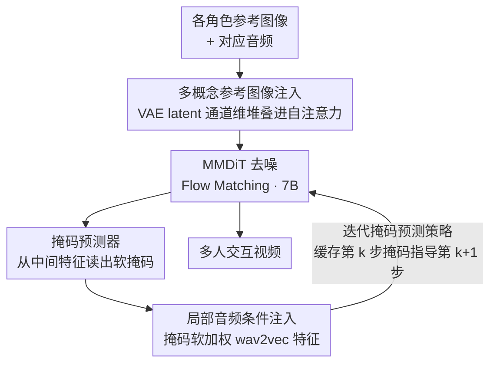

# InterActHuman: Multi-Concept Human Animation with Layout-Aligned Audio Conditions

**会议**: ICLR 2026  
**arXiv**: [2506.09984](https://arxiv.org/abs/2506.09984)  
**代码**: 部分开源（基于 Wan2.1 的复现版本）  
**领域**: 图像复原  
**关键词**: 多人视频生成, 音频驱动动画, 掩码预测, 布局控制, DiT

## 一句话总结
提出 InterActHuman，通过自动推断时空布局的掩码预测器和迭代掩码引导策略，实现多人/人物交互场景下的音频驱动视频生成，支持每个角色独立的语音驱动口型同步和身体动作。

## 研究背景与动机

**领域现状**：音频驱动的人体动画已取得显著进展（CyberHost, OmniHuman），但主要聚焦于单人场景。多人交互视频生成中，需要将不同音频精确匹配到各自角色。

**现有痛点**：多人场景下的核心挑战是"鸡生蛋蛋生鸡"问题——要将音频注入到正确的空间位置需要知道每个角色的布局（掩码），但掩码取决于最终生成的视频，而视频尚未生成。使用固定掩码会导致运动伪影和不自然的僵硬效果。

**核心矛盾**：全局音频条件无法区分多人场景中哪个角色在说话；固定掩码无法适应角色的运动变化；需要动态掩码但推理时视频尚未确定。

**本文目标** (a) 多人场景的音频-角色匹配，(b) 推理时的动态布局预测，(c) 身份保持的多概念视频生成。

**切入角度**：在 DiT（扩散 Transformer）的去噪过程中，利用中间特征预测当前步的掩码，然后用该掩码指导下一步的音频注入——迭代细化。

**核心 idea**：通过轻量掩码预测头从 DiT 中间特征推断角色布局，利用迭代去噪过程逐步细化掩码和视频生成。

## 方法详解

### 整体框架
InterActHuman 要解决的是多人交互场景下的音频驱动视频生成：给定每个角色的参考图像和对应音频，让每个人各说各的、口型与身体动作都对得上。整套系统建在 MMDiT + Flow Matching 的 7B 参数 DiT 上。给定参考图像和音频，流程是：先把多个参考人物的身份零参数地注入 DiT；去噪过程中，**掩码预测器**从中间特征实时读出每个角色当前占据的时空区域；再用这张掩码把对应音频只软加权注入到该角色所在的位置。但这几步并非一次到位——推理时存在「要预测掩码得先有视频、视频却正是要生成的东西」的死结，本文借扩散去噪的渐进性把它拆成**迭代闭环**：前 10 步先不用掩码、让 DiT 自由把大致布局铺出来，之后缓存第 $k$ 步预测的掩码去指导第 $k+1$ 步的音频注入，掩码随去噪一步步精细化。

### 关键设计

**1. 多概念参考图像注入：零额外参数地把多个身份塞进去**

多人场景要同时保住每个角色的身份，常规做法是引入 IP-Adapter 这类额外网络，但会推高参数量和训练复杂度。本文的做法是直接复用 DiT 自身的注意力：把每个参考图像 $X_i$ 用 VAE 编码成潜在表示 $x_i$，与噪声视频潜在表示 $v$ 在通道维度上堆叠，让它们在 DiT 的自注意力层里直接交互。这样身份信息是隐式注入的，不需要任何新增网络，架构保持简洁。

**2. 掩码预测器（Mask Predictor）：从去噪中间特征里读出谁在哪**

要把音频注到正确的人身上，先得知道每个角色当前占据视频里哪块时空区域。掩码预测器在每个 DiT 层附加一个轻量头——线性投影 + 3D RoPE + 交叉注意力 + 2 层 MLP + sigmoid——让视频隐藏特征 $h_v$ 和参考特征 $h_i^r$ 做交叉注意力，输出一张 0–1 之间的软掩码，最终掩码取最后几层的平均。整个预测器只增加 56M 参数（相对 7B 的 DiT 几乎可忽略），每个 DiT 块只多 0.013s 推理时间。训练时用 focal loss 应对前景-背景的严重不平衡。

**3. 迭代掩码预测策略（Denoising-time Mask Guidance）：用扩散的多步性质破"鸡生蛋"**

这是本文最核心的设计。推理时有个死结：要预测掩码得有视频，但视频正是要生成的东西，开局时根本没有。固定掩码又会带来运动伪影和僵硬效果。本文把它拆成两阶段，借扩散去噪本身的渐进性质破局：Stage 1（前 10 步）不用任何掩码，让 DiT 先自由地把大致布局铺出来；Stage 2 起，缓存第 $k$ 步预测出的掩码，在第 $k+1$ 步用它指导音频注入。掩码就这样随去噪一步步精细化——早期定大致位置，后期做精细调整，本质上是一个无需外部检测器的 bootstrap。

**4. 局部音频条件注入：让每段音频只影响对应的人**

有了掩码，音频注入就能定向。wav2vec 提取的音频特征通过交叉注意力注入 DiT，关键在于用上一步预测的掩码做软加权——只让某段音频影响对应角色的 token，在掩码边界处软过渡而非硬切。对比之下，全局音频注入无法区分多人场景里到底谁在说话（Sync-D 高达 9.482），换成这种掩码加权的局部注入后 Sync-D 降到 6.670。

### 训练策略
- Flow matching 目标：速度预测损失
- 掩码损失：focal loss（处理前景-背景不平衡）
- 两阶段训练：先单人音频预训练，再多概念微调
- 数据：260 万视频-掩码-字幕三元组，通过 Qwen2-VL 密集描述 + Grounding-SAM2 掩码标注

## 实验关键数据

### 主实验（单人音频驱动）

| 方法 | Sync-C (高好) | HKV (高好) | Sync-D (低好) | FVD (低好) |
|------|-------------|------------|-------------|----------|
| CyberHost | 6.627 | 24.733 | 8.974 | 54.797 |
| OmniHuman (无掩码) | 7.443 | 47.561 | 9.482 | 33.895 |
| OmniHuman (固定掩码) | - | - | 7.068 | 40.239 |
| **InterActHuman** | **7.272** | **59.635** | **6.670** | **22.881** |

### 用户研究（多人音频驱动）

| 方法 | 平均分 | Top-1 选择率 |
|------|--------|------------|
| Kling | 1.70 | 14.5% |
| OmniHuman | 1.82 | 25.6% |
| **InterActHuman** | **2.48** | **59.9%** |

### 消融实验

| 音频注入策略 | Sync-D (低好) | FVD (低好) |
|------------|-------------|----------|
| 全局音频条件 | 9.482 | 33.895 |
| ID Embedding | 8.627 | 35.665 |
| 固定掩码 | 7.068 | 40.239 |
| **预测掩码** | **6.670** | **22.881** |

### 关键发现
- 预测掩码全面优于固定掩码：Sync-D 降低 5.6%，FVD 降低 43.1%（40.239 -> 22.881）
- HKV（手部关键点方差）在所有方法中最高（59.635），说明身体动作最丰富
- 多概念身份保持（CLIP-I = 0.744, DINO-I = 0.533）显著优于 Pika、Vidu 等商业产品
- 掩码预测器开销很小：每增加一个参考仅增加 0.4s（vs DiT 基础 6.5s）

## 亮点与洞察
- **迭代掩码策略**：巧妙利用扩散过程的多步性质，在去噪过程中逐步精细化布局掩码。这是一种优雅的 bootstrap 方案，无需额外的外部检测器。
- **零额外参数的参考注入**：直接复用 DiT 自注意力，堆叠参考图像的 VAE latent，保持架构简洁。
- **工业级数据流水线**：260 万视频的标注流水线（Qwen2-VL 描述 + Gemini 结构化解析 + SAM2 掩码）本身就是valuable的工程贡献。

## 局限与展望
- 参考人数增加时推理时间二次增长（注意力复杂度）
- 掩码预测质量依赖于 DiT 中间特征的质量，在极早期去噪步骤中掩码可能不准
- 目前仅支持最多 3 人交互，更多人的场景未验证
- 音频条件仅限于语音，音乐或环境声的驱动未探索
- 核心模型基于 ByteDance 内部 7B DiT，完整复现有壁垒

## 相关工作与启发
- **vs OmniHuman**: 本文的直接竞争者，但 OmniHuman 不支持多人音频匹配
- **vs CyberHost**: 早期音频驱动方法，性能差距较大
- **vs Phantom (多概念定制)**: Phantom 擅长多概念但不支持音频驱动；InterActHuman 两者兼备

## 评分
- 新颖性: ⭐⭐⭐⭐ 迭代掩码预测策略新颖，但整体框架是已有组件的集成
- 实验充分度: ⭐⭐⭐⭐⭐ 单人/多人/多概念全面评测 + 用户研究 + 详细消融
- 写作质量: ⭐⭐⭐⭐ 架构描述清晰，但数学符号较多需要仔细读
- 价值: ⭐⭐⭐⭐⭐ 多人交互视频生成的实用系统，工业价值高

<!-- RELATED:START -->

## 相关论文

- [\[CVPR 2025\] EchoMimicV2: Towards Striking, Simplified, and Semi-Body Human Animation](../../CVPR2025/image_restoration/echomimicv2_towards_striking_simplified_and_semi-body_human_animation.md)
- [\[CVPR 2026\] VLIC: Vision-Language Models As Perceptual Judges for Human-Aligned Image Compression](../../CVPR2026/image_restoration/vlic_vision-language_models_as_perceptual_judges_for_human-aligned_image_compres.md)
- [\[CVPR 2026\] Human-Centric Multi-Exposure Fusion: Benchmark and Bi-level Cognition Distillation Framework](../../CVPR2026/image_restoration/human-centric_multi-exposure_fusion_benchmark_and_bi-level_cognition_distillatio.md)
- [\[ICLR 2026\] Learning Domain-Aware Task Prompt Representations for Multi-Domain All-in-One Image Restoration](learning_domain-aware_task_prompt_representations_for_multi-domain_all-in-one_im.md)
- [\[CVPR 2026\] PhaSR: Generalized Image Shadow Removal with Physically Aligned Priors](../../CVPR2026/image_restoration/phasr_generalized_image_shadow_removal_with_physically_aligned_priors.md)

<!-- RELATED:END -->
