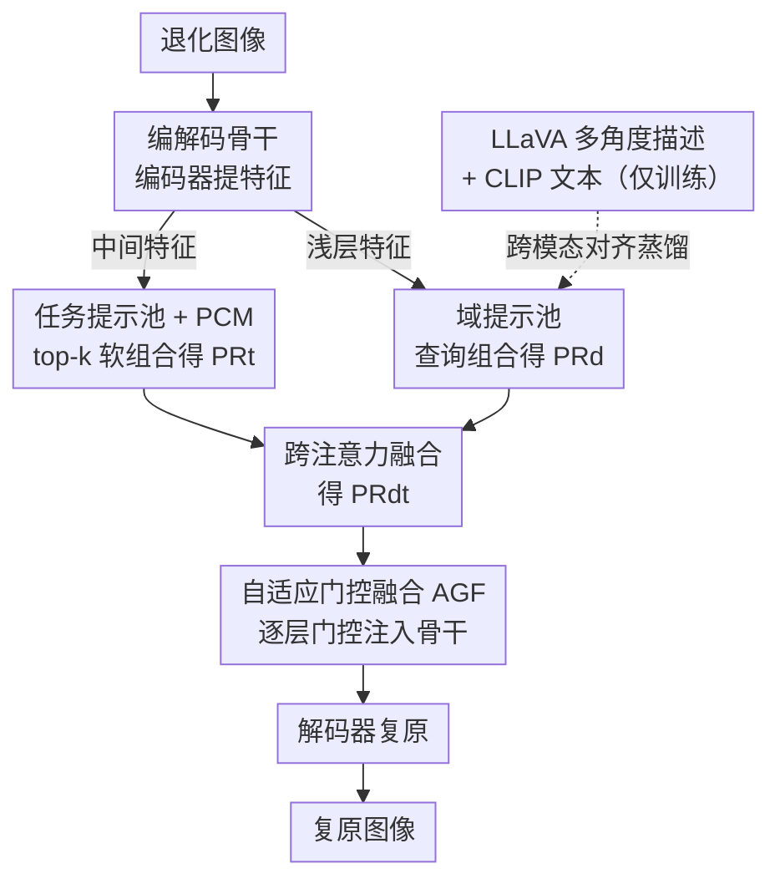

# Learning Domain-Aware Task Prompt Representations for Multi-Domain All-in-One Image Restoration

**会议**: ICLR 2026  
**arXiv**: [2603.01725](https://arxiv.org/abs/2603.01725)  
**代码**: [GitHub](https://github.com/GuangluDong0728/DATPRL-IR)  
**领域**: 图像修复  
**关键词**: 全能图像复原, 多域复原, 提示学习, 双提示池, 跨模态对齐

## 一句话总结
提出首个多域全能图像复原方法DATPRL-IR，通过双提示池（任务提示池+域提示池）学习域感知的任务提示表征，利用MLLM蒸馏域先验并通过自适应门控融合指导复原，在自然/医学/遥感三域9任务上显著超越SOTA。

## 研究背景与动机

**领域现状**：现有全能图像复原（AiOIR）方法（如PromptIR、MoCE-IR）能用单一模型处理多种退化任务，但仅局限于单一图像域（如自然图像或医学图像），尚未有方法同时处理跨域的多任务复原。

**现有痛点**：(1) 不同域的图像（自然、医学、遥感）有各自独特的视觉特征，单域方法无法迁移；(2) 现有方法侧重区分不同任务的差异，忽略了任务间的共享知识；(3) 随着任务和域的增加，模型学习难度急剧上升。

**核心矛盾**：多域多任务设置下，需要同时建模任务特异性、域特异性以及它们之间的共享知识，现有单一提示或单一编码机制无法有效捕获这种层次化的知识结构。

**本文目标** 如何用一个模型同时处理跨3个域（自然、医学、遥感）的多种复原任务？如何有效利用任务间和域间的共享知识来降低学习难度？

**切入角度**：不同域的图像虽然有独特特征，但也存在重叠的视觉特性（如"灰度+人体器官"对应医学，"鸟瞰+建筑"对应遥感）；通过双提示池分别编码任务和域知识，并在实例级自适应组合和融合。

**核心 idea**：用双提示池分别学习任务和域的专有/共享知识，通过提示组合机制和跨注意力融合生成域感知的任务提示表征来指导多域全能复原。

## 方法详解

### 整体框架
DATPRL-IR 在一个编解码器骨干网络上挂了两个提示池：编码器的中间特征去查询任务提示池得到任务表征 $\mathbf{PR}_t$，浅层特征去查询域提示池得到域表征 $\mathbf{PR}_d$，两者跨注意力融合成域感知任务提示表征 $\mathbf{PR}_{dt}$，再经自适应门控逐层注入骨干网络指导复原。关键在于任务知识和域知识被拆成两套可检索的"知识库"分别学习，再在实例级动态组合，而不是塞进一个笼统的提示里。

### 关键设计

**1. 任务提示池与提示组合机制（PCM）：让不同任务共享知识又各有侧重**

现有方法要么给每个任务单独编码（忽略共享），要么用一个提示编码所有退化（无法区分）。本文构建一个含 $N_t=15$ 个键值对提示 $(\mathbf{K}_j^{\text{task}}, \mathbf{V}_j^{\text{task}})$ 的任务池，用可学习投影器把编码器中间特征映射为查询 $\mathbf{Q}^{\text{task}}$，按余弦相似度挑出 top-$k$（$k=3$）个最相关的提示，再用温度 softmax 加权组合成实例级任务表征 $\mathbf{PR}_t = \sum_{j \in k} \alpha_j^{\text{task}} \mathbf{V}_j^{\text{task}}$。提示本身随复原目标端到端联合优化。这种"软组合"而非硬分配的设计让超分和去模糊这类共享需求（都需要锐化）能复用同一批提示，同时通过不同的加权系数保留各自的任务特异性，自然地在共享与专有之间取得平衡。

**2. 域提示池与 MLLM 知识蒸馏：把域语义先验"免费"灌进提示**

域感知需要理解图像的语义级特征（是自然照片、医学切片还是遥感俯拍），但退化图像本身难以直接学到这种高层语义。本文对应地构建 $N_d=15$ 个域提示，用浅层特征查询组合得到 $\mathbf{PR}_d$；训练时让 LLaVA-1.5-7B 对高质量图像生成内容、色彩、物体、亮度、视角等多角度文本描述，经 CLIP 文本编码器得到 $\mathbf{F}_{\text{text}}$，再用跨模态对齐损失 $\mathcal{L}_{\text{align}} = 1 - \cos(\mathbf{PR}_d, \mathbf{F}_{\text{text}})$ 把 MLLM 的域先验蒸馏进域提示。这样推理时完全不需要 LLaVA 和 CLIP，域感知能力已经固化在提示池里，没有任何额外开销——相当于借 MLLM 的图像理解能力训练，部署时却不背它的包袱。

**3. 自适应门控融合（AGF）：每层自己决定要多少域/任务信息**

任务表征和域表征先跨注意力融合成 $\mathbf{PR}_{dt}$，但不同深度的层对提示的需求并不一样——浅层更需要域信息来辨别输入类型，深层更需要任务信息来执行具体复原操作，固定融合比例过于刚性。AGF 因此给每层配一个可学习门控 $\alpha_l \in [0,1]$ 来动态调配特征与提示的占比：$\mathbf{F}_l^e = \text{CrossAttn}(\alpha_l \mathbf{F}_l, (1-\alpha_l) \mathbf{PR}_{dt})$，让每层独立学到最适合自己的融合策略。

### 损失函数 / 训练策略
总损失把六项加权求和：$\mathcal{L} = \lambda_{\text{pix}}\mathcal{L}_{\text{pix}} + \lambda_{\text{fft}}\mathcal{L}_{\text{fft}} + \lambda_{\text{align}}\mathcal{L}_{\text{align}} + \lambda_{\text{div}}\mathcal{L}_{\text{div}} + \lambda_{\text{bal}}\mathcal{L}_{\text{bal}} + \lambda_{\text{con}}\mathcal{L}_{\text{con}}$。其中 $\mathcal{L}_{\text{pix}}$ 和 $\mathcal{L}_{\text{fft}}$ 分别是 RGB 域和傅里叶域的 $\ell_1$ 重建损失，$\mathcal{L}_{\text{align}}$ 是上面的跨模态对齐损失，$\mathcal{L}_{\text{div}}$ 用余弦相似度阈值 $\tau=0.1$ 鼓励提示之间保持多样性，$\mathcal{L}_{\text{bal}}$ 通过最大化选择熵让提示被均衡使用、避免少数提示被反复挑中而其余沦为死权重。优化用 Adam，学习率 $4 \times 10^{-4}$ 配 cosine 退火，batch=12，训练 1000K iteration。

## 实验关键数据

### 主实验

| 任务/数据集 | 指标 | DATPRL-IR (6T) | MoCE-IR (SOTA) | 提升 |
|--------|------|------|----------|------|
| 自然SR / DIV2K-Val | PSNR | 28.98 | 28.16 | +0.82 |
| 去雨 / Rain100L | PSNR | 39.56 | 38.64 | +0.92 |
| MRI SR / IXI MRI | PSNR | 27.88 | 27.75 | +0.13 |
| CT去噪 / AAPM-Mayo | PSNR | 33.80 | 33.74 | +0.06 |
| 遥感SR / UCMerced | PSNR | 28.29 | 28.06 | +0.23 |
| 云去除 / CUHK CR1 | PSNR | 26.12 | 26.06 | +0.06 |
| **6任务平均** | **PSNR** | **30.77** | **30.40** | **+0.37** |

### 消融实验

| 配置 | 去雨PSNR | CT去噪PSNR | 遥感SR PSNR |
|------|---------|------|------|
| 无TP+无DP（基线） | 38.34 | 33.70 | 28.02 |
| 仅TP Pool | 39.32 | 33.76 | 28.16 |
| 仅DP Pool | 38.88 | 33.74 | 28.12 |
| TP+DP（完整） | 39.56 | 33.80 | 28.29 |

### 关键发现
- 从6任务扩展到9任务时，原有任务性能不降反升（如自然SR: 28.98→29.05），验证了不同任务间存在可迁移的共享知识
- 更换不同规模的MLLM（LLaVA-7B/13B、Qwen3-VL-2B）对性能影响极小，说明方法仅依赖粗粒度域语义
- 用固定文本提示（如"这是MRI图像"）替代域提示池会降低性能，验证了自适应选择和共享建模的必要性
- 提示池大小15、top-k=3/5 是最优配置，过大过小都会影响性能

## 亮点与洞察
- 首次将全能图像复原扩展到多域场景，提出的双提示池架构优雅地解耦了任务知识和域知识的学习，通过PCM实现了共享与专有知识的自适应平衡。扩展任务不降性能的特性具有很好的扩展性。
- 利用MLLM蒸馏域先验的设计思路巧妙：训练时利用LLaVA的强理解能力，推理时完全不需要，实现了"免费"的域感知能力。

## 局限与展望
- 域的扩展目前仅覆盖自然/医学/遥感三域，更多域（如水下、夜视、卫星等）的可扩展性有待验证
- 提示池的大小和top-k需要手动调节，缺乏自适应机制
- 仅使用PSNR/SSIM评估，缺少感知质量指标（如LPIPS）和下游任务评估

## 相关工作与启发
- **vs PromptIR**: PromptIR使用单一可学习提示编码退化信息，本文通过提示池+PCM实现更灵活的实例级表征，且额外引入域感知维度
- **vs MoCE-IR**: MoCE-IR用混合专家架构分配任务资源，本文通过双提示池的"查询-检索-组合"范式实现类似功能但更轻量，6任务平均高出0.37dB

## 评分
- 新颖性: ⭐⭐⭐⭐ 首个多域全能复原方法，双提示池+MLLM蒸馏的设计有新意
- 实验充分度: ⭐⭐⭐⭐ 3域9任务的完整实验，详尽的消融和扩展性验证
- 写作质量: ⭐⭐⭐⭐ 结构清晰，图表丰富，动机阐述充分
- 价值: ⭐⭐⭐⭐ 多域统一复原具有重要实践意义，双提示池可迁移到其他多域多任务场景

<!-- RELATED:START -->

## 相关论文

- [\[CVPR 2026\] Degradation-Consistent Test-Time Adaptation for All-in-One Image Restoration](../../CVPR2026/image_restoration/degradation-consistent_test-time_adaptation_for_all-in-one_image_restoration.md)
- [\[CVPR 2026\] FAPE-IR: Frequency-Aware Planning and Execution Framework for All-in-One Image Restoration](../../CVPR2026/image_restoration/fape-ir_frequency-aware_planning_and_execution_framework_for_all-in-one_image_re.md)
- [\[CVPR 2025\] Degradation-Aware Feature Perturbation for All-in-One Image Restoration](../../CVPR2025/image_restoration/degradation-aware_feature_perturbation_for_all-in-one_image_restoration.md)
- [\[ICLR 2026\] Mechanism of Task-oriented Information Removal in In-context Learning](mechanism_of_task-oriented_information_removal_in_in-context_learning.md)
- [\[CVPR 2025\] Visual-Instructed Degradation Diffusion for All-in-One Image Restoration](../../CVPR2025/image_restoration/visual-instructed_degradation_diffusion_for_all-in-one_image_restoration.md)

<!-- RELATED:END -->
