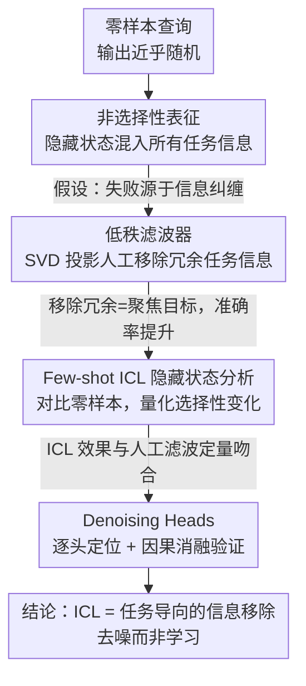

# Mechanism of Task-oriented Information Removal in In-context Learning

**会议**: ICLR 2026  
**arXiv**: [2509.21012](https://arxiv.org/abs/2509.21012)  
**代码**: 无  
**领域**: 图像复原  
**关键词**: in-context learning, information removal, denoising heads, mechanistic interpretability, low-rank filter

## 一句话总结
从"信息移除"的新视角解释 In-context Learning（ICL）的内部机制：发现 LM 在零样本时将查询编码为包含所有可能任务信息的"非选择性表征"（导致随机输出），而 few-shot ICL 的核心作用是模拟一种"任务导向的信息移除"过程——通过识别出的"Denoising Heads"（去噪注意力头）从纠缠的表征中选择性移除冗余任务信息，引导模型聚焦目标任务。消融实验证实阻断去噪头后 ICL 准确率显著下降。

## 研究背景与动机

**领域现状**：In-context Learning（ICL）是大语言模型的标志性能力——无需微调，仅通过在 prompt 中提供少量示例（demonstrations）就能让模型执行新任务。尽管 ICL 已被广泛应用，但其内部"如何工作"的机制仍不清晰。

**现有痛点**：
   - **现有理论视角有限**：已有解释包括"ICL 是隐式梯度下降"、"ICL 学习贝叶斯推断"、"induction heads 做复制粘贴"等，但这些解释要么在简化模型上验证、要么只覆盖特定类型任务，缺乏统一和深入的理解
   - **零样本为何失败不清楚**：在没有 demonstrations 的零样本场景下，LM 对许多任务的准确率接近零。模型具备知识但输出随机——为什么？
   - **demonstrations 到底做了什么**：few-shot 的 demonstrations 如何改变模型内部表征，引导模型从"什么任务都想做"变成"只做目标任务"？机制不明

**核心矛盾**：LM 的预训练使其拥有处理各种任务的能力，但这些能力以"纠缠"的形式存在于隐藏状态中。零样本时，查询的隐藏状态包含了所有可能任务的信息，导致输出混乱——ICL 的 demonstrations 需要做的不是"添加信息"，而是"移除干扰"。

**本文目标**：从"信息移除"这个全新视角，解释 ICL 的核心机制——demonstrations 如何帮助模型从纠缠的表征中去除冗余任务信息，聚焦目标任务。

**切入角度**：
   - 首先证明零样本时 LM 的隐藏状态是"非选择性"的（包含所有任务信息）
   - 然后用低秩滤波器人工模拟信息移除，验证移除冗余信息确实能提升任务准确率
   - 接着测量 few-shot ICL 的隐藏状态，发现其效果等价于任务导向的信息移除
   - 最后识别执行移除操作的关键注意力头（Denoising Heads）

**核心 idea**：ICL 的机制不是"利用 demonstrations 学习新知识"，而是"利用 demonstrations 从纠缠表征中移除冗余信息"——去噪而非学习。

## 方法详解

### 整体框架

这是一项机制分析（mechanistic interpretability）工作，目标不是提出新模型，而是回答一个长期困惑：一个预训练后已经具备各种任务能力的语言模型，为什么在零样本时输出近乎随机，却只要在 prompt 里加几个示例（demonstrations）就能正常工作？本文给出的答案是：demonstrations 的作用不是"教模型新知识"，而是"帮模型从纠缠的表征里移除冗余的任务信息"——去噪而非学习。

整篇分析沿四个递进的发现展开。先证明零样本时查询 token 的隐藏状态是"非选择性"的，里面同时编码了所有可能任务的信息；再用一个人工的低秩滤波器模拟"信息移除"，验证移除冗余信息确实能让模型聚焦目标任务；接着测量 few-shot ICL 的隐藏状态，发现它在定量上等价于这种任务导向的信息移除；最后把执行移除操作的具体组件定位到一小撮注意力头，命名为 Denoising Heads，并用因果消融验证其作用。贯穿全程的分析工具有四样：用线性探测（probing）训练探测器检测隐藏状态里某个任务信息是否存在；用 SVD 低秩投影作为可控的信息移除手段；用因果消融（causal ablation）干预单个组件验证其因果作用；以及借 flipped labels、随机 labels 等对照实验，区分不同情形下 ICL 的行为差异。

### 关键设计

**1. 非选择性表征：解释零样本为什么失败**

第一步要回答的是零样本失败的根源。作者对 LM 在零样本场景下查询 token 的隐藏状态做探测，设计度量指标衡量其中不同任务信息的存在程度——例如对一条情感分类查询，检查它的隐藏状态是否同时含有"情感分类""主题分类""翻译"等多个任务的激活信号。结果发现这些表征确实是"非选择性"的：不同任务的信息混杂在一起，模型无法判定该执行哪个任务，于是输出近乎随机、准确率接近零。这把零样本失败从"模型不会"重新解释为"模型什么都想做"——能力是有的，只是没有被聚焦，从而为后面"用移除信息来聚焦"的思路铺好了前提。

**2. 低秩滤波器：人工模拟信息移除，验证"移除=聚焦"**

既然问题出在信息纠缠，那能不能人工把冗余信息删掉？作者设计了一个低秩投影操作 $P$，对隐藏状态 $h$ 做滤波 $h' = P \cdot h$，选择性移除特定任务维度的信息。具体做法是对隐藏状态矩阵做 SVD 分解，识别与不同任务关联的主成分方向，再把表征投影到目标任务相关的低秩子空间，这等价于抹掉了该子空间正交方向上的其他任务信息。把这个滤波器施加到零样本的隐藏状态后，模型立刻能"聚焦"目标任务、准确率显著提升。这一步的意义在于提供了一个可控的对照工具：如果人工移除冗余信息就能达到指导任务的效果，那么"信息移除 = 任务导向"的假设就站得住，也为下一步把 ICL 和滤波器作定量对比做好了铺垫。

**3. Few-shot ICL 的隐藏状态分析：证明 demonstrations 等价于信息移除**

有了人工滤波器作参照，就能检验自然的 ICL 到底在做什么。作者对比 few-shot 与零样本的隐藏状态，用度量"选择性"程度的指标观察冗余任务信息是否被压缩、目标任务信息是否被增强。结果是：随着 demonstrations 数量增加，隐藏状态逐渐变得"选择性"——冗余信息被抑制、目标任务信息占主导，而且这个变化在定量上与低秩滤波器实验的效果高度吻合。换句话说，自然 ICL 和人工滤波在功能上是等价的，demonstrations 起的就是一台"信息移除器"的作用，而不是在往模型里灌新知识。

**4. Denoising Heads：把信息移除定位到具体注意力头并做因果验证**

最后一步把机制从"功能描述"推进到"组件定位"。作者逐头分析每个注意力头对隐藏状态"选择性"指标的贡献，筛出贡献最大的那一小撮，称为 Denoising Heads；观察它们的注意力模式可以看到，这些头主要关注 demonstrations 中与目标任务相关的部分（如标签 token），并用这些信息去调制查询的隐藏状态。为验证它们的因果作用，作者在推理时"阻断"这些头（把输出置零或用原始隐藏状态替代），ICL 准确率随即显著下降；尤其在"正确标签不在 demonstrations 中"的极端场景（flip label 设置）下，阻断后退化更严重——因为此时模型更依赖信息移除而非照抄标签。这组消融把信息移除从一个抽象功能落实到了可干预、可验证的具体组件上。

## 实验关键数据

### 实验设置
- **模型**：在多个语言模型上验证（GPT-2 系列、LLaMA 等不同规模）
- **任务**：文本分类（情感分析、主题分类等）——选择这类任务是因为它们有清晰的标签空间，方便度量"任务信息"
- **规模**：87 页论文、90 张图、7 个表——极其详尽的实验

### 主实验

**发现1：非选择性表征**

| 场景 | 准确率 | 隐藏状态选择性 | 说明 |
|------|--------|-------------|------|
| 零样本 | ~0% | 低（多任务信息混杂） | 模型"什么都想做" |
| 人工低秩滤波 | 显著提升 | 高（目标任务信息占优） | 移除冗余信息等价于指导任务 |
| Few-shot ICL (4-shot) | 高 | 高 | demonstrations 自然实现了信息移除 |

**发现2：ICL ≈ 信息移除**
- 低秩滤波器的效果和 few-shot ICL 的效果在定量指标上高度吻合
- 两者都使隐藏状态变得"更选择性"——冗余任务信息被压缩

**发现3：Denoising Heads 消融**

| 配置 | ICL 准确率变化 | 说明 |
|------|---------------|------|
| 正常 ICL | 基线 | — |
| 阻断 Denoising Heads | 显著下降（↓15-30%） | 信息移除被阻断 |
| 阻断非 Denoising Heads | 轻微影响 | 非关键头不影响 ICL |
| Flipped Labels + 阻断 Denoising Heads | 退化最严重 | 无正确标签时信息移除更关键 |

### 消融实验

| 配置 | 关键指标 | 说明 |
|------|---------|------|
| 不同 demonstration 数量 | 信息移除程度单调增加 | 更多示例 = 更强的去噪 |
| 不同模型规模 | 更大模型有更多 Denoising Heads | 规模↑ → 信息移除能力↑ |
| 不同任务类型 | 信息移除机制一致存在 | 在情感、主题等多种任务上验证 |
| 标签空间大小 | 标签越多越需要信息移除 | 验证：更多可能的任务 = 更多需要移除的冗余信息 |

### 关键发现
- **ICL 不是在"学习新技能"，而是在"过滤干扰"**：这是最核心的发现。LM 已经具备各种任务能力，demonstrations 只是帮助模型"聚焦"到正确的任务
- **Denoising Heads 数量有限但关键**：只有少量注意力头负责信息移除，但阻断它们对 ICL 影响巨大
- **信息移除在 flipped label 场景更关键**：当 demonstrations 的标签被翻转（故意给错标签）时，模型仍能部分工作——说明 demonstrations 的主要作用不是提供正确标签，而是指示"应该做什么任务"（通过移除其他任务信息）
- **不同模型的 Denoising Heads 位置不同但功能一致**：验证了机制的普适性

## 亮点与洞察

- **全新的 ICL 解释视角**：相比"ICL = 隐式梯度下降"或"ICL = 贝叶斯推断"，"ICL = 信息移除"更直观、更具操作性——它告诉我们 demonstrations 的功能不是"教新东西"而是"告诉模型该做什么"
- **非选择性表征的发现**：首次系统性地展示零样本时的隐藏状态包含所有任务信息。这解释了一个长期困惑：为什么具备知识的模型在零样本时输出随机
- **Denoising Heads 的概念**：将信息移除操作定位到具体的注意力头，是 mechanistic interpretability 的重要进展——从"功能描述"到"组件定位"
- **低秩滤波器作为分析工具**：提供了一个优雅的实验框架来人工模拟信息移除，为 ICL 机制研究提供了新的方法论
- **论文的深度和彻底性**：87 页、90 张图、7 张表——作者对每一个发现都进行了多角度验证，极其严谨

## 局限与展望

- **主要在分类任务上验证**：信息移除机制是否适用于生成式任务（如对话、摘要、翻译）尚不清楚。生成任务的"任务信息"更难定义和度量
- **仅使用线性探测和低秩投影**：信息移除可能涉及非线性变换，低秩线性近似可能只捕获了部分机制
- **模型规模限制**：由于分析需要对隐藏状态进行详细探测，实验主要在中等规模模型（GPT-2 系列、较小的 LLaMA）上验证，对超大模型（100B+）的适用性未知
- **Denoising Heads 的形成机制**：论文发现了这些头的存在，但未解释它们是如何在预训练中形成的——这需要对训练动态的进一步研究
- **与其他 ICL 理论的统一**：信息移除视角与"隐式梯度下降"、"贝叶斯推断"等视角之间是互补还是矛盾？缺乏显式的理论统一

## 相关工作与启发

- **Induction Heads**（Olsson et al.）：识别出执行"复制-粘贴"操作的注意力头。Denoising Heads 是另一类功能性注意力头，执行"信息过滤"操作
- **Task Vectors**：发现模型内部存在表征任务方向的向量。信息移除可以理解为将隐藏状态投影到正确的任务向量方向
- **ICL 的贝叶斯视角**（Xie et al. 2022）：ICL 做隐式贝叶斯推断——选择最可能的任务。信息移除可以看作贝叶斯推断的"注意力头级别"实现
- **可解释性研究**（Mechanistic Interpretability）：本文遵循"定位功能性组件→因果验证→消融实验"的标准范式
- **启发**：信息移除视角可能对 prompt engineering 有实用指导——好的 prompt 应该帮助模型"过滤掉不相关的任务解读"，而不只是"提供任务信息"

## 评分
- 新颖性: ⭐⭐⭐⭐⭐
- 实验充分度: ⭐⭐⭐⭐⭐
- 写作质量: ⭐⭐⭐⭐
- 价值: ⭐⭐⭐⭐⭐

<!-- RELATED:START -->

## 相关论文

- [\[CVPR 2026\] Event-Based Motion Deblurring Using Task-Oriented 3D Gaussian Event Representations](../../CVPR2026/image_restoration/event-based_motion_deblurring_using_task-oriented_3d_gaussian_event_representati.md)
- [\[ICLR 2026\] Learning Domain-Aware Task Prompt Representations for Multi-Domain All-in-One Image Restoration](learning_domain-aware_task_prompt_representations_for_multi-domain_all-in-one_im.md)
- [\[CVPR 2025\] Tokenize Image Patches: Global Context Fusion for Effective Haze Removal in Large Images](../../CVPR2025/image_restoration/tokenize_image_patches_global_context_fusion_for_effective_haze_removal_in_large.md)
- [\[CVPR 2026\] BiEvLight: Bi-level Learning of Task-Aware Event Refinement for Low-Light Image Enhancement](../../CVPR2026/image_restoration/bievlight_bi-level_learning_of_task-aware_event_refinement_for_low-light_image_e.md)
- [\[CVPR 2026\] IAFMNet: Information-Aware Feature Modulation for Efficient Super-Resolution](../../CVPR2026/image_restoration/iafmnet_information-aware_feature_modulation_for_efficient_super-resolution.md)

<!-- RELATED:END -->
