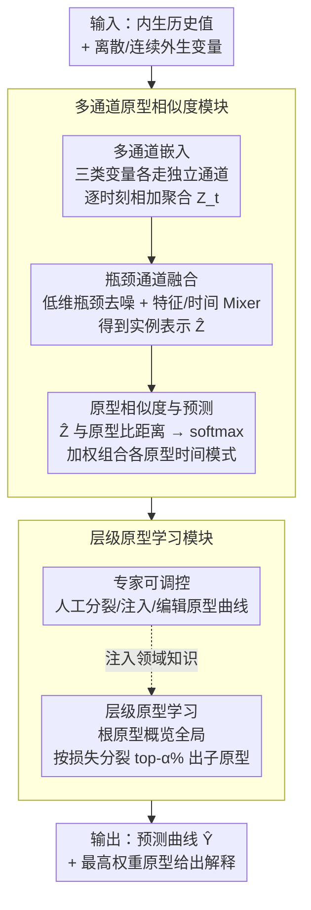

# ProtoTS: Learning Hierarchical Prototypes for Explainable Time Series Forecasting

**会议**: ICLR 2026  
**arXiv**: [2509.23159](https://arxiv.org/abs/2509.23159)  
**代码**: [有](https://github.com/SKURA502/ProtoTS)  
**领域**: 图像复原  
**关键词**: 可解释预测, 层级原型, 外生变量, 多通道嵌入, 专家可调控

## 一句话总结

提出 ProtoTS，通过层级原型学习实现可解释时间序列预测：少量粗粒度原型提供全局模式概览，逐级细分捕捉局部变化，结合多通道嵌入与瓶颈融合处理异质外生变量。在 LOF 数据集上 MSE 降低 48.3%，MAE 降低 20.9%，且支持专家编辑原型以进一步提升性能。

## 研究背景与动机

时间序列预测在电力调度、能源管理、天气预报等高利害场景中广泛应用。在这些场景中，仅有准确预测不够——理解预测原因同样关键，以防止巨大财务损失并建立信任。

现有可解释方法的两个核心缺陷：

- **C1（输出侧）**：TFT、DiPE-Linear 等只解释单个时间步的预测，无法解释整体趋势模式（如"为什么电力负荷曲线在中午、下午、晚间出现三个递减峰值"）。电力调度专家需要理解整体模式才能做出是否外购电力的决策
- **C2（输入侧）**：现有解释仅关注部分输入变量（如 CycleNet 仅关注内生变量）。但预测结果由多种异质变量的交互作用决定（如高温+夏季→空调高峰），需理解它们的联合影响

**ProtoTS 的解决思路**：每个原型对应一种典型时间模式（如"春节模式"、"夏季工作日模式"），通过实例与原型的相似度匹配形成预测。少量原型提供全局概览，层级结构支持逐步深入和专家干预。

## 方法详解

### 整体框架

ProtoTS 把每个实例编码成一个嵌入向量，再与一组可学习的「原型」比相似度，预测就是这些原型所携带时间模式的加权组合。它由两部分串起来：多通道原型相似度模块负责处理异质输入变量并算出实例-原型相似度，层级原型学习模块则用一棵从粗到细的树来组织原型，让少量根原型概括全局模式、子原型刻画局部细节。整体数据流是：异质输入先经多通道嵌入和瓶颈去噪压成一个干净的实例表示 $\hat{\mathbf{Z}}$，再与原型库比相似度做加权预测，而原型库本身由层级学习从粗到细组织、并允许专家在语义层面编辑。

### 关键设计

**1. 多通道嵌入：让异质变量各走各的编码通道**

预测结果往往由多种性质完全不同的变量共同决定——内生历史值、离散外生变量（如星期、节假日标记）、连续外生变量（如温度），若一股脑塞进同一个编码器，离散与连续、内生与外生的语义会互相干扰。ProtoTS 为三类变量各设独立通道：内生值经带激活函数的 MLP 得到 $\gamma(\mathbf{y}_t)$，每个离散外生变量查各自的嵌入表 $\mathbf{E}_j(\mathbf{x}_{t,j}^{\text{dis}})$，每个连续外生变量走变量特定的非线性投影 $\psi_j(\mathbf{x}_{t,j}^{\text{con}})$。时刻 $t$ 的完整嵌入再相加聚合：$\mathbf{Z}_t = \gamma(\mathbf{y}_t) + \sum_{j=1}^{C_{\text{dis}}} \mathbf{E}_j(\mathbf{x}_{t,j}^{\text{dis}}) + \sum_{j=1}^{C_{\text{con}}} \psi_j(\mathbf{x}_{t,j}^{\text{con}})$。注意预测窗口内没有真实内生值 $\mathbf{y}_t$，那一段只靠外生变量补齐，这也正是为什么外生变量的建模质量直接决定了未来段的预测精度。

**2. 瓶颈通道融合：把加和后的噪声压掉再交互**

多通道嵌入做加法聚合很简洁，但也把噪声变量的扰动一并带了进来，直接在高维上做特征/时间交互容易放大这种噪声。ProtoTS 在 MLP-Mixer 架构里插入一个瓶颈层 $\mathbb{R}^d \to \mathbb{R}^{d_{\text{bottle}}} \to \mathbb{R}^d$（$d_{\text{bottle}} \ll d$），先压到低维迫使模型只保留主导信息再还原，分别沿特征维和时间维做融合：$\mathbf{Z}_{1:L+H}^{(l+1)} = \text{MLP}_{\text{time}}(\text{MLP}_{\text{feature}}(\mathbf{Z}_{1:L+H}^{(l)})^T)^T$。多层之后再用一个线性变换把整段时间维聚成单个实例表示 $\hat{\mathbf{Z}} = \mathbf{Z}_{1:L+H}^T \mathbf{W} \in \mathbb{R}^d$，供后续与原型比对。消融里去掉瓶颈后平均 MAE 从 0.106 升到 0.143，是降幅最大的组件，印证了这步去噪的必要性。

**3. 原型相似度与预测：把预测写成「典型模式的加权和」**

每个原型由两部分组成——嵌入 $\boldsymbol{\mu} \in \mathbb{R}^d$ 用来和实例比距离，时间模式 $\mathbf{p} \in \mathbb{R}^T$ 是这类模式对应的整条预测曲线，两者都是可学习参数。实例表示 $\hat{\mathbf{Z}}$ 与各原型嵌入算欧氏距离再经 softmax 归一化成相似度 $f(\hat{\mathbf{Z}}|\boldsymbol{\mu}_c) = \frac{\exp(-d(\hat{\mathbf{Z}}, \boldsymbol{\mu}_c))}{\sum_{i=1}^N \exp(-d(\hat{\mathbf{Z}}, \boldsymbol{\mu}_i))}$，最终预测就是各原型时间模式按相似度的加权组合 $\hat{\mathbf{Y}} = \sum_{i=1}^N f(\hat{\mathbf{Z}}|\boldsymbol{\mu}_i) \cdot \mathbf{p}_i$。这种写法的可解释性来得很自然：看一眼哪个原型权重最高、它的 $\mathbf{p}$ 长什么样，就知道模型把当前实例归到了哪种典型模式，而原型直接解码为整条序列（而非单个类别标签）正是它区别于传统原型分类网络的地方。

**4. 层级原型学习：粗原型概览全局，按需细分捕局部**

少量原型够概览全局却不够刻画局部变化，全靠大量原型又会让解释变得琐碎。ProtoTS 用一棵树平衡二者：根层级先用少量原型（如 6 个）捕获季节性、假日等粗粒度模式并训练至收敛；随后按各原型关联实例的平均 MAE 损失排序，挑出损失最高的 top $\alpha$% 叶原型——高损失说明该原型的单一时间模式不足以代表它聚到的那批实例——把每个这样的原型分裂成 $M$ 个子原型继续细化。有了子层级，预测变成两级相似度的嵌套加权 $\hat{\mathbf{Y}} = \sum_{i=1}^N f(\hat{\mathbf{Z}}|\boldsymbol{\mu}_i) \sum_{j=1}^M f(\hat{\mathbf{Z}}|\boldsymbol{\mu}_{i,j}) \cdot \mathbf{p}_{i,j}$：先选大类，再在大类内部选更细的子模式。这样既保留了「先看 6 个根原型就懂大局」的全局视角，又能逐层下钻到具体的局部模式。

**5. 专家可调控：让人能直接编辑原型而非黑盒微调**

因为每个原型都对应一条可读的时间模式，专家可以在模型之上做语义层面的干预，而不必去碰底层权重：选择性地把某个原型再分裂（如将「春节」原型拆成「节前」「节中」）、往根层级注入一个新原型、甚至直接编辑某原型的时间模式曲线。实验中仅手动分裂「春节」原型一项，就让春节期间 MSE 降低 0.009，说明这种人在回路的编辑能把领域知识低成本地灌进模型。

### 损失函数 / 训练策略

训练目标是 L1 预测损失加一项相似度熵正则：$\mathcal{L} = \|\hat{\mathbf{Y}} - \mathbf{Y}\|_1 - \lambda \sum_{i=1}^N f(\hat{\mathbf{Z}}|\boldsymbol{\mu}_i) \log(f(\hat{\mathbf{Z}}|\boldsymbol{\mu}_i))$，熵项鼓励每个实例的相似度集中在少数原型上，从而让「一个实例≈一种典型模式」的解释更干净。整体采用分阶段训练：先把根层级训到收敛，再按损失分裂出子层级，然后继续训练细化，与层级原型的「从粗到细」结构保持一致。

## 实验关键数据

### 主实验

**LOF 数据集**（电力负荷预测，22个外生变量，4个区域）：

| 模型 | RE | YC | EA | PC | Avg MAE | vs ProtoTS |
|------|-----|-----|-----|-----|---------|-----------|
| **ProtoTS** | **0.198** | **0.055** | **0.059** | **0.112** | **0.106** | - |
| TiDE | 0.253 | 0.057 | 0.061 | 0.164 | 0.134 | +21% |
| iTransformer | 0.279 | 0.080 | 0.097 | 0.139 | 0.149 | +29% |
| TimeXer | 0.272 | 0.079 | 0.096 | 0.182 | 0.157 | +32% |
| XGBoost | 0.405 | 0.084 | 0.092 | 0.230 | 0.203 | +48% |

**EPF 数据集**（电价预测，5个市场）：

| 模型 | NP | PJM | BE | FR | DE | Avg MAE |
|------|-----|-----|-----|-----|-----|---------|
| **ProtoTS** | **0.213** | **0.152** | **0.226** | **0.183** | **0.318** | **0.218** |
| TimeXer | 0.240 | 0.173 | 0.241 | 0.192 | 0.343 | 0.238 |

ProtoTS 在 LOF 上 MSE 降低 48.3%、MAE 降低 20.9%；EPF 上 MSE 和 MAE 均降低 8%。

### 消融实验

| 组件 | PC MSE | YC MSE | RE MSE | EA MSE | Avg MAE |
|------|--------|--------|--------|--------|---------|
| w/o bottleneck | 0.044 | 0.013 | 0.089 | 0.129 | 0.143 |
| w/o multi-channel | 0.034 | 0.006 | 0.108 | 0.007 | 0.117 |
| w/o hierarchy | 0.026 | 0.006 | 0.089 | 0.007 | 0.110 |
| **ProtoTS (完整)** | **0.025** | **0.006** | **0.085** | **0.007** | **0.106** |

### 关键发现

- **数据效率高**：训练数据从100%减少到50%时，ProtoTS 性能下降轻微，而 TimeXer、iTransformer 明显劣化
- **根原型数量**：增至12-15个时趋于饱和，说明典型模式数量有限
- **可解释性量化评估**：24名用户参与，ProtoTS 的 User Precision 77%（TFT 64%、NBEATSx 62%），SUS 得分 73.36（大幅领先）
- **专家编辑案例**：将"春节"原型手动分裂为"节前"和"节中"，春节期间 MSE 降低 0.009

## 亮点与洞察

1. **原型即时间模式**：首次将原型解码为输出序列（如96步预测曲线），而非单一类别标签
2. **全局+局部双层解释**：粗粒度原型给出全局理解，细粒度原型提供局部细节
3. **专家在回路**：可解释性不止于"展示"，还支持专家主动编辑原型来优化模型
4. **处理异质外生变量**：多通道嵌入 + 瓶颈去噪，避免噪声变量干扰

## 局限与展望

- 当前原型的"命名"需人工总结（如"春节模式"），可结合 LLM 自动生成语义标签
- 层级深度和分裂策略依赖启发式规则（top $\alpha$% 损失），自适应方案值得探索
- 仅验证了电力负荷和电价数据集，其他高利害场景（医疗、金融）的适用性待验证
- 与 Foundation Model 的结合（如用 ProtoTS 原型解释大模型预测）是有趣方向

## 相关工作与启发

- **原型网络家族**：从分类扩展到回归序列输出，是原型方法的重要进展
- **CycleNet**：仅发现内生变量周期模式，ProtoTS 同时建模外生变量交互
- **TFT 的 attention 解释**：提供局部逐步解释，ProtoTS 的原型提供更直觉的全局视角
- 启发：在时序预测中，"可解释性"不仅是附加功能，通过原型学习可同时提升准确性

## 评分

- 新颖性: ⭐⭐⭐⭐⭐ （层级原型→时间模式序列输出，专家可编辑设计，开创性工作）
- 实验充分度: ⭐⭐⭐⭐ （LOF + EPF 数据集，消融完整，用户研究加分）
- 写作质量: ⭐⭐⭐⭐⭐ （电力场景案例详实，层级原型可视化极具说服力）
- 价值: ⭐⭐⭐⭐⭐ （兼顾准确性与可解释性，专家可调控设计直击工业需求）

<!-- RELATED:START -->

## 相关论文

- [\[ICML 2025\] TimeDART: A Diffusion Autoregressive Transformer for Self-Supervised Time Series Representation](../../ICML2025/image_restoration/timedart_a_diffusion_autoregressive_transformer_for_self-supervised_time_series_.md)
- [\[NeurIPS 2025\] Luminance-Aware Statistical Quantization: Unsupervised Hierarchical Learning for Illumination Enhancement](../../NeurIPS2025/image_restoration/luminance-aware_statistical_quantization_unsupervised_hierarchical_learning_for_.md)
- [\[ICLR 2026\] Mechanism of Task-oriented Information Removal in In-context Learning](mechanism_of_task-oriented_information_removal_in_in-context_learning.md)
- [\[CVPR 2025\] A Flag Decomposition for Hierarchical Datasets](../../CVPR2025/image_restoration/a_flag_decomposition_for_hierarchical_datasets.md)
- [\[CVPR 2026\] Time Without Time: Pseudo-Temporal Representation for Space-Time Super-Resolution](../../CVPR2026/image_restoration/time_without_time_pseudo-temporal_representation_for_space-time_super-resolution.md)

<!-- RELATED:END -->
