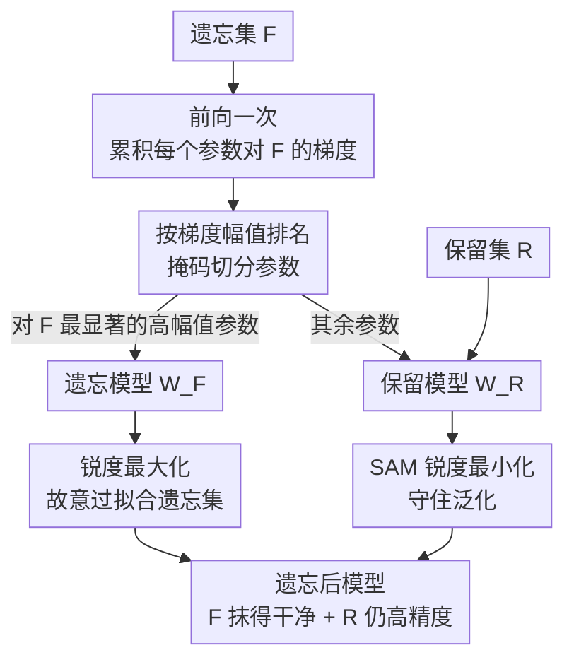

# Sharpness-Aware Machine Unlearning

**会议**: ICLR 2026  
**arXiv**: [2506.13715](https://arxiv.org/abs/2506.13715)  
**代码**: 无  
**领域**: 图像复原  
**关键词**: machine unlearning, Sharpness-Aware Minimization, SAM, Signal-Noise Decomposition, Sharp MinMax

## 一句话总结

本文从信号-噪声分解的视角系统分析了 SAM 在机器遗忘场景下的理论特性，发现 SAM 在遗忘集上会"放弃"去噪能力但在保留集上仍维持优势，进而提出 Sharp MinMax 算法——将模型拆成两部分分别做锐度最小化（保留）和锐度最大化（遗忘），达到SOTA遗忘效果。

## 研究背景与动机

机器遗忘（Machine Unlearning）旨在高效移除特定训练数据对模型的影响，而无需从零重新训练。现有方法如影响函数更新（Influence Unlearning）、稀疏微调（L1-Sparse）、梯度上升（NegGrad）等虽然各有进展，但对遗忘过程缺乏深入的理论理解，实践中依赖大量超参调节且行为难以预测。

关键问题在于：当模型同时接收"保留信号"（retain signals）和"遗忘信号"（forget signals）时，两类信号会在训练中互相干扰甚至抵消。特别地，**如何在保留数据的准确率和遗忘数据的彻底性之间取得平衡**，一直缺乏可靠的理论指导。

Sharpness-Aware Minimization（SAM）已被证明能寻找更平坦的损失最小值，有效抑制噪声记忆化，提升泛化性能。一个自然的假设是：擅长抑制记忆化的优化器是否也更擅长"遗忘"？本文对此进行了深入的理论和实验研究。

## 方法详解

### 整体框架

这篇论文要回答一个问题：擅长抑制噪声记忆化、找平坦极小值的 SAM，能不能也帮模型更好地"遗忘"特定数据？为了讲清楚，本文先搭一个可分析的"显微镜"，再据此提出一个具体算法。显微镜部分在两层 CNN 上把每个权重更新拆成信号学习系数 $\kappa$ 与噪声记忆化系数 $\zeta$，精确追踪 SGD 与 SAM 在 NegGrad 遗忘中的不同走向——每个图像 patch 要么携带类别信号 $y_i\varphi$、要么是无关噪声 $\xi_i$，遗忘用双目标损失 $\mathcal{L}_{\text{NegGrad}}=\alpha\,\mathcal{L}(\mathcal{R})-(1-\alpha)\,\mathcal{L}(\mathcal{F})$ 对保留集 $\mathcal{R}$ 做梯度下降、对遗忘集 $\mathcal{F}$ 做梯度上升。理论上得到三个结论（SAM 去噪能力的选择性失效、差异化误差界、保留权重 $\alpha$ 的理论阈值），共同指向同一个反直觉事实：SAM 只在保留集上有用、在遗忘集上退化成普通 SGD。算法部分顺着这个事实把模型按对遗忘集梯度的幅值拆成"遗忘模型 $W_F$"和"保留模型 $W_R$"，对前者做锐度最大化、对后者做 SAM 锐度最小化，即 Sharp MinMax。下图是 Sharp MinMax 的数据流：

### 关键设计

**1. SAM 去噪能力的选择性失效：解释 SAM 在遗忘中为何不再万能**

人们默认 SAM 找到的平坦极小值能压制噪声记忆化，但本文的 Lemma 3.1 证明这一好处在遗忘场景下只对一半数据成立。SAM 的扰动项 $\hat\epsilon$ 沿损失上升方向加噪后再求梯度，在保留集 $\mathcal{R}$ 上能让噪声神经元去激活、维持去噪特性；可 NegGrad 对遗忘集 $\mathcal{F}$ 做的是梯度上升，恰好把 $\hat\epsilon$ 的作用方向反转，遗忘集的噪声神经元仍保持激活。结果就是 SAM 在 $\mathcal{F}$ 上退化成普通 SGD，对遗忘集的过拟合程度与 SGD 相当——这正是后面"故意过拟合反而利于遗忘"的伏笔。

**2. 信号强度决定的差异化误差界：量化 SAM 的安全裕度**

Theorem 3.2 与 3.3 把"何时遗忘后还泛化得好"归结为信号强度门槛。SGD 下只有当 $\|\varphi\|_2\geq C_1 d^{1/4}n^{-1/4}P\sigma_p$ 时才能落入良性过拟合（benign overfitting），否则陷入有害过拟合、测试误差 $\geq 0.1$。SAM 把这道门槛大幅放松：即便信号弱到只有 $\|\varphi\|_2\geq\Omega(1)$，只要保留集信号充足就仍能保持低测试误差。差距的来源正是设计 1——SAM 在保留集上的去噪特性没被破坏，于是在更宽的信号区间里都安全。

**3. 保留权重 $\alpha$ 的理论阈值：把调参变成可计算的量**

实践中 $\alpha$ 越小越强调遗忘，但小过头会拖垮保留精度，过去全靠手调。Lemma 3.4 给出依据：SAM 在保留集上的信号学习速率是 SGD 的 $\Theta(\|\varphi\|_2^2)$ 倍，因此能容忍更小的 $\alpha$；在良性过拟合区间内，SGD 与 SAM 所需的 $\alpha$ 阈值相差 $O(\sqrt{d/n})$ 量级。换句话说，$\alpha$ 的合理取值不只取决于保留集与遗忘集的样本比，还被信号强度 $\|\varphi\|_2$ 和数据维度 $d$ 共同决定，这让 $\alpha$ 第一次有了可估算的下界而非纯启发式。

**4. Sharp MinMax：把"SAM 只对保留集有用"翻成算法**

既然 SAM 在保留集有优势、在遗忘集退化，那就让两半各司其职。作者先把遗忘集 $\mathcal{F}$ 过一次模型、累积每个参数的梯度，按梯度幅值排名做权重掩码（Fan et al., 2023）：对 $\mathcal{F}$ 最显著的高幅值参数划给"遗忘模型 $W_F$"，其余划给"保留模型 $W_R$"。两半再分别施加相反方向的锐度正则——保留模型用 SAM 做锐度最小化 $\min_{W_R}\mathcal{L}+[\max_{\hat\epsilon}\mathcal{L}(W_R+\hat\epsilon)-\mathcal{L}(W_R)]$，靠平坦极小值守住泛化；遗忘模型反其道做锐度最大化 $\min_{W_F}\mathcal{L}-[\max_{\hat\epsilon}\mathcal{L}(W_F+\hat\epsilon)-\mathcal{L}(W_F)]$，故意把损失景观推向尖锐、让模型对遗忘集深度过拟合从而"记得越牢、抹得越干净"。两个目标只差正负号，却把设计 1 的反直觉观察直接物化成 SOTA 遗忘策略；需要注意的是 $W_F$ 要比 SGD 更强的信号强度才能避免有害过拟合。此外作者借 Feldman & Zhang (2020) 的记忆化得分 $\text{mem}(\mathcal{A},\mathcal{S},i)$ 量化每个样本的遗忘难度，高记忆化样本更难抹除，用于把遗忘集划成 $\mathcal{F}_{\text{high}},\mathcal{F}_{\text{mid}},\mathcal{F}_{\text{low}}$ 分级评测。

## 实验关键数据

### 实验设置
- 数据集：CIFAR-100、ImageNet-1K（主实验）、CIFAR-10、Tiny-ImageNet（补充实验）
- 模型：ResNet-50
- 遗忘集大小 $|\mathcal{F}| \approx 5\%|\mathcal{S}|$，按记忆化得分分为 $\mathcal{F}_{\text{high}}, \mathcal{F}_{\text{mid}}, \mathcal{F}_{\text{low}}$
- 评价指标：ToW（Tug-of-War），综合衡量保留准确率、遗忘准确率、测试准确率
- 对比方法：NegGrad, RL, SalUn, L1-Sparse, SCRUB

### 主实验

| 方法 | ImageNet AVG ToW | CIFAR-100 AVG ToW | 说明 |
|------|-----------------|-------------------|------|
| NegGrad+SGD | 83.83 | 81.80 | Baseline |
| NegGrad+SAM 0.1 | 83.68 | 72.78 | SAM 作为 $\mathcal{U}$ |
| NegGrad+ASAM 1.0 | 84.84 | 83.11 | 最佳 NegGrad 变体 |
| Sharp MinMax+ASAM 1.0 | ~87.90 | ~87.90 | **新 SOTA** |

### 消融实验

| 配置 | 关键指标 | 说明 |
|------|---------|------|
| 减小 $\alpha$ | SAM 抗衰退能力更强 | SGD 最先崩溃，ASAM 1.0 最鲁棒 |
| MIA 正确率 | SAM 一致降低 | 遗忘集更难被成员推断攻击识别 |
| 特征纠缠度 $E_{Wp}$ | SAM < SGD | SAM 遗忘后保留/遗忘特征分离更好 |

### 关键发现

1. **SAM 一致提升所有遗忘方法**: 无论作为预训练算法还是遗忘算法，SAM 都能提升 ToW 指标
2. **过拟合可以有益于遗忘**: 在隐私/版权等严格的样本级遗忘场景中，故意让模型对遗忘集过拟合反而更有效——这挑战了"过拟合总是有害"的常规认知
3. **SGD 有时遗忘准确率更低**: 尽管 SAM 的 ToW 更高，SGD 有时能达到更低的遗忘集准确率，印证了 SGD 在遗忘集上更深度过拟合的理论预测
4. **损失景观可视化**: SAM 预训练模型更平坦，但有趣的是 SGD 在遗忘后变得更平坦，可能存在隐式正则化效应

## 亮点与洞察

- **理论贡献突出**: 首次在严格的信号-噪声框架下分析 SAM 在机器遗忘中的行为，证明了 SAM 去噪特性的"选择性失效"——这是一个反直觉但重要的发现
- **连接优化与遗忘**: 将锐度感知优化与机器遗忘深度结合，提供了 $\alpha$ 选择的理论指导，不再依赖纯启发式调参
- **Sharp MinMax 设计精巧**: 利用"过拟合=好遗忘"这一洞察，将模型拆分为互补的两部分，既保持泛化又增强遗忘
- **Wasserstein 纠缠度指标**: 提出基于最优传输的特征纠缠度度量 $E_{Wp}$，比方差纠缠度 $E_{\text{Var}}$ 更能区分不规则形状的特征分布

## 局限与展望

1. **弱信号区间理论缺失**: 当保留信号强度为 $O(1)$ 时，SAM 的行为未被完全刻画，可能存在有害过拟合
2. **$\alpha$ 与模型拆分比例的交互**: 两个超参数（保留权重 $\alpha$ 和遗忘模型占比）之间的交互关系未被理论分析
3. **两层CNN假设**: 理论分析基于两层CNN，向深层网络的推广需要额外工作
4. **遗忘后SGD的"正则化"效应**: 论文观察到SGD遗忘后损失景观变平坦但未给出解释
5. **计算开销**: SAM 本身需要两次前向/反向传播，Sharp MinMax 还增加了模型拆分的成本

## 相关工作与启发

- **与 SalUn 的关系**: SalUn 也做参数选择性遗忘，但用随机标签翻转；Sharp MinMax 用锐度最大化替代，更有理论基础
- **与 SCRUB 的关系**: SCRUB 基于知识蒸馏+NegGrad，SAM 可以直接作为插件提升其性能
- **对隐私遗忘的启发**: "过拟合有益遗忘"的发现对设计满足差分隐私约束的遗忘算法有重要指导意义
- **对 LLM 遗忘的启发**: 论文的框架可能延伸到大模型遗忘（如知识编辑、概念擦除），尤其是 SAM 在 LLM 微调中已有广泛应用

## 评分
- 新颖性: ⭐⭐⭐⭐⭐
- 实验充分度: ⭐⭐⭐⭐⭐
- 写作质量: ⭐⭐⭐⭐
- 价值: ⭐⭐⭐⭐⭐

<!-- RELATED:START -->

## 相关论文

- [\[CVPR 2025\] Classic Video Denoising in a Machine Learning World: Robust, Fast, and Controllable](../../CVPR2025/image_restoration/classic_video_denoising_in_a_machine_learning_world_robust_fast_and_controllable.md)
- [\[ICLR 2026\] Learning Domain-Aware Task Prompt Representations for Multi-Domain All-in-One Image Restoration](learning_domain-aware_task_prompt_representations_for_multi-domain_all-in-one_im.md)
- [\[CVPR 2026\] Edit-aware RAW Reconstruction](../../CVPR2026/image_restoration/edit-aware_raw_reconstruction.md)
- [\[CVPR 2026\] CARD: Correlation Aware Restoration with Diffusion](../../CVPR2026/image_restoration/card_correlation_aware_restoration_with_diffusion.md)
- [\[ICML 2026\] Degradation-Aware Metric Prompting for Hyperspectral Image Restoration](../../ICML2026/image_restoration/degradation-aware_metric_prompting_for_hyperspectral_image_restoration.md)

<!-- RELATED:END -->
