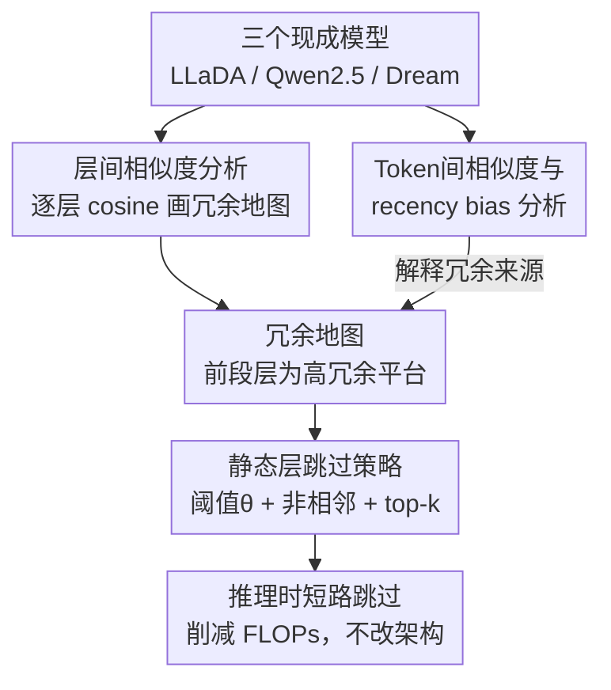

# Skip to the Good Part: Representation Structure & Inference-Time Layer Skipping in Diffusion vs. Autoregressive LLMs

**会议**: ICLR 2026  
**arXiv**: [2603.07475](https://arxiv.org/abs/2603.07475)  
**代码**: 无  
**领域**: 图像复原  
**关键词**: 扩散语言模型, 层跳过, 表征冗余, 推理加速, LLaDA

## 一句话总结
首次系统比较扩散语言模型（dLLM）和自回归模型（AR LLM）的层间表征结构，发现原生 dLLM 具有更强的层级抽象和早期层冗余性，据此提出静态、任务无关的推理时层跳过策略，在 LLaDA 上跳过 6 层（18.75% FLOPs 削减）仍保持 90%+ 性能。

## 研究背景与动机

**领域现状**：自回归（AR）语言模型通过从左到右的 next-token prediction 逐步构建表征，而扩散语言模型（dLLM）如 LLaDA、Dream 等通过全序列去噪训练。近期 dLLM 在推理和代码生成上已接近 AR 模型性能。

**现有痛点**：尽管 dLLM 与 AR 模型在性能上趋近，但两者的内部表征结构差异尚未被系统研究。现有的效率优化工作（如 YOCO）聚焦于 KV-cache 共享等架构级改造，需要修改模型结构。

**核心矛盾**：训练目标（扩散 vs 自回归）是否从根本上重塑了模型的内部表征？如果存在系统性差异，能否直接利用这种差异来加速推理？

**本文目标**：(a) 量化 dLLM 和 AR LLM 在层间和 token 间表征相似性上的差异；(b) 探究 AR 初始化对 dLLM 表征的持久影响；(c) 利用发现的表征冗余实现无需架构修改的推理加速。

**切入角度**：通过逐层 cosine 相似度分析，发现原生 dLLM 早期层表征高度相似（>0.95），意味着这些层的计算是冗余的，可以安全跳过。

**核心 idea**：扩散训练目标诱导出层级化的"粗到细"抽象，早期层建立粗糙表征（高冗余），后期层进行精细化。这种冗余可以直接用于静态层跳过，无需 KV-cache 共享或架构修改。

## 方法详解

### 整体框架

本文不训练新模型，而是把三个现成模型——LLaDA-8B（原生 dLLM）、Qwen2.5-7B（原生 AR）、Dream-7B（在 AR 模型上做扩散微调）——放到同一套表征诊断流程下逐层量化它们的冗余结构。先用层间和 token 间的 cosine 相似度画出每个模型的"冗余地图"，再把地图上相似度最高的那些层在推理时直接短路掉，得到一个静态、任务无关、不改架构的加速策略。

### 关键设计

**1. 层间相似度分析：把"哪些层在做重复劳动"量化出来**

要判断一层值不值得跳，先得知道它和邻层有多像。作者对每个连续层对计算表征的 cosine 相似度 $\text{sim}(\mathbf{h}_\ell, \mathbf{h}_{\ell+1})$，相似度越接近 1 说明这一层几乎没改变表征、计算越冗余。沿深度扫一遍后三个模型呈现出截然不同的形态：LLaDA 在前 60–70% 的层上相似度稳定 >0.95，形成一段"高冗余平台"，只有后段才掉下来开始精细化；Qwen2.5 则全程相似度偏低且分布均匀，没有明显可跳的平台；Dream-7B 虽然经过扩散训练，曲线却和 Qwen2.5 几乎重合。这条曲线既是"训练目标重塑了表征结构"这一核心论点的直接证据，也直接告诉跳层策略该从哪里下手——平台区的层就是冗余候选。

**2. Token 间相似度与 recency bias 分析：解释冗余从何而来**

层间冗余只是表象，作者进一步看每层内 token 之间的表征如何随序列变化，用来区分两种训练目标的抽象方式。AR 模型逐 token 从左到右生成，每个新 token 都会在各层引起一连串表征更新，表现出强烈的 recency bias；dLLM 用全序列去噪训练，对所有位置同时给反馈。测量结果正好对应：LLaDA 几乎没有 recency bias，token 间相似度全局平滑，而 Qwen2.5 和 Dream-7B 都有显著的近因偏置。这解释了为什么 LLaDA 的早期层可以高度冗余——全局反馈让它在浅层就建立起粗糙但稳定的全局表征，后续层只是细化，因此跳掉若干浅层不会破坏整体语义。

**3. 静态层跳过策略：把冗余地图变成推理时的开关**

有了相似度地图，跳层本身只是一次离线挑选（论文中的 Algorithm 1）：先保留所有 $\text{sim}(\mathbf{h}_\ell,\mathbf{h}_{\ell+1}) > \theta$（默认 $\theta=0.95$）的候选层，按相似度从高到低排序取前 $k$ 层跳过，约束是不允许跳过相邻层——一旦连跳，表征的连续传递会断裂，实验中这会让 GSM8K 保持率从 91.8% 掉到 75.3%、Dream 甚至崩到 14.1%。推理时跳过第 $\ell$ 层就是把它的输入 $\mathbf{h}_{\ell-1}$ 直接送进第 $\ell+1$ 层。整个过程不重训、不共享 KV-cache、不动任何模块结构，因此和 KV-cache 类优化天然正交、可以叠加；在 LLaDA 上跳 6 层即削减 18.75% FLOPs 而性能仍保持 88–102%。

## 实验关键数据

### 主实验

| 模型 | 跳过层数 | FLOPs 削减 | GSM8K 保持率 | HumanEval 保持率 | MATH500 保持率 |
|------|---------|-----------|------------|----------------|--------------|
| LLaDA-8B | 0 | 0% | 100% (0.83) | 100% (0.51) | 100% (0.37) |
| LLaDA-8B | 2 | 6.25% | 101.3% | 100% | 108.5% |
| LLaDA-8B | 4 | 12.5% | 102.5% | 92.2% | 89.4% |
| LLaDA-8B | 6 | 18.75% | 91.8% | 88.2% | 102.1% |
| LLaDA-8B | 8 | 25% | 91.8% | 62.7% | 70.2% |
| Qwen2.5-7B | 2 | 7.14% | 34.9% | 64.7% | - |
| Dream-7B | 2 | 7.14% | 76.8% | 66.2% | 81.4% |

### 消融实验

| 配置 | GSM8K 保持率 | HumanEval 保持率 | 说明 |
|------|------------|----------------|------|
| LLaDA 6层 非连续跳过 | 91.8% | 88.2% | 完整方法 |
| LLaDA 6层 允许连续跳过 | 75.3% | 64.7% | 连续跳过导致严重退化 |
| Dream-7B 2层 非连续跳过 | 76.8% | 66.2% | AR初始化限制了可跳过性 |
| Dream-7B 2层 连续跳过 | 14.1% | - | 崩溃 |

### 关键发现
- **原生 dLLM 支持激进跳过**：LLaDA 跳 6 层仍保持 88-102% 性能，而 Qwen2.5 跳 2 层就崩溃（34.9%）
- **AR 初始化偏置持久存在**：Dream-7B 经过扩散训练后，表征模式仍与 Qwen2.5 一致，跳层鲁棒性也类似 AR 模型
- **不允许连续跳过是关键**：连续跳过导致表征连续性断裂，性能严重下降
- **跳过的层集中在网络前 40-60%**：与早期层建立粗糙表征的分析一致
- dLLM 可实现 2.6× 更大 FLOPs 削减 + 1.4× 更高质量保持

## 亮点与洞察
- **训练目标决定表征结构**：这是一个重要的发现——不是架构而是训练目标决定了表征的冗余模式。这意味着可以通过改变训练目标来"设计"所需的表征属性
- **初始化偏置的深度**：Dream-7B 的案例表明，扩散微调不足以覆盖 AR 预训练的表征结构，initialization matters more than fine-tuning objective
- **与 KV-cache 正交**：层跳过减少深度计算，KV-cache 减少 token 冗余计算，两者可乘性组合

## 局限与展望
- 仅测试了 7-8B 规模的模型，更大规模模型的冗余模式可能不同
- 跳过策略是静态的，动态/自适应跳过可能更优
- 未探索 dLLM 专门为层跳过优化训练的可能性（如引入层间正则化）
- benchmarks 有限（GSM8K, MATH500, HumanEval, MBPP）

## 相关工作与启发
- **vs YOCO**：YOCO 需要 cache-once 架构设计，本文方法不需要任何架构修改
- **vs Early Exit**：Early Exit 在 prefill 阶段退出，本文在全序列去噪的每个步骤都跳层
- **vs DiffuCoder (Gong et al., 2025)**：DiffuCoder 从行为层面分析 dLLM 的 AR-ness，本文从表征层面提供了互补的视角

## 评分
- 新颖性: ⭐⭐⭐⭐ 首次系统分析 dLLM vs AR 表征差异，发现有价值但技术贡献偏分析性
- 实验充分度: ⭐⭐⭐⭐ 三个模型家族+四个 benchmark+消融，但规模有限
- 写作质量: ⭐⭐⭐⭐⭐ 结构清晰，可视化出色，故事线流畅
- 价值: ⭐⭐⭐⭐ 对理解 dLLM 内部机制有重要贡献，层跳过方法实用但简单

<!-- RELATED:START -->

## 相关论文

- [\[ICLR 2026\] Beyond Scattered Acceptance: Fast and Coherent Inference for DLMs via Longest Stable Prefixes](beyond_scattered_acceptance_fast_and_coherent_inference_for_dlms_via_longest_sta.md)
- [\[ICML 2025\] TimeDART: A Diffusion Autoregressive Transformer for Self-Supervised Time Series Representation](../../ICML2025/image_restoration/timedart_a_diffusion_autoregressive_transformer_for_self-supervised_time_series_.md)
- [\[ICLR 2026\] Breaking Scale Anchoring: Frequency Representation Learning for Accurate High-Resolution Inference from Low-Resolution Training](breaking_scale_anchoring_frequency_representation_learning_for_accurate_high-res.md)
- [\[ICML 2026\] DyLLM: Efficient Diffusion LLM Inference via Saliency-based Token Selection and Partial Attention](../../ICML2026/image_restoration/dyllm_efficient_diffusion_llm_inference_via_saliency-based_token_selection_and_p.md)
- [\[CVPR 2026\] Time Without Time: Pseudo-Temporal Representation for Space-Time Super-Resolution](../../CVPR2026/image_restoration/time_without_time_pseudo-temporal_representation_for_space-time_super-resolution.md)

<!-- RELATED:END -->
