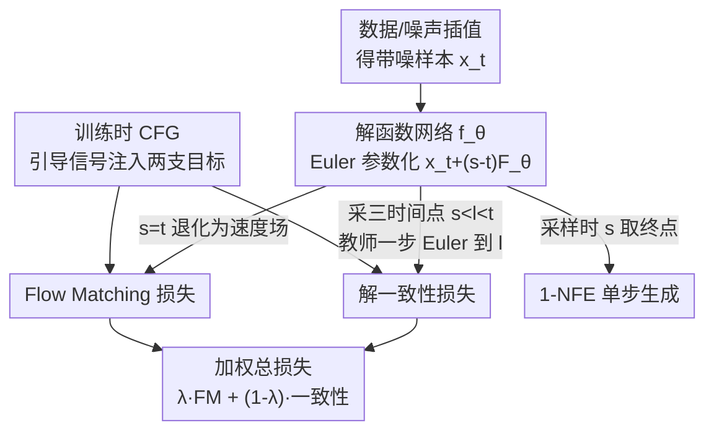

# SoFlow: Solution Flow Models for One-Step Generative Modeling

**会议**: ICLR 2026  
**arXiv**: [2512.15657](https://arxiv.org/abs/2512.15657)  
**代码**: [https://github.com/zlab-princeton/SoFlow](https://github.com/zlab-princeton/SoFlow)  
**领域**: 扩散模型 / 单步生成  
**关键词**: solution function, flow matching, one-step generation, consistency loss, JVP-free

## 一句话总结
提出 Solution Flow Models (SoFlow)，直接学习速度 ODE 的解函数 $f(x_t, t, s)$（将 $t$ 时刻的 $x_t$ 映射到 $s$ 时刻的解），通过 Flow Matching 损失 + 无需 JVP 的解一致性损失从头训练，在 ImageNet 256 上 1-NFE FID 优于 MeanFlow（XL/2: 2.96 vs 3.43）。

## 研究背景与动机

**领域现状**：一致性模型（CM/iCT/ECT/sCT）和 MeanFlow 实现了少步/单步生成，但 MeanFlow 的 Flow Matching 锚定需要昂贵的 JVP 计算（PyTorch 中优化不足），一致性模型从头训练难以利用 CFG。

**现有痛点**：(a) JVP 在深度学习框架中效率低（非前向/反向传播）；(b) 一致性训练目标不稳定（stop-gradient 伪目标漂移）；(c) 从头训练的单步模型不支持训练时 CFG。

**核心矛盾**：要学会"一步跳到终点"，现有方法要么需要 JVP（慢），要么目标不稳定（差）。

**本文目标** 设计一个无需 JVP、支持训练时 CFG、能从头训练的单步生成框架。

**切入角度**：与其学速度场然后积分（Flow Matching），不如直接学 ODE 的解函数 $f(x_t, t, s)$。解函数天然满足两个性质：(1) 初始条件 $f(x_t, t, t) = x_t$ (2) 解的 ODE 一致性。第二个性质可以用不需要 JVP 的一致性损失来近似。

**核心 idea**：学 ODE 的解函数而非速度场，用三个时间点 $(s, l, t)$ 的一致性替代 JVP 来保证 ODE 一致性。

## 方法详解

### 整体框架

SoFlow 要解决的是"一步从噪声直接跳到数据"。传统 Flow Matching 学的是速度场 $v(x_t, t)$，生成时还要把它沿 ODE 积分很多步；SoFlow 换了个视角——直接学 ODE 的**解函数** $f_\theta(x_t, t, s)$，它接收当前带噪样本 $x_t$、当前时间 $t$ 和目标时间 $s$，一次前向就给出 $s$ 时刻的解。采样时只要把 $s$ 设成终点，就是 1-NFE 单步生成，天然绕开了积分过程。训练损失由两块加权而成：$\lambda$ 份 Flow Matching 损失 + $(1-\lambda)$ 份解一致性损失——前者把解函数锚在速度场上、并接入训练时 CFG，后者保证解函数在不同时间点之间自洽。整体上是一张「同一个解函数网络、两支损失、加权汇合」的训练图：

### 关键设计

**1. 解一致性损失：用三时间点替代 JVP 来保证 ODE 一致性**

这一项直接针对 MeanFlow 最重的负担——它的一致性损失要计算速度场对时间的偏导（JVP），而 JVP 在 PyTorch 里既不是前向也不是反向传播，实现效率很低。SoFlow 把一致性改写在解函数上：真正的解满足传递性 $f(x_t, t, s) = f(f(x_t, t, l), l, s)$，也就是先走到中间时刻 $l$ 再走到 $s$，应当和一步直达 $s$ 一致。训练时采样三个时间点 $s < l < t$，最小化

$$\big\|f_\theta(x_t, t, s) - f_{\theta^-}\big(x_t + (\alpha_t' x_0 + \beta_t' x_1)(l-t),\, l,\, s\big)\big\|^2$$

其中 $l$ 时刻的中间点由教师模型 $f_{\theta^-}$（stop-gradient）做一步 Euler 得到。整个目标只用到前向传播，彻底甩掉了 JVP。

**2. Flow Matching 损失：让解函数在 $s=t$ 退化成速度场，顺便接上 CFG**

光有一致性还不够——它只约束解函数自洽，却没给出明确的回归目标，容易漂移。关键观察是：解函数在 $s$ 趋近 $t$ 时的行为正好等价于速度场，$\partial_3 f(x_t, t, s)|_{s=t} = v(x_t, t)$。于是用 Euler 形式参数化 $f_\theta(x_t, t, s) = x_t + (s-t) F_\theta(x_t, t, s)$，此时 $F_\theta(x_t, t, t) = v_\theta(x_t, t)$ 就直接是速度场。这样一个网络既能在 $s=t$ 处当速度预测器训练（提供稳定、明确的 FM 目标），又能在 $s \neq t$ 处当解函数用，还顺势把 CFG 的引导速度场接进了训练。

**3. 训练时 CFG：把引导信号提前注入，绕开单步推理没法做 CFG 的死结**

CFG 通常在推理时对中间状态反复施加引导，但 1-NFE 单步生成根本没有中间状态可施加，所以引导必须在训练阶段就学进网络。SoFlow 的做法是：FM 损失部分回归引导后的速度目标 $w(\alpha_t' x_0 + \beta_t' x_1) + (1-w) v_{\text{uncond}}$，让网络直接学会带引导的速度；一致性损失则用模型自己预测的 guided velocity 替代原本高方差的目标，避免引导信号让一致性训练抖动。消融里 CFG 把 B/4 的 FID 从 44.64 拉到 14.92，说明这一步是单步生成质量的命门。

### 损失函数 / 训练策略
- DiT 架构（B/4, L/2, XL/2），latent space (SD-VAE)
- $\lambda$ = Flow Matching 比例，~80% FM + 20% 一致性
- 时间采样：logit-normal 分布
- 自适应 Huber 损失（$p=0.5$ 或 $1$），鲁棒于大误差样本

## 实验关键数据

### 主实验（ImageNet 256×256, 1-NFE）

| 模型大小 | MeanFlow FID | **SoFlow FID** | 提升 |
|---------|-------------|--------------|------|
| B/2 | 6.17 | **4.85** | -1.32 |
| M/2 | 5.01 | **3.73** | -1.28 |
| L/2 | 3.84 | **3.20** | -0.64 |
| XL/2 | 3.43 | **2.96** | -0.47 |

### 消融实验

| 配置 | FID (B/4) |
|------|----------|
| 100% 一致性, 0% FM | 53.78 |
| 20% FM + 80% 一致性 | 47.65 |
| 80% FM + 20% 一致性 | **44.64** |
| MSE ($p=0$) | 62.93 |
| Huber ($p=0.5$) | **44.64** |
| 无 CFG | 44.64 |
| 有 CFG (w=1.0) | **14.92** |

### 关键发现
- SoFlow 在所有模型大小上都优于 MeanFlow（相同架构、相同训练步数）
- FM 损失占比 80% 最优——过多一致性损失反而有害（需要 FM 提供稳定的速度场引导）
- Huber 损失远优于 MSE（62.93→44.64），对大误差样本的鲁棒性至关重要
- 训练时 CFG 效果显著（44.64→14.92），是单步生成质量的关键

## 亮点与洞察
- **无 JVP** 是最大实用优势——MeanFlow 需要 JVP 但 PyTorch 的 JVP 实现效率低（比反向传播慢 2-4×）。SoFlow 只需前向传播，工程实现更简单。
- **解函数 vs 速度场** 的视角转换很有启发——学"答案"（解函数）而非"方向"（速度场），自然避开了积分过程。
- **训练时 CFG** 解决了单步模型无法在推理时做 CFG 的根本问题——1 步没有中间状态可以施加引导。

## 局限与展望
- XL/2 的 FID 2.96 仍不如多步 SiT/DiT（~2.0 with 250 步），单步质量上限还有提升空间
- 仅在 ImageNet 256 上验证，缺少 512/1024、T2I 等验证
- 解函数需要额外的 $s$ 输入（通过 $s-t$ 的 positional embedding），增加了模型设计复杂性
- 与 sCT、IMM 等最新一致性方法缺少直接对比

## 相关工作与启发
- **vs MeanFlow**: 核心区别是无 JVP + 解函数参数化。所有模型大小上 SoFlow 都更优（-0.47~-1.32 FID）。
- **vs Consistency Models (iCT/sCT)**: 类似的一致性思想，但 SoFlow 的解函数一致性更通用（支持任意 $(t,s)$ 对），且天然支持训练时 CFG。
- **vs Shortcut/IMM**: 都是学任意时间对的映射，但理论出发点不同——SoFlow 从 ODE 解函数的数学性质出发。

## 评分
- 新颖性: ⭐⭐⭐⭐ 解函数学习+无 JVP 一致性损失有新意，但思路不算颠覆性
- 实验充分度: ⭐⭐⭐⭐ 全面的消融 + 多模型大小比较，但缺少高分辨率和 T2I
- 写作质量: ⭐⭐⭐⭐⭐ 数学推导清晰，动机和方法关系紧凑
- 价值: ⭐⭐⭐⭐ 在单步生成方向上实质性推进，无 JVP 的工程价值大

<!-- RELATED:START -->

## 相关论文

- [\[CVPR 2026\] ExpoCM: Exposure-Aware One-Step Generative Single-Image HDR Reconstruction](../../CVPR2026/image_restoration/expocm_exposure-aware_one-step_generative_single-image_hdr_reconstruction.md)
- [\[CVPR 2026\] GDPO-SR: Group Direct Preference Optimization for One-Step Generative Image Super-Resolution](../../CVPR2026/image_restoration/gdpo-sr_group_direct_preference_optimization_for_one-step_generative_image_super.md)
- [\[CVPR 2026\] F²HDR: Two-Stage HDR Video Reconstruction via Flow Adapter and Physical Motion Modeling](../../CVPR2026/image_restoration/f2hdr_two-stage_hdr_video_reconstruction_via_flow_adapter_and_physical_motion_mo.md)
- [\[CVPR 2026\] One-Shot Flow, Any-Time Frame: A Bidirectional Warping Framework for Event-Based Video Frame Interpolation](../../CVPR2026/image_restoration/one-shot_flow_any-time_frame_a_bidirectional_warping_framework_for_event-based_v.md)
- [\[ICLR 2026\] Activation Steering for Masked Diffusion Language Models](activation_steering_for_masked_diffusion_language_models.md)

<!-- RELATED:END -->
