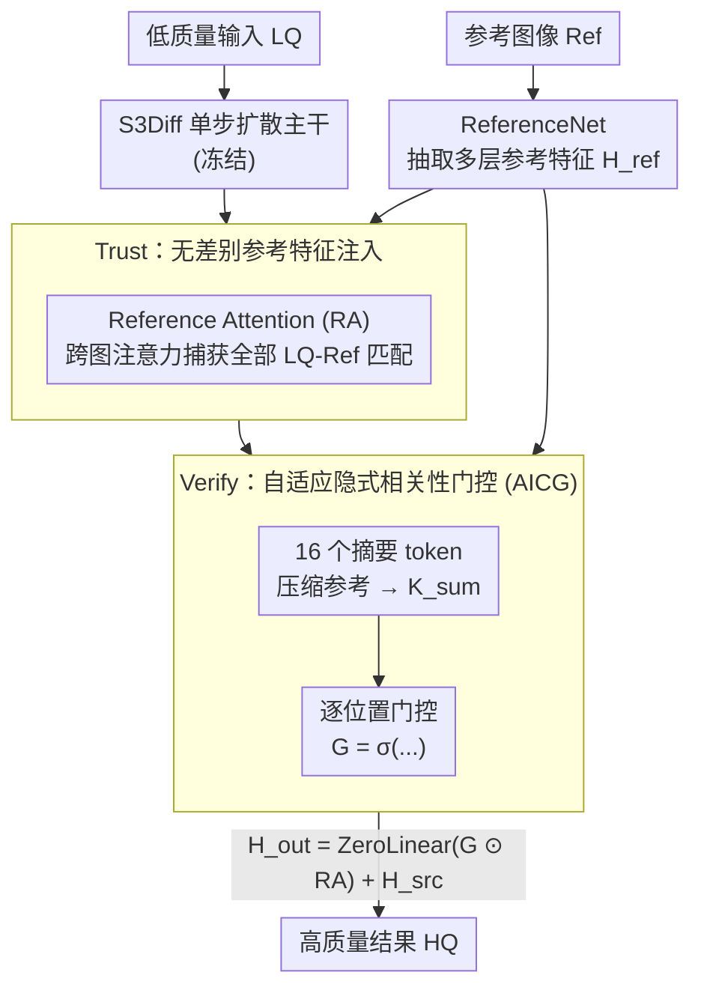

# Trust but Verify: Adaptive Conditioning for Reference-Based Diffusion Super-Resolution

**会议**: ICLR 2026  
**arXiv**: [2602.01864](https://arxiv.org/abs/2602.01864)  
**代码**: [https://github.com/vivoCameraResearch/AdaRefSR](https://github.com/vivoCameraResearch/AdaRefSR)  
**领域**: Image Restoration  
**关键词**: Reference-based Super-Resolution, diffusion model, Adaptive Gating, Implicit Correlation, Single-step Diffusion

## 一句话总结

提出 Ada-RefSR，一个基于"Trust but Verify"原则的单步参考引导扩散超分辨率框架，通过自适应隐式相关性门控（AICG）机制在利用可靠参考信息的同时抑制错误融合，仅增加 0.13% 计算开销。

## 研究背景与动机

基于扩散模型的单图超分辨率（SISR）方法（如 StableSR、DiffBIR、SeeSR）虽然能利用生成先验产生视觉上令人满意的结果，但普遍存在**幻觉问题**——捏造或遗漏细节。参考引导超分辨率（RefSR）通过引入外部参考图像来提供补充的高频细节，缓解幻觉。

核心挑战在于：真实世界退化使得低质量（LQ）输入与参考（Ref）图像之间的对应关系不可靠。现有方法在调控参考使用方面存在严重缺陷：

**PFStorer（全局可学习向量）**：使用全局权重统一控制参考分支，无法适应不同对齐质量的输入对——对齐质量好和坏的图像对使用相同的门控值

**ReFIR（显式token相似性）**：基于显式相关性的空间门控容易被噪声干扰，且存在长尾分布问题（多数相同token主导计算，少数关键token被忽略）

**两面问题**：
   - **过度依赖参考**：错误注入参考线索，导致语义不一致（如鸟眼被复制到非眼区域）
   - **参考利用不足**：有价值的参考信息未被充分利用

## 方法详解

### 整体框架

Ada-RefSR 以 S3Diff 单步扩散 SR 为骨干，冻结其余组件、只训练新插入的参考注意力模块，把整个参考利用过程拆成"先信任、后验证"两步：Trust 阶段用 Reference Attention（RA）不加筛选地把参考特征注入主干，最大化潜在匹配的捕获率；Verify 阶段用自适应隐式相关性门控（AICG）逐空间位置地估计参考可信度，把错误融合的部分压下去。两步串联，既不漏掉有用参考，又不会被错误对应污染。

### 关键设计

**1. Trust：无差别参考特征注入，确保不漏匹配**

真实退化下 LQ 与 Ref 的对应关系本来就不稳，如果在注入前就用某种相似度阈值过滤，很容易把那些"看起来弱、实则有用"的匹配提前砍掉。Ada-RefSR 反其道而行：先信任所有参考。它用一个 ReferenceNet（SD-Turbo 初始化、固定 timestep=1）抽取多层次参考特征 $\mathbf{H}_{ref}$，再在主干每个注意力层插入 RA 模块做跨图注意力——查询来自主干 $\mathbf{Q}=\mathbf{H}_{src}\mathbf{W}_Q$，键值来自参考 $\mathbf{K}=\mathbf{H}_{ref}\mathbf{W}_K$、$\mathbf{V}=\mathbf{H}_{ref}\mathbf{W}_V$，输出 $\mathbf{H}_{out}=\text{ZeroLinear}(\text{Softmax}(\tfrac{\mathbf{QK}^\top}{\sqrt{d}})\mathbf{V})+\mathbf{H}_{src}$。RA 的投影权重直接从骨干自注意力复制初始化，外加 ZeroLinear 让残差支路从零起步，避免训练早期参考特征冲垮已收敛的主干。这一步刻意不做任何筛选，确保所有潜在的 LQ-Ref 匹配都被捕获——代价是无差别融合会带来局部语义不一致（比如把鸟眼复制到非眼区域），这正是下一步要修的。

**2. Verify：自适应隐式相关性门控（AICG），逐位置抑制错误融合**

要修上一步的副作用，最直接的想法是像 ReFIR 那样算一个显式的 $L_{src}\times L_{ref}$ token-to-token 相似性矩阵来当门控，但它计算量大（+16% 开销）又对噪声敏感，且多数雷同 token 会主导计算、淹没少数关键 token。AICG 换成隐式估计：先用一组可学习的摘要 token $\mathbf{T}_S\in\mathbb{R}^{M\times d}$（$M=16$）把整张参考压缩成紧凑表示，$\mathbf{S}=\mathbf{T}_S\mathbf{W}_K$，$\mathbf{K}_{sum}=\text{Softmax}(\tfrac{\mathbf{SK}^\top}{\sqrt{d}})\mathbf{K}\in\mathbb{R}^{M\times d}$；再让主干查询与这 16 个摘要 token 算注意力得到分布图 $\mathbf{S}_{map}=\text{Softmax}(\tfrac{\mathbf{Q}\mathbf{K}_{sum}^\top}{\sqrt{d}})\in\mathbb{R}^{L_q\times M}$，逐位置沿摘要维度取均值并过 sigmoid，得到每个空间位置一个门控值 $\mathbf{G}=\sigma(\tfrac{1}{M}\sum_{j=1}^{M}[\mathbf{S}_{map}]_{:,j})\in\mathbb{R}^{L_q\times 1}$。最后用它逐位置调制 RA 的输出：$\mathbf{H}_{out}=\text{ZeroLinear}(\mathbf{G}\odot\text{RA}(\mathbf{H}_{src},\mathbf{H}_{ref}))+\mathbf{H}_{src}$。某个位置若与参考整体高度相关，门控接近 1、参考被放行；若相关性弱，门控压低、错误融合被截断。因为 $\mathbf{Q}$、$\mathbf{K}$ 都复用 RA 内已有的投影和中间变量，把 16 个摘要 token 一摊到全图，AICG 的额外开销仅 +0.13%，远低于 ReFIR 的 +16%，却避开了显式相似性的噪声和长尾问题。

### 损失函数 / 训练策略

训练目标是重建、感知、对抗三项加权和：

$$\mathcal{L}_{total} = \lambda_1 \mathcal{L}_{rec} + \lambda_2 \mathcal{L}_{per} + \lambda_3 \mathcal{L}_{adv}$$

其中 $\mathcal{L}_{rec}$ 是 L2 重建损失、$\mathcal{L}_{per}$ 是 VGG 感知损失、$\mathcal{L}_{adv}$ 是标准 GAN 对抗损失。模型在 2 块 A40 GPU 上用 Adam 训练，学习率 5e-5、batch size 16、共 11K 迭代。为强化对不可靠参考的鲁棒性，训练时把 20% 的 HQ-Ref 对随机替换成不相关样本，逼 AICG 学会在参考无用时主动把门控压低。

## 实验关键数据

### 主实验（Table 1）

**WRSR 数据集**（场景参考SR）：

| 方法 | PSNR↑ | SSIM↑ | LPIPS↓ | FID↓ |
|------|-------|-------|--------|------|
| S3Diff | 21.91 | 0.562 | 0.354 | 63.82 |
| SeeSR+ReFIR | 21.83 | 0.567 | 0.344 | 61.96 |
| SUPIR+ReFIR | 21.01 | 0.538 | 0.395 | 76.50 |
| **Ours** | **21.97** | **0.578** | **0.306** | **53.28** |

**Bird 数据集**（检索增强SR）：

| 方法 | PSNR↑ | LPIPS↓ | FID↓ |
|------|-------|--------|------|
| S3Diff | 24.84 | 0.290 | 60.95 |
| SeeSR+ReFIR | 23.72 | 0.295 | 52.40 |
| **Ours** | **25.30** | **0.254** | **36.42** |

**Face 数据集**（人脸参考SR）：

| 方法 | PSNR↑ | LPIPS↓ | FID↓ |
|------|-------|--------|------|
| DMDNet | 26.90 | 0.232 | 56.63 |
| InstantRestore | 26.22 | 0.207 | 51.23 |
| **Ours** | **27.13** | **0.175** | **42.70** |

### 消融实验（Table 2 - WRSR & Face 数据集）

| 门控方案 | WRSR PSNR | WRSR SSIM | Face PSNR | Face SSIM |
|---------|-----------|-----------|-----------|-----------|
| Vanilla (无门控) | 21.95 | 0.574 | 27.08 | 0.750 |
| Global (PFStorer) | 21.63 | 0.561 | 27.06 | 0.750 |
| ReFIR | 21.78 | 0.567 | 26.94 | 0.747 |
| **AICG (本文)** | **21.97** | **0.578** | **27.13** | **0.752** |

### 效率对比（Table 3 - 1024×1024）

| 方法 | 显存(GB) | 推理时间(s) |
|------|---------|-----------|
| S3Diff | 7.18 | 0.74 |
| Ada-RefSR | 15.54 | 1.35 |
| SeeSR+ReFIR | 18.95 | **40.23** |

- **Ada-RefSR 比 SeeSR+ReFIR 快约 30 倍**

### 关键发现

1. **AICG 在所有数据集上一致优于其他门控方案**：验证了隐式相关性建模的有效性
2. **鲁棒性优势**：当 LQ-Ref 对齐比率 <0.7 时，SUPIR+ReFIR 低于其 baseline，而本文方法始终超越 baseline
3. **摘要 token 的可解释性**：不同token捕获不同语义区域（人体部位、天空、草地、鸟类特征等）
4. **16个摘要token是最佳选择**：8和32个token均不如16个

## 亮点与洞察

- **"Trust but Verify"设计哲学**：先信任（最大化参考利用），再验证（抑制错误融合），逻辑清晰
- **极致轻量**：AICG 仅增加 0.13% 计算开销（vs ReFIR 的 16%），通过复用现有投影实现
- **隐式 vs 显式相关性**：隐式建模通过摘要token避免了显式token-to-token相似性的噪声敏感问题
- **可学习摘要token的语义聚类**：自组织形成语义有意义的聚类中心
- **30倍加速**：单步扩散设计使推理速度远超多步方法

## 局限与展望

1. 模型参数量约为 S3Diff 的两倍（2679M vs 1327M），来自 ReferenceNet
2. 对极端不相关参考的处理仍有提升空间
3. 当前仅使用单张参考图，多参考扩展有待探索
4. Patch 级别的参考引导可能带来更精细的控制
5. 更轻量的参考注入策略（如token剪枝、稀疏注意力）有待探索

## 相关工作与启发

- **S3Diff**：作为SR骨干的单步扩散模型
- **ReFIR**：当前SOTA的检索增强RefSR，但显式相关门控有局限
- **IP-Adapter / ControlNet**：其他参考注入范式，但在RefSR场景中不够精细
- **DETR 的可学习query**：AICG的摘要token灵感来源，但功能完全不同
- **启发**：隐式相关性建模的思路可推广到其他需要条件控制的生成任务（如视频编辑、换装等）

## 评分

- 新颖性: ⭐⭐⭐⭐ （AICG门控机制设计新颖，Trust-but-Verify范式清晰）
- 实验充分度: ⭐⭐⭐⭐⭐ （4个数据集，多维度消融，效率分析，鲁棒性测试，复杂度推导）
- 写作质量: ⭐⭐⭐⭐⭐ （逻辑清晰，图表精美，公式推导完整）
- 价值: ⭐⭐⭐⭐ （RefSR领域的实用进展，30倍加速有实际意义）

<!-- RELATED:START -->

## 相关论文

- [\[CVPR 2026\] ZeroIDIR: Zero-Reference Illumination Degradation Image Restoration with Perturbed Consistency Diffusion Models](../../CVPR2026/image_restoration/zeroidir_zero-reference_illumination_degradation_image_restoration_with_perturbe.md)
- [\[CVPR 2026\] TUDSR: Twice Upsampling-Diffusion for Higher Super-Resolution](../../CVPR2026/image_restoration/tudsr_twice_upsampling-diffusion_for_higher_super-resolution.md)
- [\[CVPR 2026\] Disentangled Textual Priors for Diffusion-based Image Super-Resolution](../../CVPR2026/image_restoration/disentangled_textual_priors_for_diffusion-based_image_super-resolution.md)
- [\[CVPR 2026\] Rethinking Diffusion Model-Based Video Super-Resolution: Leveraging Dense Guidance from Aligned Features](../../CVPR2026/image_restoration/rethinking_diffusion_model-based_video_super-resolution_leveraging_dense_guidanc.md)
- [\[CVPR 2026\] CanonCGT: Reference-Based Color Grading via Canonical Pivot Representation](../../CVPR2026/image_restoration/canoncgt_reference-based_color_grading_via_canonical_pivot_representation.md)

<!-- RELATED:END -->
