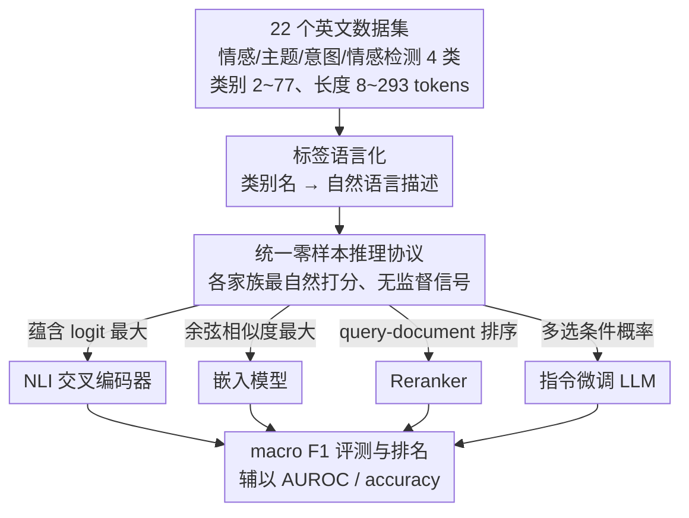

# BTZSC: A Benchmark for Zero-Shot Text Classification Across Cross-Encoders, Embedding Models, Rerankers and LLMs

**会议**: ICLR2026  
**arXiv**: [2603.11991](https://arxiv.org/abs/2603.11991)  
**代码**: [GitHub](https://github.com/IliasAarab/btzsc)  
**领域**: 信息检索  
**关键词**: zero-shot classification, benchmark, reranker, embedding model, NLI

## 一句话总结
提出 BTZSC 基准（22 个数据集），首次在统一零样本协议下系统比较 NLI 交叉编码器、嵌入模型、Reranker 和指令微调 LLM 四大模型家族（共 38 个模型），发现 Qwen3-Reranker-8B 以 macro F1=0.72 取得新 SOTA，嵌入模型在精度-延迟权衡上最优。

## 研究背景与动机

**领域现状**：零样本文本分类（ZSC）通过将文本与人类可读的标签描述直接匹配，免去昂贵标注。早期主流方法是将分类问题转化为自然语言推理（NLI）任务，使用交叉编码器（Cross-Encoder）来判断文本-标签之间的蕴含关系。

**现有痛点**：近年来嵌入模型（Embedding Models）、Reranker 和指令微调 LLM 快速发展，但目前缺乏一个在统一零样本协议下公平对比这四类模型的基准。MTEB 基准虽然覆盖面广，但其分类评估使用了有监督的线性探针（linear probe），并非真正零样本。

**核心矛盾**：已有评测要么只覆盖单一模型家族，要么混入了有监督信号，导致无法准确衡量各模型在真正零样本条件下的能力差距和适用场景。

**本文目标**：构建一个覆盖多任务类型、多领域、多标签规模的标准化零样本文本分类基准，系统对比四大模型家族的性能、扩展特性和效率。

**切入角度**：选取 22 个公开数据集覆盖情感、主题、意图、情感检测四大类，使用统一的 label verbalization 和推理协议，确保所有模型在相同条件下评估。

**核心 idea**：构建首个统一评测 NLI 交叉编码器、嵌入模型、Reranker 与 LLM 的零样本文本分类基准 BTZSC。

## 方法详解

### 整体框架
BTZSC 是一套评测基准而非模型方法，它要回答的问题是：在**真正的零样本**条件下（不碰任何标注数据），NLI 交叉编码器、嵌入模型、Reranker、指令微调 LLM 这四类机制迥异的模型谁更会做文本分类。整条流水线是这样转的：先挑出 22 个覆盖多任务、多领域、多类别粒度的英文数据集，把每个数据集里干瘪的类别名通过 **label verbalization** 改写成一句自然语言描述；再让四大模型家族各自用最自然的方式给「文本-标签」打分——但都被锁死在零样本协议里；最后统一用 macro F1 对全部 38 个模型评测排名，并辅以 AUROC、accuracy 做侧面验证。

### 关键设计

**1. 多维度数据集设计：用覆盖面避免单一任务/领域带来的评估偏差**

如果基准只挑某一类任务或某一个领域，得出的"谁更强"结论就很难推广。BTZSC 因此从四个维度铺开选数据集：任务多样性（情感、主题、意图、情感检测共 4 类）、类别粒度（从 2 类一直到 77 类不等）、领域多样性（新闻、社交媒体、产品评论、百科、政治等），以及文档长度（短到 8 tokens、长到 293 tokens）。为了佐证这 22 个数据集确实彼此差异够大、不是换皮重复，作者用加权 Jaccard 相似度量化了跨数据集的词汇重叠，确认覆盖面足够分散，结论才具有广泛适用性。

**2. 标签语言化（Label Verbalization）：把干瘪的类别名写成语义丰富的自然语言描述**

直接拿原始标签（如 "positive"）去匹配，信息量太薄，模型很难充分调动语义理解。Label verbalization 把每个类别改写成一句完整描述，例如 Amazon Polarity 的正类被语言化为 "The overall sentiment within the Amazon product review is positive"。这层描述给模型提供了更多上下文锚点，让文本-标签匹配从"对一个词"变成"对一句话"，从而更好地利用各家族的语义表征能力——它也是后面统一推理协议能公平对比四家族的共同输入。

**3. 统一零样本推理协议：让四类机制各异的模型都在最自然又零样本的方式下被公平比较**

四大模型家族的推理机制天差地别，硬套同一个接口会让某些家族吃亏，所以协议为每类模型指定了它最自然的打分方式，同时严格保持零样本（不引入任何有监督信号）：NLI 交叉编码器把每个候选标签当作蕴含假设，取蕴含 logit 最大的标签；嵌入模型计算文本与各标签描述的余弦相似度，取最大值；Reranker 复用信息检索的范式，把文本当 query、把标签描述当 document 做排序；指令微调 LLM 则用多选题 prompt，取条件概率最高的选项。这样既照顾了不同家族的结构特性，又把"是否用了标注数据"这个变量锁死，得分差异才能归因到模型本身的语义理解能力。

**4. 评测指标：用 macro F1 抵消类别不均衡、用 AUROC 隔离阈值干扰**

不同数据集类别数差距悬殊（2~77 类）且分布往往不均衡，若用 accuracy 当主指标，多数类会主导分数、掩盖模型在长尾类别上的真实表现。BTZSC 因此以 macro F1 为主指标，对每个类别等权后再平均，辅以 micro accuracy 做参照。对单独考察 NLI 蕴含能力时，则改用 AUROC——它不依赖某个固定决策阈值，从而绕开阈值选择和概率校准带来的干扰，让"NLI 能力强不强"和"ZSC 分类准不准"这两件事能被分开度量。

## 实验关键数据

### 主实验

| 模型家族 | 代表模型 | 主题 F1 | 情感 F1 | 意图 F1 | 情感检测 F1 | 平均 F1 | 平均 Acc |
|----------|---------|---------|---------|---------|------------|---------|---------|
| Base Encoder | bert-large | 0.34 | 0.38 | 0.15 | 0.08 | 0.30 | 0.40 |
| NLI Cross-Enc | deberta-v3-large-nli-triplet | 0.50 | 0.90 | 0.45 | 0.42 | **0.60** | 0.62 |
| Reranker | Qwen3-Reranker-8B | — | — | — | — | **0.72** | 0.76 |
| Embedding | gte-large-en-v1.5 | — | — | — | — | 0.62 | 0.65 |
| LLM | Mistral-Nemo-12B | — | — | — | — | 0.67 | 0.71 |

### 扩展性与效率分析

| 分析维度 | 关键结论 |
|----------|---------|
| Reranker 扩展 | 随参数增大单调提升，8B 达 0.72 F1 |
| Embedding 扩展 | 到几百M参数后饱和在 0.60-0.62 |
| LLM 扩展 | 3B→8B 区间提升最陡，追平最佳嵌入模型 |
| 精度-延迟权衡 | 嵌入模型占据 Pareto 前沿（高精度+低延迟）|
| NLI→ZSC 迁移性 | NLI 交叉编码器线性正相关；嵌入模型不相关 |

### 关键发现
- Reranker（Qwen3-Reranker-8B）以 macro F1=0.72 刷新 ZSC SOTA，比最佳 NLI 交叉编码器高 +12 F1
- 嵌入模型（gte-large-en-v1.5）在无交叉注意力的情况下达到 0.62 F1，逼近交叉编码器，但推理速度快得多
- NLI 交叉编码器随骨干网络增大性能趋于饱和，deberta-v3 仍是最强骨干
- LLM 在主题分类上特别强（F1 最高 0.69），但情感检测较弱
- 即使小型 Qwen3-Reranker-0.6B 也超过了所有 NLI 交叉编码器
- NLI 能力对嵌入模型并非 ZSC 性能的好预测因子——嵌入空间的结构才是关键

## 亮点与洞察
- **首个四家族统一零样本评测**：填补了 MTEB 在零样本分类方面的空白，发现 Reranker 是被严重低估的 ZSC 模型家族
- **Reranker 的意外崛起**：将信息检索中的 Reranker 重新定位为 ZSC 最优解，这个发现对实际部署有重要指导意义——在要求高精度时用 Reranker，在要求低延迟时用嵌入模型
- **NLI-ZSC 传递性分析**：揭示了 NLI 能力与 ZSC 性能的关系是模型家族依赖的，这意味着不能简单地通过提升 NLI 性能来改善嵌入模型的零样本分类能力
- **可复用设计**：label verbalization 策略和统一评测协议可以直接迁移到多语言或其他分类任务

## 局限与展望
- 仅覆盖英文数据集，多语言零样本分类能力未评估，限制了跨语言场景的适用性
- 部分模型的预训练数据可能包含基准数据集（数据泄漏风险），虽然作者做了检查但无法完全排除
- 缺少更大规模 LLM（>12B）的评测，无法判断 LLM 在更大规模下能否超越 Reranker
- label verbalization 的质量对结果影响较大，但未做 verbalization 敏感性分析
- 仅评估单标签分类，未考虑多标签分类场景

## 相关工作与启发
- **vs MTEB**: MTEB 使用有监督 linear probe 评估分类，非真正零样本；BTZSC 纯零样本，更能反映模型固有语义理解能力
- **vs Yin et al. (2019)**: 最早的 NLI-ZSC 基准仅 3 个数据集、仅交叉编码器；BTZSC 扩展到 22 数据集 × 4 家族
- **vs TTC23**: 仅评测主题分类的 prompt 方法，不含嵌入和 Reranker 模型
- **vs Lepagnol et al. (2024)**: 仅评估 100M-1B 小模型，缺少嵌入和 Reranker 对比
- 对于需要零样本分类的实际应用，本文提供了清晰的模型选择指南：精度优先选 Reranker，延迟优先选嵌入模型

## 评分
- 新颖性: ⭐⭐⭐⭐ 首次统一评测四大家族，但方法本身是基准而非算法创新
- 实验充分度: ⭐⭐⭐⭐⭐ 22 数据集 × 38 模型，含扩展性、效率、NLI 传递性等多角度分析
- 写作质量: ⭐⭐⭐⭐⭐ 结构清晰，结论明确，图表丰富
- 价值: ⭐⭐⭐⭐ 对零样本分类领域的模型选择提供了重要实证依据

<!-- RELATED:START -->

## 相关论文

- [\[ACL 2026\] PL-MTEB: Polish Massive Text Embedding Benchmark](../../ACL2026/information_retrieval/pl-mteb_polish_massive_text_embedding_benchmark.md)
- [\[CVPR 2026\] Explaining CLIP Zero-shot Predictions Through Concepts](../../CVPR2026/information_retrieval/explaining_clip_zero-shot_predictions_through_concepts.md)
- [\[CVPR 2025\] EZSR: Event-based Zero-Shot Recognition](../../CVPR2025/information_retrieval/ezsr_event-based_zero-shot_recognition.md)
- [\[ICML 2026\] BlitzRank: Principled Zero-shot Ranking Agents with Tournament Graphs](../../ICML2026/information_retrieval/blitzrank_principled_zero-shot_ranking_agents_with_tournament_graphs.md)
- [\[ACL 2025\] Semantic Outlier Removal with Embedding Models and LLMs](../../ACL2025/information_retrieval/semantic_outlier_removal_with_embedding_models_and_llms.md)

<!-- RELATED:END -->
