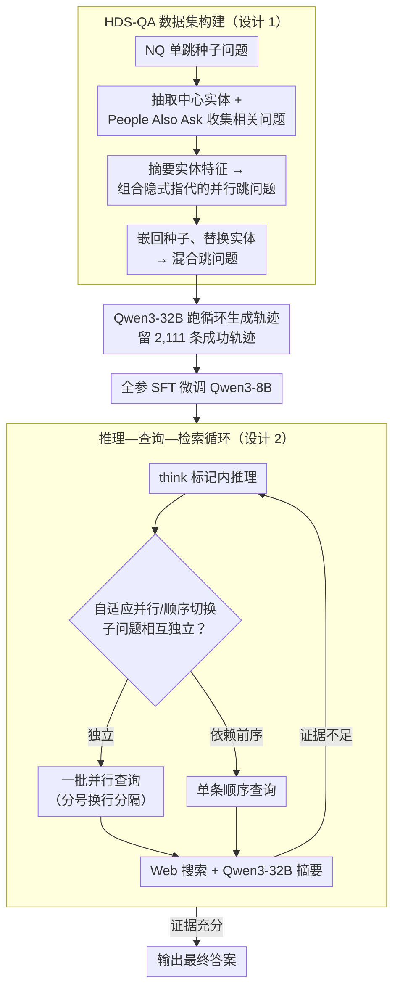

# Hybrid Deep Searcher: Scalable Parallel and Sequential Search Reasoning

**会议**: ICLR 2026  
**arXiv**: [2508.19113](https://arxiv.org/abs/2508.19113)  
**代码**: 无  
**领域**: 信息检索  
**关键词**: 深度搜索, 并行搜索, 检索增强生成, 大语言推理模型, 测试时搜索扩展

## 一句话总结

提出 HybridDeepSearcher，通过构建 HDS-QA 数据集训练大语言推理模型（LRM）区分可并行化和顺序依赖的搜索查询，在 FanOutQA 上 F1 提升 +15.9、BrowseComp 子集上提升 +11.5，同时显著降低推理延迟并展示出一致的测试时搜索扩展能力。

## 研究背景与动机

大语言推理模型（LRM）如 OpenAI o3、DeepSeek-R1 结合检索增强生成（RAG）形成深度研究 agent，通过"推理—查询—检索"循环完成复杂多步任务。然而现有方法存在关键局限：

**延迟过高**：纯顺序查询逐一检索，每个查询都增加延迟

**工作流不连贯**：顺序搜索导致模型过早尝试回答或重复查询

**可扩展性差**：面对需要跨大量文档进行穷举搜索的问题，逐一查询难以覆盖所有证据

以 John Carpenter 电影问题为例：需要查询每部电影的时长。顺序方法逐一查询，不仅慢且容易遗漏；而**同时查询**所有电影时长则高效且准确得多。

核心问题：**如何让 LRM 在深度研究中同时利用并行和顺序搜索策略？**

## 方法详解

### 整体框架

这篇论文要解决的是：让深度研究 agent 在「推理—查询—检索」循环里，既能把彼此独立的子问题一次性并行查完、又能对有依赖关系的子问题逐步顺序查。整套方案分两步落地。第一步是数据：现有搜索训练数据要么是纯单跳、要么是纯链式多跳，模型从中学不到「哪些子问题可以同时问」，所以作者先自动构造一个专门包含「混合跳」问题的 HDS-QA 数据集——这类问题里既有相互独立、可并行的子问题，也有必须等前一步结果才能问的子问题，再用 Qwen3-32B 在循环里跑出成功轨迹。第二步是训练与推理：用这批轨迹全参微调出 HybridDeepSearcher，让它在循环每一步通过一套带特殊标记的生成格式，自己判断当前该发一批并行查询还是一条顺序查询，直到证据足够才作答。

### 关键设计

**1. HDS-QA 数据集构建：制造既能并行又需顺序的混合跳问题**

要训练出「该并行时并行」的能力，前提是有同时示范两种策略的数据，而现有数据里并行性根本不存在。作者设计了一条四步流水线来人工注入并行性：先从 Natural Questions 的单跳种子问题里抽取中心实体，借 Google「People Also Ask」收集围绕该实体的相关问题，并只保留那些检索到不同文档的查询以保证多样性；再把检索文档摘要成该实体的若干关键特征，用这些特征组合出一个隐式指代该实体（故意不直接点名）的并行跳问题——因为指代的是同一实体，多个特征查询天然可以并行；最后把这个并行跳问题嵌回原始单跳问题、替换掉其中心实体，从而再叠一层顺序依赖，并验证并行与顺序两个阶段都确实需要多步检索才能回答。这样得到 1,987 个混合跳问题。在此基础上用 Qwen3-32B 跑「推理—查询—检索」循环生成答案轨迹，每步允许同时发多个并行查询，每个问题重复推理 4 次并保留全部正确轨迹以丰富策略多样性；最终 773 个问题至少被答对一次（pass@4 = 38.9%），从 7,948 次尝试中收集到 2,111 条成功轨迹（轨迹级成功率约 27%），也侧面说明任务本身确有难度。

**2. 结构化推理—查询—检索循环：用特殊标记把并行与顺序查询写进生成格式**

数据有了，还要给生成过程一套可解析的协议，模型才能在一步里「同时发多条查询」。模型先在 `<think>...</think>` 标记内做推理，再在 `<|begin_search_queries|>...<|end_search_queries|>` 标记内吐出查询；多条并行查询之间用分号加换行分隔，因此一步既可以是单条顺序查询、也可以是一批并行查询，由模型自行决定。每条查询经 Web 搜索 API 执行，返回文档再由外部模型（Qwen3-32B）摘要后喂回上下文，既补上证据又避免长文档把推理上下文撑爆。模型就这样多轮迭代，直到收集到足够证据才跳出循环、生成最终答案——这套标记化协议正是后面「自适应切换」能被显式表达和训练的载体。

**3. 自适应并行/顺序切换：让模型按子问题依赖关系挑策略**

有了混合跳数据和可解析格式，剩下的就是让模型学会在循环每一步做对选择。混合跳数据同时示范了两种情形——彼此独立的子问题（如「这十二部电影各自的时长」）应当并行一次性查完，而依赖前序结果的子问题（如「先找出导演、再查导演的另一部作品」）只能顺序逐步推进。模型通过模仿这些轨迹学会动态判断当前属于哪种，并在推理文本中显式区分「当前正在执行的步骤」与「后续待办的计划」，使搜索流程既高效（独立子问题一轮查完、省去多轮往返）又不至于过早作答或重复查询。

### 损失函数 / 训练策略

基于 Qwen3-8B 全参数微调，用 2,111 条问答轨迹训练 1 个 epoch，学习率 3e-5、batch size 4、梯度累积 32 步。关键一点是不对轨迹中的搜索结果片段计算梯度，只在模型自己生成的推理与查询部分回传损失，避免模型去死记检索内容而丧失泛化。整套训练在 8 块 A100 40GB 上约 30 分钟即可完成，开销远低于 RL 类方法。

## 实验关键数据

### 主实验

| 数据集 | 指标 | HybridDeepSearcher | RAG-R1 (SOTA) | 提升 |
|--------|------|-------------------|---------------|------|
| MuSiQue | F1 | 31.2 | 29.7 | +1.5 |
| FanOutQA | F1 | 44.1 | 28.2 | **+15.9** |
| FRAMES | F1 | 39.1 | 35.8 | +3.3 |
| MedBrowseComp | MBE | 30.4 | 28.2 | +2.2 |
| BrowseComp-50 | F1 | 17.2 | 5.7 | **+11.5** |

AUC（效率-效果权衡）：在所有基准上达到最高值，说明模型在更少搜索轮次内达到更高精度。

### 消融实验 / 搜索能力分析

| 方法 | MuSiQue 覆盖率 | FanOutQA 覆盖率 | FRAMES 覆盖率 |
|------|---------------|----------------|--------------|
| Search-o1 | 33.4% | 38.3% | 44.8% |
| DeepResearcher | 38.8% | 49.9% | 49.0% |
| RAG-R1 | 35.9% | 53.2% | 48.0% |
| **HybridDeepSearcher** | **40.7%** | **61.0%** | **55.8%** |

在 FanOutQA 上证据覆盖率提升最大（+7.8pp），该数据集标注证据链接最多，最需要广泛并行检索。

### 关键发现

1. **测试时搜索扩展**（核心优势）：
    - HybridDeepSearcher 的性能随搜索轮次和API调用增加而**持续提升**
    - RAG-R1 等基线在 2-3 轮后**性能停滞**
    - 在 BrowseComp-50 上尤为明显：其他方法几乎无法受益于更多搜索预算

2. **效率优势**：用更少的搜索轮次达到更高精度
    - 在 FanOutQA 上用约3轮搜索就超越其他方法用5轮以上的结果

3. **非迭代方法的失败**：直接生成和标准 RAG 效果极差（BrowseComp-50 上 F1 为 0.0/1.8），证明这些基准确实需要外部知识和多步推理

4. **Case Study 洞察**：
    - 在 FRAMES 的 John Carpenter 问题上，HybridDeepSearcher 并行查询12部电影的时长并找到正确答案（Starman, 115分钟），而 DeepResearcher 先入为主猜测 The Thing、Search-o1 陷入循环查询

## 亮点与洞察

1. **并行+顺序搜索的统一**：首次系统性地训练 LRM 区分可并行化和顺序依赖的查询，填补了现有工作的空白
2. **数据集构建巧妙**：HDS-QA 的自动构建流水线从 NQ 出发，通过"People Also Ask"引入并行性，设计精巧且可扩展
3. **SFT 优于 RL**：仅用 2,111 条轨迹的监督微调就超越了使用 GRPO 的 RL 方法（如 Search-R1、DeepResearcher），说明高质量的混合搜索示范数据极其重要
4. **搜索扩展性**：该方法是少数展示出一致测试时搜索扩展能力的工作，性能随计算预算增长而不饱和
5. **训练成本极低**：仅需 30 分钟在 8 块 A100 上微调，开销远低于 RL 训练方法

## 局限与展望

1. 仅使用 SFT 训练，未结合偏好优化（DPO/RLHF），可利用 HDS-QA 中的成功和失败轨迹进一步提升
2. 搜索查询摘要依赖外部大模型（Qwen3-32B），增加了系统复杂度和API调用成本
3. HDS-QA 仅基于 Natural Questions 构建，领域覆盖可能有限
4. 未探索多 Agent 协作搜索的可能性
5. BrowseComp-50 仅选取了 o3 能解决的50道题，选择偏差可能影响评估公平性

## 相关工作与启发

- **Search-o1**：基于 prompt 的迭代推理-查询-检索框架，单查询顺序搜索
- **Search-R1 / DeepResearcher**：使用 GRPO 训练增强搜索推理能力，但训练数据缺少并行搜索示范
- **RAG-R1**：多查询基线，性能不错但缺乏搜索扩展性
- **APR**：自适应并行推理，但仅在 Countdown 等玩具任务上验证

本文对 RAG 系统设计的启发：将"何时并行、何时顺序"作为显式训练信号，比单纯增加推理能力更有效。混合搜索策略可能是大规模深度研究 Agent 的关键能力。

## 评分
- 新颖性: ⭐⭐⭐⭐
- 实验充分度: ⭐⭐⭐⭐⭐
- 写作质量: ⭐⭐⭐⭐
- 价值: ⭐⭐⭐⭐⭐

<!-- RELATED:START -->

## 相关论文

- [\[ICLR 2026\] SynthWorlds: Controlled Parallel Worlds for Disentangling Reasoning and Knowledge in Language Models](synthworlds_controlled_parallel_worlds_for_disentangling_reasoning_and_knowledge.md)
- [\[ICLR 2026\] Summaries as Centroids for Interpretable and Scalable Text Clustering](summaries_as_centroids_for_interpretable_and_scalable_text_clustering.md)
- [\[ACL 2026\] Agentic Conversational Search with Contextualized Reasoning via Reinforcement Learning](../../ACL2026/information_retrieval/agentic_conversational_search_with_contextualized_reasoning_via_reinforcement_le.md)
- [\[ACL 2026\] Rerank Before You Reason: Analyzing Reranking Tradeoffs through Effective Token Cost in Deep Search Agents](../../ACL2026/information_retrieval/rerank_before_you_reason_analyzing_reranking_tradeoffs_through_effective_token_c.md)
- [\[ACL 2025\] ARise: Towards Knowledge-Augmented Reasoning via Risk-Adaptive Search](../../ACL2025/information_retrieval/arise_risk_adaptive_search.md)

<!-- RELATED:END -->
