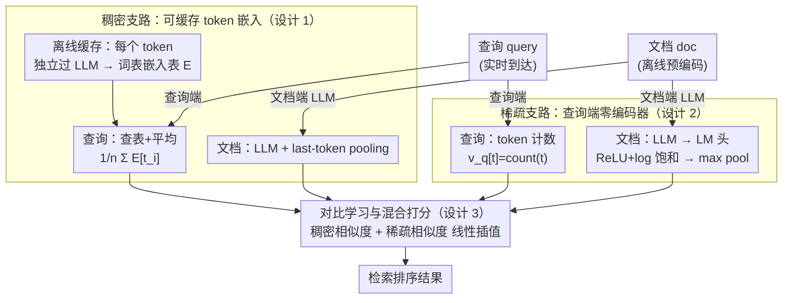

# LightRetriever: A LLM-based Text Retrieval Architecture with Extremely Faster Query Inference

**会议**: ICLR 2026  
**arXiv**: [2505.12260](https://arxiv.org/abs/2505.12260)  
**代码**: [GitHub](https://github.com/caskcsg/lightretriever)  
**领域**: 信息检索  
**关键词**: LLM检索, 不对称编码器, 极速查询推理, 混合检索, 嵌入缓存

## 一句话总结
提出 LightRetriever，一种极端不对称的LLM检索架构：文档端保留完整LLM编码器，查询端完全去除深度建模——稠密检索仅需嵌入查表+平均，稀疏检索仅需token计数——实现查询编码1000倍加速、端到端10倍吞吐提升，同时保持95%的检索性能。

## 研究背景与动机
LLM-based检索器（如E5-Mistral、LLM2Vec）使用对称双编码器架构，文档和查询共享同一LLM编码器。文档可离线预计算，但查询必须在线编码，部署深度LLM作为查询编码器面临：

**吞吐瓶颈**: 全尺寸LLM编码65K查询需要100+秒

**资源消耗**: 需要GPU加速器在线服务

**延迟敏感**: 实时搜索对延迟有严格要求

关键洞察是：文档受益于LLM的完整建模能力（捕获丰富上下文语义），但查询是否真的需要同等深度的建模？BM25基于词法匹配几乎零推理成本但仍有竞争力。这说明查询理解的计算可以大幅简化。

核心idea：打破查询-文档编码器的对称性——查询端完全移除深度模型，训练时让各token独立通过LLM，然后缓存每个token的嵌入，推理时用查表+平均替代整个前向传播。

## 方法详解

### 整体框架
LLM 检索器普遍用「对称双编码器」：查询和文档共享同一个深度 LLM。文档可以离线预编码、建好索引，但查询是实时到达的，必须在线跑一遍 LLM，于是这颗大模型成了在线服务的吞吐瓶颈。LightRetriever 的思路是把这种对称性彻底打破——**文档端保留完整 LLM 做深度建模，查询端则砍到几乎不需要前向传播**，把语义建模的成本整体从查询侧搬到文档侧。

具体落地成两条互补的支路。稠密支路靠「可缓存的 token 嵌入」：训练时让每个 query token 独立过 LLM，从而整张词表的嵌入都能预先算好存成查找表，上线后查询编码退化成查表加平均。稀疏支路更激进，查询端直接用词频当向量、零编码器，把语义负担全压到文档端。两路各自用对比损失训练，推理时把稠密相似度与稀疏相似度线性插值，合成最终的混合检索分数。

### 关键设计

**1. 稠密支路：让 token 嵌入可缓存**

对称双编码器的麻烦在于查询必须在线跑一遍深度 LLM，而 LightRetriever 想把这步换成查表。做法是训练时不让查询整体过编码器，而是把任务指令拼上单个查询 token 独立送进去，用 last token pooling 取出该 token 的向量 $v_{t_i}^{\text{den}} = Enc_q(Inst; t_i)$，查询向量就是各 token 向量的平均 $v_q^{\text{den}} = \frac{1}{n}\sum_i v_{t_i}^{\text{den}}$。因为每个 token 都是独立编码、彼此不交互，整张词表的嵌入就能一次性预计算成查找表 $E \in \mathbb{R}^{V \times H}$——用 Llama-8b 在 8×H800 上离线缓存不到 20 秒。上线后查询编码退化成 $v_q^{\text{den}} = \frac{1}{n}\sum_i E[t_i]$，只是查表加平均，连 GPU 都不必。代价是放弃了查询内部 token 之间的上下文交互，但作者认为查询通常很短，这点损失换来千倍提速是划算的。

**2. 稀疏支路：查询端零编码器**

这一路把简化推到极限——查询向量直接用 token 计数 $v_q^{\text{spr}}[t] = \text{count}(t)$，完全不经过任何模型，本质上就是 BM25 式的词法信号。语义建模全部交给文档端：文档的 LLM 末层隐状态经语言模型头投影回词表空间，再过 ReLU、log 饱和与 max pooling 得到稀疏向量 $v_d^{\text{spr}} = \max\big(\ln(\max(h_{\text{last}} \cdot P, 0) + 1)\big)$，其中 log 饱和压制高频词的权重膨胀，max pooling 把整篇文档聚合成一个词表维度的稀疏表示。训练时再用 FLOPs 正则约束文档向量的非零项数量，控制稀疏度以兼顾检索效率。之所以可行，是因为稀疏检索本就靠词项匹配吃饭，查询侧的深度理解原本贡献就有限，索性省掉。

**3. 对比学习与混合打分**

两条支路都用标准的 listwise 对比损失训练，$\ell^{CL} = -\log \frac{e^{v_q \cdot v_{d^+}/\tau}}{\sum_d e^{v_q \cdot v_d/\tau}}$，把正样本文档从一批 hard negative 中拉近、推开其余。稠密与稀疏分别训练各自的表示，推理时把两路归一化后的相似度线性求和插值，让平滑的语义匹配（稠密）和精确的词项匹配（稀疏）互补，混合分数显著高于任一单路。

### 损失函数 / 训练策略
训练目标是对比损失叠加稀疏支路的 FLOPs 正则（系数 0.001，前 4k 步二次方递增到最大值以减小初期副作用）。数据上用 20 个英文加 3 个中文数据集、共 8.38M 样本；采用 LoRA 微调（$r=16$、$\alpha=32$、dropout 0.1），batch 大小 128、每个查询配 7 个 hard negative，温度 $\tau=0.02$，训练 12k 步。

## 实验关键数据

### 主实验

| 模型 | BeIR(nDCG@10) | CMTEB-R | 编码时间(s) | 总时间(s) | QPS |
|------|--------------|---------|------------|----------|-----|
| Full-Llama8b | 56.8 | 67.6 | 109.49 | 119.37 | 549 |
| Full-Llama3b | 55.6 | 66.1 | 52.59 | 62.42 | 1050 |
| Llama8b首层 | 52.5 | 59.0 | 2.34 | - | - |
| **LightRetriever-Llama8b** | **54.0** | **63.8** | **0.04** | **10.08** | **6500** |
| Static Embedding | 44.9 | 49.1 | 0.04 | - | - |
| BM25 | 42.0 | 53.4 | 0 | - | - |

### 消融实验

| 配置 | BeIR | CMTEB-R | 说明 |
|------|------|---------|------|
| 仅稠密 | ~50 | ~60 | 无稀疏补充 |
| 仅稀疏 | ~42 | ~53 | 类似BM25水平 |
| 混合（默认） | 54.0 | 63.8 | 最佳性价比 |
| 全LLM编码器 | 56.8 | 67.6 | 性能上限 |
| 维度截断 | ~53 | ~62 | 可进一步压缩嵌入大小 |

### 关键发现
- 查询编码从109.5s降到0.04s，**2500倍加速**，端到端QPS提升12倍
- 保持全尺寸LLM 95%的检索性能，远优于仅用首层Llama编码器
- 稀疏+稠密混合显著优于单一模式
- 不同LLM骨干（Llama-1B/3B/8B, Qwen-1.5B/3B/7B）均有效泛化

## 亮点与洞察
- "查询不需要深度建模"的洞察极具启发性，重新审视了双编码器对称性假设
- 缓存整个词表嵌入的思路简洁而有效（一次性操作，<20s）
- 稀疏检索端的零编码器设计将轻量化推到极限
- 将深度语义理解成本从查询端转移到文档端的策略有广泛适用性

## 局限与展望
- token独立编码牺牲了查询内部的上下文交互，对复杂查询可能降质
- 需要为每种指令+模型组合重新缓存嵌入表
- 对长查询的效果退化程度未充分分析
- 稠密向量维度较大（与LLM隐藏维度相同），存储成本仍然可观

## 相关工作与启发
- **vs E5-Mistral**: 性能保持95%，但查询速度快2500倍
- **vs BM25**: 性能高12个nDCG点，且同样几乎零查询推理成本
- **vs Static Embedding**: 性能高9个点，验证LLM训练带来的提升

## 评分
- 新颖性: ⭐⭐⭐⭐⭐ 极端不对称编码器的首次系统性探索，查询端简化到极致
- 实验充分度: ⭐⭐⭐⭐⭐ 6种LLM骨干、23个数据集、速度+质量双维度评测
- 写作质量: ⭐⭐⭐⭐ 清晰直观，图表丰富
- 价值: ⭐⭐⭐⭐⭐ 对实际检索系统部署有巨大价值，千倍加速极具吸引力

<!-- RELATED:START -->

## 相关论文

- [\[ICLR 2026\] RAEE: A Robust Retrieval-Augmented Early Exit Framework for Efficient Inference](raee_a_robust_retrieval-augmented_early_exit_framework_for_efficient_inference.md)
- [\[ACL 2025\] Hypothetical Documents or Knowledge Leakage? Rethinking LLM-based Query Expansion](../../ACL2025/information_retrieval/hypothetical_documents_or_knowledge_leakage_rethinking_llm-based_query_expansion.md)
- [\[ICLR 2026\] Fine-tuning with RAG for Improving LLM Learning of New Skills](fine-tuning_with_rag_for_improving_llm_learning_of_new_skills.md)
- [\[ICLR 2026\] Query-Level Uncertainty in Large Language Models](query-level_uncertainty_in_large_language_models.md)
- [\[ICLR 2026\] Summaries as Centroids for Interpretable and Scalable Text Clustering](summaries_as_centroids_for_interpretable_and_scalable_text_clustering.md)

<!-- RELATED:END -->
