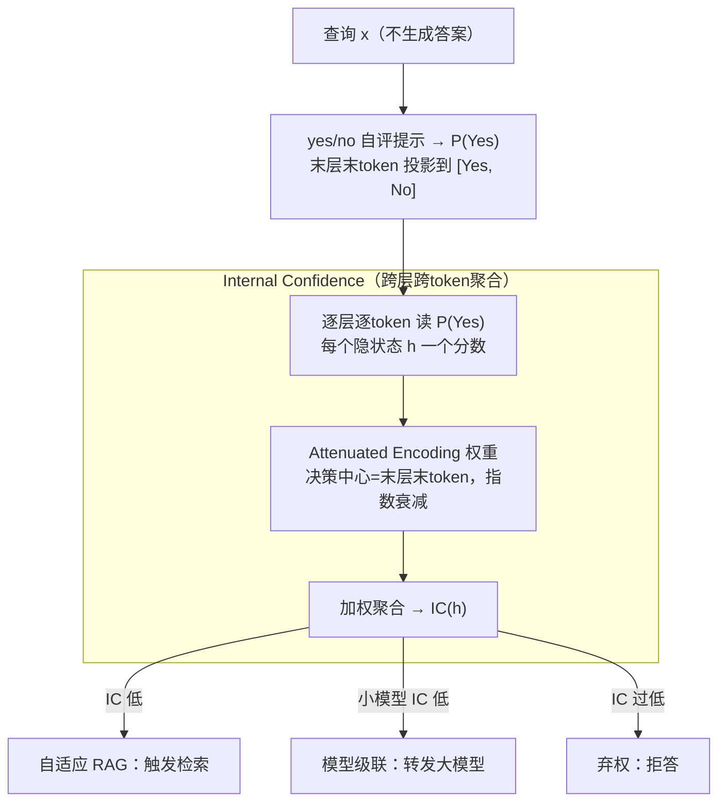

# Query-Level Uncertainty in Large Language Models

**会议**: ICLR2026  
**arXiv**: [2506.09669](https://arxiv.org/abs/2506.09669)  
**代码**: [GitHub](https://github.com/tigerchen52/query_level_uncertainty)  
**领域**: 信息检索  
**关键词**: uncertainty estimation, knowledge boundary, adaptive inference, training-free, internal confidence

## 一句话总结
提出Query-Level Uncertainty概念，通过Internal Confidence方法在生成前（单次前向传播）估计LLM能否回答给定查询，无需训练即可实现高效的自适应推理（RAG触发/模型级联/弃权）。

## 背景与动机
1. LLM存在知识边界，无法准确回答所有问题；知识边界感知对构建可信高效AI系统至关重要
2. 现有不确定性估计多为answer-level（生成后评估），计算开销大（需完整生成答案）
3. 自适应推理（如RAG、慢思考、模型级联）需要pre-generation信号来决定是否触发额外资源
4. 已有query-level方法需训练探针或微调模型（如IDK token、R-Tuning），泛化性受限
5. LLM内部隐藏状态蕴含丰富的知识可达性信息，跨层一致性可提升输出质量

## 方法详解

### 整体框架
方法把"LLM 能否答对这个查询"变成一个**生成前**就能读出的置信度：给模型一句固定的 yes/no 自评提示，但**不让它真的生成答案**，而是从隐藏状态里读出"它觉得自己答得了吗"的概率 $P(\text{Yes})$。原始读法只看最后一层最后一个 token，本文把它扩展到**所有层、所有 token 位置**都算一遍 $P(\text{Yes})$，再用一组随"决策中心"距离衰减的权重加权聚合成 Internal Confidence（IC）。整个过程只需**一次前向传播、完全 training-free**，得到的 IC 直接拿去驱动自适应 RAG、模型级联、弃权三类前置决策。

### 关键设计

**1. yes/no 自评提示 + P(Yes) 读出：把答题前的"自知之明"变成可读信号**

现有不确定性估计大多是 answer-level，要先把答案完整生成出来再评估，开销大、又无法用于"要不要触发检索"这类**生成前**的决策。本文改用一句固定提示让模型自评——"Respond only with 'Yes' or 'No' to indicate whether you are capable of answering the {Query} accurately."——但**并不解码**这个 yes/no，而是直接取最后一层最后 token 的隐状态 $\mathbf{h}_N^{(L)}$，经 unembedding 矩阵投影到 [Yes, No] 两个词上做 softmax，把分给 Yes 的概率作为置信度：

$$P(\text{Yes}) = \text{softmax}\!\left(\mathbf{W}^{\text{unemb}}_{[\text{Yes},\text{No}]}\,\mathbf{h}_N^{(L)}\right)_{\text{Yes}}$$

这相当于一次无需训练的 linear probing：模型对自己知识边界的判断本就线性可分地编码在隐状态里（answerable 与 non-answerable 的查询在隐空间近似线性可分），直接读出即可，省去了生成答案的全部代价，只需一次前向传播。

**2. Internal Confidence：跨层跨 token 加权聚合，用衰减权重免验证集定权**

只看最后一个位置会丢掉中间层里编码的知识信号——$P(\text{Yes})$ 沿层从低到高、沿 token 从左到右普遍升高，单看末端并非最有区分力。本文于是把 $P(\text{Yes})$ 在所有层 $l$、所有 token 位置 $n$ 上都算一遍，加权聚合成 Internal Confidence：

$$\text{IC}(\mathbf{h}) = \sum_{n=1}^{N}\sum_{l=1}^{L} w_n^{(l)}\, P\!\left(\text{Yes}\mid \mathbf{h}_n^{(l)}\right)$$

难点在于权重 $w_n^{(l)}$ 怎么定：若靠验证集挑最优位置就破坏了 training-free。本文用 **Attenuated Encoding** 让权重随到一个"决策中心"的距离指数衰减，$\delta_j^{(i)} = \exp(-\alpha\,|i-j|^2)\,/\,\sum_j \exp(-\alpha\,|i-j|^2)$，其中 $i$ 是中心位置、$\alpha$ 控制局部性（越大越集中在中心附近）。决策中心**固定取最后层最后 token**——AUROC 热力图显示真正最具区分力的点其实在中间（如 Llama-8B 上是 $\mathbf{h}_5^{(27)}$）而非末端，但把中心钉在末端、再吸收邻域信息，近似效果已足够好，从而绕开了为找最优点而引入验证集的麻烦。聚合后 AUROC 从基础 $P(\text{Yes})$ 的 59.6 升到 64.2，且模型越大提升越明显，印证大模型对自身知识边界的感知更强。

**3. 三种自适应推理落地：让前置置信度直接驱动资源分配**

IC 是生成前信号，天然适合在答题前就决定要不要动用额外资源。**自适应 RAG**：IC 低则触发检索、IC 高则直接回答，可在性能几乎不降的情况下减少 50%+ 的 RAG 调用；**模型级联**：小模型 IC 低时把查询转发给大模型，换取成本-质量的更优权衡；**弃权策略**：对 IC 过低的查询直接拒答，以提升可信度。三者共用同一个 IC 阈值开关，把"先验置信度"变成了实打实的算力分配杠杆。

## 实验关键数据

### 主实验（跨模型跨任务）

| 方法 | Phi-3.8B AUROC | Llama-8B AUROC | Qwen-14B AUROC | Avg AUROC |
|------|:--:|:--:|:--:|:--:|
| Max(-log p) | 54.0 | 56.3 | 57.8 | 56.0 |
| Predictive Entropy | 57.9 | 60.1 | 62.4 | 60.1 |
| Semantic Entropy | 55.6 | 59.7 | 60.0 | 58.4 |
| P(Yes) top-right | 57.3 | 60.5 | 60.9 | 59.6 |
| **Internal Confidence** | **60.8** | **64.7** | **67.1** | **64.2** |

### 与Answer-level方法对比（速度）

| 方法 | GSM8K AUROC | 毫秒/样本 |
|------|:--:|:--:|
| IC(本文) | 66.8 | **0.3** |
| Predictive Entropy | 61.0 | 9.8 |
| Min-K Entropy | 60.4 | 3.8 |
| Semantic Entropy | 60.0 | 151.8 |

**关键发现**:
1. IC在3个数据集3个模型上一致优于所有baseline
2. 相比answer-level方法快32×-602×，并且精度更高
3. RAG场景下可在性能几乎不降的情况下减少50%+的RAG调用
4. 模型越大IC效果越显著，因为更大的模型有更好的自我知识边界感知
5. 决策中心附近的层和token信息最有区分力，与AUROC热力图观察一致

## 亮点
- 首次形式化定义query-level uncertainty，将不确定性估计从"后验"推向"先验"
- 完全training-free，单次前向传播，实用性极强
- 跨层跨token的加权聚合策略（Attenuated Encoding）简洁有效
- 在RAG和模型级联中展示了显著的效率-质量权衡优势

## 局限
- 决策中心固定在最后层最后token，非最优（但为保持training-free的权衡）
- 仅在有明确答案的任务（事实QA/数学推理）上验证，开放式生成未涉及
- 贪心解码作为知识边界定义的代理较保守，可能低估模型能力
- 对reasoning-heavy任务（如多步数学推理）的区分能力相对弱于factual QA

## 相关工作
- Answer-level不确定性: Semantic Entropy (Kuhn et al. 2023), P(True) (Kadavath et al. 2022)
- 知识边界检测: IDK token (Cohen et al. 2024), R-Tuning (Zhang et al. 2024a) — 均需训练
- 内部状态探针: Gottesman & Geva 2024训练轻量探针; Semantic Entropy Probes (Kossen et al. 2024)

## 评分
- 新颖性: ⭐⭐⭐⭐ (query-level概念新颖，方法简洁)
- 实验充分度: ⭐⭐⭐⭐ (3模型3数据集，多应用场景)
- 写作质量: ⭐⭐⭐⭐⭐ (问题定义清晰，图示直观)
- 价值: ⭐⭐⭐⭐ (对自适应推理有直接实用价值)

<!-- RELATED:START -->

## 相关论文

- [\[AAAI 2026\] "As Eastern Powers, I Will Veto." : An Investigation of Nation-Level Bias of Large Language Models in International Relations](../../AAAI2026/information_retrieval/as_eastern_powers_i_will_veto_an_investigation_of_nation-level_bias_of_large_lan.md)
- [\[ICLR 2026\] TokMem: One-Token Procedural Memory for Large Language Models](tokmem_one-token_procedural_memory_for_large_language_models.md)
- [\[ACL 2026\] How Large Language Models Balance Internal Knowledge with User and Document Assertions](../../ACL2026/information_retrieval/how_large_language_models_balance_internal_knowledge_with_user_and_document_asse.md)
- [\[ACL 2025\] Investigating the Robustness of Retrieval-Augmented Generation at the Query Level](../../ACL2025/information_retrieval/investigating_the_robustness_of_retrieval-augmented_generation_at_the_query_leve.md)
- [\[ACL 2025\] Enhancing Lexicon-Based Text Embeddings with Large Language Models](../../ACL2025/information_retrieval/enhancing_lexicon-based_text_embeddings_with_large_language_models.md)

<!-- RELATED:END -->
