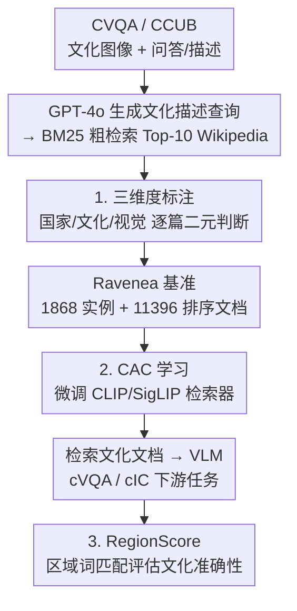

# RAVENEA: A Benchmark for Multimodal Retrieval-Augmented Visual Culture Understanding

**会议**: ICLR 2026  
**arXiv**: [2505.14462](https://arxiv.org/abs/2505.14462)  
**代码**: [https://jiaangli.github.io/ravenea](https://jiaangli.github.io/ravenea)  
**领域**: 信息检索  
**关键词**: 检索增强生成, 文化理解, 多模态基准, 视觉问答, 图像描述

## 一句话总结
构建首个评估多模态检索增强文化理解的基准 Ravenea，包含 1868 个实例和 11396 篇人工排序的 Wikipedia 文档，覆盖 8 个国家 11 个类别，评估 7 个多模态检索器和 17 个 VLM，发现文化感知的 RAG 可在 cVQA 上平均提升 6%、cIC 上提升 11%。

## 研究背景与动机

**领域现状**：VLM 在通用视觉-语言任务上表现优异，但在理解文化细节（如传统服饰的仪式意义、地区特定的符号和习俗）方面能力不足。检索增强生成（RAG）在纯文本设置下已被证明能有效提升文化理解，但多模态 RAG 在文化场景中的应用几乎未被探索。

**现有痛点**：(a) 现有多模态文化数据集主要测试 VLM 记忆的文化知识，而非真实场景中的文化理解能力；(b) 不清楚当前多模态检索器能否可靠地检索文化相关文档；(c) VLM 对不同国家/文化的表现差异巨大，存在明显的文化偏见（偏向西方文化）。

**核心矛盾**：VLM 被越来越多地部署在教育、辅助技术等场景中，但其文化盲区可能导致误解甚至强化文化偏见——缺乏一个系统的基准来评估和改进这一能力。

**本文目标** (a) 构建一个专门评估多模态 RAG 文化理解的基准；(b) 评估现有检索器的文化检索能力；(c) 量化 RAG 对 VLM 文化理解的提升效果。

**切入角度**：从 CVQA 和 CCUB 两个现有文化数据集出发，通过 BM25 初始检索 + 人工重排序标注，为每个图像附加文化相关的 Wikipedia 文档，构建检索增强的评估管线。

**核心 idea**：通过人工标注的文化相关性文档构建多模态 RAG 基准，揭示文化感知检索对 VLM 理解的实质性提升。

## 方法详解

### 整体框架
Ravenea 要回答的问题是：给 VLM 接上"文化相关的外部文档"，到底能不能、以及多大程度上改善它对文化细节的理解。论文把这件事拆成一条"先造基准、再训检索器、最后量化收益"的流水线：先从两个现有文化数据集取图像，用 GPT-4o 生成文化描述当查询、BM25 从 600 万 Wikipedia 文章里粗检索 Top-10，再由人工把这批候选文档逐篇标成"文化相关/不相关"，得到带人工排序文档的 Ravenea 基准。基准建好后，用这些标注微调一个 **文化感知检索器（CAC）**，让它检索出的文档真的文化对口；最后把"检索文档 + VLM"接到 cVQA / cIC 两个下游任务上，并用专门设计的 **RegionScore** 衡量生成结果的文化准确性。三个贡献点——三维度标注、CAC 学习、RegionScore——分别落在"造基准""训检索器""做评估"这三段上。

### 关键设计

**1. 文化相关性三维度标注：把模糊的"文化相关"拆成可验证的二元判断**

直接让标注者判断"这篇文档和这张图文化上相不相关"太主观，歧义大。Ravenea 把它拆成三个独立的二元维度逐一标注：(a) 国家关联性（文档是否属于图像所在国家，True/False/不确定）、(b) 文化内容相关性（是否涉及该图像的文化内涵）、(c) 视觉元素相关性（是否对应图中的可见元素）。三个维度独立评估，每个判断都更明确，既把标注一致性拉到 Cohen's κ = 0.83，也让后续能做更细粒度的分析（例如区分"国家对但文化无关"的文档）。

**2. Culture-Aware Contrastive（CAC）学习：给检索器加显式文化监督信号**

标准对比学习只对齐图文语义，并不知道"哪篇文档文化上更相关"，所以直接拿 CLIP/SigLIP 检索文化文档效果有限。CAC 在 Ravenea 标注数据上微调编码器，用三重损失等权组合：

$$\mathcal{L}_{\text{CAC}} = \frac{1}{3}(\mathcal{L}_{\text{Culture Classify}} + \mathcal{L}_{\text{Rank}} + \mathcal{L}_{\text{Diversity}})$$

其中分类损失用 sigmoid 二元交叉熵直接判断一篇文档是否文化相关，给检索器一个明确的文化标签信号；排序损失用 margin ranking 拉开相关文档与不相关文档的得分；多样性损失则约束正样本的文本嵌入不要彼此坍缩到一起，保持检索结果的覆盖面。三者合起来，让检索器从"语义相似"升级为"文化相关"。

**3. RegionScore 评估指标：用最朴素的区域词匹配衡量文化准确性**

文化理解最大的评估难题是：ROUGE-L、CIDEr、BERTScore、CLIPScore 这些现有指标和人类对文化准确性的判断弱相关、甚至负相关，分数高不代表真的描述对了文化。RegionScore 反其道而行，只做一件极简单的事——检查生成描述里有没有出现目标国家名或对应的形容词/国籍词：

$$R(\mathbf{g}^{(i)}, I_i) = 1 \quad \text{当描述中出现正确的区域词，否则为 } 0$$

正是这种朴素的二元匹配，反而和人类判断对得最齐——Kendall τ 达到 0.442（显著），远高于其他语义指标。这说明现有评估体系在文化维度上有系统性盲区，一个"是否点出了正确地区"的硬约束比复杂语义相似度更能反映文化是否到位。

### 损失函数 / 训练策略

CAC 训练使用 Ravenea 标注数据微调 CLIP/SigLIP 编码器，三个损失等权重组合。标注质量保障：多轮独立标注 + meta checker 验证（98.2% 接受率），标注者经过详细指南训练和模拟测试。

## 实验关键数据

### 主实验

检索性能（7 个检索器）：

| 检索器 | MRR↑ | P@1↑ | nDCG@5↑ |
|--------|------|------|---------|
| CLIP-L/14 (frozen) | 75.44 | 60.87 | 78.09 |
| SigLIP2 (frozen) | 68.62 | 54.66 | 71.44 |
| LLaVA-OV-7B | 58.85 | 37.48 | 60.34 |
| **Ravenea-CLIP (ours)** | **82.17** | **72.05** | **84.09** |
| Ravenea-SigLIP (ours) | 70.95 | 57.14 | 73.92 |

下游任务（17 个 VLM，w/ vs w/o RAG）：
- cVQA 平均提升 +6%
- cIC 平均提升 +11%（RegionScore）
- 轻量模型受益更大

### 消融实验

| 分析维度 | 关键发现 |
|---------|---------|
| 检索器类型 | 对比学习架构（CLIP/SigLIP）天然适合检索，生成式模型（LLaVA, VL-T5）不适合 |
| 文化微调效果 | Ravenea-CLIP P@1 从 60.87→72.05（+11.18），证明文化监督信号的价值 |
| 跨国家差异 | VLM 对不同国家表现差异大，每个模型有不同的"文化偏好" |
| 指标对比 | RegionScore 与人类判断相关性最高（τ=0.442），传统指标甚至负相关 |

### 关键发现
- 微调后的对比检索器（Ravenea-CLIP）在所有指标上达到 SOTA，P@1 提升 11%+
- 文化 RAG 对轻量模型的帮助更大——外部知识更能弥补小模型的知识缺口
- 不同 VLM 表现出不同的"文化偏好"——某些模型对特定国家文化的理解显著优于其他国家
- 传统自动评估指标无法衡量文化准确性，RegionScore 是一个有意义但仍初步的替代方案
- 生成式检索模型（LLaVA-OV-7B）在文化检索上意外地不如判别式模型（CLIP），可能因为其训练目标与检索不对齐

## 亮点与洞察
- **填补空白**：首个系统评估多模态 RAG 文化理解的基准，实验规模大（7 检索器 × 17 VLM × 8 国家 × 2 任务），提供了全面的经验性发现
- **RegionScore 的洞察**：简单的区域词匹配比复杂的语义指标更能反映文化准确性，这一"越简单越有效"的发现揭示了现有评估体系在文化维度上的盲区
- **文化微调的简洁有效**：仅用三个简单的对比学习损失就能将检索性能提升 11%+，说明显式的文化监督信号（而非更大的模型）是关键
- **跨文化差异分析**：揭示了每个 VLM 都有独特的文化偏见模式，这对公平性研究有重要启发——未来需要针对文化偏见的校准方法

## 局限与展望
- 仅覆盖 8 个国家，世界上有 200+ 国家，许多文化（如非洲、中东、太平洋岛屿）未被代表
- Wikipedia 作为唯一外部知识源存在偏差——Wikipedia 本身对不同文化的覆盖程度不均
- RegionScore 仅检查是否提到正确的国家/区域词，无法评估文化细节的准确性（如是否正确描述了仪式的具体含义）
- 仅使用英文文档进行检索，跨语言文化检索未被探索
- 人工标注虽然质量高，但标注者对某些文化可能本身存在理解偏差
- cVQA 使用多选题格式，可能无法反映开放式文化推理能力

## 相关工作与启发
- **vs CVQA (Romero et al., 2025)**: CVQA 仅有问答对，无外部知识；Ravenea 扩展了人工排序的 Wikipedia 文档，支持 RAG 评估
- **vs CCUB (Liu et al., 2023)**: CCUB 聚焦文化描述用于文生图，Ravenea 反转任务方向（图→文），并加入检索增强
- **vs Seo et al. (2025)**: 他们在纯文本设置下研究 RAG 的文化理解，Ravenea 将其扩展到多模态
- **实际应用启发**：在任何涉及文化敏感场景的多模态系统（如文化遗产保护、多文化教育辅助）中，显式的文化检索增强都值得考虑

## 评分
- 新颖性: ⭐⭐⭐⭐ 首个多模态 RAG 文化理解基准，填补重要空白
- 实验充分度: ⭐⭐⭐⭐⭐ 7 检索器 × 17 VLM 的大规模评估，多维度分析
- 写作质量: ⭐⭐⭐⭐ 组织清晰，但数据集构建部分略冗长
- 价值: ⭐⭐⭐⭐ 对 VLM 文化公平性研究有持续价值，但受限于 8 个国家

<!-- RELATED:START -->

## 相关论文

- [\[ACL 2026\] Utility-Oriented Visual Evidence Selection for Multimodal Retrieval-Augmented Generation](../../ACL2026/information_retrieval/utility-oriented_visual_evidence_selection_for_multimodal_retrieval-augmented_ge.md)
- [\[ACL 2025\] VISA: Retrieval Augmented Generation with Visual Source Attribution](../../ACL2025/information_retrieval/visa_retrieval_augmented_generation_with_visual_source_attribution.md)
- [\[CVPR 2025\] DocoPilot: Improving Multimodal Models for Document-Level Understanding](../../CVPR2025/information_retrieval/docopilot_improving_multimodal_models_for_document-level_understanding.md)
- [\[NeurIPS 2025\] Windsock is Dancing: Adaptive Multimodal Retrieval-Augmented Generation](../../NeurIPS2025/information_retrieval/windsock_is_dancing_adaptive_multimodal_retrieval-augmented_generation.md)
- [\[CVPR 2026\] M4-RAG: A Massive-Scale Multilingual Multi-Cultural Multimodal RAG](../../CVPR2026/information_retrieval/m4-rag_a_massive-scale_multilingual_multi-cultural_multimodal_rag.md)

<!-- RELATED:END -->
