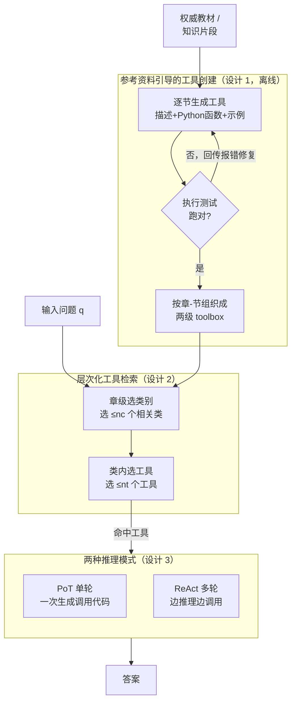

# RefTool: Reference-Guided Tool Creation for Knowledge-Intensive Reasoning

**会议**: ICLR 2026  

**arXiv**: [2505.21413](https://arxiv.org/abs/2505.21413)  
**代码**: 待确认  
**领域**: 信息检索  
**关键词**: tool creation, reference-guided, knowledge-intensive reasoning, executable tools, hierarchical toolbox  

## 一句话总结
提出 RefTool 框架基于外部参考资料（教材、知识片段）自动创建可执行 Python 工具，解决了现有工具创建方法依赖 LLM 内在知识在专业领域失败的问题，在因果推理、物理和化学任务上平均超过已有方法 12.3%。

## 研究背景与动机
**领域现状**：LLM 工具创建（tool creation）让模型在推理时动态生成和调用工具，比预定义工具集更灵活。现有方法（如 CRAFT、TroVE）依赖 LLM 的内在知识生成工具。

**现有痛点**：LLM 的内在知识在专业领域（因果推理、量子物理、有机化学）不可靠，导致生成的工具含有错误的公式或逻辑。

**核心矛盾**：工具创建需要精确的领域知识，而 LLM 在专业领域的知识可能不准确或不完整。

**本文要解决**：如何利用外部权威参考资料（教材）作为知识来源来指导工具创建？

**切入角度**：利用教材的自然章节-小节结构组织工具层次，从每个小节提取可执行的 Python 函数。

**核心idea**：参考资料 → 工具创建 + 层次化 toolbox → 层次化检索 → 推理。

## 方法详解

### 整体框架
RefTool 想解决的是「LLM 在专业领域凭内在知识造工具会写错公式」这个痛点，办法是把权威教材当成知识源、离线编译成一套可执行工具，推理时直接调用。整条流水线分两阶段：先做**工具创建**，逐节读教材、生成带描述和示例的 Python 函数、跑执行测试验证正确性，最后按教材的章-节结构组织成一个两级 toolbox；再做**工具利用**，推理时先按章级类别再按具体工具两步检索，把命中的工具喂给 PoT 单轮或 ReAct 多轮推理去解题。

### 关键设计

**1. 参考资料引导的工具创建：用教材而非 LLM 脑补当知识源**

针对的正是上面那个核心矛盾——工具创建要精确的领域知识，而 LLM 在因果推理、量子物理、有机化学这些专业领域的知识本就不可靠。RefTool 改从教材的每个 section 取材，为每节生成一个工具，工具包含三件套：自然语言描述、可执行 Python 函数、一段使用示例。生成之后并不直接信任，而是跑**执行测试**验证：73% 的工具一次生成就通过测试，再有 14% 经一轮修复后通过，确保入库的都是能跑对的代码。组织上则直接借用教材分章分节的天然结构，搭成「章→节→工具」两级层次，省掉了额外的知识工程——因为教材本身就是人类反复验证过的知识，比 LLM 内在知识可靠得多。

**2. 层次化工具检索：两步收窄搜索空间**

工具入库后数量可观，推理时若平铺去匹配，检索精度会被大量无关工具拖低。RefTool 顺着 toolbox 的两级结构做两步检索：先从章级类别里选出相关类别，再在该类别内部挑具体工具。这样每一步面对的候选都小一截，搜索空间被层层压缩，命中精度随之提高。对于本身没有清晰章节结构的非结构化参考资料，则先由 LLM 自动归纳出类别层次，再走同样的两步检索。

**3. 两种推理模式：PoT 与 ReAct 互补**

拿到工具后怎么用，取决于任务形态。**PoT（Program of Thought）**单轮直接生成一段包含工具调用的代码，一次性算完，效率更高，适合解法路径较确定的题；**ReAct**则多轮交互，边推理边按需检索和调用工具，灵活性更强，适合需要逐步探索的题。两种模式覆盖了从「一步到位」到「走一步看一步」的不同推理需求。

## 实验关键数据

### 主实验

| 任务 | RefTool+PoT (GPT-4o) | TroVE | 领域特定方法 |
|------|---------------------|-------|------------|
| 因果推理 (QRData) | **46.8%** | 36.4% | — |
| 物理 (TheoremQA) | **57.9%** | — | Physics Reasoner |
| 化学 (SciBench) | **66.4%** | — | ChemAgent |

### 消融实验

| 配置 | 效果 |
|------|------|
| 无参考资料（纯 LLM 知识） | 显著下降 |
| 无层次结构（平铺检索） | 检索精度降低 |
| 无执行测试验证 | 错误工具比例增加 |

### 关键发现
- 平均超过工具创建方法 **13.0%**，超过领域特定方法 **10.2%**
- 73% 工具一次生成即通过验证——参考资料质量保证了工具质量
- 层次化检索比平铺检索更有效——利用教材结构降低搜索空间
- RefTool 在因果推理上的提升最大（+10.4%），说明 LLM 内在知识在因果领域最薄弱

## 亮点与洞察
- **将教材直接转化为工具**的思路非常自然——人类学习新领域也是先学教材再应用
- **73% 一次通过验证**说明教材知识到代码的转化比想象中更可靠
- **层次化 toolbox**利用了教材的自然结构——不需要额外的知识工程
- 可推广到任何有结构化参考资料的专业领域

## 局限与展望
- 依赖高质量参考资料的可获取性——若无好教材则无法使用
- 每个 section 仅生成最多 2 个工具，信息密集的章节可能遗漏重要功能
- 工具层次结构固定为两级，复杂知识体系可能需要更灵活的组织
- 未探索工具间的组合和复用（如一个工具调用另一个工具）

## 相关工作与启发
- **vs CRAFT/TroVE**: 依赖 LLM 内在知识，在专业领域不可靠；RefTool 用外部参考弥补
- **vs RAG**: RAG 检索原始文本让 LLM 推理，RefTool 将知识预编译为可执行代码——执行比推理更精确
- **vs chainSTORM/domain-specific agents**: 领域特定方法需要人工设计，RefTool 自动从教材生成
- 可启发"知识编译"范式：将文本知识预编译为可执行程序，减少推理时的认知负担

## 补充讨论

### 工具创建 vs 直接 RAG
工具创建的优势在于“编译”而非“解释”——将知识预编译为可执行代码后，推理时只需调用函数而非重新理解文本。这对需要精确计算的任务（物理公式、统计检验）特别有效，因为 LLM 在计算上不可靠但执行代码是确定的。

### 教材结构的利用

教材的章-节结构是人类知识组织的自然产物，直接作为工具层次使用避免了额外的知识工程。

这种思路可以推广到任何有结构化文档的领域（如 API 文档、法律法规、医学指南），具有很好的通用性。

## 评分
- 新颖性: ⭐⭐⭐⭐ 参考资料→工具的思路自然且有效
- 实验充分度: ⭐⭐⭐⭐ 三个专业领域验证，对比充分
- 写作质量: ⭐⭐⭐⭐ 框架设计清晰
- 价值: ⭐⭐⭐⭐ 为专业领域的工具创建提供了实用范式

<!-- RELATED:START -->

## 相关论文

- [\[ICML 2026\] REAL: Resolving Knowledge Conflicts in Knowledge-Intensive Visual Question Answering via Reasoning-Pivot Alignment](../../ICML2026/information_retrieval/real_resolving_knowledge_conflicts_in_knowledge-intensive_visual_question_answer.md)
- [\[ACL 2026\] A Survey of Reasoning-Intensive Retrieval: Progress and Challenges](../../ACL2026/information_retrieval/a_survey_of_reasoning-intensive_retrieval_progress_and_challenges.md)
- [\[ICLR 2026\] G-reasoner: Foundation Models for Unified Reasoning over Graph-structured Knowledge](g-reasoner_foundation_models_for_unified_reasoning_over_graph-structured_knowled.md)
- [\[ICLR 2026\] SynthWorlds: Controlled Parallel Worlds for Disentangling Reasoning and Knowledge in Language Models](synthworlds_controlled_parallel_worlds_for_disentangling_reasoning_and_knowledge.md)
- [\[ICLR 2026\] Attribution-Guided Decoding](attribution-guided_decoding.md)

<!-- RELATED:END -->
