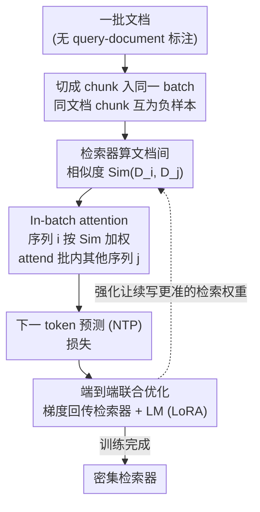

# Revela: Dense Retriever Learning via Language Modeling

**会议**: ICLR2026 Oral  
**arXiv**: [2506.16552](https://arxiv.org/abs/2506.16552)  
**代码**: 待确认  
**领域**: 信息检索  
**关键词**: dense retrieval, self-supervised learning, language modeling, in-batch attention, retriever

## 一句话总结
提出 Revela，通过 in-batch attention 机制将检索器学习融入语言建模——NTP 不仅依赖本序列上下文，还依赖批内其他序列（由检索器相似度加权），无需标注 query-document 对即可训练强大的密集检索器。

## 研究背景与动机

**领域现状**：密集检索器通常需要标注的 query-document 对训练，在专业领域和复杂场景中标注成本高昂。

**现有痛点**：自监督检索方法（如 Contriever）容易过拟合数据结构偏差；自编码方法缺乏成对监督。

**核心矛盾**：LM 通过 NTP 学习 token 间依赖（自监督成功），如何将类似思路扩展到学习 chunk 间依赖？

**切入角度**：将检索类比为"序列级 NTP"——NTP 找最相关的上文 token，检索找最相关的文档。

**核心 idea**：在 Transformer 块中引入 in-batch attention，让 NTP 同时依赖序列内上下文和批内其他序列，检索器提供跨序列权重。

## 方法详解

### 整体框架

Revela 把"训练检索器"重新表述成"做语言建模"：先把一批文档各自切成 chunk 放进同一个 batch，再在 LM 的 Transformer 块里插入一层 in-batch attention，让每个序列在做下一个 token 预测（NTP）时不仅看自己序列内的上文，还能看 batch 里其他序列的表示，而"看多少"由检索器算出的文档间相似度决定。这样一来，最小化 NTP 损失会同时给检索器和 LM 回传梯度：检索器学到"哪些文档对当前续写最有帮助"，全程不需要任何标注的 query-document 对。下面这张图是整条数据流——从一批无标注文档进来，到训练出一个密集检索器出去。

### 关键设计

**1. 同文档 chunk 互为负样本：免费的硬负样本来源**

要做对比式的检索学习，绕不开"从哪儿找难区分的负样本"——传统做法靠人工挖掘硬负样本，昂贵又脆弱。Revela 直接把同一篇文档切出的不同 chunk 放进同一个 batch：它们语义相近、却并非完全可以互相续写，天然构成了"难区分"的对比信号。再配上一个极小的温度 $\tau=10^{-4}$ 把相似度分布拉开，模型被迫学到细粒度的文档间区分。整批负样本完全由 batch 的构造方式产生，不需要额外标注或挖掘，这也是后面 in-batch attention 能学到有用相似度的前提。

**2. In-batch attention：把"跨文档检索"塞进注意力层**

标准 NTP 只能利用本序列上文，无法表达"为续写当前文档，需要参考哪一篇别的文档"这件事。Revela 在 Transformer 里加入一层跨序列注意力：序列 $i$ 的 token 表示除了 attend 自己的上文，还能 attend batch 内其他序列 $j$ 的表示，而这一跨序列注意力的权重由检索器给出的相似度 $\text{Sim}(D_i, D_j)$ 调制——相似度越高，序列 $j$ 对序列 $i$ 续写的贡献越大。于是检索器不再是一个外挂模块，而是直接决定了语言模型预测下一个 token 时往哪些文档"借信息"，NTP 的梯度自然就成了检索器的训练信号。

**3. 端到端联合优化：检索器和 LM 在同一个 NTP 目标下一起更新**

这是 Revela 区别于 REPLUG 一类方法的关键。REPLUG 冻结 LM、用它的困惑度去蒸馏检索器，但 LM 的困惑度本身校准很差，会给检索器错误信号；Revela 让检索器与 LM 共享同一个 NTP 损失、端到端联合训练——某个检索权重一旦让续写更准，对应的相似度就被强化。这把"检索质量"和"语言建模质量"绑成了同一个可微目标，从根上避免了冻结 LM 带来的信号偏差。

### 损失函数 / 训练策略

通用检索在 Wikipedia 上训练，代码检索在 StackOverflow + 文档语料上训练，二者也可混合。检索器和 LM 都用 LoRA（rank=256）微调，学习率 $10^{-4}$，温度 $\tau=10^{-4}$，仅训练 1 个 epoch（Wiki 约 10K 步、~44 小时，代码约 11K 步、~48 小时，4×A100）。推理时 query/document 最长 2048 token，取 `<eos>` token 的嵌入作为文档表示，并分别加 "Query:" / "Passage:" 前缀区分查询与段落。

## 实验关键数据

### 主实验

| 方法 | CoIR (nDCG@10) | BRIGHT | BEIR |
|------|------|--------|------|
| E5-Mistral-7B (监督) | 基线 | 基线 | 基线 |
| **Revela-3B** (无监督) | **+2.8** | **超越商业API** | **无监督SOTA** |

### 关键发现
- 无标注数据超越 7B 参数的监督模型
- 用约 1000× 少的数据和 10× 少的计算达到 BEIR 无监督 SOTA
- 跨域泛化能力强于对比学习方法
- 随 batch size 和模型规模持续提升

## 消融实验与深入分析

| 消融/分析 | 发现 |
|-----------|------|
| Batch size 缩放 | 性能随 batch size 单调提升，更大 batch 提供更多负样本 |
| 检索器规模缩放 | 135M→3B 持续提升，遵循规模缩放律 |
| LM 规模 | 更大的 LM（1B→3B）带来更好的检索器学习信号 |
| 混合域训练 | Wiki+Code 联合训练不损害单域性能，同时提升跨域泛化 |
| vs REPLUG | 在所有规模下 Revela > REPLUG，联合优化优于冻结 LM |
| 跨域泛化 | 在 Wiki 上训练的 Revela 在未见过的 BRIGHT 推理密集任务上超越商业 API |

### CoIR 详细结果（nDCG@10）

| 方法 | 规模 | 平均 nDCG@10 |
|------|------|-------------|
| UniXCoder (监督) | 0.1B | 基线 |
| Revela | 0.1B | +11.1 |
| E5-PT (弱监督, 270M 对) | 0.3B | 基线 |
| Revela | 0.5B | **+9.7** |
| BGE-M3 (监督) | 0.6B | 基线 |
| Revela | 0.5B | **超越** |
| E5-Mistral-7B (监督) | 7B | 基线 |
| **Revela** | **3B** | **+2.8** |

## 亮点与洞察
- **NTP→检索的类比**极为自然且有效——token 间的依赖关系 ↔ 文档间的依赖关系
- **联合优化**的威力：REPLUG 冻结 LM 依赖其困惑度（往往校准差），Revela 联合更新解决了这一根本问题
- **数据效率惊人**：~1000× 少的数据 + 10× 少的计算达到 BEIR 无监督 SOTA——说明方法设计比数据堆叠更重要
- **跨域泛化**：比传统对比学习方法更强，因为 NTP 目标捕获的是更通用的"语义依赖"而非表面共现

## 局限与展望
- batch size 对性能影响大，需要足够大的 batch（16+）——在资源受限时可能成为瓶颈
- in-batch attention 增加了训练时的计算开销——每个序列需要 attend 到 batch 内所有其他序列
- 仅验证了文本和代码检索，图像、音频等多模态检索未探索
- 训练数据的 chunk 划分策略（句子边界、固定长度等）对性能的影响未深入分析
- 对于超长文档（>2048 token），当前的 chunk 方式可能丢失长距离依赖

## 相关工作与启发
- **vs Contriever (Izacard et al.)**：Contriever 用对比学习（同文档=正例，跨文档=负例），Revela 用 NTP 建模跨文档条件概率——后者更精细地捕获了"为什么这两个文档相关"
- **vs Atlas (Izacard et al.)**：Atlas 用 encoder-decoder 架构的 cross-attention 信号训练检索器，需要周期性重索引；Revela 用 decoder-only + in-batch attention，更高效且无需重索引
- **vs REPLUG (Shi et al.)**：REPLUG 冻结 LM 用困惑度蒸馏，Revela 联合训练——实验证明联合训练在所有规模下显著更优
- **vs E5-PT (Wang et al.)**：E5-PT 在 270M 弱监督数据对上训练，Revela 仅用原始文本自监督学习——说明好的目标函数可以替代大量标注数据
- **启发**：in-batch attention 的思路可以推广到任何需要建模"集合内关系"的场景——如多文档摘要、跨模态检索

## 评分
- 新颖性: ⭐⭐⭐⭐⭐ NTP 学检索的范式非常新颖
- 实验充分度: ⭐⭐⭐⭐⭐ 三个基准、多规模、缩放分析
- 写作质量: ⭐⭐⭐⭐ 动机清晰，公式严谨
- 价值: ⭐⭐⭐⭐⭐ 为自监督检索提供了强大的新范式

<!-- RELATED:START -->

## 相关论文

- [\[AAAI 2026\] HiMo-CLIP: Modeling Semantic Hierarchy and Monotonicity in Vision-Language Alignment](../../AAAI2026/information_retrieval/himo-clip_modeling_semantic_hierarchy_and_monotonicity_in_vi.md)
- [\[ACL 2025\] FlashBack: Efficient Retrieval-Augmented Language Modeling for Fast Inference](../../ACL2025/information_retrieval/flashbackefficient_retrieval-augmented_language_modeling_for_long_context_infere.md)
- [\[AAAI 2026\] RRRA: Resampling and Reranking through a Retriever Adapter](../../AAAI2026/information_retrieval/rrra_resampling_and_reranking_through_a_retriever_adapter.md)
- [\[ICML 2026\] Retriever Portfolios: A Principled Approach to Adaptive RAG](../../ICML2026/information_retrieval/retriever_portfolios_a_principled_approach_to_adaptive_rag.md)
- [\[ACL 2026\] Language-Coupled Reinforcement Learning for Multilingual Retrieval-Augmented Generation](../../ACL2026/information_retrieval/language-coupled_reinforcement_learning_for_multilingual_retrieval-augmented_gen.md)

<!-- RELATED:END -->
