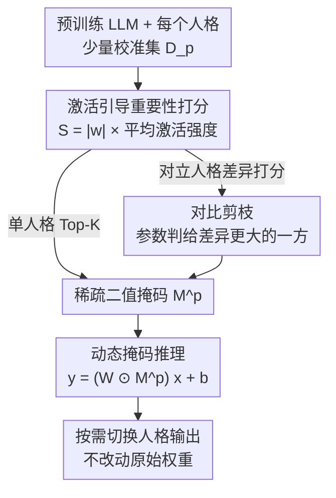

# Your Language Model Secretly Contains Personality Subnetworks

## 基本信息

- **会议**: ICLR 2026
- **arXiv**: [2602.07164](https://arxiv.org/abs/2602.07164)
- **代码**: [GitHub](https://github.com/Ruimeng-Ye/Persona)
- **领域**: 信息检索
- **关键词**: persona subnetwork, network pruning, contrastive pruning, MBTI, activation-guided masking

## 一句话总结

本文提出通过激活引导的剪枝（activation-guided pruning）从预训练 LLM 中提取人格专用子网络，无需任何训练即可实现高效的人格切换，并引入对比剪枝策略增强对立人格间的参数分离。

## 研究背景与动机

- 人类在不同社交场景中自然切换人格，LLM 同样能采用不同角色，但现有方法依赖外部知识注入
- **Prompt 方法**：简单快速，但人格保持不稳定，容易漂移
- **RAG 方法**：需要检索管道，存在干扰问题
- **微调方法**：需要额外训练，成本高（数小时到数天）
- **核心问题**：LLM 是否真的需要外部干预才能展现不同人格？还是这些行为已经嵌入在参数空间中？
- 受 Lottery Ticket Hypothesis 启发，作者假设单个预训练模型中**已包含**多个对应不同人格的"中奖彩票"子网络

## 方法详解

### 整体框架

方法把"人格切换"从外部干预问题改写成一个内在的子网络选择问题：对每种人格只收集少量校准数据，用激活统计量在预训练 LLM 中圈出一个稀疏的二值掩码，推理时把掩码乘到权重上就完成了人格开关，全程不更新任何参数。整套流程围绕"如何打分挑通道"和"如何让对立人格互不重叠"两件事展开——先在校准数据上给每个通道打重要性分数，单人格直接取 Top-K、对立人格则用差异打分把参数推向两边，各得一张稀疏掩码，推理时按需贴上对应掩码即可切换人格。

### 关键设计

**1. 稀疏掩码目标：把人格定义成一组该保留的连接**

对每个人格 $p \in \mathcal{P}$，作者假设手上有小规模校准集 $\mathcal{D}_p = \{(x_i^p, y_i^p)\}_{i=1}^{N_p}$，要找的是一张二值掩码 $\mathbf{M}^p$，让被它选中的子网络在该人格数据上的对齐度最高：$\max_{\mathbf{M}^p} \mathbb{E}_{(x,y) \sim \mathcal{D}_p} [\log P_{\mathcal{M}_p}(y|x)]$。同时施加稀疏约束 $\|\mathbf{M}^p\|_0 \leq (1 - \rho) d$，其中 $\rho$ 是目标稀疏率。这一步把"是否需要外部知识"这个开放问题，收敛成"在固定参数里挑一个子集"的可操作目标，也直接呼应了 Lottery Ticket 的中奖彩票视角。

**2. 激活引导重要性打分：用人格数据决定哪些通道值得留**

单看权重幅度无法区分人格，所以作者在校准数据上统计每个通道的平均激活强度 $\mathbf{A}_p^{(l)}[j] = \mathbb{E}_{(x,y) \sim \mathcal{D}_p} [|\mathbf{h}_j^{(l)}(x)|]$，再把它和权重幅度相乘得到重要性分数 $S_{ij}^p = |w_{ij}| \cdot \mathbf{A}_p^{(l)}[j]$。对每个输出通道 $i$ 保留分数 Top-K 的输入通道，就得到该人格的掩码 $\mathbf{M}^p$。这种"权重×激活"的打分继承自 Wanda，好处是只需前向传播采集统计量、不需任何梯度，因此从校准到出掩码只是分钟级开销。

**3. 对比剪枝：逼着对立人格分到不同参数上**

单独给内向和外向分别打分时，两张掩码往往高度重叠，切换效果就被稀释。对比剪枝改成"看两个人格的差异"来打分，从而把参数推向更分离的方向，作者给了两个变体。Contrastive-Wanda 用激活统计的标准化差异决定保留与否：$S_{ij}^p = |w_{ij}| \cdot \phi\left(\frac{\mu_{ij}^{p_+} - \mu_{ij}^{p_-}}{\sqrt{\sigma_{ij}^{p_+} + \sigma_{ij}^{p_-}} + \varepsilon}\right)$，差异越显著的连接越被强调。Contrastive-Sparse 则先把分数按行归一化 $\tilde{S}_{ij}^p = \frac{S_{ij}^p}{\sum_k S_{ik}^p}$，再算两人格的归一化分数之差 $C_{ij} = |\tilde{S}_{ij}^{p_+} - \tilde{S}_{ij}^{p_-}|$，并把每个参数判给得分更高的那一方，从而直接构造出两张不相交的掩码 $\mathbf{M}^{p_+}, \mathbf{M}^{p_-}$。这一设计是后面 AI Persona 上对比剪枝大幅领先普通 Wanda 的直接原因。

**4. 动态掩码推理：开关人格不碰原始权重**

推理时掩码以逐元素相乘的方式作用在权重上 $\mathbf{y} = (\mathbf{W} \odot \mathbf{M}^p) \mathbf{x} + \mathbf{b}$，原始权重保持不动，因此一个模型可以随时换上不同人格的掩码而无需重新加载或微调。作者还提供可选的软门控 $G = \mathbf{M}^p + \gamma(1 - \mathbf{M}^p)$，让被剪掉的连接保留 $\gamma$ 倍的残余而非彻底归零，当 $\gamma = 0$ 时退化为标准硬掩码，方便在"人格强度"和"通用能力"之间做权衡。

## 实验

### 数据集与模型

- **数据集**：MBTI（16 种人格类型）、AI Persona（权力寻求/财富寻求/幻觉检测）、RoleAgentBench（角色扮演）
- **模型**：LLaMA-2-13B, LLaMA-3-8B, Qwen2.5-14B

### 主实验结果

**AI Persona 分类（LLaMA-2-13B）**：

| 方法 | Power-Seeking | Wealth-Seeking | Hallucination |
|------|:---:|:---:|:---:|
| Prompt | 41.0% | 44.0% | 58.5% |
| RAG | 45.5% | 50.5% | 64.5% |
| Wanda | 51.5% | 54.5% | 89.0% |
| Contrastive Wanda | 54.0% | 66.0% | 95.0% |
| Contrastive Sparse | **56.5%** | 64.5% | **96.0%** |
| SFT（上界） | 64.0% | 71.0% | 97.5% |

对比剪枝较 Prompt 方法在 Power-Seeking 上提升 +15.5，Wealth-Seeking 上提升 +20.5。

**RoleAgentBench 角色扮演（LLaMA-3-8B）**：

| 方法 | Friends | Harry Potter | Sherlock | Big Bang | Venice |
|------|:---:|:---:|:---:|:---:|:---:|
| Prompt | 18.37 | 42.06 | 42.11 | 29.55 | 41.67 |
| Sparse | **51.02** | **53.97** | **60.53** | **61.76** | **70.83** |

### 消融实验

**掩码分析**：

| MBTI 维度 | 平均差异率(%) | Attn | MLP |
|-----------|:---:|:---:|:---:|
| I vs. E | 1.34 | 1.28 | 1.44 |
| F vs. T | 1.08 | 1.03 | 1.14 |
| N vs. S | 0.75 | 0.75 | 0.76 |
| J vs. P | 0.76 | 0.73 | 0.79 |

- I/E 和 F/T 维度差异更大 → 切换效果更好
- MLP 层差异一致大于 Attention 层 → 人格分离主要依赖 FFN 变换

**通用能力影响**（LLaMA-3-8B）：

| 方法 | MMLU | HellaSwag |
|------|:---:|:---:|
| Base Model | 0.378 | 0.675 |
| Wanda | 0.369 | 0.668 |
| Sparse | 0.362 | 0.653 |

剪枝后通用能力退化极小（≤1.6%），表明人格子网络仅占模型容量的小部分。

## 亮点

1. **全新视角**：首次从 Lottery Ticket Hypothesis 角度理解 LLM 中的人格表征，证明人格行为是嵌入式而非外部诱导的
2. **训练无关**：无需任何梯度更新，仅需小规模校准数据（几百到几千条样本）
3. **对比剪枝**：专门设计的策略有效增强对立人格间的参数解纠缠
4. **实用高效**：掩码切换仅需分钟级计算，支持快速人格切换

## 局限性

1. N/S 和 J/P 维度的掩码分离度较弱，导致这些人格维度切换效果不稳定
2. 高层（L39）部分人格对的余弦相似度仍然很高（如 INFJ-INFP 达 0.9883），表明深层纠缠难以解开
3. 目前仅在 13B 级别模型上验证，对更大或更小模型的迁移性未知
4. 校准数据的质量和代表性可能影响剪枝效果

## 相关工作

- **人格建模**：提示法（Shao et al., 2023）、RAG（Zerhoudi, 2024）、微调（Zhou et al., 2023）
- **网络剪枝**：Lottery Ticket Hypothesis（Frankle & Carlin, 2019）、Wanda（Sun et al., 2023）、SparseGPT（Frantar & Alistarh, 2023）
- **机制可解释性**：truth direction（Li et al., 2023）、activation steering（Zou et al., 2022）、FFN 键值记忆（Geva et al., 2023）

## 评分

- **新颖性**：⭐⭐⭐⭐ — 将剪枝用于人格发现而非压缩，视角新颖
- **技术贡献**：⭐⭐⭐⭐ — 对比剪枝设计合理，理论直觉清晰
- **实验充分性**：⭐⭐⭐⭐ — 三个数据集、三种模型、详细消融
- **写作质量**：⭐⭐⭐⭐ — 条理清晰，图表丰富
- **综合评分**：8/10

<!-- RELATED:START -->

## 相关论文

- [\[ICCV 2025\] LangBridge: Interpreting Image as a Combination of Language Embeddings](../../ICCV2025/information_retrieval/langbridge_interpreting_image_as_a_combination_of_language_embeddings.md)
- [\[ACL 2025\] Re-identification of De-identified Documents with Autoregressive Infilling](../../ACL2025/information_retrieval/reidentification_deidentified.md)
- [\[ACL 2025\] Uncovering Visual-Semantic Psycholinguistic Properties from the Distributional Structure of Text Embedding Space](../../ACL2025/information_retrieval/psycholinguistic_visual_semantic.md)
- [\[CVPR 2025\] LamRA: Large Multimodal Model as Your Advanced Retrieval Assistant](../../CVPR2025/information_retrieval/lamra_large_multimodal_model_as_your_advanced_retrieval_assistant.md)
- [\[ICML 2026\] Understand and Accelerate Memory Processing Pipeline for Large Language Model Inference](../../ICML2026/information_retrieval/understand_and_accelerate_memory_processing_pipeline_for_disaggregated_llm_infer.md)

<!-- RELATED:END -->
