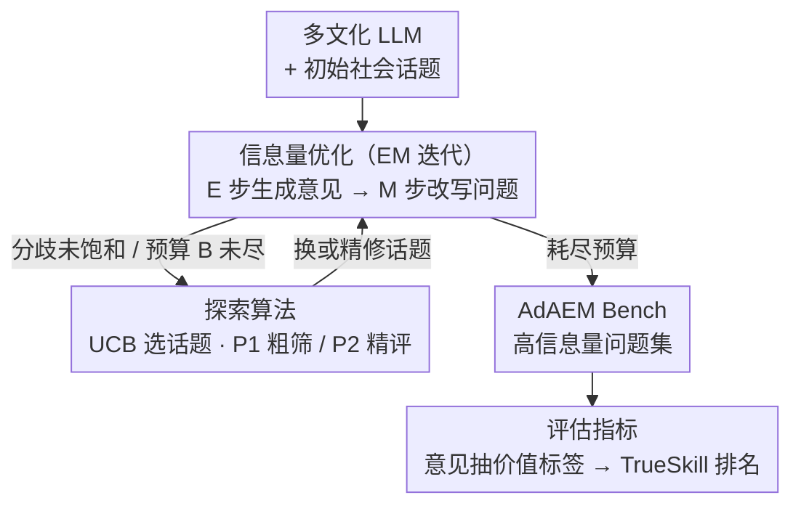

# AdAEM: An Adaptively and Automated Extensible Measurement of LLMs' Value Difference

**会议**: ICLR 2026 (Oral)  
**arXiv**: [2505.13531](https://arxiv.org/abs/2505.13531)  
**代码**: [https://github.com/ValueCompass/AdAEM](https://github.com/ValueCompass/AdAEM)  
**领域**: 可解释性  
**关键词**: LLM价值观评估, 动态基准, 信息论优化, Schwartz价值理论, 文化差异

## 一句话总结
提出 AdAEM，一个自适应、自扩展的 LLM 价值观评估框架，通过信息论优化自动生成能最大化揭示不同 LLM 价值差异的测试问题，解决现有静态基准无法区分模型价值取向的"信息量不足"问题。

## 研究背景与动机

大语言模型（LLM）虽在知识和指令跟随方面取得巨大进展，但可能生成有害、偏见或非法内容。评估 LLM 内在价值取向已成为全面诊断模型错误对齐、文化适应性和偏见的重要途径。

**现有痛点**：当前价值评估基准面临"信息量不足"挑战——测试问题要么过时、被污染、要么过于通用，只能捕捉到不同 LLM 之间共享的安全价值取向（如 HHH），导致评估结果趋同且无法区分。例如，在现有基准 SVS 和 ValueBench 上，GPT-4 和 GLM-4（分别来自美国和中国）在享乐主义维度展现出几乎相同的偏好，这显然不合理。

**核心矛盾**：静态基准无法与 LLM 的发展同步演化，且无法探索文化差异导致的争议性话题。

**核心 idea**：设计一个自扩展的动态评估框架，通过探测多个来自不同文化和时间段的 LLM 内部价值边界，自动生成能激发价值差异的测试问题，从理论上最大化信息论目标。

## 方法详解

### 整体框架
AdAEM 接受一组来自不同文化、不同时期的 LLM（如分别来自美国和中国的模型）和一批初始的通用社会话题，目标是产出一个能最大限度区分这些模型价值取向的测试问题集。它把"找到最具信息量的问题"建模成一个利用-探索交替的迭代过程：利用端（信息量优化）用类 EM 的方式不断打磨当前话题下的问题，让模型间的价值分歧最大化；探索端（探索算法）像多臂老虎机一样在"继续精修当前话题"和"另起一个新话题碰运气"之间权衡，决定下一步往哪投预算。两端交替直到耗尽预算，最终问题集再交给评估指标模块，从每个模型的回答中抽出价值标签、用相对排名聚合成可比较的价值评分。

### 关键设计

**1. 信息量优化：让问题本身把模型的价值分歧逼出来**

静态基准的根本毛病是题目太"安全"，所有 LLM 都给出趋同的 HHH 回答，评估结果自然糊成一团。AdAEM 把"区分度"直接写进优化目标，去寻找一个能让不同模型价值分布拉开最大差距的问题 $x$。优化目标取两项之和：第一项是每个模型 $\theta_i$ 的价值分布 $p_{\theta_i}(v|x)$ 相对于群体平均分布 $p_M(v|x)$ 的 KL 散度，本质上是广义 Jensen-Shannon 散度，散度越大说明模型间在这道题上越"吵得起来"；第二项是一个解耦正则项，惩罚问题本身先入为主的价值倾向 $\hat p(v|x)$ 与模型实际表态之间的偏离，防止某些题目因为措辞带强烈预设而强行把模型的回答带偏、制造虚假分歧。

$$x^* = \arg\max_x \sum_{i=1}^K \left\{ \alpha_i \, \text{KL}\big[p_{\theta_i}(v|x) \,\|\, p_M(v|x)\big] + \frac{\beta}{2} \sum_v \big|\hat p(v|x) - p_{\theta_i}(v|x)\big| \right\}$$

其中 $\alpha_i$ 是各模型的权重、$\beta$ 控制解耦正则的强度。由于问题是离散文本无法求梯度，作者把这个 $\arg\max$ 改用类 EM 的迭代在文本空间近似求解：E 步（Response Generation）让每个模型对当前问题生成若干意见并保留得分最高的那条，M 步（Question Refinement）固定这些意见、改写问题使其更具信息量。每轮改写都按价值一致性、价值差异、语义连贯、语义差异四个维度打分把关，保证问题既能放大分歧又读得通、不跑题。

**2. 探索算法：用多臂老虎机决定继续打磨还是另起话题**

单靠优化一个话题容易陷进局部最优，但盲目铺开新话题又烧钱。AdAEM 把每个候选话题当成老虎机的一只臂，用 UCB 策略在"继续精修当前最有潜力的话题"和"探索尚未充分挖掘的新话题"之间自适应权衡，把有限预算优先投到回报期望高的方向。为进一步压成本，系统分两档模型协作：先用一组小而快的 LLM 集合（P1）做低成本的话题探索和粗筛，再把筛出的高潜力问题交给更强的 LLM 集合（P2）做最终评分。总探索次数由预算 $B$ 统一卡住，使问题质量与算力开销维持在一条可控的曲线上。

**3. 评估指标：从意见抽价值标签，再用相对排名聚合**

模型的一段回答往往夹杂多种立场，直接打一个绝对分既不稳又难比较。AdAEM 先做基于意见的价值评估：从每个 LLM 的响应里拆出多条独立意见，对每条意见用分类器识别其在 Schwartz 10 维价值上的标签，再用逻辑或合并成该模型在这道题上的价值画像。聚合阶段不打绝对分，而是用 TrueSkill（贝叶斯技能评分）让所有模型在每个维度上两两比较、滚动更新技能值，最终以胜率作为价值评分。相对排名天然消化了不同模型答题风格的尺度差异，比绝对打分更稳健可复现。

### 损失函数 / 训练策略
AdAEM 不训练任何参数，全部优化都在 in-context 下通过 LLM API 调用完成。核心优化目标即上文「信息量优化」给出的 $x^*$ 式子，信息量项（广义 JS 散度）与解耦正则项（强度 $\beta$）之和构成被最大化的对象，整个 $\arg\max$ 由 EM 迭代在文本空间近似求解，没有任何梯度回传。

## 实验关键数据

### 主实验
AdAEM Bench 基于 Schwartz 价值理论的 10 个维度构建，包含 12,310 个测试问题，覆盖 106 个国家。

| 基准 | 问题数 | 平均长度 | Self-BLEU | 相似度 |
|------|--------|---------|-----------|--------|
| SVS | 57 | 13.00 | 52.68 | 0.61 |
| ValueBench | 40 | 15.00 | 26.27 | 0.60 |
| ValueDCG | 4,561 | 11.21 | 13.93 | 0.36 |
| **AdAEM** | **12,310** | **15.11** | **13.42** | **0.44** |

### 消融实验

| 配置 | 关键指标 | 说明 |
|------|---------|------|
| 价值启动实验（priming） | 目标价值 +31%, 对立价值 -58% | p < 0.01，验证评估有效性 |
| 同组价值变化 | +17% | 符合 Schwartz 价值结构预测 |
| 可靠性分析 | Cronbach's α = 0.8991 | "良好"可靠性 |
| 人类评估改进 | 合理性 +6.7%, 价值区分度 +31.6% | Cohen's κ = 0.93 |

### 关键发现
- 16 个 LLM 的价值基准测试揭示四个有趣发现：(1) 更先进的 LLM 更偏好安全相关维度（如普世主义）；(2) 同一系列的 LLM 价值取向相似，与模型大小无关；(3) 推理型与聊天型 LLM 价值差异显著；(4) 更大的 LLM 增强特定维度偏好
- AdAEM 在仅数次迭代后就能超越基线基准的信息量得分
- 不同话题类别（技术创新 vs 哲学信仰）下，所有 LLM 展现明显不同的价值取向
- GLM-4（中国开发）和 GPT-4-Turbo（美国开发）在文化相关话题上展现出显著的地域差异

## 亮点与洞察
- 首个将动态评估引入 LLM 价值评估领域的工作，理论驱动的自扩展机制非常优雅
- 信息论目标函数的设计很巧妙，同时兼顾区分度和解耦性
- Multi-Armed Bandit 的探索-利用策略自然且高效
- TrueSkill 评分系统的引入相比传统绝对打分更可靠
- 获得 ICLR 2026 Oral，说明审稿人高度认可
- 跨文化分析揭示了 LLM 训练数据/对齐策略中的文化偏见

## 局限与展望
- 仅基于 Schwartz 价值理论，未覆盖道德基础理论（MFT）、Kohlberg 道德发展阶段等
- 主要关注英语语境，未充分探索多语言和多文化场景
- 由于预算限制，只选取了有限的代表性 LLM
- 自动生成的争议性内容可能被恶意利用
- 价值分类器（GPT-4o）本身可能存在偏见

## 相关工作与启发
- 与 ValueBench、ValueDCG 等静态基准形成互补，引入了动态评估范式
- 受 DyVal 等动态评估工作启发，但首次应用于价值评估
- 与 PromptAgent 等黑盒优化工作相关，但目标函数面向价值区分度
- 启发：该方法可迁移至其他需要动态基准的评估场景，如安全评估、文化适应性测试

## 评分
- 新颖性: ⭐⭐⭐⭐⭐
- 实验充分度: ⭐⭐⭐⭐⭐
- 写作质量: ⭐⭐⭐⭐
- 价值: ⭐⭐⭐⭐⭐

<!-- RELATED:START -->

## 相关论文

- [\[ICLR 2026\] Decoupling Dynamical Richness from Representation Learning: Towards Practical Measurement](decoupling_dynamical_richness_from_representation_learning_towards_practical_mea.md)
- [\[ICML 2026\] Cognitive Fatigue in Autoregressive Transformers: Formalization and Measurement](../../ICML2026/interpretability/cognitive_fatigue_in_autoregressive_transformers_formalization_and_measurement.md)
- [\[ICLR 2026\] Formal Mechanistic Interpretability: Automated Circuit Discovery with Provable Guarantees](formal_mechanistic_interpretability_automated_circuit_discovery_with_provable_gu.md)
- [\[AAAI 2026\] Hypothesis Generation via LLM-Automated Language Bias for ILP](../../AAAI2026/interpretability/hypothesis_generation_via_llm-automated_language_bias_for_ilp.md)
- [\[ICML 2026\] ShaplEIG: Bayesian Experimental Design for Shapley Value Estimation](../../ICML2026/interpretability/shapleig_bayesian_experimental_design_for_shapley_value_estimation.md)

<!-- RELATED:END -->
