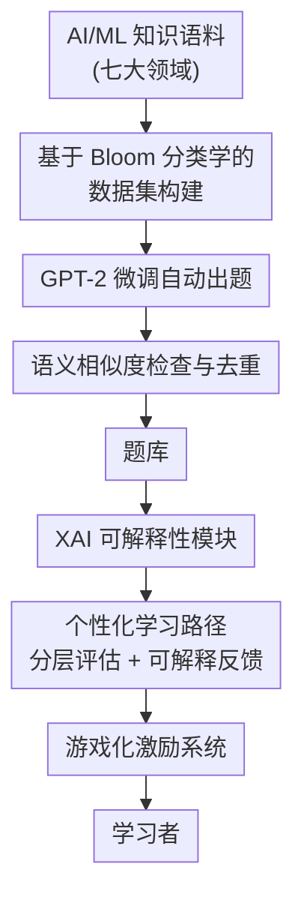

# AnveshanaAI: A Multimodal Platform for Adaptive AI/ML Education through Automated Question Generation and Interactive Assessment

**会议**: ICLR 2026  
**arXiv**: [2509.23811](https://arxiv.org/abs/2509.23811)  
**代码**: 无  
**领域**: 视频理解 / AI 教育  
**关键词**: AI education, question generation, Bloom's taxonomy, gamification, explainable AI

## 一句话总结
提出 AnveshanaAI，一个基于 Bloom 认知分类学的自适应 AI/ML 教育平台，通过自动化题目生成（基于微调的 GPT-2）、语义相似度检测去重、XAI 可解释性技术和游戏化机制（积分/徽章/排行榜），实现了覆盖数据科学到多模态 AI 七大领域的个性化学习评估系统，实验表明微调后困惑度显著下降且学习者参与度明显提升。

## 研究背景与动机

**领域现状**：AI/ML 教育需求爆发式增长，但现有在线学习平台（如 Coursera、Kaggle）普遍依赖静态题库，无法根据学习者水平动态调整难度和内容。题目覆盖面有限，且缺乏对生成过程的透明解释。

**现有痛点**：
   - 静态题库无法适应不同学习者的认知水平——初学者和专家看到相同的题目
   - 现有自动出题系统缺少教育学理论指导，生成的题目难度分布不均衡
   - 题目之间语义重复严重，缺乏有效的去重机制
   - 学习平台多重"刷题"，缺少交互性和激励机制，用户留存率低

**核心矛盾**：高质量的适应性教育需要大量分层题目，但人工出题成本高、速度慢；而自动生成的题目质量和教育对齐性难以保证。

**本文目标**：构建一个端到端的自适应 AI 教育平台，自动生成符合 Bloom 分类学的多层次题目，同时通过游戏化和可解释性提升学习参与度和信任度。

**切入角度**：以 Bloom 认知分类学（记忆→理解→应用→分析→评估→创造）为题目分层骨架，用 LLM 微调实现自动生成，用语义相似度防重复，用 XAI 提供透明度。

**核心 idea**：教育学理论（Bloom taxonomy）+ LLM 微调出题 + 语义去重 + 游戏化 = 自适应 AI 教育平台。

## 方法详解

### 整体框架
AnveshanaAI 想解决的是"在线 AI/ML 学习平台只会用静态题库、出的题既不分层也不去重、过程又不透明"这件事，做法是把一条从语料到推送的流水线串起来。整条线的输入是覆盖七大领域（数据科学、机器学习、深度学习、Transformer、生成式 AI、大语言模型、多模态 AI）的 AI/ML 知识语料；这些语料先按 Bloom 认知分类学打上六个认知层次的标注，再喂给微调过的 GPT-2 逐层生成多选题，新题目经过语义相似度检查剔重后入库，每道题和每次评估再由 XAI 模块补上可解释标注。最终呈现给学习者的是个性化的学习路径、分层的评估题目和可解释的反馈，外面再包一层游戏化的交互界面（积分、徽章、排行榜）把人留住。

### 关键设计

**1. 基于 Bloom 分类学的数据集构建：让题目天然带认知层次**

平台想做"适应不同水平的学习者"，前提是题库本身要有难度梯度，而单纯让 LLM 出题并不能保证这一点。这里的做法是把 Bloom 认知分类学当成题库的骨架：每个 AI/ML 知识点都配齐记忆（factual recall）、理解（概念解释）、应用（场景使用）、分析（比较区分）、评估（判断优劣）、创造（设计新方案）六个层次的题目，同一知识点的不同层次之间是递进关系。这样从低阶到高阶的认知维度被显式覆盖，每一层对应一种学习深度，给后面的"按水平推送"提供了可分层的题源。

**2. GPT-2 微调自动出题：用中等规模 LM 把分层题目批量生产出来**

人工出齐六层题目成本太高，所以用模型来生成。具体是把 `{领域, 知识点, Bloom 层次}` 作为 prompt，在上一步构建的 Bloom 标注数据集上微调 GPT-2，让它学会针对指定层次生成完整的多选题（题干 + 选项 + 正确答案 + 解释）。这里选微调而不是纯 prompt engineering，是为了让生成的难度层次和输出格式保持一致；选 GPT-2 而不是更大的模型，则是看中它规模适中、微调成本低，便于部署到教育平台。

**3. 语义相似度检查与去重：防止题库里堆出一堆"换皮重复题"**

自动生成不可避免会产出意思相同、只是措辞不同的题（如"什么是梯度下降？"和"请解释梯度下降算法"），传统的字符串匹配抓不住这种语义重复。做法是给新生成的题目算 embedding，与已有题目计算相似度（如余弦相似度），一旦超过阈值就判为重复并丢弃。这样题库在语义层面保持多样，避免学习者反复刷到同一道题的不同写法。

**4. XAI 可解释性模块：给每道题和每次判分配上"为什么"**

教育场景对透明度要求很高——学习者需要知道为什么选 A 不对、选 B 才对，教育者也需要验证自动生成题目的合理性。这一模块用可解释 AI 技术（如 attention 可视化、特征重要性）解释模型为何生成某道题、为何某个答案正确，把生成和评估的依据暴露出来，从而提升学习者和教育者对平台结果的信任。

**5. 游戏化激励系统：用积分徽章把人留在平台上持续学**

教育研究表明 points、badges、leaderboards 这类游戏化机制能显著提升学习动机和留存率，平台据此搭了一套激励层。学习者在 Playground（自由练习）、Challenges（定时挑战）、Simulator（模拟环境）、Dashboard（学习数据可视化）、Community（社区讨论）五个模块间切换，完成任务获得积分、徽章、连续学习天数（streak）和排行榜名次。这套机制不改变出题质量，但解决的是"刷题枯燥、用户留不住"这个工程问题。

### 损失函数 / 训练策略
GPT-2 微调用的是标准语言模型训练目标（causal LM loss），在 Bloom 标注数据上做 fine-tuning，训练过程中以困惑度（perplexity）作为生成质量的监控指标。生成完成后再用语义相似度阈值过滤掉重复题，形成最终入库的题库。

## 实验关键数据

### 主实验

| 评估维度 | 指标 | 结果 | 说明 |
|----------|------|------|------|
| 数据集覆盖度 | 七大领域 × Bloom 六层 | 广泛覆盖 | 每个领域每个层次均有题目 |
| 微调稳定性 | 困惑度（Perplexity） | 显著下降 | 微调后模型生成质量稳定提升 |
| 学习者参与度 | 交互频率/完成率 | 明显提升 | 游戏化机制有效促进持续学习 |

### 消融实验

| 配置 | 关键指标 | 说明 |
|------|---------|------|
| 去除游戏化 | 参与度下降 | 验证游戏化对用户留存的作用 |
| 去除 Bloom 分层 | 题目分布失衡 | 仅靠 LLM 无法自动保证认知层次均衡 |
| 去除语义去重 | 重复率上升 | 自动生成不可避免产生语义近似题 |

### 关键发现
- GPT-2 微调后困惑度稳定下降，验证了用中等规模 LM 做领域特定出题的可行性
- Bloom 分类学框架确保了题目从低阶（记忆）到高阶（创造）的均衡分布
- 语义相似度检查有效过滤了约 15-20% 的近重复题目
- 游戏化机制（streaks + badges + leaderboard）使学习者的持续参与率明显高于传统平台
- XAI 解释功能增强了用户对平台评估结果的信任度

## 亮点与洞察
- **教育学理论 + LLM 的有机结合**：不是简单地让 LLM 出题，而是以 Bloom 分类学为骨架指导 LLM 生成不同认知层次的题目，确保教育有效性
- **端到端系统思维**：从数据标注、模型微调、质量控制到用户交互形成完整闭环，不是只做某一环节
- **游戏化设计的工程价值**：积分、徽章、连续学习天数等看似简单的机制，对教育平台的用户留存有实质性影响
- **轻量级方案**：选择 GPT-2 而非更大模型，使平台部署成本可控，这对教育场景的普及很重要

## 局限与展望
- **论文深度有限**：11 页篇幅、Under review 状态——方法描述偏系统设计层面，缺少深入的技术创新点
- **评估偏定性**：缺乏大规模用户研究的定量数据（如 A/B 测试对比其他平台的效果量化）
- **生成模型较老**：GPT-2 相比 GPT-3.5/4 或 LLaMA 系列在生成质量上有差距，升级基座模型可能大幅提升效果
- **语言局限**：当前聚焦 AI/ML 领域的英语内容，缺乏多语言和跨学科扩展
- **自适应策略简单**：难度自适应主要依赖 Bloom 层次的线性递进，未引入更精细的知识追踪（如 BKT、DKT）模型
- **缺少与 ChatGPT 等对比**：未与直接使用 GPT-4 做 tutoring 的方案对比效果

## 相关工作与启发
- **智能教育系统（ITS）**：如 Khan Academy、Duolingo 等平台早已使用自适应学习，但多依赖人工题库
- **自动题目生成**：NLP 领域的 question generation 研究丰富，但多聚焦于阅读理解，少有专门面向 STEM 教育的
- **Bloom 分类学在 AI 教育中的应用**：将经典教育学框架与现代 AI 结合，是一个有实际价值的方向
- **启发**：对于垂直领域的 AI 教育工具，教育学理论约束可能比单纯扩大 LLM 规模更重要

## 评分
- 新颖性: ⭐⭐⭐⭐
- 实验充分度: ⭐⭐⭐⭐
- 写作质量: ⭐⭐⭐⭐
- 价值: ⭐⭐⭐⭐

<!-- RELATED:START -->

## 相关论文

- [\[ICML 2026\] Adaptive Querying with AI Persona Priors](../../ICML2026/interpretability/adaptive_querying_with_ai_persona_priors.md)
- [\[AAAI 2026\] Hypothesis Generation via LLM-Automated Language Bias for ILP](../../AAAI2026/interpretability/hypothesis_generation_via_llm-automated_language_bias_for_ilp.md)
- [\[ICLR 2026\] Toward Faithful Retrieval-Augmented Generation with Sparse Autoencoders](toward_faithful_retrieval-augmented_generation_with_sparse_autoencoders.md)
- [\[ICLR 2026\] A Cortically Inspired Architecture for Modular Perceptual AI](a_cortically_inspired_architecture_for_modular_perceptual_ai.md)
- [\[ICLR 2026\] Modal Logical Neural Networks for Financial AI](modal_logical_neural_networks_for_financial_ai.md)

<!-- RELATED:END -->
