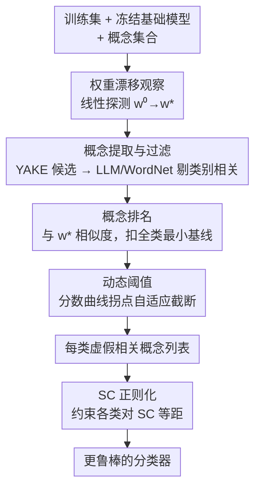

# Bridging Explainability and Embeddings: BEE Aware of Spuriousness

**会议**: ICLR 2026  
**arXiv**: [2410.18970](https://arxiv.org/abs/2410.18970)  
**代码**: [公开可用](https://arxiv.org/abs/2410.18970)  
**领域**: 可解释性  
**关键词**: 虚假相关性检测, 权重空间分析, 嵌入几何, 线性探测, 基础模型

## 一句话总结
提出BEE框架，通过分析微调如何扰动预训练表征的权重空间几何结构，直接从分类器学到的权重中识别和命名虚假相关性（spurious correlations），无需反例样本即可发现隐藏的数据偏差，在ImageNet-1k上发现可导致准确率下降高达95%的虚假关联。

## 研究背景与动机
**领域现状**: 深度神经网络尤其是微调后的基础模型被广泛部署在医疗、金融等关键领域。虚假相关性（SC）会导致模型基于与任务无关的特征做决策，产生严重后果。检测SC是确保模型可靠性的关键。

**现有痛点**: 现有方法分两大类——**数据驱动方法**（如SpLiCE、Lg）分析数据集统计特征标记与类别关联的概念，但无法判断模型是否真的学到了这些关联；**错误驱动方法**（如B2T）从验证集错误推断SC，但依赖验证集中存在反例来暴露模型捷径。当反例缺失时（这在真实场景中很常见），这些方法都失效。

**核心矛盾**: 数据方法不看模型、错误方法需要反例，而实际中很多有害的SC恰恰是因为数据集中没有反例才存在的。现有的可解释方法（如CBM）需要预定义概念集并牺牲表达能力。根本问题是：**如何在不依赖反例的情况下发现模型实际学到的虚假关联？**

**本文目标**: (1) 无需反例即可识别模型学到的SC；(2) 不仅检测还要**命名**具体是什么概念导致了SC；(3) 方法需适用于视觉和文本多种模态、多种基础模型。

**切入角度**: 关键观察——微调过程中，线性分类器的权重会从初始的类别名称嵌入（零样本权重）偏移，而偏移方向编码了模型学到的特征，包括虚假关联。由于权重和概念嵌入共享同一嵌入空间，可以通过几何关系直接分析哪些与类别无关的概念与权重高度相似。

**核心 idea**: 利用嵌入空间中分类权重相对于零样本初始化的漂移方向，识别与类别无关但与学到权重高度相似的概念作为虚假相关性。

## 方法详解

### 整体框架
BEE要解决的是"模型到底学了哪些虚假关联，而且还得叫得出名字"这个问题，且不依赖验证集里的反例。它的切入点是一个几何观察：当我们在冻结的基础模型嵌入上训练一个线性分类器时，每个类别的权重会从"类别名称的零样本嵌入"出发，朝着模型真正依赖的特征方向漂移——这个漂移方向里就藏着虚假关联。

整个框架输入训练集、基础模型和一个概念集合，输出每个类别学到的虚假相关概念列表。它先在基础模型嵌入之上训练一层线性探测，把权重漂移暴露出来；再在同一个嵌入空间里，先攒出与类别无关的候选概念、按它们和漂移后权重的相似度排名、用动态阈值自适应截断，自动筛成 SC；最后还能把发现的 SC 反过来当正则项约束模型。因为权重和概念嵌入活在同一空间，相似度比较是直接可算的，这正是整套方法能落地的前提。

### 关键设计

**1. 权重漂移观察：用零样本权重当基准，让漂移方向暴露学到的特征**

线性分类器的每个类权重不是随机初始化，而是用类别名称的文本嵌入起步：$w_k^0 = M(\text{class\_name}_k)$。这个零样本权重 $w_k^0$ 编码的是类别的"纯语义"；训练结束后的 $w_k^*$ 则混进了模型真正依赖的特征，既有真实特征也有虚假特征。两者之差就是漂移方向，它直接告诉我们模型在原本的语义之外又额外抓住了什么。之所以用线性探测而不是全参数微调来做这件事，一是线性层权重和概念嵌入处在同一空间、相似度可比，二是它足够透明、可解释；论文进一步用实验说明，线性探测里发现的 SC 在全参数微调模型中同样持续存在，所以这个"诊断透镜"并不因为简单而失真。

**2. 概念提取与过滤：先攒候选概念，再剔掉和类别本身相关的那些**

只有与类别定义无关的概念才有资格当 SC 候选——比如"森林背景"和"陆地鸟"高度相关，但它不该成为分类依据。BEE 先从数据里攒候选：图像数据用 GIT-Large 生成描述（文本数据直接用原文），再用 YAKE 关键词提取器取 top-256 的 n-gram 作为候选概念集合 $C_{all}$。攒完之后做两级过滤：先用 Llama-3.1-8B-Instruct 把类别实例本身过滤掉，再用 WordNet 的上下位词关系做二次过滤。LLM 负责语义层面的判断、WordNet 补上分类学层面的覆盖，两级配合保证"和类别相关"的概念被尽量清干净，留下来的才是真正"类别中立"的候选。

**3. 概念排名：按概念和学到权重的相似度排序，但要先扣掉通用基线**

对每个类别，BEE 按概念嵌入与漂移后权重 $w_k^*$ 的相似度给候选打分。正相关 SC 的评分是

$$s_{k,i}^+ = w_k^{*\top} M(c_i) - \min_{k'} w_{k'}^{*\top} M(c_i)$$

直觉是找"只和这一类很像、却和别的类不像"的概念。这里减去 $\min_{k'} w_{k'}^{*\top} M(c_i)$ 很关键：如果只看与单个类别的相似度，那些和所有类都沾边的通用概念会全部冒头、产生假阳性；扣掉所有类里的最小相似度，相当于减掉这个基线效应，只保留对特定类别真正有区分力的概念。负相关 SC 则用不相似度 $-w_k^{*\top} M(c_i)$ 同理排名。

**4. 动态阈值：自动判断每个类该留几个 SC，不靠手调 top-k**

不同类别学到的 SC 数量本来就不一样，硬性给所有类设同一个 top-k 并不合理。BEE 的做法是在排序后的分数曲线上找拐点：先对分数做窗口大小为 $r$ 的均值滤波得到平滑曲线 $\bar{s}$，再找平滑曲线偏离"首尾两端连线"最远的那个点作为截断位置

$$m_k = \lfloor r/2 \rfloor + \arg\max_i \left(\bar{s}_{k,1} - i \frac{\bar{s}_{k,1} - \bar{s}_{k,p}}{p-1} - \bar{s}_{k,i}\right)$$

直观上就是分数从高速下落转向平缓的那个弯，弯之前的概念保留为 SC、之后的丢弃。这样每个类别都自适应地拿到合适数量的 SC，不用人工调参，也才能在 ImageNet 这种 1000 类的规模上自动跑下来。

**5. SC 正则化：拿发现的 SC 反过来约束模型，降低对它的依赖**

检测只是第一步，BEE 还把发现的 SC 用来提升鲁棒性。思路是约束分类权重与 SC 概念保持等距——也就是不让任何一类对某个 SC 概念表现出偏好。正则化损失为

$$\mathcal{L}_{reg}(b) = \frac{\tau^2}{N} \sum_{k=1}^N \left[w_k^\top M(b) - sg\Big(\frac{1}{N}\sum_j w_j^\top M(b)\Big)\right]^2$$

其中 $sg(\cdot)$ 是 stop-gradient，把各类对概念 $b$ 的相似度往它们的均值上拉。总损失把它加到经验风险上：$\mathcal{L} = \mathcal{L}_{ERM} + \alpha \frac{1}{|\mathcal{B}|} \sum_{b \in \mathcal{B}} \mathcal{L}_{reg}(b)$。这一项的价值在极端设置里最明显：当训练集里完全没有反例时，依赖分组信息的 GroupDRO 会失效，而 SC 正则化靠显式约束直接压低对 SC 的依赖，仍能改善最差组表现。

### 训练策略
- 使用AdamW优化器（$lr=1e$-4, $wd=1e$-5），batch size 1024
- 交叉熵损失+类别平衡权重，使用CLIP温度 $\tau=100$ 缩放logits
- 每次更新后权重归一化，基于验证集类别平衡准确率做早停

## 实验关键数据

### 主实验：SC增强的零样本提示

| 方法 | Waterbirds Worst | Waterbirds Avg | CelebA Worst | CelebA Avg | CivilComments Worst |
|------|------------------|----------------|--------------|------------|---------------------|
| Basic zero-shot | 35.2 | 84.2 | 72.8 | 87.7 | 33.1 |
| w/ B2T | 48.1 | 86.1 | 72.8 | 88.0 | - |
| w/ SpLiCE | 48.1 | 82.5 | 67.2 | 90.2 | - |
| w/ Lg | 46.1 | 85.9 | 50.6 | 87.2 | - |
| **w/ BEE** | **50.3** | **86.3** | **73.1** | 85.7 | **53.2** |

BEE在Waterbirds和CivilComments上的worst-group准确率显著优于所有竞争方法。

### ImageNet-1k SC影响量化

| 正确类别 | 虚假概念 | 诱导类别 | 正确类识别率变化 | 诱导类预测率 |
|----------|----------|----------|------------------|-------------|
| Peafowl | firemen | Fire truck | 100% → 5.3% (**-94.7%**) | 0% → 93.4% |
| Mexican Hairless Dog | reading newspaper | Crossword | 47.5% → 0.9% (-46.6%) | 0% → 36.6% |
| Bernese Mountain Dog | shrimp | American lobster | 99.8% → 10.6% (-89.2%) | 0% → 37.2% |

### 完全虚假设置下的正则化实验

| 方法 | Waterbirds Worst | CelebA Worst | CivilComments Worst |
|------|------------------|--------------|---------------------|
| ERM | 43.2±5.7 | 9.6±1.0 | 18.6±0.3 |
| GroupDRO | 38.9±5.4 | 8.1±0.3 | 18.7±0.4 |
| Reg w/ random SCs | 46.6±2.7 | 9.4±0.0 | 19.1±1.6 |
| Reg w/ Lg's SCs | 50.4±0.1 | 8.3±0.0 | - |
| **Reg w/ BEE's SCs** | **57.9±0.3** | **10.4±0.5** | **31.3±0.7** |

在无反例的极端设置中，GroupDRO甚至不如ERM，但BEE的SC正则化持续改善worst-group表现。

### 关键发现
- **SC跨模型迁移**：BEE在CLIP上发现的SC在AlexNet、ResNet50、ViT-L/16等多种架构上都导致显著性能下降，表明SC是数据集的属性而非模型的属性
- **MIMIC-CXR医疗笔记中的危险捷径**：BEE发现"chest examination"和"chest radiograph"是"无病理发现"类的SC，添加这类词会使分类器偏向"无发现"，在医疗场景中可能导致漏诊
- **无需反例的SC发现**：在移除所有少数组样本的完全虚假设置中，BEE仍能有效识别SC，而基于错误分析的方法完全失效

## 亮点与洞察
- **权重空间分析是全新的SC检测范式**：不看数据分布也不看预测错误，直接从分类器权重的几何漂移推断学到了什么。这个思路利用了嵌入空间的对齐性质，非常优雅，且可以发现传统方法看不到的SC。
- **线性探测作为诊断透镜**：选择最简单的分类器避免了复杂模型的不可解释性，同时实验证明发现的SC在全参数微调模型中同样存在并可迁移，说明线性探测的发现具有普适性。
- **动态阈值的拐点检测方法**：自动为每个类确定SC数量，无需人工调参，使方法在ImageNet的1000个类上自动化运行，具有很好的可扩展性。
- **MIMIC-CXR发现的实际安全意义**：在医疗文本中发现的SC直接指向了可能导致漏诊的模型缺陷，展示了方法在高风险领域的实际价值。

## 局限与展望
- 依赖线性探测假设——如果SC以非线性方式编码，可能无法检测到
- 概念提取依赖YAKE+GIT-Large，概念覆盖范围受限于captioning模型的描述能力
- 当前仅针对分类任务，能否扩展到检测/分割/生成等更复杂任务的SC检测？
- SC正则化需要已知SC集合，能否将检测和缓解做成闭环迭代？
- 在CelebA-blonde hair上BEE和B2T都未检测到SC，可能存在某些类型的短路特征检测盲区

## 相关工作与启发
- **vs B2T**: B2T从验证错误推断SC，需要反例存在。BEE从权重漂移推断，不需要反例，发现的概念范围更广。在Waterbirds上BEE（worst 50.3%）优于B2T（48.1%）。
- **vs SpLiCE/Lg**: 这些是数据驱动方法，分析数据集中的概念分布，但无法确认模型是否真的学到了这些关联。BEE直接分析模型权重，确保发现的是模型实际学到的SC。
- **vs CBM**: 概念瓶颈模型需要预定义概念并修改模型架构，牺牲表达能力。BEE对模型无任何修改，分析的是原始SOTA模型。

## 评分
- 新颖性: ⭐⭐⭐⭐⭐ 从权重空间几何分析SC是全新视角，理论动机清晰，方法设计优雅
- 实验充分度: ⭐⭐⭐⭐⭐ 覆盖视觉+文本、5种嵌入模型、5个数据集、定量+定性+生成验证，非常全面
- 写作质量: ⭐⭐⭐⭐ 结构清晰，图示直观，但部分数学符号较密需要反复阅读
- 价值: ⭐⭐⭐⭐⭐ 在AI安全和可信AI领域有重要意义，MIMIC-CXR的发现直接关系到医疗安全

<!-- RELATED:START -->

## 相关论文

- [\[ICLR 2026\] Cross-Modal Redundancy and the Geometry of Vision-Language Embeddings](cross-modal_redundancy_and_the_geometry_of_vision-language_embeddings.md)
- [\[ACL 2026\] Interpreto: An Explainability Library for Transformers](../../ACL2026/interpretability/interpreto_an_explainability_library_for_transformers.md)
- [\[ICLR 2026\] RADAR: Reasoning-Ability and Difficulty-Aware Routing for Reasoning LLMs](radar_reasoning-ability_and_difficulty-aware_routing_for_reasoning_llms.md)
- [\[ICLR 2026\] TokenSeek: Memory Efficient Fine Tuning via Instance-Aware Token Ditching](tokenseek_memory_efficient_fine_tuning_via_instance-aware_token_ditching.md)
- [\[CVPR 2026\] NeuroRule: Bridging Vision and Logic with Differentiable Rule Induction](../../CVPR2026/interpretability/neurorule_bridging_vision_and_logic_with_differentiable_rule_induction.md)

<!-- RELATED:END -->
