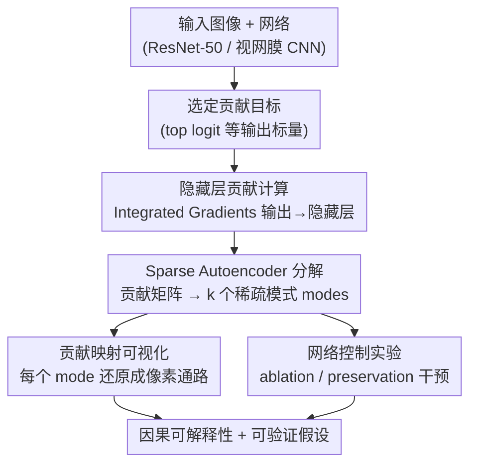

# Causal Interpretation of Neural Network Computations with Contribution Decomposition

**会议**: ICLR2026  
**arXiv**: [2603.06557](https://arxiv.org/abs/2603.06557)  
**代码**: [https://github.com/baccuslab/CODEC_ICLR_2026](https://github.com/baccuslab/CODEC_ICLR_2026)  
**领域**: 可解释性  
**关键词**: neural network interpretability, contribution decomposition, sparse autoencoder, causal analysis, retinal modeling

## 一句话总结
提出 CODEC（Contribution Decomposition），用 Integrated Gradients 计算隐藏层神经元对输出的贡献（而非仅分析激活），再用 Sparse Autoencoder 将贡献分解为稀疏模式（modes），实现比激活分析更强的因果可解释性和网络控制能力，并成功应用于 ResNet-50 和视网膜生物神经网络模型。

## 研究背景与动机

**领域现状**：理解神经网络如何将输入转化为输出是可解释 AI 的核心问题。现有方法主要分析隐藏层的激活模式（activations），寻找与人类可解释概念相关的表征。

**现有痛点**：激活分析只反映了神经元的感受野（receptive field）——即它对什么输入敏感，但**没有回答该神经元如何影响输出**。一个高度激活的神经元可能对输出有正面、负面或零影响。现有的 saliency map 方法（Grad-CAM、SmoothGrad）只分析输入→输出的映射，对中间层的因果机制缺乏洞察。

**核心矛盾**：激活（activation）≠贡献（contribution）。激活只是感受野的半截信息，还需要投射野（projective field）——即对下游的影响——才能理解一个神经元的因果角色。但现有工具几乎不分析隐藏层神经元群体的协同贡献。

**本文目标** 建立一个分析隐藏层神经元群体协同贡献的通用框架，揭示它们如何共同构建网络输出。

**切入角度**：灵感来自神经科学——视网膜中不同类型的神经元通过协同作用产生功能输出。将归因方法（Integrated Gradients）从输入→输出扩展到中间层→输出，计算每个隐藏神经元的贡献，再用 SAE 分解为协同模式。

**核心 idea**：分析隐藏层神经元的"贡献"而非"激活"，并用 SAE 将贡献分解为稀疏协同模式，获得激活分析无法提供的因果洞察。

## 方法详解

### 整体框架
CODEC 想回答的问题是"隐藏层里哪些神经元群体、通过什么方式共同撑起了网络的某个输出"，而不只是"哪些神经元对什么输入敏感"。整条流水线从网络输出端起步：先选定一个要解释的标量目标（如 top logit），用 Integrated Gradients 把归因从常规的"输出→输入"改写成"输出→隐藏层"，给每个隐藏神经元算出一个有正有负的贡献值；再对整张贡献矩阵做稀疏自编码（Sparse Autoencoder），挖出若干"总是协同出力"的稀疏模式（modes）；最后兵分两路——一路把每个 mode 还原成像素空间里的一条通路做可视化，另一路通过 ablation / preservation 干预这些模式，验证它们确实是因果结构而非相关巧合，最终汇成可实验验证的因果解释。

### 关键设计

**1. 隐藏层贡献计算：把神经元的角色从"对什么敏感"换成"对输出做了什么"**

激活分析只告诉你一个神经元被什么输入点亮，却答不出它点亮之后是促进还是抑制了输出。CODEC 的第一步就是把 Integrated Gradients 从习惯的"输出→输入"路径改写成"输出→隐藏层"，对卷积层的每个通道在空间维度上求和，得到该通道对目标标量的单个贡献值。关键在于这个值有正有负——正表示推高输出，负表示压低输出——而激活经过 ReLU 后恒为正，本质上丢掉了"抑制"这半边信息。选 Integrated Gradients 而非 Grad-CAM 这类近似方法，是因为它满足完整性（completeness）：所有神经元的贡献之和精确等于输出值，于是后续把贡献拆成若干模式时，每个模式分到的份额都有严格的加和意义，而不是一张只能看相对热度的近似图。

**2. Sparse Autoencoder 分解：从 $d$ 维贡献里挖出"总是一起出力"的神经元群体**

逐个盯着 $d$ 维贡献向量看不出结构，CODEC 的核心是对整张贡献矩阵（$d$ 通道 × $n$ 图像）做一个稀疏自编码，把它分解成 $k$ 个稀疏模式（modes）。编码器 $f_{\text{enc}}: \mathbb{R}^d \to \mathbb{R}^k$ 算出每张图在各模式上的 loadings，经硬阈值 $\tau$ 稀疏化，再由一个非负字典 $\mathbf{D} \in \mathbb{R}^{d \times k}_+$ 把模式重建回贡献空间，训练目标是重建损失加 L1 正则：

$$\mathcal{L} = \|\mathbf{c} - \mathbf{D}\mathbf{z}\|_2^2 + \lambda \|\mathbf{z}\|_1$$

默认取 $k = 3d$ 的过完备表示、阈值 0.9，每层训练约 3–7 分钟。这样一个 mode 就对应"哪些通道总是一起正向贡献、或一起负向贡献"的协同结构。之所以对贡献而不是激活做 SAE，是因为激活里混着大量"被表征但对输出没有因果影响"的特征，对贡献做分解挖出的模式天然和输出类别更相关。

**3. 贡献映射可视化（Contribution Mapping）：把每个模式还原成它在像素上的那条通路**

传统 saliency map 只给一张笼统的输入重要性图，看不出同一个输出是被几条不同的视觉线索分别撑起来的。CODEC 对某个 mode $m$ 里的关键通道 $c$，沿雅可比链算输入灵敏度 $A_i^{(c,p)} = J_{y,h_{c,p}} J_{h_{c,p},x_i}$，再与输入逐元素相乘得到该模式的贡献映射 $C_i^{(m)} = A_i^{(m)} \odot x_i$。于是一张图能拆出多张分通路的热图——木纹、手、琴弦各自通过不同的计算通路驱动同一个输出，而不是糊成一团。

**4. 网络控制实验：用干预验证模式确实是因果结构而非相关巧合**

如果 CODEC 找到的模式真的捕捉了因果结构，那么动它们应该比动激活模式更精准地改变输出。具体做法是定位与目标类别最相关的 mode，取出其高权重通道，再做两种相反的干预：ablation 把这些通道去掉，看目标类准确率掉多少（衡量"必要性"）；preservation 只保留这些通道，看能否单独支撑分类（衡量"充分性"）。两种干预都拿贡献 mode 和激活 mode 对照，看谁识别出的通道更"管用"。

### 训练策略
SAE 在 ImageNet 验证集 50,000 图像上训练，学习率 5e-5，batch size 128，300 epochs，L1 正则化系数 5e-5。使用 ResNet-50 的不同 block 逐层分析。平均重建 $R^2 = 0.85$。

## 实验关键数据

### 主实验（贡献 vs 激活的比较）

| 分析维度 | 贡献（Contribution） | 激活（Activation） |
|---------|-------------------|------------------|
| 跨层稀疏性 | 持续增加，始终高于激活 | 增加但较低 |
| 95% 方差所需维数 | 更高（~200 at layer 14） | 更低（~150） |
| Mode-类别最大相关性 | **0.45+**（中间层） | ~0.30 |
| 超越类别相关的 mode 数 (>0.2) | **80+**（layer 13） | ~40 |

### 消融实验（网络控制 - 贡献 mode vs 激活 mode）

| 控制方式 | 贡献 Mode | 激活 Mode | 说明 |
|---------|----------|----------|------|
| Ablation（去2%通道） | 目标类准确率→~0% | 目标类→~20% | 贡献 mode 识别的通道更加必要 |
| Preservation（只保留2%通道） | 目标类准确率~80% | 目标类~50% | 贡献 mode 识别的通道更加充分 |
| 跨层一致性 | Block 7+ 显著提升 | Block 7+ 改善但弱 | 语义信息在 block 6-7 有转折点 |

### 关键发现
- **贡献的正负效应逐层解耦**：在早期层，同一通道的正贡献和负贡献高度相关（类似视网膜的中心-周围感受野）；在深层，正负贡献逐渐解耦（通道变得单一功能）
- **贡献 mode 比激活 mode 更"类别特异"**：在中间层差异最大。这说明激活中混杂了"被表征但对输出无因果影响"的特征，贡献过滤了这些噪声
- **视网膜模型中的动态感受野**：CODEC 揭示了视网膜模型中不同 mode 的组合如何产生动态瞬时感受野（IRF）——同一神经元在不同时间由不同 mode 驱动时展现从中心-周围到方向选择性的不同感受野
- **SAE 超参数鲁棒**：结果对 L1 正则化、随机种子、mode 非负约束不敏感，仅在阈值过高或字典过小时退化

## 亮点与洞察
- **激活≠贡献的核心洞察**：这是全文最重要的 message。一个高激活的神经元可能在抑制输出（负贡献），只看激活会完全误判其角色。这个区分对 mechanistic interpretability 至关重要
- **协同模式而非单个神经元**：跳过了"什么单个神经元重要"直接到"什么神经元组合重要"，这与生物神经科学中的 population coding 理论一致。一个 mode 可以跨不同类别提取相同的视觉特征（如"闪亮的木头"），是比单个神经元更自然的分析单元
- **从 AI 到生物的双向桥梁**：在视网膜 CNN 模型上的应用不是附加实验，而是展示了方法的核心价值——CODEC 能生成可实验验证的假设（哪些中间神经元组合驱动哪些输出模式）
- **block 6-7 的转折点**：ablation 效力在 block 6-7 急剧上升，暗示语义信息在这一层有质变——可以指导模型剪枝和特征提取层的选择

## 局限与展望
- **仅在 ResNet-50 和 ViT-B 上验证**：未在更大的模型（如 ViT-L、LLM）上系统测试。虽然作者提到在 LLM 上做了 scaling 分析，但细节不足
- **ViT 上效果较弱**：ViT 的 ablation 效果不如 CNN，作者认为是因为 ViT 缺乏显式空间等变偏置，token 的空间聚合策略需要进一步探索
- **仅分析正贡献**：当前的 SAE 分解只用了正贡献，负贡献（抑制效应）可能包含同样重要的计算结构
- **计算开销**：Integrated Gradients 需要 10 步积分，SAE 训练虽然不慢（3-7分/层）但整个 pipeline 比简单的激活分析重得多
- **与训练数据无关**：CODEC 在推理时分析，不需要训练数据。但这也意味着它无法区分归因于训练数据偏差的贡献和真正有意义的贡献

## 相关工作与启发
- **vs Grad-CAM**：Grad-CAM 只做输入→输出的归因，产生一张 saliency map。CODEC 分析中间层→输出，并将归因分解为多个协同 mode，信息量远超单张 saliency map
- **vs SAE on activations（Anthropic 的 monosemanticity 工作）**：Anthropic 对 LLM 的激活做 SAE 发现可解释特征。CODEC 的关键区别是对贡献而非激活做 SAE——这保证了发现的 mode 有因果意义而不仅是相关
- **vs Circuit-level mechanistic interpretability**：电路级分析逐个追踪信息流，适合小模型。CODEC 通过 mode 分解直接跳到群体级别分析，更适合大规模网络

## 评分
- 新颖性: ⭐⭐⭐⭐⭐ 贡献 vs 激活的区分是深刻洞察，SAE 分解贡献而非激活是全新角度
- 实验充分度: ⭐⭐⭐⭐ CNN + ViT + 生物模型，控制实验设计优秀，但缺少 LLM 大规模验证
- 写作质量: ⭐⭐⭐⭐⭐ 从神经科学出发的叙事优雅，方法和生物学应用无缝衔接
- 价值: ⭐⭐⭐⭐⭐ 为 mechanistic interpretability 提供了新的分析工具和思维框架

<!-- RELATED:START -->

## 相关论文

- [\[ICLR 2026\] Addressing Divergent Representations from Causal Interventions on Neural Networks](addressing_divergent_representations_causal.md)
- [\[CVPR 2026\] Hidden Monotonicity: Explaining Deep Neural Networks via their DC Decomposition](../../CVPR2026/interpretability/hidden_monotonicity_explaining_deep_neural_networks_via_their_dc_decomposition.md)
- [\[AAAI 2026\] ElementaryNet: A Non-Strategic Neural Network for Predicting Human Behavior in Normal-Form Games](../../AAAI2026/interpretability/elementarynet_a_non-strategic_neural_network_for_predicting_human_behavior_in_no.md)
- [\[NeurIPS 2025\] FaCT: Faithful Concept Traces for Explaining Neural Network Decisions](../../NeurIPS2025/interpretability/fact_faithful_concept_traces_for_explaining_neural_network_decisions.md)
- [\[ICML 2026\] How Few-Shot Examples Add Up: A Causal Decomposition of Function Vectors in In-Context Learning](../../ICML2026/interpretability/how_few-shot_examples_add_up_a_causal_decomposition_of_function_vectors_in_in-co.md)

<!-- RELATED:END -->
