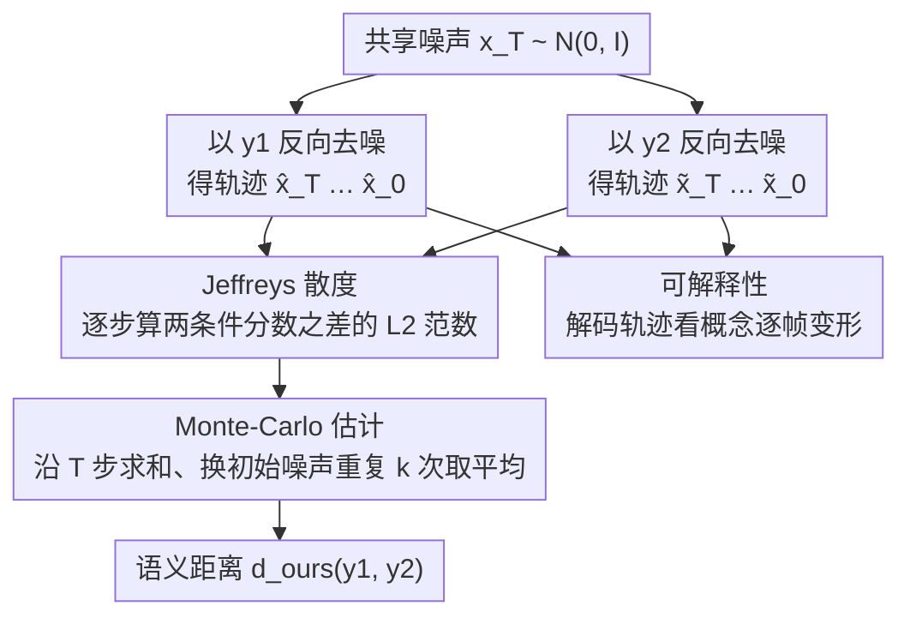

# Conjuring Semantic Similarity

**会议**: ICLR2026  
**arXiv**: [2410.16431](https://arxiv.org/abs/2410.16431)  
**代码**: 待确认  
**领域**: 图像生成  
**关键词**: semantic similarity, diffusion model, Jeffreys divergence, SDE, text-to-image

## 一句话总结
提出一种基于视觉想象的文本语义相似度度量——通过计算文本条件扩散模型在两个文本提示下诱导的反向 SDE 之间的 Jeffreys 散度来衡量语义距离，可用 Monte-Carlo 采样直接计算，首次量化了扩散模型学到的语义空间与人类标注的对齐程度。

## 研究背景与动机

**领域现状**：语义相似度传统上通过文本空间测量（Word2Vec、BERT 嵌入、CLIP 等）。Liu et al. (2023) 定义了自回归 LLM 的意义空间为续写分布。

**现有痛点**：(a) 文本嵌入方法生成不可解释的向量距离；(b) 没有方法量化文本条件扩散模型所学语义空间的质量；(c) Bender & Koller (2020) 认为仅语言训练不足以捕获语义——需要外部接地。

**核心矛盾**：语义相似度应该可解释——但现有方法只给数字不给解释。人类理解语义是通过"想象"场景来比较的，但人无法系统化比较心理图像。

**切入角度**：让扩散模型充当"想象力"——两个文本的语义距离 = 它们诱导的图像分布的距离。

**核心 idea**：文本语义相似度 = 两个文本条件下反向扩散 SDE 的路径测度之间的 Jeffreys 散度，通过 Monte-Carlo 计算。

## 方法详解

### 整体框架
这篇论文要回答的问题是：两段文本到底有多"近"？它的答案不是去比文本嵌入向量，而是让一个文本条件扩散模型（text-conditioned diffusion model）替我们"想象"。给定两个文本 $y_1, y_2$ 和一个预训练扩散模型 $s_\theta$，从同一份高斯噪声出发、分别以 $y_1$ 和 $y_2$ 为条件做反向去噪，两条轨迹会逐步分叉成两幅不同的图像；它们在每个去噪步上的分歧累加起来、再做 Monte-Carlo 平均，就得到一个标量的语义距离。整套方法只有三块：一条把"比图像分布"化简为"比分数函数"的数学推导（决定算什么），一个把期望式落成采样循环的 Monte-Carlo 估计（决定怎么算），以及随计算免费得到的轨迹可视化（决定怎么解释）。

### 关键设计

**1. Jeffreys 散度：把"比较图像分布"化简为"比较条件分数函数"**

直接比较两个文本各自诱导的图像分布（比如算 FID）需要先采样大量图像、再统计对比，代价高且只给最终结果。本文换了个角度：两个文本条件下的反向去噪本质上是两条随机微分方程（SDE），它们各自对应一个路径测度（path measure）$\mathbb{P}_1, \mathbb{P}_2$，文本的语义距离就定义为这两个路径测度之间的散度。借助 Girsanov 定理，$D_{KL}(\mathbb{P}_2\|\mathbb{P}_1)$ 里的随机积分项在 Novikov 条件下是个鞅、取期望后归零，只剩下沿轨迹对**分数函数之差**的漂移积分；再把两个方向的 KL 对称化即得 Jeffreys 散度。为免去对每种调度器单独调权，本文直接取扩散系数 $g(t)=1$，最终落到一个干净的期望式：

$$d_{\text{ours}}(y_1, y_2) = \mathbb{E}_{t \sim \text{unif}([0,T]),\; x \sim \frac{1}{2}p_t(\cdot|y_1) + \frac{1}{2}p_t(\cdot|y_2)} \big\| s_\theta(x, t|y_1) - s_\theta(x, t|y_2) \big\|_2^2$$

其中 $p_t(\cdot|y)$ 是 $t$ 时刻噪声图像的分布。这样做的好处是：抽象的路径测度距离被还原成"在每个去噪步上量一量两个条件分数差多大"，既保留了理论上的严格性，又能在去噪过程中边走边算、不必先生成完整图像。

**2. Monte-Carlo 估计：把期望式落成一段可执行的采样循环**

上面的期望无法解析求解，本文（Algorithm 1）用 Monte-Carlo 直接估计：从 $\pi=\mathcal{N}(0, I)$ 采一份初始噪声 $x_T$，分别以 $y_1$、$y_2$ 为条件去噪得到两条样本序列，在每个时间步算两个条件分数差的 L2 范数 $\|s_\theta(x_t, t|y_1) - s_\theta(x_t, t|y_2)\|_2^2$、沿 $T$ 步求和；再换不同的初始噪声重复 $k$ 次取平均，压低单次采样的方差。实验里去噪只需 $T=10$ 步分歧累计就已饱和（单步约 2 秒），因此整套估计在计算上是可行的。

**3. 可解释性：度量的副产品是一段"概念变形"可视化**

文本嵌入方法只能吐出一个不可解释的向量距离，而这里因为距离本身是从一段真实去噪轨迹里算出来的，轨迹自带解释。把去噪过程逐帧解码出来观察，就能看到模型如何把一个概念平滑"变形"成另一个——例如从雪豹（Snow Leopard）到孟加拉虎（Bengal Tiger），画面里的斑点会逐步过渡成条纹、再给脸部补上纹理。这让相似度分数不再只是一个数字，而是配上了"为什么近、近在哪里"的视觉证据，也是文本嵌入类方法做不到的。

## 实验关键数据

### 主实验（STS Benchmark, Spearman 相关系数）

| 方法 | STS-B | STS12 | STS13 | STS14 | Avg |
|------|-------|-------|-------|-------|-----|
| BERT-CLS | 16.5 | 20.2 | 30.0 | 20.1 | 29.2 |
| BERT-mean | 45.4 | 38.8 | 58.0 | 58.0 | ~50 |
| SimCSE-BERT | 68.4 | 82.4 | 74.4 | 80.9 | **76.3** |
| CLIP-ViTL14 | 65.5 | 67.7 | 68.5 | 58.0 | 67.0 |
| **Ours (SD v1.4)** | ~55 | ~50 | ~55 | ~50 | ~53 |

### 消融实验

| 配置 | 效果 | 说明 |
|------|------|------|
| 只看初始步 | 较差 | 高噪声区分辨力弱 |
| 只看最终步 | 中等 | 低噪声有信息但不完整 |
| 全轨迹（ours） | 最优 | 累积各尺度语义信息 |
| KL vs Jeffreys | Jeffreys 更稳定 | 对称化改善 |
| $T$ 步数消融 | $T=10$ 即饱和 | 计算友好 |

### 关键发现
- **零样本方法超过 BERT 编码器**：仅用 Stable Diffusion 就能达到与语言模型可比的语义相似度——说明扩散模型确实学到了有意义的语义结构
- **可解释性是独特优势**：不仅给出数值分数，还可视化两个概念的"变形过程"——这是文本嵌入方法无法做到的
- **首次量化扩散模型的语义对齐**：为评估 T2I 模型开辟了新维度——不仅评图像质量，还评语义理解

## 亮点与洞察
- **"意义 = 唤起的图像分布"**：将 Wittgenstein 的"意义即使用"从文本扩展到视觉——概念转移
- **Girsanov 定理在 AI 中的优雅应用**：将抽象的路径测度距离化简为简单的分数函数差——理论推导优美且实用
- **可扩展到任何条件生成模型**：方法不限于文本-图像，理论上可用于音频-文本、视频-文本等

## 局限与展望
- **不如专门训练的嵌入模型**：SimCSE-BERT (76.3) vs Ours (~53)——专用模型仍有大优势
- **计算成本**：每对需要多次去噪采样（~2s/步 × 10步 × k次），比嵌入距离慢几个量级
- **依赖扩散模型质量**：SD v1.4 的语义空间有限，更强的模型（如 DALL-E 3）可能效果更好

## 相关工作与启发
- **vs Liu et al. (2023)**：他们用 LLM 续写分布定义语义。本文用扩散模型图像分布——从文本空间转向视觉空间
- **vs CLIP score**：CLIP 用对齐的文本-图像嵌入。本文直接在扩散过程中测距——更原生、更可解释

## 评分
- 新颖性: ⭐⭐⭐⭐⭐ "语义=唤起图像"的定义极具创意，SDE 散度的数学推导优美
- 实验充分度: ⭐⭐⭐ 在 STS benchmark 上验证充分，但未超越专用模型，应用场景有限
- 写作质量: ⭐⭐⭐⭐⭐ 概念清晰、推导严谨、可视化令人印象深刻
- 价值: ⭐⭐⭐⭐ 为评估扩散模型语义空间开辟新方向，更多是概念贡献而非 SOTA

<!-- RELATED:START -->

## 相关论文

- [\[ACL 2026\] Similarity-Distance-Magnitude Activations](../../ACL2026/interpretability/similarity-distance-magnitude_activations.md)
- [\[ICLR 2026\] LORE: Jointly Learning the Intrinsic Dimensionality and Relative Similarity Structure from Ordinal Data](lore_jointly_learning_the_intrinsic_dimensionality_and_relative_similarity_struc.md)
- [\[ICLR 2026\] Semantic Regexes: Auto-Interpreting LLM Features with a Structured Language](semantic_regexes_auto-interpreting_llm_features_with_a_structured_language_of_re.md)
- [\[CVPR 2026\] Make it SING: Analyzing Semantic Invariants in Classifiers](../../CVPR2026/interpretability/make_it_sing_analyzing_semantic_invariants_in_classifiers.md)
- [\[NeurIPS 2025\] Explaining Similarity in Vision-Language Encoders with Weighted Banzhaf Interactions](../../NeurIPS2025/interpretability/explaining_similarity_in_vision-language_encoders_with_weighted_banzhaf_interact.md)

<!-- RELATED:END -->
