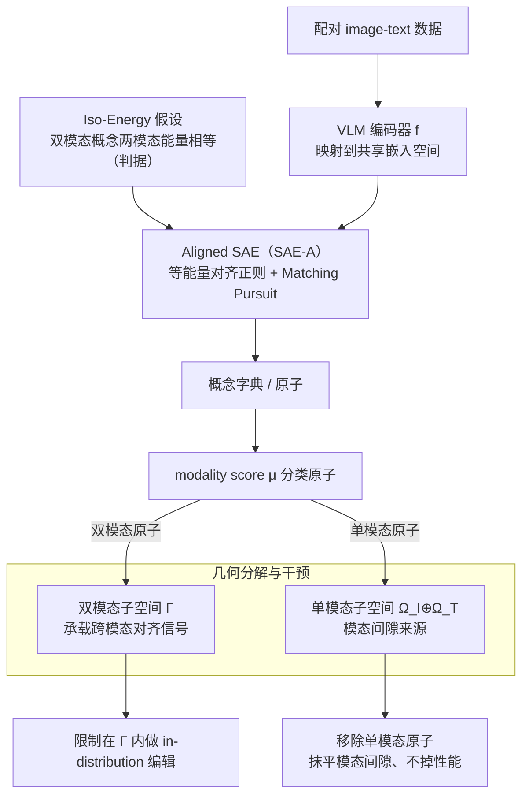

# Cross-Modal Redundancy and the Geometry of Vision-Language Embeddings

**会议**: ICLR 2026  
**arXiv**: [2602.06218](https://arxiv.org/abs/2602.06218)  
**代码**: [https://github.com/Parabrele/IsoEnergy](https://github.com/Parabrele/IsoEnergy)  
**领域**: 可解释性  
**关键词**: 模态间隙, 稀疏自编码器, 跨模态冗余, 等能量假设, VLM可解释性

## 一句话总结
提出 Iso-Energy 假设（真正跨模态共享的概念在不同模态中应具有相同的平均激活能量），并设计 Aligned SAE 作为分析工具，揭示 VLM 嵌入空间中双模态原子承载跨模态对齐信号、单模态原子完全解释模态间隙的几何结构。

## 研究背景与动机

**领域现状**：CLIP/SigLIP 等视觉-语言模型通过对比学习将图像和文本映射到共享嵌入空间，实现了跨模态对齐。但其嵌入空间的内部几何结构仍不清楚。

**现有痛点**：已知存在"模态间隙"（modality gap）现象——图像和文本嵌入位于隐空间中不相交的锥体中。之前的工作尝试通过移除均值差异或投影某些坐标方向来消除间隙，但这些干预都会损害跨模态性能。用稀疏自编码器（SAE）提取概念字典时，发现概念往往按模态分离，难以找到真正的双模态概念。

**核心矛盾**：VLM 明明是为跨模态对齐而训练的，但提取出的概念字典却大量按模态分离——这是因为概念恢复本身是一个欠定问题（非线性ICA不可辨识），缺乏额外归纳偏置时标准 SAE 无法正确区分双模态和单模态原子。

**本文目标** (a) 如何从 VLM 嵌入中准确恢复双模态 vs 单模态概念？ (b) 模态间隙的本质是什么？ (c) 能否在不损害性能的情况下消除模态间隙？

**切入角度**：从数据生成过程出发——如果多模态数据由共享的潜在概念向量通过各模态生成器产生，那么真正共享的概念应该在两个模态中留下"冗余的统计痕迹"，特别是相同的平均激活能量。

**核心 idea**：利用跨模态冗余作为归纳偏置，通过等能量约束引导 SAE 学到正确的双模态/单模态概念分解，从而揭示和操控 VLM 嵌入的几何结构。

## 方法详解

### 整体框架

这篇论文要回答的核心问题是：VLM 明明为跨模态对齐而训练，为什么用稀疏自编码器（SAE）提取出的概念字典却大量按模态分离、找不到真正的双模态概念？作者把它归结为一个可辨识性问题，并用「跨模态冗余」这个统计信号来破解。

整条思路建立在一个假想的多模态概念生成过程上：潜在概念向量 $\mathbf{c}$ 被稀疏采样，再经由模态特定生成器 $\mathbf{g}^{(d)}$ 投影成各模态的观测，VLM 编码器 $\mathbf{f}$ 把配对的 image-text 拉回到共享嵌入空间。在嵌入之上，作者用一个带等能量对齐正则的 **Aligned SAE**（由 **Iso-Energy 假设** 提供判据）学出概念字典；再用一个 modality score $\mu$ 把原子分成双模态与单模态两类，把嵌入空间切成承载跨模态信号的双模态子空间 $\Gamma$ 和构成模态间隙的单模态子空间 $\Omega$，最后据此做精确干预（移除单模态原子抹平间隙、限制在 $\Gamma$ 内做编辑）。整体是「编码 → 等能量约束下提取字典 → 几何分解 → 干预」一条线。

### 关键设计

**1. Iso-Energy 假设：用「能量相等」当作双模态概念的可检验判据**

可辨识性问题的根子在于：标准 SAE 没有任何理由相信某个原子是跨模态共享的——非线性 ICA 本身不可辨识，缺乏额外约束时它会把一个双模态概念错拆成两个单模态原子。作者从生成过程出发给出一个判据：如果概念 $k$ 真的由同一份潜在代码在两个模态里生成，那它在两个模态中留下的统计痕迹应当对得上，最直接的就是平均激活能量（平均平方激活）相同。形式化为等能量约束：

$$\mathbb{E}_{X \in \mathcal{X}^{(d)}}[\psi(X)_k^2] = \mathbb{E}_{X \in \mathcal{X}^{(d')}}[\psi(X)_k^2]$$

即概念 $k$ 在模态 $d$ 与 $d'$ 上的平均平方激活相等。这个量简单到只是一个二阶统计，却恰好为不可辨识的非线性 ICA 提供了一个有方向的归纳偏置，把「哪些原子该被当成双模态」从猜测变成可检验的命题——跨模态特征应当能量相当，模态特有的因子则不必。

**2. Aligned SAE（SAE-A）：把等能量假设落成一个轻量对齐正则**

有了判据还需要让 SAE 在训练时真的去满足它。SAE-A 以 Matching Pursuit SAE 为底座（用序贯残差更新实现 $\ell_0$ 稀疏，比 ReLU/TopK 更贴近稀疏编码的理论假设），在标准重建目标上加一项对齐正则：

$$\mathcal{L}_{\text{SAE-A}} = \mathcal{L}_{\text{SAE}} + \beta \cdot \mathcal{L}_{\text{align}}, \qquad \mathcal{L}_{\text{align}} = -\frac{1}{b}\text{Tr}\!\left(\mathbf{Z}^{(d)} \mathbf{Z}^{(d')^\top}\right)$$

其中 $\mathbf{Z}$ 是 $\ell_2$ 归一化后的编码、$b$ 为 batch size，这一项实际是在最大化配对 image-text 样本编码的余弦相似度——而它的最小值恰好与 Iso-Energy 一致：让来自两模态对齐样本的编码同向，等价于让共享原子在两模态上能量相同。关键在于权重 $\beta \approx 10^{-4}$ 极小：它足以把字典「轻推」向正确的双模态/单模态分解，却几乎不动重建质量——这正是它区别于「移除均值、投影掉若干坐标方向」等粗暴干预的地方，后者一压间隙就掉跨模态性能。

**3. 几何分解与干预：把概念字典翻译成嵌入空间的子空间结构**

最后一步是把恢复出的字典用回 VLM 嵌入的几何上。作者对每个原子算一个 modality score $\mu$（比较该原子在两模态上的能量），据此把字典分成双模态与单模态两类，对应地把嵌入空间切成双模态子空间 $\Gamma$ 与单模态子空间 $\Omega_I \oplus \Omega_T$。双模态原子张成 $\Gamma$，是一个与模态无关、正交于单模态方向的紧致子空间，承载真正的跨模态对齐信号；少数高能量单模态原子张成 $\Omega_{I/T}$，像「模态偏置」一样装着各模态特有的信息，复现了模态间隙的锥体几何。这个分解的价值在于让干预有的放矢——移除单模态原子就能抹平模态间隙而不碰跨模态性能，把向量运算限制在 $\Gamma$ 内则能得到更 in-distribution 的编辑，这是此前纯几何视角下做不到的精确操控。

### 损失函数 / 训练策略

基础 SAE 用 Matching Pursuit 做 $\ell_0$ 稀疏，通过序贯残差更新逐个挑选被激活的原子（实验中 expansion ratio 取 8、目标 $\ell_0 = 20$）。对齐项 $\mathcal{L}_{\text{align}}$ 最大化配对样本编码的余弦相似度，权重 $\beta \approx 10^{-4}$ 极小，对重建几乎无影响（$R^2$ 基本不降）。

## 实验关键数据

### 主实验

在 6 个 VLM（CLIP, CLIP-L, OpenCLIP, OpenCLIP-L, SigLIP, SigLIP2）上训练 SAE 和 SAE-A：

| 模型 | MSE (SAE/SAE-A) | R² (SAE/SAE-A) | 分类准确率 $p_{\text{acc}}$ (SAE/SAE-A) |
|------|------|----------|------|
| CLIP | 0.141/0.163 | 0.859/0.837 | 0.847/**0.915** |
| SigLIP2 | 0.115/0.115 | 0.884/0.885 | **0.897/0.899** |

- SAE-A 在重建质量几乎不变的情况下，显著提高了双模态原子的激活模式分类准确率

### 消融实验

| 实验 | 关键指标 | 说明 |
|------|---------|------|
| 合成数据 (Iso-Energy成立) | SAE: W=0.396, mma=0.29; SAE-A: W=0.184, mma=0.52 | SAE-A 恢复双模态原子显著更好 |
| 合成数据 (Iso-Energy不成立) | 两者: W≈0.19, mma≈0.82 | 正则化器不会强行创造双模态原子 |
| 移除单模态原子 | 模态间隙消失 + 跨模态性能不降 | 验证了单模态原子=模态间隙的解释 |
| 仅在双模态子空间做向量运算 | 检索性能提升 + 编辑更 in-distribution | 双模态子空间是跨模态操作的正确空间 |

### 关键发现
- 稀疏双模态原子承载了全部跨模态对齐信号——数量少但信息集中
- 少数高能量单模态原子充当"模态偏置"，完全解释了模态间隙
- 移除单模态原子可以在不损害下游性能的情况下消除模态间隙（之前所有方法做不到）
- 将向量运算限制在双模态子空间内可以产生 in-distribution 编辑，改善检索效果
- 与 Papadimitriou et al. (2025) 的发现相反：跨模态信息由共享原子而非特异性原子承载

## 亮点与洞察
- **等能量假设**的简洁与深刻：一个如此简单的统计量（各模态的平均平方激活相等）就足以作为双模态概念的判别标准，且有坚实的生成模型支撑。这个思想可迁移到任何多视角/多模态的概念提取任务
- **"不伤害就是最好的验证"策略**：在合成数据上证明当假设不成立时正则化器是"中性"的（不会fabricate双模态概念），这种验证方式非常巧妙，避免了人为引入偏差的质疑
- **模态间隙的概念级解释**：将之前纯几何的描述（锥体、椭球壳）提升到概念层面（单模态原子=模态偏置），使得间隙不再是需要"消除"的bug，而是模型正确保留模态特定信息的feature
- **Matching Pursuit SAE**：使用 $\ell_0$ 稀疏而非 ReLU/TopK，更符合稀疏编码的理论假设，可迁移到其他SAE应用场景

## 局限与展望
- Iso-Energy 假设要求概念在两个模态中有完全相同的能量，但现实中某些概念可能天然在视觉中更丰富（如颜色、纹理），这种不对称性未被讨论
- 实验仅在双编码器（dual-encoder）VLM 上验证，未扩展到单编码器或编码器-解码器架构（如 LLaVA、Flamingo）
- SAE-A 需要配对的 image-text 数据进行训练，限制了其在未配对数据上的应用
- 对齐正则化的权重 $\beta$ 虽然很小，但仍需要调节，不是完全无超参数的
- 双模态/单模态的二元划分可能过于粗糙，实际中可能存在"部分双模态"的概念

## 相关工作与启发
- **vs Liang et al. (2022) 模态间隙**: 他们描述了间隙的几何现象（锥体结构），但尝试消除间隙会损害性能。本文解释了为什么——间隙来自单模态原子，承载必要的模态特定信息，但可以在概念层面精确移除
- **vs Schrodi et al. (2025)**: 他们尝试通过投影少数canonical方向来消除间隙，但"误伤"了双模态信息。本文的SAE-A能正确分离，避免误伤
- **vs Papadimitriou et al. (2025)**: 他们认为跨模态信息由特异性（idiosyncratic）概念承载，本文发现恰恰相反——由共享原子承载。差异来自标准SAE的可辨识性问题
- **vs 柏拉图表示假设 (Huh et al. 2024)**: 本文的等能量假设可以看作是这一假设的可操作化版本——如果不同模型/模态收敛到相同特征，那么这些特征的统计量应跨模态一致

## 评分
- 新颖性: ⭐⭐⭐⭐⭐ Iso-Energy假设简洁优雅，首次在概念层面完整解释模态间隙
- 实验充分度: ⭐⭐⭐⭐ 合成+真实数据验证充分，但缺少非dual-encoder结构
- 写作质量: ⭐⭐⭐⭐⭐ 理论动机清晰，实验逻辑严密，图表设计精美
- 价值: ⭐⭐⭐⭐⭐ 对VLM可解释性有重要推动，Aligned SAE有广泛应用前景

<!-- RELATED:START -->

## 相关论文

- [\[ICLR 2026\] Bridging Explainability and Embeddings: BEE Aware of Spuriousness](bridging_explainability_and_embeddings_bee_aware_of_spuriousness.md)
- [\[ICLR 2026\] The Geometry of Reasoning: Flowing Logics in Representation Space](the_geometry_of_reasoning_flowing_logics_in_representation_space.md)
- [\[CVPR 2026\] Missing No More: Dictionary-Guided Cross-Modal Image Fusion under Missing Infrared](../../CVPR2026/interpretability/missing_no_more_dictionary-guided_cross-modal_image_fusion_under_missing_infrare.md)
- [\[ICLR 2026\] Exploring Interpretability for Visual Prompt Tuning with Cross-layer Concepts](exploring_interpretability_for_visual_prompt_tuning_with_cross-layer_concepts.md)
- [\[ICLR 2026\] Modal Logical Neural Networks for Financial AI](modal_logical_neural_networks_for_financial_ai.md)

<!-- RELATED:END -->
