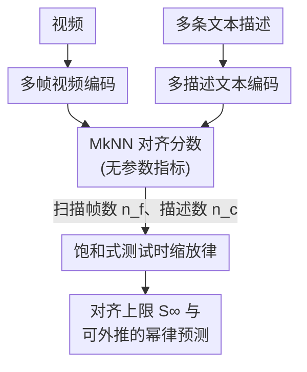

# Dynamic Reflections: Probing Video Representations with Text Alignment

**会议**: ICLR 2026  
**arXiv**: [2511.02767](https://arxiv.org/abs/2511.02767)  
**代码**: [https://video-prh.github.io](https://video-prh.github.io)  
**领域**: 可解释性 / 表示学习  
**关键词**: 视频表示对齐, 柏拉图表示假说, 测试时缩放律, 跨模态对齐, 自监督学习

## 一句话总结

本文首次将柏拉图表示假说 (PRH) 从静态图像-文本扩展到时序视频-文本领域，通过对 121 个视觉与语言模型的系统评估，揭示了测试时增加帧数与描述数可将对齐分数提升近一倍的现象，并提出 $R^2 > 0.98$ 的饱和式缩放律来量化这一行为。

## 研究背景与动机

柏拉图表示假说 (Platonic Representation Hypothesis, PRH) 指出：随着神经网络在容量、数据多样性和任务种类上扩展，不同模型学到的内部表示会趋向一个共享的、与模态无关的通用统计模型。此前 Huh et al. (2024) 在图像-文本静态模态上验证了该假说，发现独立训练的视觉编码器（如 DINOv2）和语言编码器之间的潜空间具有显著的结构相似性。

然而，先前的验证存在两个核心缺陷：

1. **模态局限**：所有实验都集中在静态模态（图像与文本），视频数据中蕴含的运动、因果关系和时序依赖信息在表示对齐研究中被完全忽略。PRH 的假说是面向所有模态提出的，但其在时序领域的有效性仍是开放问题。

2. **对齐分数的可解释性**：Huh et al. (2024) 提出了一个未解决的问题——最高对齐分数仅为 0.16，究竟算高还是低？这个绝对值难以解释。

本文的核心观察是：先前报告的有限对齐很大程度上是因为**测试时提供的数据太少**（单帧 + 单条描述）。通过提供多帧视频和多条文本描述，对齐分数可以大幅提升到接近 0.4，且不需要修改任何已训练模型。这一发现将"测试时缩放"确立为与训练时缩放互补的全新维度。

## 方法详解

### 整体框架

本文不训练新模型，而是搭建一套"测试时缩放"的探针框架：固定一对独立训练好的视频编码器和文本编码器，只改变喂给它们的数据量——把视频从单帧扩展到多帧、把描述从单条扩展到多条——再用一个无参数的对齐指标读出两个潜空间有多相似。对齐强弱仍沿用 Huh et al. (2024) 的 Mutual $k$-NN (MkNN) 指标：给定 $N$ 个视频-文本对，分别编码得到嵌入矩阵 $\mathbf{X} \in \mathbb{R}^{N \times p}$、$\mathbf{Y} \in \mathbb{R}^{N \times q}$，各自构造 $k$-近邻二值指示矩阵 $\mathbf{M_X}$、$\mathbf{M_Y}$，对齐分数为两者重合近邻的比例

$$\mathcal{A}^{\text{MkNN}}(\mathbf{X}, \mathbf{Y}) = \frac{1}{kN} \sum_{i=1}^{N} \sum_{j=1}^{N} (\mathbf{M_X} \odot \mathbf{M_Y})_{ij}$$

其中 $\odot$ 为 Hadamard 积，$k$ 取 10（数据集 1024 样本），并对两个编码器的所有中间层组合做搜索取最优层对。整体流程是一个双分支结构：视频走多帧编码、文本走多描述编码，两条潜空间在 MkNN 指标处汇合得到对齐分数，再扫描帧数与描述数把分数随数据量的变化拟合成一条饱和缩放律。

### 关键设计

**1. 多帧视频编码：让时序信息进入表示，而不是只看一张图**

先前 PRH 验证只喂单帧，等于把视频压成静态图像，运动和因果关系全部丢失，这正是对齐分数偏低的根源之一。本文对一个原生处理 $n_o$ 帧的编码器，通过均匀线性插值抽取目标帧数 $n_f$；当 $n_f > n_o$ 超出窗口时，把视频切成若干段 $n_o$ 长度的子片段分别编码再对结果取平均，从而在不改动模型的前提下吞下最多 $n_f = 80$ 帧。$n_f = 1$ 时该设置自然退化回原来的图像-文本对齐，保证可比性；对纯图像模型还额外提供"仅首帧"和"跨 8 帧平均特征"两种变体，用来区分增益是来自时序建模能力还是单纯的特征平滑。

**2. 多描述文本编码：用多个视角逼近视频的完整语义**

一条描述只覆盖视频的一个侧面，单描述设置会系统性低估视觉-语言的真实共享结构。本文把多条描述拼成一个长字符串送入文本编码器（包括 Gemma 2 这类纯生成式 LLM），取中间层特征并沿 token 维度求均值，得到 $[\text{layer}, \text{hidden\_dim}]$ 的句向量。VATEX 天然为每个视频提供 10 条不同标注者撰写的独立描述，可直接做多描述评估；而 PVD 只有单条长描述，则用 Gemini-2.5 Pro 将其拆成 10 条短描述——实验显示这种合成拆分同样能提升对齐，说明增益来自语义覆盖的扩展而非额外人工标注。

**3. 饱和式测试时缩放律：把"加数据涨对齐"写成可预测的幂律**

仅观察到分数上升还不够，本文进一步用一个参数化饱和模型刻画对齐分数对帧数 $n_f$ 与描述数 $n_c$ 的双重依赖

$$\text{score}(n_f, n_c) = S_{\infty} - (C_f \cdot n_f^{-\alpha} + C_c \cdot n_c^{-\beta})$$

其中 $S_{\infty}$ 是数据无限时的理论饱和分数，$C_f, C_c$ 是帧端、描述端的误差系数，$\alpha, \beta$ 是各自的幂律衰减指数。它与 Hoffmann et al. (2022) 的训练时 compute-optimal scaling law 形成对偶：$S_{\infty}$ 对应理想对齐上限，后面两项是有限测试数据带来的误差惩罚，会随帧数和描述数增多以幂律速度衰减。该模型在 VideoMAEv2 与 DINOv2 上拟合均达 $R^2 > 0.98$，证明"测试时加数据"不是噪声涨点，而是高度规律、可外推的行为，从而把测试时缩放确立为与训练时缩放互补的独立维度。

## 实验关键数据

### 主实验：视频-文本对齐分数

在 VATEX（10 秒视频 + 10 条标注）和 PVD 数据集上，使用 1024 个样本的测试集：

| 视觉模型 | 类型 | 文本编码器 | 帧/描述数 | MkNN 对齐分数 |
|---------|------|----------|---------|-------------|
| DINOv2 | 图像 (单帧) | 非 Gemma 最佳 | 1帧 / 1描述 | ~0.18 |
| DINOv2 | 图像 (单帧) | Gemma 2 9B-it | 1帧 / 1描述 | ~0.206 |
| DINOv2 | 图像→视频 (8帧均值) | Gemma 2 9B-it | 8帧 / 1描述 | ~0.223 |
| VideoMAEv2 | 原生视频 | Gemma 2 9B-it | 多帧 / 多描述 | ~0.41 ($S_{\infty}$) |
| DINOv2 | 图像→视频 | Gemma 2 9B-it | 多帧 / 多描述 | ~0.37 ($S_{\infty}$) |

核心发现：从最简设置 (0.18) 到完全利用测试时数据 (0.41)，对齐分数提升超过 **2 倍**。

### 缩放律拟合与消融分析

| 拟合参数 | VideoMAEv2 | DINOv2 | 解读 |
|---------|-----------|--------|------|
| $S_{\infty}$ (饱和分数) | 0.41 | 0.37 | 视频模型理论上限更高 |
| $C_f$ (帧误差系数) | 0.15 | 0.05 | 视频模型受帧数影响 **3 倍** |
| $C_c$ (描述误差系数) | 0.13 | 0.13 | 文本端影响相当 |
| $\alpha$ (帧衰减指数) | 0.75 | 1.76 | 视频模型衰减更慢，需更多帧才饱和 |
| $\beta$ (描述衰减指数) | 1.30 | 1.40 | 描述端衰减相近 |
| $R^2$ | 0.9791 | 0.9964 | 拟合质量极高 |

| 消融维度 | 变化范围 | 关键观察 |
|---------|---------|---------|
| 帧数 $n_f$ | 1 → 80 | 对齐稳步上升，视频模型获益远大于图像模型 |
| 描述数 $n_c$ | 1 → 10 | 平均提升对齐 **60%**，早期增长最快 |
| 下游语义任务 (SSv2, K700) | — | 与对齐分数呈**强正相关** |
| 下游非语义任务 (深度、位姿) | — | 也呈正相关，但点跟踪除外 |
| 时序敏感性 (Test of Time) | $k=1,2,3$ | $k=3$ 时几乎完美对齐；$k=1,2$ 差异大，LLM 偏词袋 |
| 时序敏感性 (VideoComp) | 正 vs 负描述 | 高对齐模型受时序重排干扰更大 |
| 合成多描述 (PVD) | 1条→10条合成 | 从单条长描述合成短描述也能提升对齐 |

## 亮点与洞察

- **首次将 PRH 扩展到时序领域**：系统评估了 85 个视觉模型 × 36 个语言模型的组合，填补了视频模态在表示对齐研究中的空白，证明时序信息为语义理解提供了强信号
- **测试时缩放律的发现**：类比训练阶段的 compute-optimal scaling laws，提出了测试时数据缩放律，$R^2 > 0.98$ 的拟合质量说明对齐分数对帧数/描述数的依赖是高度可预测的幂律行为
- **回答了关键开放问题**：Huh et al. (2024) 提出"0.16 的对齐分数究竟算高还是低"的疑问，本文给出了清晰答案——是测试时数据匮乏导致的低估，充分数据下可达 0.4+
- **零样本评估指标的实用价值**：视频-文本对齐与下游任务（语义 + 非语义）的强相关性表明，它可以替代昂贵的任务特定评估来指导视频模型开发
- **自监督视频模型的潜力**：VideoMAEv2 在无任何文本监督的条件下超越 DINOv2 的对齐分数，证明纯视频自监督训练也能学到与语言空间高度对齐的表示

## 局限与展望

1. **局部任务覆盖不足**：点跟踪任务与对齐的相关性很弱，说明当前 MkNN 指标更侧重全局语义，难以捕捉局部细粒度时空能力
2. **视频基础模型仍有差距**：许多原生视频模型的对齐分数低于帧级平均的图像模型，说明视频编码器的训练范式仍有优化空间
3. **生成式视频模型的表示利用**：当前生成式视频模型（如视频扩散模型）的潜在表示与文本对齐很弱，如何发挥其理解能力是开放问题
4. **数据集多样性有限**：主要使用 VATEX（10 秒短视频）和 PVD 数据集，对长视频和更复杂时序推理场景的覆盖不足
5. **描述效应的混杂因素**：增加描述数既增加了语义覆盖又增加了视角多样性，两者对对齐的贡献未被解耦

## 相关工作与启发

本文处于三个方向的交汇处：(1) 柏拉图表示假说与涌现对齐 — 延续 Huh et al. (2024) 和 Maniparambil et al. (2024) 的静态模态工作，首次推向时序领域；(2) 自监督视频表示学习 — 以 VideoMAEv2、V-JEPA 为代表的大规模无标注视频预训练，本文为其提供了新的零样本评估手段；(3) 缩放律研究 — 与 Hoffmann et al. (2022) 的训练时 scaling laws 形成对偶，开辟了"测试时 scaling"的系统研究方向。此外，Gemma 2 系列作为纯文本生成模型却作为最优文本编码器的发现，呼应了 Zhang et al. (2025) 关于语言模型在多模态对齐中重要性的结论。

## 评分

- 新颖性: ⭐⭐⭐⭐ — 首次将 PRH 扩展至视频领域，测试时缩放律发现新颖且有预测力
- 实验充分度: ⭐⭐⭐⭐⭐ — 121 个模型组合覆盖广泛，多数据集验证，缩放律拟合严谨
- 写作质量: ⭐⭐⭐⭐ — 结构清晰，图表丰富直观，核心发现阐述精确
- 价值: ⭐⭐⭐⭐ — 对视频表示学习的评估范式和多模态对齐理论均有启发意义

<!-- RELATED:START -->

## 相关论文

- [\[ICLR 2026\] One Language, Two Scripts: Probing Script-Invariance in LLM Concept Representations](one_language_two_scripts_probing_script-invariance_in_llm_concept_representation.md)
- [\[CVPR 2026\] Learning complete and explainable visual representations from itemized text supervision](../../CVPR2026/interpretability/learning_complete_and_explainable_visual_representations_from_itemized_text_supe.md)
- [\[ACL 2026\] Rhetorical Questions in LLM Representations: A Linear Probing Study](../../ACL2026/interpretability/rhetorical_questions_in_llm_representations_a_linear_probing_study.md)
- [\[ICLR 2026\] Beyond Linear Probes: Dynamic Safety Monitoring for Language Models](beyond_linear_probes_dynamic_safety_monitoring_for_language_models.md)
- [\[AAAI 2026\] Probing Preference Representations: A Multi-Dimensional Evaluation and Analysis Method for Reward Models](../../AAAI2026/interpretability/probing_preference_representations_a_multi-dimensional_evaluation_and_analysis_m.md)

<!-- RELATED:END -->
