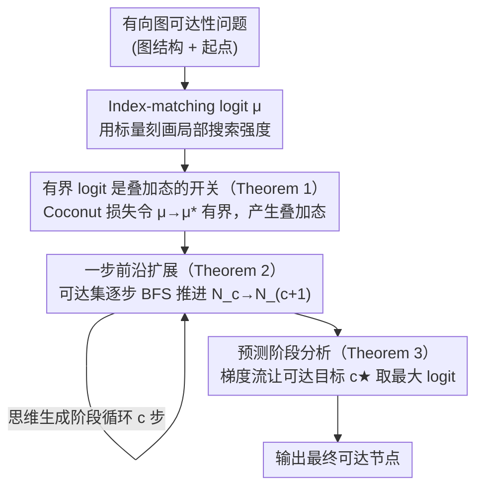

# Emergence of Superposition: Unveiling the Training Dynamics of Chain of Continuous Thought

**会议**: ICLR 2026  
**arXiv**: [2509.23365](https://arxiv.org/abs/2509.23365)  
**代码**: 无  
**领域**: 可解释性 / LLM 推理理论  
**关键词**: Continuous CoT, 叠加态, 训练动力学, Transformer 理论, 图可达性

## 一句话总结

从理论上分析了两层 Transformer 在有向图可达性问题上使用连续 Chain-of-Thought（Coconut）训练时的训练动力学，揭示了"叠加态"（superposition）机制如何自然涌现：index-matching logit 先增长后有界，从而在探索与利用之间取得平衡。

## 研究背景与动机

**连续 CoT 的经验优势**：Coconut（Hao et al., 2024）通过将推理轨迹保持在连续潜空间而非离散 token 空间，在多任务上展现了理论和实验优势

**叠加态机制的构造性证明**：先前工作（Zhu et al., 2025）证明了两层 Transformer + 连续 CoT 可通过"叠加态"高效求解图可达性问题，即模型在不确定时同时保持多条推理轨迹

**核心空白**：构造性证明只展示了存在这样的参数，但未解释基于梯度的训练方法是否能自然学到叠加态机制

**与离散 CoT 的对比**：离散 CoT 每步只能选择一条路径（需要全局规划或回溯），而连续 CoT 可以并行保持多条路径（仅需局部搜索能力）

**理论贡献定位**：回答"梯度下降是否自然导致叠加态构造"这一开放问题

## 方法详解

### 整体框架

全文是一套围绕两层 Transformer + 连续 CoT（Coconut）在有向图可达性任务上的梯度流分析，把训练拆成"思维生成"与"答案预测"两个阶段：前者让模型自回归地把当前可达节点集向外扩展一步，后者让模型读出叠加态思维并输出最终可达节点。分析的核心抓手是一个被称作 index-matching logit 的标量 μ，整条理论链就是证明梯度流会把 μ 推到一个有限正值，而这个"有界"恰好是叠加态自然涌现的根因。串起来的逻辑链是：定义 μ → 证明 μ 有界（产生叠加态）→ 叠加态做一步步 BFS 扩展 → 预测头从叠加态里读出正确答案。

### 关键设计

**1. Index-matching logit μ：用一个标量刻画局部搜索强度**

为了把"模型有多依赖局部图结构去匹配下一条边"压成可分析的量，作者定义了 index-matching logit μ，它控制注意力里"当前已探索节点"对"候选边源节点"的匹配强度。μ 的大小直接决定模型的行为风格：μ 太小时注意力近似均匀，模型退化成随机猜测、没有局部搜索能力；μ 太大时注意力近似 one-hot，模型过度自信地只盯着局部特征（如节点入度最高的邻居），从而丢掉正确路径。在 Coconut 损失下，μ 沿梯度流的演化满足 $\dot{\mu}(t) = \frac{\alpha}{n\sqrt{K}}\big(d_{p_{c+1}} - F(\mu(t))\big)$，右端是一个示范路径入度项减去随 μ 单调增的 $F(\mu)$，因此 μ 不会无限增长，而是收敛到使两项平衡的有限值——这给后面所有结论铺了底。

**2. 有界 logit 是叠加态的开关（Theorem 1）**

定理 1 把训练目标和 logit 的渐近行为直接对应起来：在 Coconut 损失下，只要目标节点入度 $d_\star < d_{max}$，就有 $\mu(t)\to\mu^\ast<\infty$；而换成 Coconut-BFS 损失时 $\mu(t)\to\infty$，至少以对数速率发散。这个对比是整篇文章的关键——有界的 μ 让 softmax 给出平滑的概率分布，模型在不确定时会对多条候选路径赋予相近的权重，这正是"叠加态"：同时保留多条推理轨迹。反过来，发散的 μ 把分布压成接近 one-hot，模型过早承诺于单一路径，一旦猜错就无法恢复。所以叠加态能否出现，本质上由训练损失是否让 logit 有界来决定。

**3. 一步前沿扩展（Theorem 2）**

光证明 μ 有界还不够，得说明这样的 μ 真的能做 BFS 式的并行扩展。定理 2 证明当 μ > 0 时，下一步思维的 token 投影 $\mathbf{U}^\top[t_{c+1}]$ 只在一步扩展集 $\mathcal{N}_{c+1}$ 上有正质量，其系数 $\beta_v$ 恰好由两部分构成：carryover（已经在 $\mathcal{N}_c$ 里的节点继续保留）和 one-hop expansion（沿边新加入的节点）。也就是说，连续思维每生成一步，可达集就从 $\mathcal{N}_c$ 干净地推进到 $\mathcal{N}_{c+1}$，既不丢老节点也不混入不可达节点，从而把"有界正 μ"和"宽度优先搜索"画上等号。

**4. 预测阶段分析（Theorem 3）**

最后一环是证明叠加态思维真能读出正确答案。定理 3 分析答案预测阶段的梯度流：在所有候选里，只有真正可达的目标 c★ 同时拥有正的 residual carryover 和 candidate lift，而梯度流会把预测头里的一对 logit 比值 $(\mu_A(t),\mu_R(t))$ 收敛到能让 c★ 取得最大 logit 的方向。这样就闭合了一条完整的端到端理论链：训练自然把 μ 推到有界正值 → 有界值产生叠加态 → 叠加态做一步步并行扩展 → 预测头从叠加态里挑出正确可达节点。

### 损失函数 / 训练策略

实际使用的是 Coconut 损失 $\ell^{coco} = -\log \frac{\exp(\xi_{p_{c+1}})}{\sum_v \exp(\xi_v)}$，它只对单条示范路径上的下一节点做交叉熵；作为对照的 Coconut-BFS 损失 $\ell^{BFS} = -\log \frac{\sum_{v \in \mathcal{N}_{c+1}} \exp(\xi_v)}{\sum_v \exp(\xi_v)}$ 则对所有可达节点做多标签交叉熵，正是它导致 logit 发散。为了利用顶点对称性，分析采用排列平均的数据集损失；训练则走课程学习（curriculum learning），阶段 c+1 先无监督地生成 c 步连续思维，再训练第 c+1 步的扩展。这里一个反直觉之处是：Coconut 损失明明只监督了单条路径，叠加态却仍然涌现，原因正是它没有逼 logit 发散。

## 实验关键数据

### 主实验

| 设置 | 模型 | 测试精度 |
|------|------|---------|
| GPT-2 style, 2层, d=768 | Coconut 训练 | 96.2% |
| 训练策略 | 阶段1: 150 epochs, 后续各25 epochs | 共350 epochs |
| 阶段混合概率 | 0.1（防止遗忘前阶段能力） | - |

图可达性问题数据集来自 ProsQA（Hao et al., 2024）的子集，额外使用了随机顶点排列。

### 消融实验

| 训练阶段 | 现象 | 理论预测 |
|----------|------|---------|
| Stage 1 (c=1) | logit 差值稳步增长，约125 epochs饱和在~60 | Theorem 1: μ 有界 ✓ |
| Stage 2 (c=2) | 极少epochs即建立正μ | 叠加态机制复用 ✓ |
| Stage 3-4 (c=3,4) | 未显式训练但自动泛化 | 长度泛化 ✓ |

### 关键发现

1. **Coconut 损失自然产生有界 logit**：即使训练数据只提供单一示范路径，叠加态仍能涌现——这回答了 Zhu et al. (2025) 提出的开放问题
2. **有界 logit 是叠加态涌现的关键机制**：平衡了探索（保持多条可能路径）与利用（利用局部图结构识别相关路径）
3. **长度泛化**：一旦叠加态在早期阶段涌现，后续阶段能快速复用，即使从未在更长序列上训练
4. **与离散 CoT 理论的对比**：离散设置中 logit 通常对数增长且无界（Tian et al., 2023a; Nichani et al., 2024a），连续设置的有界行为是本质差异

## 亮点与洞察

- **填补了构造性证明与训练动力学之间的空白**：之前只知道叠加态"可以存在"，现在知道"会自动出现"
- **反直觉发现**：即使训练数据只展示单条路径（单示范），模型仍学会同时追踪多条路径——这是连续潜空间的独特优势
- **exploration-exploitation 的新视角**：将注意力 logit 的有界性与推理中的探索-利用权衡直接联系，为理解 LLM 内部推理机制提供了新工具
- **理论与实验高度一致**：logit 增长后饱和的实验曲线完美验证了理论预测

## 局限与展望

1. 分析限于两层 Transformer + 线性注意力的简化设置，与实际深层 softmax 注意力的 Transformer 有差距
2. 仅考虑有向图可达性问题，对更一般推理任务的推广需要额外工作
3. 假设第一层的 copy 机制已经建立（引用已有工作），未分析其学习过程
4. 排列对称性假设在实际 LLM 训练中未必严格成立
5. 实验规模有限（2层Transformer，简单图结构），需要在更大模型和更复杂任务上验证

## 相关工作与启发

- **Zhu et al. (2025)**：本文的直接前驱，提供了连续 CoT 求解图可达性的构造性证明——本文补充了训练动力学分析
- **Hao et al. (2024) Coconut**：提出了连续 CoT 的概念和课程学习方法——本文解释了其成功的理论基础
- **Nichani et al. (2024a)**：分析了 induction head 的训练动力学，但在离散设置中 logit 发散——与本文的有界结果形成对比
- 对 latent-space reasoning（pause token、filler token、planning token）方向有理论指导意义：连续空间的"探索-利用平衡"可能是这些方法成功的共同机制

## 评分

- **新颖性**: ⭐⭐⭐⭐⭐ 首次从训练动力学角度解释连续 CoT 中叠加态的涌现机制
- **实验充分度**: ⭐⭐⭐ 实验规模有限，主要作为理论验证，缺少大规模模型和真实推理任务
- **写作质量**: ⭐⭐⭐⭐ 数学推导清晰，图示直观，但前置知识要求较高
- **价值**: ⭐⭐⭐⭐ 为理解连续 CoT 工作原理提供了坚实理论基础，对 latent reasoning 方向有广泛启发

<!-- RELATED:START -->

## 相关论文

- [\[NeurIPS 2025\] Reasoning by Superposition: A Theoretical Perspective on Chain of Continuous Thought](../../NeurIPS2025/interpretability/reasoning_by_superposition_a_theoretical_perspective_on_chain_of_continuous_thou.md)
- [\[ICLR 2026\] Hidden Breakthroughs in Language Model Training](hidden_breakthroughs_in_language_model_training.md)
- [\[ICLR 2026\] Closing the Curvature Gap: Full Transformer Hessians and Their Implications for Scaling Laws](closing_the_curvature_gap_full_transformer_hessians_and_their_implications_for_s.md)
- [\[ICLR 2026\] How Do Transformers Learn to Associate Tokens: Gradient Leading Terms Bring Mechanistic Understanding](how_do_transformers_learn_to_associate_tokens_gradient_leading_terms_bring_mecha.md)
- [\[ICLR 2026\] Evolution of Concepts in Language Model Pre-Training](evolution_of_concepts_in_language_model_pre-training.md)

<!-- RELATED:END -->
