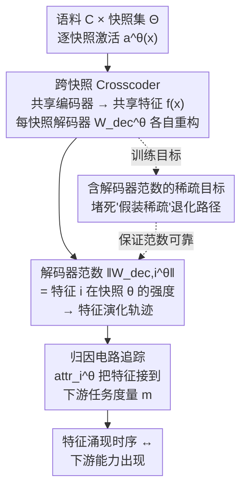

# Evolution of Concepts in Language Model Pre-Training

**会议**: ICLR 2026  
**arXiv**: [2509.17196](https://arxiv.org/abs/2509.17196)  
**代码**: [GitHub](https://github.com/OpenMOSS/Language-Model-SAEs)  
**领域**: 可解释性  
**关键词**: 机制可解释性, crosscoders, sparse autoencoders, 训练动态, feature evolution, 预训练, Pythia

## 一句话总结

首次将 crosscoders（跨快照稀疏字典学习）应用于追踪语言模型预训练过程中特征的涌现和演化，发现预训练存在"统计学习→特征学习"两阶段相变，并通过归因分析将微观特征演化与宏观下游任务指标因果关联。

## 研究背景与动机

- **预训练仍是黑箱**：尽管 scaling laws 揭示了计算、数据和损失的宏观关系，模型内部参数的重组过程仍不清楚
- **现有理论框架的局限**：NTK、信息瓶颈理论、奇异学习理论等提供了泛化和 grokking 的高层解释，但无法回答"模型在预训练中如何发展其能力"
- **SAE 的静态局限**：稀疏自编码器（SAE）已被证明能从全训练模型中提取可解释特征，但几乎所有分析都针对训练完成的模型，特征如何涌现和演化的过程仍未被探索
- **Crosscoders 的新机会**：Lindsey 等人提出的 crosscoders 原用于跨层特征对齐，本文创新性地将其适配于跨快照分析

## 方法详解

### 整体框架

这篇论文要解决的问题是：scaling laws 只告诉我们计算/数据/损失的宏观关系，模型内部的特征究竟在预训练的哪一步、以什么顺序长出来，仍是黑箱。整体思路是把 crosscoders（原本用于跨层特征对齐的稀疏字典）改造成「跨快照」字典——同时吃进同一段语料在多个预训练快照上的激活，用一个**共享编码器**把它们投影到统一的特征空间，再用**每快照各一份的解码器**重构回各快照的激活。这样「同一个特征」在不同训练步上的强弱就能被对齐对比，解码器范数随快照的变化曲线即是这条特征的涌现-演化轨迹；最后叠加一层**归因电路追踪**，把这些微观特征的兴衰与下游任务表现因果地挂上钩。

### 关键设计

**1. 跨快照 Crosscoder：用快照专属解码器换来共享特征空间**

静态 SAE 只能解剖一个训练完成的模型，无法回答「特征是何时长出来的」。本文给定语料 $\mathcal{C}$ 和快照集 $\Theta$，让编码器聚合所有快照的激活、产出一份共享的特征激活 $f(x) = \sigma\!\left(\sum_{\theta \in \Theta} W_{\text{enc}}^{\theta} a^{\theta}(x) + b_{\text{enc}}\right)$，而解码器 $W_{\text{dec}}^{\theta}$ 是每个快照各一份、独立重构 $\hat{a}^{\theta}(x) = W_{\text{dec}}^{\theta} f(x) + b_{\text{dec}}^{\theta}$。共享编码器保证「同一个特征」在所有快照里指代一致，快照专属解码器则让同一特征可以在不同步上有不同强度。这一拆分带来一个极简却好用的代理指标：解码器范数 $\|W_{\text{dec},i}^{\theta}\|$ 直接反映特征 $i$ 在快照 $\theta$ 的强度与存在性——当某特征只在部分快照「存在」时，稀疏惩罚会自然把不相关快照的解码器范数压到接近零，于是范数随快照的变化曲线就是这条特征的演化轨迹。

**2. 含解码器范数的稀疏目标：防止 $L_0$ 近似下的退化**

训练目标是重构与稀疏两项之和：

$$\mathcal{L}(x) = \sum_{\theta \in \Theta} \|a^{\theta}(x) - \hat{a}^{\theta}(x)\|^2 + \lambda_{\text{sparsity}} \sum_{\theta \in \Theta} \sum_{i} \Omega\!\big(f_i(x) \cdot \|W_{\text{dec},i}^{\theta}\|\big)$$

其中 $\Omega(\cdot)$ 是 $L_0$ 的可微替代。关键巧思是把解码器范数 $\|W_{\text{dec},i}^{\theta}\|$ 乘进稀疏项里：在不完美的 $L_0$ 近似下，模型本可以靠压低激活值 $f_i(x)$、同时膨胀解码器范数来「假装稀疏」，把范数纳入惩罚就堵死了这条退化路径，也让设计 1 那个「范数即特征强度」的代理指标真正可靠。激活函数采用带学习阈值的 JumpReLU，在重构-稀疏权衡上优于传统的 ReLU+L1 组合。

**3. 归因电路追踪：把特征演化接到下游任务**

光有特征轨迹还不够，得证明这些特征真的驱动了模型行为。本文用基于归因的电路追踪给每个特征算一个对任务度量 $m$ 的贡献分 $\text{attr}_i^{\theta}(x) = f_i(x) \cdot \frac{\partial m(a^{\theta}(x))}{\partial f_i(x)}$；对于有干净/污染输入对的任务（如主谓一致），改用归因修补 $\text{attr}_i^{\theta}(x, \tilde{x}) = [f_i(x) - f_i(\tilde{x})] \cdot \frac{\partial m(a^{\theta}(x))}{\partial f_i(x)}$，度量「把特征从污染态换成干净态」对输出的因果影响。实际计算用积分梯度（IG）版本以提高线性近似的准确性。因为这套归因可以在每个快照上单独跑，就能看出同一任务的关键特征如何随训练交替主导，从而把「特征何时涌现」与「下游能力何时出现」对齐起来。

实验配置上，分析对象为 Pythia-160M（Layer 6）与 Pythia-6.9B（Layer 16），从 154 个公开快照中策略性选取 32 个（前 10K 步全取 20 个 + 后期均匀采样 12 个），字典最大 98,304 维（160M）和 32,768 维（6.9B），训练语料为 SlimPajama。

## 实验关键数据

### 主实验

**Crosscoder 重构质量（Pythia-160M）**

| 特征数 | 解释方差 | L0 范数 |
|--------|----------|---------|
| 32,768 | ~92% | ~40 |
| 65,536 | ~95% | ~35 |
| 98,304 | ~97% | ~30 |

增大字典大小在解释方差和稀疏性两个维度均获得 Pareto 改进。Crosscoders 的 Pareto 前沿甚至略优于仅在最终快照训练的 SAE。

**特征演化模式**

| 特征类型 | 涌现时间 | 持续性 |
|----------|----------|--------|
| 初始化特征 | 随机初始化即存在 | 步骤 128 处突降后回升，随后逐渐衰减 |
| 涌现特征（简单） | ~步骤 1,000 | 多数持续 60%+ 的快照 |
| 涌现特征（复杂） | 步骤 10,000–100,000 | 多数持续 60%+ 的快照 |

**特征类型与涌现时序（Pythia-6.9B）**

| 特征类型 | 涌现时间范围 |
|----------|-------------|
| Previous Token 特征 | 步骤 1,000–5,000 |
| Induction 特征 | 步骤 10,000–100,000 |
| 上下文敏感特征 | 步骤 10,000–100,000 |

### 消融实验

**主谓一致任务（SVA Across-PP）归因分析**

关键贡献特征按涌现时间排序：
1. 特征 18341、47045：捕获复数名词（47045 专门化于复数主语）
2. 特征 68813：标记复合主语和后置定语
3. 特征 50159、69636：识别后置定语结尾（69636 准确度更高）

仅需数十个特征即可在所有训练快照上一致地破坏或恢复模型在下游任务上的表现。

### 关键发现

**1. 通用方向转折点**

几乎所有特征在步骤 ~1,000 处经历剧烈的方向变化，前后方向近乎正交。此后特征继续缓慢旋转，最终快照方向与步骤 1,000 后的早期方向保持显著余弦相似度。

**2. 涌现步骤与复杂度相关**

使用 LLM（Claude Sonnet 4）评分特征复杂度（1-5 分），发现涌现时间与复杂度存在中等正相关（Pearson $r = 0.309$，$p = 0.002$）。更复杂的特征倾向于更晚涌现。

**3. 统计学习→特征学习的相变**

| 指标 | 早期训练 | 转折后 |
|------|----------|--------|
| 一元/二元 KL 散度 | 快速收敛至低值 | 已收敛 |
| 训练损失 | 趋近一元/二元熵理论下界 | 继续下降 |
| 总特征维度率 | 先压缩 | 后扩展至~70% |

早期训练几乎完全在学习一元和二元分布（Zipf 定律），此后才进入稀疏特征的超位置学习阶段。

## 亮点与洞察

1. **方法论创新**：首次将 crosscoders 从跨层分析迁移到跨训练快照分析，实现了对特征演化的细粒度追踪
2. **两阶段学习假说的特征级证据**：通过一元/二元 KL 散度和特征维度率变化，从特征层面支持了信息瓶颈理论预测的"拟合→压缩"两阶段
3. **特征涌现层次结构**：Previous Token → Induction → 上下文敏感特征的涌现顺序与因果依赖关系一致
4. **微观-宏观因果连接**：仅数十个特征即可解释下游任务表现，且通过归因追踪揭示了特征交替主导（模型通过组件迭代演化电路）
5. **解码器范数作为特征强度代理**：这一简洁的观察为跟踪特征演化提供了高效的定量工具

## 局限性

1. **模型范围有限**：仅在 Pythia 套件上验证，虽有特征通用性的先行证据，但不同架构/数据的泛化性仍待确认
2. **下游任务较简单**：SVA、Induction、IOI 均为较基础的任务，受限于 Pythia 模型能力和电路追踪方法的现状
3. **离散快照限制**：crosscoder 训练需要离散快照的激活，内存和计算成本随快照数线性增长，观测粒度受限
4. **复杂度相关性仅为中等**：特征涌现时间与复杂度的 Pearson 相关系数仅 0.309，说明复杂度并非涌现时间的唯一决定因素

## 相关工作与启发

- **与 SAE 研究的关系**：将 SAE 从静态分析扩展到动态追踪，crosscoders 的统一特征空间是关键使能技术
- **与信息瓶颈理论的呼应**：统计学习→特征学习的两阶段与 Shwartz-Ziv 2017 的实验发现高度一致
- **与 grokking 研究的关系**：特征涌现的陡峭性变化暗示了与相变/grokking 的潜在联系
- **对预训练优化的启示**：知道特征何时涌现可以指导学习率调度、课程学习等预训练策略
- **对可解释性的启示**：crosscoders 为理解"为什么模型学到了某个概念"提供了因果级别的洞察

## 评分

- **新颖性**: ⭐⭐⭐⭐⭐ 首次实现跨训练快照的特征演化追踪，方法论贡献显著
- **实验充分度**: ⭐⭐⭐⭐ 多尺度模型（160M/6.9B）验证，包含定量和定性分析
- **实用价值**: ⭐⭐⭐½ 主要面向理解和解释，直接应用价值有限但对预训练优化有启发
- **写作质量**: ⭐⭐⭐⭐⭐ 论文结构清晰，图表精美，技术细节充分
- **总评**: ⭐⭐⭐⭐½ 机制可解释性领域的优秀工作，首次打开了预训练动态的特征级观察窗口

<!-- RELATED:START -->

## 相关论文

- [\[ICLR 2026\] Hidden Breakthroughs in Language Model Training](hidden_breakthroughs_in_language_model_training.md)
- [\[ICLR 2026\] Concepts' Information Bottleneck Models](concepts_information_bottleneck_models.md)
- [\[CVPR 2025\] Scaling Vision Pre-Training to 4K Resolution](../../CVPR2025/interpretability/scaling_vision_pre-training_to_4k_resolution.md)
- [\[ECCV 2024\] POA: Pre-training Once for Models of All Sizes](../../ECCV2024/interpretability/poa_pre-training_once_for_models_of_all_sizes.md)
- [\[ICLR 2026\] Exploring Interpretability for Visual Prompt Tuning with Cross-layer Concepts](exploring_interpretability_for_visual_prompt_tuning_with_cross-layer_concepts.md)

<!-- RELATED:END -->
