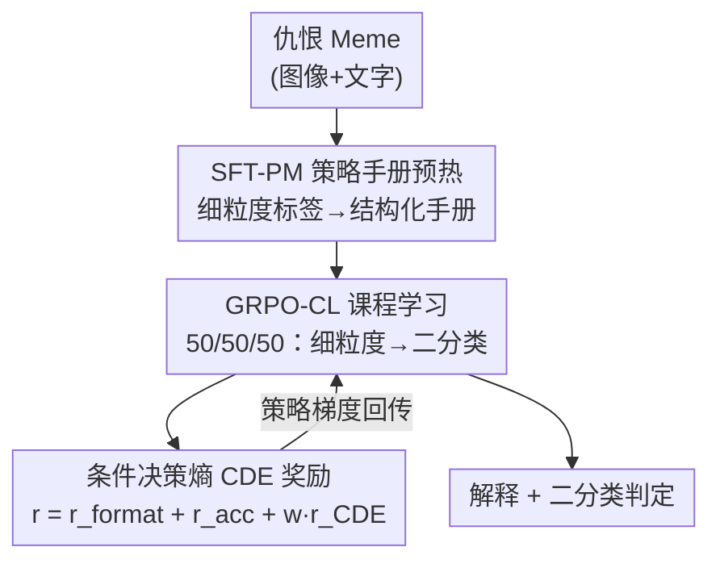

# ExPO-HM: Learning to Explain-then-Detect for Hateful Meme Detection

**会议**: ICLR 2026  
**arXiv**: [2510.08630](https://arxiv.org/abs/2510.08630)  
**代码**: [GitHub](https://github.com/JingbiaoMei/ExPO-HM)  
**领域**: 可解释性  
**关键词**: 仇恨言论检测, 多模态, GRPO, 课程学习, 条件决策熵, 可解释性

## 一句话总结

提出 ExPO-HM，受人类审核员培训流程启发，结合策略手册 SFT 预热、GRPO 课程学习和条件决策熵（CDE）奖励，首次实现 Explain-then-Detect 仇恨 Meme 检测在二分类、细粒度分类和推理质量上全面超越直接检测基线，F1 提升最高达 15-17%。

## 研究背景与动机

仇恨 Meme 检测是极具挑战性的在线内容审核任务。现有方法主要存在两个范式：

**直接检测（Direct Detection）**：仅输出二分类结果（hateful/benign），代表工作如 RA-HMD 等基于 CLIP 的方法，性能较好但无法提供解释，不满足真实审核需求。

**Explain-then-Detect**：先生成自然语言解释再做分类，但现有此类系统（如 LOREHM、U-CoT+）使用 CoT 提示或 agent 框架，**性能反而低于简单的 SFT 基线**。即使使用 GRPO 等后训练方法也无法缩小差距。

作者分析发现两个关键问题：

**模型解释遗漏关键线索**：如攻击目标和攻击类型等策略相关信息未被模型作为可能的解释假设

**二值奖励信号不足以引导推理**：正如人类标注员无法仅从 yes/no 标签学习，模型也需要更细粒度的反馈

核心类比：**人类审核员的培训流程**——先学习详细的审核策略手册，然后从细粒度类别练习到二分类判断——激发了 ExPO-HM 的设计。

## 方法详解

### 整体框架

ExPO-HM 要解决的是 Explain-then-Detect 仇恨 Meme 检测"先解释、再判定却打不过直接检测"的难题。它把人类审核员的成长路径搬进训练流程：一张仇恨 Meme 输入后，先用策略手册增强的监督微调（SFT-PM）让模型读懂审核规则、学会生成细粒度判断作为预热；再用课程式 GRPO（GRPO-CL）把推理从细粒度类别逐步迁移到最终的二分类；训练中同时引入条件决策熵（CDE）奖励，专门为"解释是否真正支撑了决策"打分，最终输出既准又可解释的判定。三者层层递进，正对应"先学手册、再练分类、全程盯推理质量"的培训曲线。

### 关键设计

**1. SFT-PM 策略手册预热：把审核规则灌进模型而非只喂标签**

Explain-then-Detect 之所以打不过简单 SFT，一个根因是模型根本不知道"攻击目标""攻击类型"这类策略维度该作为解释的假设去考虑。ExPO-HM 不直接让模型背 yes/no，而是把数据集的细粒度标签整理成结构化的策略手册写进输入提示，每个策略项还附上来自标注指南的文字描述，训练时优化语言建模损失、让模型在手册引导下输出细粒度标签 $d^*$ 作为目标响应。这里有个反直觉的选择：作者不用人工撰写的金标准解释 $\mathbf{e}^*$ 做监督，因为那属于 off-policy 监督，会让模型去模仿不属于自己分布的文本，实测性能反而更差——让模型在自己的输出分布里学会"按手册推理"才是更稳的预热。

**2. GRPO-CL 课程学习：用 50/50/50 把推理从细粒度迁移到二分类**

直接在二分类数据上跑 GRPO，奖励信号太稀疏，模型会退化成"猜标签"，标准 GRPO 在二分类上的平均响应长度只有 28 tokens，几乎不推理。课程学习的做法很朴素：前 50% 训练步只喂细粒度数据，因为细粒度类别天然逼着模型去探索"为什么是这类攻击"，激励它生成更长的推理链；后 50% 步骤再按 50/50 混入二分类数据，让学到的推理能力迁移到最终任务上（作者试过多种切换调度，结论是只要"细粒度先于二分类"性能就接近，于是采用最简单的 50/50/50）。这套课程让二分类响应长度几乎翻倍到 52 tokens，意味着模型在做最终判断时仍在展开实质性推理，而不是直接跳到结论。

**3. 条件决策熵 CDE：给"推理质量"一个可微的代理奖励**

二值奖励的另一个缺陷是它只看决策对错，完全不管解释好不好；而仇恨 Meme 任务又因为解释语料稀缺、人类判断主观，没法训一个可靠的奖励模型。ExPO-HM 的观察是：好的解释应该让决策变得清晰确定，差的解释则会留下混淆。据此定义条件决策熵——给定解释 $\mathbf{e}$ 和输入 $\mathbf{x}$，决策 $d$ 在解释条件下的熵为

$$H(d \mid \mathbf{e}, \mathbf{x}) = -\mathbb{E}_{d \sim \pi_\theta(\cdot|\mathbf{e},\mathbf{x})}[\log \pi_\theta(d \mid \mathbf{e}, \mathbf{x})]$$

熵低说明解释把决策"锁死"了，熵高说明解释含糊；实际用蒙特卡洛估计，对每个样本采 $K=16$ 条解释再算决策分布的熵。但低熵不等于好，自信地错才最危险，所以 CDE 奖励要把对错和确定性一起考虑：$r_{\text{CDE}}(h, \delta) = \delta \cdot f_{\text{correct}}(h) + (1-\delta) \cdot f_{\text{wrong}}(h)$，其中 $\delta = \mathbf{1}[d = d^*]$ 标记预测是否正确。正确且自信（低 CDE）给奖励，鼓励"想清楚再下结论"；错误却自信则按系数 $\rho$ 重罚，压制"胡说还笃定"；错误但不确定则容忍，给模型留出改正空间。这样 CDE 把抽象的"推理是否可信"翻译成了一个能直接进 RL 目标的标量。

### 损失函数 / 训练策略

最终的强化学习奖励把三块拼在一起：$r = r_{\text{format}} + r_{\text{acc}} + w \cdot r_{\text{CDE}}$，其中 $r_{\text{format}} \in \{0,1\}$ 检查输出格式是否合规，$r_{\text{acc}} \in [0,1]$ 衡量预测正确性，CDE 奖励以权重 $w$ 接入，避免它喧宾夺主。优化沿用标准 GRPO 的 clipped surrogate loss 加 KL 正则，默认超参为 $a=0.1$、$b=0.5$、$w=0.2$、$\rho=0.25$，CDE 权重和错误惩罚系数都压得较小，正是为了在引入推理质量信号的同时不破坏整体的策略熵。

## 实验关键数据

### 主实验

在 HatefulMemes / MAMI / PrideMM 三个数据集上评估，基础模型为 Qwen2.5-VL-3B 和 7B。

**Qwen2.5-VL-7B 在 HatefulMemes 上的结果：**

| 方法 | Binary F1 | Attack F1 | Target F1 | LLM Judge | CDE ↓ |
|------|-----------|-----------|-----------|-----------|-------|
| Zero-shot | 65.9 | 44.7 | 64.5 | 5.0 | 0.33 |
| SFT | 74.5 | 58.4 | 69.4 | 5.0 | 0.33 |
| DPO | 73.6 | 63.2 | 66.6 | 4.9 | 0.32 |
| GRPO | 74.5 | 61.2 | 64.5 | 5.2 | 0.26 |
| RA-HMD（SOTA直接检测） | 80.2 | — | — | 5.5 | — |
| **ExPO-HM** | **81.1** | **75.6** | **77.2** | **6.2** | **0.03** |

ExPO-HM 首次让 Explain-then-Detect 系统全面超越直接检测的 SOTA（RA-HMD），同时在推理质量上大幅领先。

**跨数据集一致性**（7B 模型）：

| 数据集 | GRPO Binary F1 | ExPO-HM Binary F1 | 提升 |
|--------|---------------|-------------------|------|
| HatefulMemes | 74.5 | 81.1 | +6.6 |
| MAMI | 76.8 | 82.3 | +5.5 |
| PrideMM | 73.2 | 78.7 | +5.5 |

### 消融实验

| # | SFT-PM | GRPO-CL | CDE | Binary F1 | Attack F1 | Target F1 | LLM ↑ | CDE ↓ |
|---|--------|---------|-----|-----------|-----------|-----------|-------|-------|
| 1 | - | - | - | 74.5 | 61.2 | 64.5 | 5.2 | 0.263 |
| 2 | ✓ | - | - | 75.8 | 70.8 | 70.2 | 5.6 | 0.092 |
| 3 | ✓ | ✓ | - | 78.4 | 74.3 | 76.1 | 5.8 | 0.056 |
| 4 | ✓ | ✓ | ✓ | **81.1** | **75.6** | **77.2** | **6.2** | **0.026** |

三个组件均有贡献：SFT-PM 大幅提升细粒度指标，GRPO-CL 进一步全面提升，CDE 显著改善推理质量（LLM Judge 5.8→6.2）。

### 关键发现

1. **Explain-then-Detect 首次超越 Direct Detection**：之前所有此类系统均不如 SFT 基线
2. **CDE 与 LLM-Judge 强相关**：Pearson $r=-0.78$，Spearman $\rho=-0.81$（$p<0.001$）
3. **SFT 预热策略至关重要**：Binary-only SFT 在 RL 阶段反而劣于无预热基线
4. **CDE 不导致策略熵坍塌**：整体策略熵与不使用 CDE 的基线相当
5. **人工评估验证**：ExPO-HM 100% 逻辑一致性 vs GRPO 96%，帮助性评分 2.2 vs 1.6

## 亮点与洞察

1. **人类标注员培训的类比非常精准**：策略手册→细粒度练习→二分类判断的渐进式流程
2. **CDE 是推理质量的优秀代理指标**：定义简洁（条件熵），与人工评估高度相关，且可作为可微奖励信号
3. **关键发现：好的 SFT 不一定导致好的 RL**：Binary SFT 在 SFT 阶段最好但 RL 后最差
4. **三数据集一致性**：方法在不同仇恨内容类型上泛化良好
5. **实验极其全面**：消融、预热策略比较、CDE 分析、校准分析、人工评估一应俱全

## 局限与展望

1. **数据集规模有限**：仇恨 Meme 标注数据（尤其是带解释的）非常稀缺
2. **单轮交互**：仅评估单轮推理，未考虑多轮审核对话场景
3. **文化依赖性**：审核策略高度依赖文化背景，跨文化适用性未验证
4. **基础模型限制**：仅在 Qwen2.5-VL 3B/7B 上验证
5. 可扩展到其他内容审核任务（如虚假信息检测、网络暴力识别）

## 相关工作与启发

- **RA-HMD** (Mei et al., 2025)：之前的 SOTA 直接检测方法，ExPO-HM 首次超越
- **LOREHM** (Huang et al., 2024)：基于 LLaVA-Next-34B 的推理 agent框架
- **GRPO** (Shao et al., 2024)：ExPO-HM 在其基础上加入 CDE 奖励和课程学习
- 启发：CDE 的"推理质量代理"思路可推广到其他需要可解释推理的任务

## 评分

- **新颖性**: ⭐⭐⭐⭐ — CDE 概念新颖，课程学习策略设计精巧
- **技术深度**: ⭐⭐⭐⭐ — 从人类培训流程到具体算法设计的映射完整
- **实验充分性**: ⭐⭐⭐⭐⭐ — 三数据集、多基线、消融、人工评估极其全面
- **写作质量**: ⭐⭐⭐⭐ — 动机清晰，实验组织有序
- **实用价值**: ⭐⭐⭐⭐ — 对内容审核有直接应用价值
- **综合推荐**: ⭐⭐⭐⭐ (4/5)

<!-- RELATED:START -->

## 相关论文

- [\[CVPR 2026\] Language Models Can Explain Visual Features via Steering](../../CVPR2026/interpretability/language_models_can_explain_visual_features_via_steering.md)
- [\[ICLR 2026\] Behavior Learning (BL): Learning Hierarchical Optimization Structures from Data](behavior_learning_bl_learning_hierarchical_optimization_structures_from_data.md)
- [\[CVPR 2026\] A Study of Failure Modes in Two-Stage Human–Object Interaction Detection](../../CVPR2026/interpretability/a_study_of_failure_modes_in_two-stage_human-object_interaction_detection.md)
- [\[ACL 2026\] Linear Probes Detect Task Format, Not Reasoning Mode in Language Model Hidden States](../../ACL2026/interpretability/linear_probes_detect_task_format_not_reasoning_mode_in_language_model_hidden_sta.md)
- [\[ICML 2026\] Tracing the Dynamics of Refusal: Exploiting Latent Refusal Trajectories for Robust Jailbreak Detection](../../ICML2026/interpretability/tracing_the_dynamics_of_refusal_exploiting_latent_refusal_trajectories_for_robus.md)

<!-- RELATED:END -->
