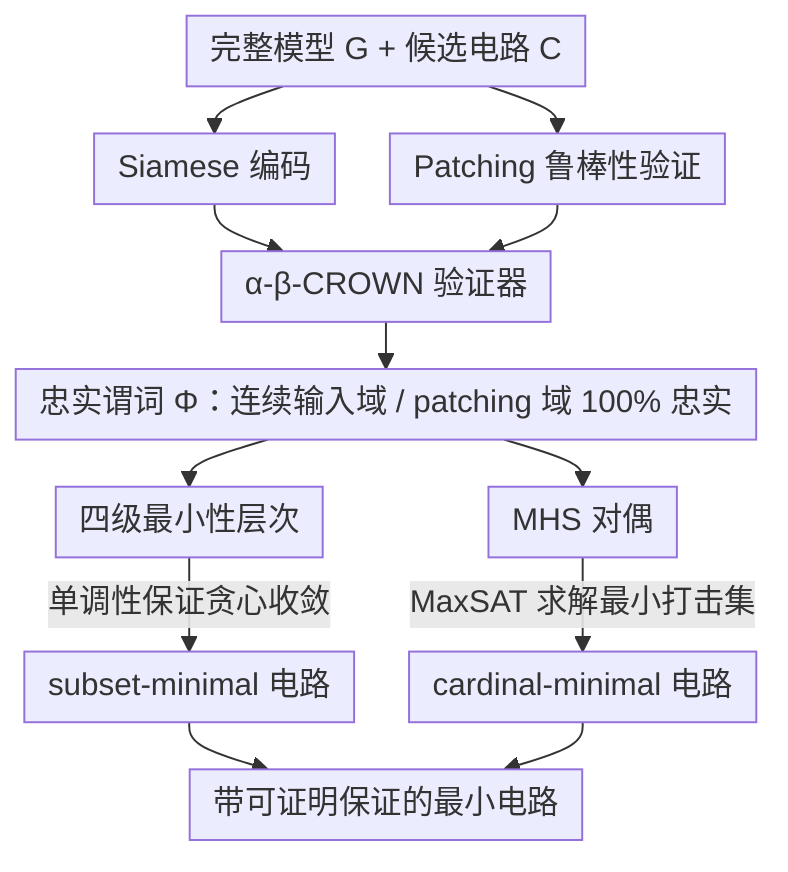

# Formal Mechanistic Interpretability: Automated Circuit Discovery with Provable Guarantees

**会议**: ICLR 2026  
**arXiv**: [2602.16823](https://arxiv.org/abs/2602.16823)  
**代码**: 无  
**领域**: AI安全 / 可解释性  
**关键词**: 机制可解释性, 电路发现, 神经网络验证, provable guarantees, minimality

## 一句话总结
将神经网络验证（NN verification）引入机制可解释性，提出首个具有可证明保证的电路发现框架：在连续输入域上保证电路忠实度（input robustness）、在连续 patching 域上保证电路一致性（patching robustness），并形式化了四级最小性层次（quasi → local → subset → cardinal），通过单调性理论将三类保证统一连接。

## 研究背景与动机
**领域现状**：机制可解释性（MI）中的电路发现旨在找到驱动模型特定行为的子图（circuit）。ACDC、edge attribution patching 等方法已取得进展，但均依赖启发式或采样近似。

**现有痛点**：采样评估电路忠实度存在根本缺陷——即使电路在所有采样点上忠实，微小的输入扰动就可能打破一致性。这在安全关键场景中是不可接受的。同时，"最小性"的定义模糊，不同算法达到的最小性层次不同但缺乏形式化讨论。

**核心矛盾**：电路发现既需要在连续域上保证忠实度（而非离散点），又需要电路尽可能小（可解释），同时 patching 策略的选择（zero/mean/sampling）本身也引入不确定性。

**本文目标**（1）如何在连续输入域上保证电路忠实度？（2）如何在连续 patching 域上保证电路一致性？（3）如何形式化并追求不同层次的最小性？

**切入角度**：利用神经网络验证领域的 α-β-CROWN 等工具，通过 Siamese 编码将电路和原模型并列，将电路忠实度转化为可验证的输入-输出约束。

**核心 idea**：用神经网络验证器替代采样来证明电路的连续域忠实度，用单调性理论统一输入鲁棒性、patching 鲁棒性和最小性保证。

## 方法详解

### 整体框架
这篇论文要解决的是电路发现里一个被长期忽视的可靠性问题：现有方法（ACDC、edge attribution patching）只在有限采样点上检验电路是否忠实于原模型，而采样过不了连续域——哪怕电路在每个采样点都对，一个微小扰动就可能让它失效。本文的思路是把电路发现整体搬进神经网络验证（NN verification）的框架里：先把"电路忠实"这件事形式化成可证明保证（连续输入域上的忠实、连续 patching 域上的忠实），再借 Siamese 编码把保证翻译成 α-β-CROWN 这类验证器能接受的输入-输出约束查询，得到一个在整个连续域上成立的忠实谓词 $\Phi$；最后以 $\Phi$ 为"是否忠实"的判据，用贪心算法（配合单调性）逼近 subset-minimal、用 MHS 对偶求 cardinal-minimal，逐步把电路收到最小。串起来就是：编码成验证查询 → 验证出连续域忠实谓词 → 按最小性层次搜索最小电路。

### 关键设计

**1. Siamese 编码：把"电路是否忠实"变成验证器能回答的问题**

电路忠实度本质是在问"对所有 $z \in \mathcal{Z}$，电路输出和原模型输出是否足够接近"，这是一个跨整个连续域的全称命题，采样答不了。Siamese 编码的做法是把电路 $C$ 和完整模型 $G$ 并列拼成一个共享输入层的联合网络 $G \sqcup C'$：非电路组件的激活被固定为 patching 值 $\alpha$，用输入约束 $\psi_{in}$ 把 $z$ 限制在邻域 $\mathcal{Z}$ 内，再用输出约束 $\psi_{out}$ 去检验 $\|f_C(z|\bar{C}=\alpha) - f_G(z)\|_p \leq \delta$。这样一来，"电路是否忠实"就成了一个标准的验证查询，交给 α-β-CROWN 处理。验证一旦通过，得到的就不是采样意义上的"大概忠实"，而是整个连续域 $\mathcal{Z}$ 上 100% 忠实的硬保证。

**2. Patching 鲁棒性验证：堵住 zero-patching 的 out-of-distribution 漏洞**

只验证输入鲁棒性还不够——电路忠实度还依赖于被消融组件填什么值，而 zero / mean patching 这类固定填值常被批评落在分布外、不能代表真实激活。这一设计要保证的是电路在任意"可达" patching 值下都忠实，而不仅是某个特定填值。做法是改造 Siamese 编码：让 $G$ 和 $C'$ 接收不同输入，并把 $C'$ 的非电路激活直接连到 $G$ 在另一邻域 $\mathcal{Z}'$ 上的对应激活，从而把"任意可达 patching 值"也纳入验证器的约束范围。这样电路的忠实保证就不再受限于人为选定的 patching 策略。

**3. 四级最小性层次：用单调性把"最小"讲清楚并保证算法收敛**

以往算法都声称自己找的电路"minimal"，但最小到什么程度从未被形式化。本文把最小性拆成强度递增的四级：**quasi-minimal**（存在某个组件移除后电路就不忠实）、**locally-minimal**（每个组件都必需，移除任一都不忠实）、**subset-minimal**（任何组件子集的移除都不忠实）、**cardinally-minimal**（全局最小电路）。串起这四级的关键理论是**单调性**（monotonicity）：当忠实谓词 $\Phi$ 单调——即扩大电路不会破坏忠实度——时，贪心算法被保证收敛到 subset-minimal。Proposition 5 进一步证明，只要 $\mathcal{Z} \subseteq \mathcal{Z}'$ 且激活空间闭合，input + patching robustness 组合出的谓词就自动满足单调性。于是单调性这一个性质同时撑起了两件事：subset-minimality 的收敛性，以及两类鲁棒性保证的可组合性。

**4. MHS 对偶：用最小打击集逼近全局最小电路**

四级里最强的 cardinally-minimal（全局最小）通常 NP 难、无法靠贪心拿到。这一设计借一个对偶关系来逼近它：Proposition 7 证明，所有 circuit blocking-set 的最小打击集（minimum hitting set, MHS）恰好等于 cardinally-minimal 电路。这样求全局最小电路就转化成了一个最小打击集问题，可以丢给 MaxSAT 求解器高效求解，把原本难以触及的全局最优变成可计算的目标。

## 实验关键数据

### 输入鲁棒性对比

| 数据集 | 方法 | 电路大小 | 鲁棒性 | 时间(s) |
|--------|------|---------|--------|---------|
| CIFAR-10 | Sampling | 16.5 | **46.5%** | 0.23 |
| | **Provable** | **19.2** | **100%** | 2970 |
| MNIST | Sampling | 12.6 | **19.2%** | 0.31 |
| | **Provable** | **15.8** | **100%** | 612 |
| GTSRB | Sampling | 28.9 | **27.6%** | 0.11 |
| | **Provable** | **29.6** | **100%** | 991 |

### Patching 鲁棒性对比

| 数据集 | Zero Patching Rob.% | Mean Patching Rob.% | **Provable Rob.%** |
|--------|--------------------|--------------------|-------------------|
| CIFAR-10 | 46.4 | 33.3 | **100** |
| MNIST | 58.0 | 55.7 | **100** |
| TaxiNet | 57.1 | 63.3 | **100** |

### 关键发现
- 采样方法在所有数据集上鲁棒性仅 9.5-58%，可证明方法达到 100%，但计算时间增加 100-10000 倍。
- 电路大小方面，可证明方法仅比采样稍大（+10-20%），说明鲁棒性保证不需大幅增加电路。
- MHS 下界始终不超过电路大小，且在部分情况下精确匹配，验证了 MHS 对偶的有效性。
- quasi-minimal 算法最快但电路最大，cardinally-minimal 最慢但电路最小，与理论预测一致。

## 亮点与洞察
- **NN 验证 × MI 的首次融合**：将两个快速发展但此前独立的领域联结起来。验证工具为 MI 提供了形式化保证，MI 为验证工具提供了新的应用场景。
- **单调性理论的统一作用**：一个简洁的性质（$\Phi$ 单调）同时保证了 subset-minimality 收敛和 input+patching robustness 的可组合性。
- **四级最小性层次的实用意义**：让研究者可以根据计算预算选择合适的最小性层次——quasi（最快）到 cardinal（最强），而非模糊地声称"minimal"。

## 局限与展望
- NN 验证的可扩展性限制：当前实验在视觉模型上（MNIST/CIFAR-10 级别），无法直接应用于 Transformer/LLM。随着验证工具进步，框架可自动扩展。
- 可证明方法的计算成本高 100-10000 倍，在实时 MI 分析中不实用。
- 仅在视觉模型上验证，NLP/语言模型的电路发现（如 IOI circuit）未涉及。
- 最小性保证依赖于忠实谓词 $\Phi$ 的选择，不同的 $\delta$ 阈值可能导致不同结果。

## 相关工作与启发
- **vs ACDC (Conmy et al., 2023)**：ACDC 用采样+KL 散度阈值做贪心搜索，是本文的 sampling baseline。本文 provable 方法在相当电路大小下鲁棒性从 ~40% 提升至 100%。
- **vs Adolfi et al. (2025)**：他们提出 quasi-minimality 作为最小性标准。本文扩展为四级层次，证明了更强的保证和算法收敛性。
- **vs AlphaSteer/ASIDE**：这些方法在 activation/embedding 层面操控行为，而本文从 circuit 层面理解行为。可将 AlphaSteer 的零空间约束视为对"电路"的一种软定义。

## 评分
- 新颖性: ⭐⭐⭐⭐⭐ 首次将 NN 验证引入 MI，四级最小性层次和单调性理论是原创理论贡献
- 实验充分度: ⭐⭐⭐⭐ 4 个数据集 × 3 类保证 × 多算法对比，但限于小型视觉模型
- 写作质量: ⭐⭐⭐⭐⭐ 理论推导严谨，定义-命题-算法的结构清晰，Siamese 编码图示直观
- 价值: ⭐⭐⭐⭐⭐ 为 MI 建立了形式化基础，是电路发现领域的重要理论进步

<!-- RELATED:START -->

## 相关论文

- [\[ICML 2026\] Certified Circuits: Stability Guarantees for Mechanistic Circuits](../../ICML2026/interpretability/certified_circuits_stability_guarantees_for_mechanistic_circuits.md)
- [\[ACL 2025\] Position-aware Automatic Circuit Discovery](../../ACL2025/interpretability/position-aware_automatic_circuit_discovery.md)
- [\[CVPR 2026\] Beyond Top Activations: Efficient and Reliable Crowdsourced Evaluation of Automated Interpretability](../../CVPR2026/interpretability/beyond_top_activations_efficient_and_reliable_crowdsourced_evaluation_of_automat.md)
- [\[ACL 2025\] Enhancing Automated Interpretability with Output-Centric Feature Descriptions](../../ACL2025/interpretability/output_centric_interpretability.md)
- [\[ICML 2026\] All Circuits Lead to Rome: Rethinking Functional Anisotropy in Circuit and Sheaf Discovery for LLMs](../../ICML2026/interpretability/all_circuits_lead_to_rome_rethinking_functional_anisotropy_in_circuit_and_sheaf_.md)

<!-- RELATED:END -->
