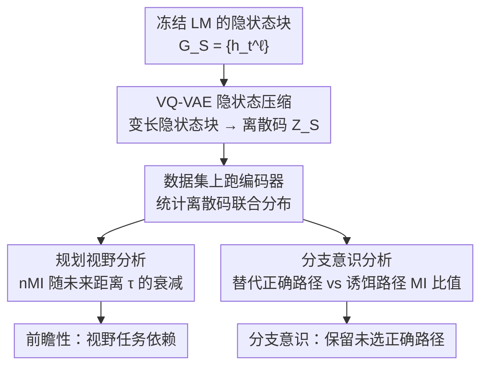

# Internal Planning in Language Models: Characterizing Horizon and Branch Awareness

**会议**: ICLR 2026  
**arXiv**: [2509.25260](https://arxiv.org/abs/2509.25260)  
**代码**: 有（附补充材料）  
**领域**: 可解释性  
**关键词**: 语言模型规划, 互信息, VQ-VAE, 前瞻性, 分支意识

## 一句话总结
提出基于VQ-VAE的信息论框架来分析语言模型内部的规划行为，发现规划视野是任务依赖的、模型隐式保留未选择的正确路径信息、下一token决策主要依赖最近的计算。

## 研究背景与动机
LLM展现出令人惊叹的能力，但其训练目标——下一token预测——似乎只关注局部，与"规划"的前瞻性本质矛盾。这引发核心问题：**LM在多大程度上是"前瞻"和"分支感知"的？**

前瞻性（horizon awareness）：好的规划者在当前决策中已考虑长期目标，类似模型预测控制(MPC)。分支感知（branch awareness）：好的规划者在做决策前保持多个可能的未来"活着"，类似Tree-of-Thoughts。

现有分析方法存在局限：(1) 电路发现需要大量手工工程；(2) 线性探针可能混淆探针自身学到的表征和模型实际编码的信息（探针交叉感染问题）。需要一种自动化、无交叉感染且可扩展的分析方法。

核心idea：用VQ-VAE将LM的高维隐状态压缩为离散码，然后直接计算离散码之间的互信息(MI)来度量内部计算之间的信息共享关系。

## 方法详解

### 整体框架
这篇论文要回答一个诊断性问题：解码器式语言模型在生成时，内部计算到底有没有「规划」——是否前瞻（考虑了多远的未来）、是否给多条可能的未来都留着余地。难点在于直接拿原始隐状态做这种分析既高维又冗余，还容易被探针自身的表达能力污染。整体思路是先用一个 VQ-VAE 把任意一组隐状态块压成单个离散码，把「两段计算共享多少信息」这个抽象问题变成可统计的离散变量互信息（MI）；再用训练好的编码器在整个数据集上跑一遍、统计离散码的联合分布；最后在这套联合分布上派生出两类分析——沿未来距离 $\tau$ 看信息衰减（规划视野），以及比较「未被选中的正确路径」与「诱饵路径」的信息量（分支意识）。

### 关键设计

**1. VQ-VAE 隐状态压缩：把高维隐状态变成可计算 MI 的离散码**

直接对原始隐状态估互信息很不稳定——维度太高、又混着大量细粒度冗余。这一步先把变长的高维隐状态集合 $G_\mathcal{S} = \{h_t^\ell | (\ell,t) \in \mathcal{S}\}$ 压成一个离散码 $Z_\mathcal{S} \in [K]$：一个 Transformer 编码器先把变长输入聚合成固定维度的潜向量 $r_\mathcal{S}$，再在码本 $\{e_k\}_{k=1}^K$ 里找最近邻量化，$k^* = \arg\min_k \|r_\mathcal{S} - e_k\|_2^2$。训练目标在标准重构与量化损失之外，额外挂了余弦相似度惩罚和熵正则：

$$\mathcal{L} = \mathcal{L}_{\text{rec}} + \lambda_q \mathcal{L}_{\text{vq}} + \lambda_{\text{cos}} \mathcal{L}_{\text{cos}} + \lambda_{\text{ent}} \mathcal{L}_{\text{ent}}$$

后两项是为了逼码本保持多样、被充分利用，避免少数码占满全部样本。离散化之后，每个计算块只剩下区分彼此的关键差异、滤掉了冗余细节，落到有限的码字空间上，互信息的联合分布就能稳定地统计出来。

**2. 规划视野分析：前缀里到底藏了多远的未来信息**

有了离散码，前瞻性就变成一个可量化的问题：把前缀里所有隐状态块 $H = \{h_t^\ell | t=1,...,T;\ \ell=1,...,L-1\}$ 汇总成摘要码 $Z_{1:T}^{1:L-1}$，去看它和第 $\tau$ 个未来生成 token 的末层隐状态码 $Z_{T+\tau}^L$ 之间的归一化互信息 nMI。$\tau$ 从近到远扫一遍，nMI 随 $\tau$ 衰减得越慢，就说明前缀里编码的不只是下一个 token，而是更长视野的后续内容。相比线性探针，这里不引入任何额外可学习模型，nMI 直接度量两段计算的信息共享，因此不会把"探针自己学到的"误算成"模型本来编码的"。

**3. 分支意识分析：选对答案时，没被选的正确路径还活着吗**

这一设计要回答的是：模型在输出某条正确答案的同时，内部是否也保留了"另一条同样正确的路"的信息。为了把这个问题问干净，论文在路径寻找（PF）任务里给每个样本造了 2 条正确路径加 1 条诱饵路径，且三条路径互不共享节点。然后比较前缀摘要码分别和"替代正确路径码"、"诱饵路径码"的互信息，看比值

$$\mathcal{I}(Z_H; Z_{\text{alt}})\,/\,\mathcal{I}(Z_H; Z_{\text{decoy}})$$

是否大于 1。三条路径不共享节点这一约束很关键——它排除了"两条路恰好有重叠节点导致 MI 偏高"这种平凡解释，于是比值显著大于 1 才能真正归因为模型对未被选中的正确分支仍有意识。

## 实验关键数据

实验基于 GPT-3 Small 架构（带 RoPE），在三类数据上分析：(1) 上下文无关文法（CFG）——局部句法规则；(2) 路径寻找（PF）——需多步推理的图任务；(3) 自然语言（OpenWebText）。重点比较 NTP 与 MTP 两种训练目标的差异。

### 规划视野（nMI衰减模式）

| 任务 | nMI衰减速度 | 含义 |
|------|------------|------|
| CFG（上下文无关文法） | 快速衰减，$\tau$=10时降至初始值1/5 | 短视野，局部规划 |
| PF-Short（4节点路径） | 在$\tau$>1处nMI上升 | 非近视，前缀编码后续节点 |
| PF-Long（6节点路径） | nMI在中间节点保持高值 | 长视野规划 |

### 分支意识

| 模型 | PF-Short MI比值 | PF-Short精度 | PF-Long MI比值 | PF-Long精度 |
|------|----------------|-------------|---------------|-------------|
| NTP | 7.60±0.78 | 0.92 | 1.45±0.01 | 0.60 |
| MTP | 6.29±0.17 | 0.88 | 1.82±0.27 | 0.85 |

### 关键发现
- **规划视野是任务依赖的**：CFG上nMI快速衰减（短期规划），PF上保持高值甚至上升（长期规划）
- **PF任务中nMI在第二个中间节点处高于第一个**——可能暗示模型"从目标反推"的策略
- **分支意识真实存在**：MI比值远大于1（PF-Short上高达7.6），模型确实保留了未选择的正确路径信息
- MTP训练略微减少短视行为，但NTP和MTP的差异并不显著
- 下一token决策主要依赖高层和最近的计算块（近因效应）

## 亮点与洞察
- VQ-VAE+MI的分析框架通用性强——避免了探针的交叉感染问题和电路发现的手工工程
- "模型内部保留替代路径信息"这一发现对理解LM的鲁棒性具有重要意义
- nMI在PF任务中对第二节点高于第一节点，暗示了隐式的"逆向规划"，与人类解题策略吻合

## 局限与展望
- VQ-VAE的压缩不可避免地丢失信息，MI估计的绝对值不可靠（作者也承认只分析相对趋势）
- 实验基于GPT-3 Small（约125M参数），在更大模型上的规划行为可能不同
- 对自然语言(OpenWebText)仅做了计算历史信息的诊断而非前瞻/分支分析
- NTP/MTP的差异不一致，可能与模型规模有关

## 相关工作与启发
- **vs 线性探针**: 探针引入额外表达能力导致结果混淆，VQ-VAE+MI方法免受此影响
- **vs 电路发现**: 电路发现需大量手工工程且难以规模化，本框架自动化且通用

## 评分
- 新颖性: ⭐⭐⭐⭐⭐ VQ-VAE+MI分析范式全新，三个分析维度设计精巧
- 实验充分度: ⭐⭐⭐⭐ 三类任务覆盖全面，但模型规模较小
- 写作质量: ⭐⭐⭐⭐ 框架严谨，公式清晰，附录非常详尽
- 价值: ⭐⭐⭐⭐ 为LM可解释性提供了新工具，但实际应用场景有限

<!-- RELATED:START -->

## 相关论文

- [\[ACL 2026\] Model Internal Sleuthing: Finding Lexical Identity and Inflectional Features in Modern Language Models](../../ACL2026/interpretability/model_internal_sleuthing_finding_lexical_identity_and_inflectional_features_in_m.md)
- [\[ICLR 2026\] Beyond Linear Probes: Dynamic Safety Monitoring for Language Models](beyond_linear_probes_dynamic_safety_monitoring_for_language_models.md)
- [\[ICLR 2026\] ZeroTuning: Unlocking the Initial Token's Power to Enhance Large Language Models Without Training](zerotuning_unlocking_the_initial_tokens_power_to_enhance_large_language_models_w.md)
- [\[ICML 2026\] Towards Atoms of Large Language Models](../../ICML2026/interpretability/towards_atoms_of_large_language_models.md)
- [\[ICLR 2026\] Universal Properties of Activation Sparsity in Modern Large Language Models](universal_properties_of_activation_sparsity_in_modern_large_language_models.md)

<!-- RELATED:END -->
