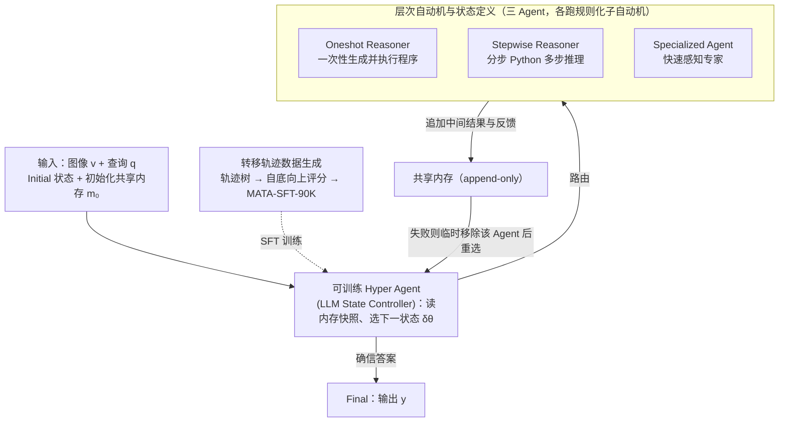

# MATA: A Trainable Hierarchical Automaton System for Multi-Agent Visual Reasoning

**会议**: ICLR 2026  
**arXiv**: [2601.19204](https://arxiv.org/abs/2601.19204)  
**代码**: [GitHub](https://github.com/ControlNet/MATA)  
**领域**: 可解释性  
**关键词**: 多Agent系统, 层次有限状态自动机, 视觉推理, 可训练状态控制器, 协作与竞争

## 一句话总结

提出MATA（Multi-Agent hierarchical Trainable Automaton），将多Agent视觉推理建模为层次有限状态自动机，顶层状态转移由可训练的hyper agent（基于LLM的状态控制器）学习，每个Agent内部使用规则化的子自动机，通过共享内存实现协作与竞争，在多个视觉推理基准上达到SOTA。

## 研究背景与动机

视觉推理要求模型解读视觉场景中实体间的关系。当前方法存在以下问题：

**端到端VLM**：隐式推理过程难以审计，在涉及空间关系、计数等复杂查询时容易产生幻觉

**组合式方法**（如ViperGPT、HYDRA）：提高了可解释性，但多数采用单Agent或手工设计的流水线

**多Agent方法**：各Agent被分配不相交角色并硬编码管道连接，无法处理错误传播，不支持功能重叠Agent间的竞争

**规则转移的僵化性**：手写规则转移函数随状态增长变得难以定义

核心问题：**如何让系统学会在何时调用哪个Agent？** 作者将这个决策问题建模为有限状态自动机的转移函数学习。

## 方法详解

### 整体框架

MATA 要解决的是「一个视觉推理查询进来，系统该派哪个 Agent、什么时候换人、什么时候收尾输出」这个调度问题。它把整套推理组织成一台**层次 Mealy 机** $\mathcal{M}_\theta = (S, S_0, \Sigma, \Lambda, \delta_\theta, \Gamma)$：顶层（hyper automaton）把每个 Agent 当成一个状态，由一个可训练的 hyper agent（基于 LLM 的状态控制器）学习状态之间的转移 $\delta_\theta$；底层每个 Agent 内部是一台规则化的子自动机（sub-automaton），负责可靠的微观执行。运行时 hyper agent 每一步都读一份共享内存快照、决定下一个状态，被选中的 Agent 跑完自己的子自动机、把中间结果追加回共享内存、再交还控制权，如此循环直到进入 Final 状态输出答案。论文之所以把「跨 Agent 该不该转」交给学习、把「Agent 内部怎么走」留给规则，正是因为前者判据模糊、随 Agent 增多越来越难手写，后者步骤清晰、容易定义。

### 关键设计

**1. 层次自动机与状态定义：把"调哪个 Agent"变成自动机的状态选择**

系统的状态集 $S = S_{\text{agent}} \cup S_{\text{life}}$ 分两类。$S_{\text{agent}} = \{\text{Oneshot}, \text{Stepwise}, \text{Specialized}\}$ 是三个 Agent，各自代表一条推理路径，并刻意构成「感知—快思考—慢思考」的连续谱：Specialized Agent 是 System-1 式的快速感知专家（目标检测、简单问答），Oneshot Reasoner 一次性生成并执行程序、适合能直接求解的查询，Stepwise Reasoner 逐步生成 Python 程序做多步推理、应对复杂查询。$S_{\text{life}} = \{\text{Initial}, \text{Final}, \text{Failure}\}$ 是生命周期状态，负责起步、收尾输出与异常协调，初始状态 $S_0 = \text{Initial}$。把 Agent 装进状态集后，"何时调用哪个 Agent"就自然变成自动机的状态转移问题，而每个 Agent 内部只跑一台规则化子自动机（LLM/VLM 提示、验证器检查、工具 I/O 这些步骤流程清晰），由它独立处理微观控制后再返回顶层——这就是"跨 Agent 学、Agent 内规则化"的层次分工。

这三个 Agent 被设计成**既协作又竞争**。协作指控制权转交时，后继 Agent 会读取共享内存里前序 Agent 留下的历史与反馈、在此基础上继续；竞争指功能重叠的 Agent 可以争抢同一个任务——所有 Agent 原则上都能回答所有查询，但各有所长，于是当某个 Agent 卡住或报告不可恢复错误时，系统把它从当前候选状态里**临时移除**、逼 hyper agent 在剩余 Agent 中重选，让另一个顶替完成。正是这套"失败即重路由"的竞争机制，把传统多 Agent 流水线"各管一段、出错就卡死"的单点失败，转化成了可恢复的路径切换。

**2. 共享内存：让协作和审计共用一份可追溯的载体**

所有 Agent 都读写同一份结构化共享内存 $m_t$，累积中间变量、感知结果、程序历史、验证反馈和任务元数据。它**仅追加**（append-only）：某个 Agent 跑完一轮就把新增内容 $\Delta m_t$ 接上去，$m_{t+1} = m_t \cup \Delta m_t$。这一处设计同时喂饱了两件事——后来的 Agent 能拿到此前全部上下文从而实现协作，整条推理轨迹也因只增不改而完全可回溯、可审计。更关键的是，这份内存是 hyper agent 做决策时**唯一**的观测输入：每一步它都基于当前 $m_t$ 选出下一个状态 $s_{t+1} = \delta_\theta(s_t, m_t)$。

**3. 可训练的 Hyper Agent：用 LLM 学转移函数，取代手写规则**

顶层转移函数 $\delta_\theta$ 不再是手写的 if-else，而是一个可训练的、基于 LLM 的 hyper agent $\mathcal{F}_\theta$，扮演状态转移控制器。由于 LLM 吃文本，做法是先从共享内存 $m_t$ 按固定模板构造提示 $x_t$，再让 $\mathcal{F}_\theta$ 把它映射到**当前可用候选状态**上的一个分布，最后用贪心解码或随机采样选出下一状态 $s_{t+1}$。这正对着论文的核心痛点：手写转移规则会随状态/Agent 数量增长而难以定义，尤其是在功能重叠的竞争 Agent 之间，"哪个更合适"本就判据含糊、依赖任务；改成从数据里学，调度策略就能自动归纳出来，同时还能在不确定时继续推进、确信时才转入 Final 输出。

**4. 转移轨迹数据生成（MATA-SFT-90K）：给"学转移"造监督信号**

要训练 hyper agent 选状态，就得有"在某个内存状态下哪个 Agent 是最优选择"的标签，论文用一棵转移轨迹树（transition-trajectory tree）来造这批数据。第一步在 GQA、OK-VQA、RefCOCO/+/g 训练集采样（图像, 查询）对，逐步运行自动机：在每个决策节点把分支铺开到所有可能的下一状态 $s_{t+1} \in S$，执行对应子自动机，保存每个分支的内存检查点 $m_{t+1}$，直到到达 Final 叶节点由输出函数 $\Gamma$ 给出预测 $\hat{y}$。第二步自底向上评分——叶节点按任务指标打分（VQA 用 $\text{Acc}$，VG 用 $\text{IoU}$），非叶节点取子节点最大值向上传播：

$$V(s) = \begin{cases} \text{metric}(\hat{y}_s, y), & s \in \text{Leaves} \\ \max_{s' \in \text{Child}(s)} V(s'), & \text{otherwise} \end{cases}$$

这样每个决策点都知道往哪个子节点走能拿到最高回报。第三步把每个决策点的文本提示 $x_t$ 配上其最优子节点对应的状态标签，重排成 instruction-completion 训练样本，最终得到 $N = 90{,}854$ 条，即 MATA-SFT-90K。数据采集时对转移树做了固定深度的近穷举展开——当前三个 Agent 还算可行，但论文也承认这一代价会随 Agent 增多而快速增长。

### 损失函数 / 训练策略

使用标准SFT损失训练Qwen3 4B作为LLM状态控制器。AdamW优化，cosine decay + 5% warmup，batch 64，训练8 epoch。推理时最大步数 $T=15$。

三种SFT配置：域内（在目标数据集训练集上训练）、域迁移（在非目标数据集上训练）、通用（全部数据联合训练）。

## 实验关键数据

### 主实验

**GQA数据集（组合式视觉问答）**：

| 类型 | 方法 | 准确率 |
|------|------|--------|
| 端到端 | InternVL2.5 (8B) | 61.5 |
| 端到端 | InternVL3.5 (8B) | 63.8 |
| 组合式 | HYDRA | 52.8 |
| 组合式 | **MATA (General)** | **64.9** |

**OK-VQA数据集（需要外部知识）**：

| 类型 | 方法 | 准确率 |
|------|------|--------|
| 端到端 | InternVL3.5 (8B) | 75.7 |
| 组合式 | DWIM | 62.8 |
| 组合式 | **MATA (Domain-Specific)** | **76.5** |

**引用表达理解（RefCOCO系列）**：

| 方法 | RefCOCO | RefCOCO+ | RefCOCOg | Ref-Adv |
|------|---------|----------|----------|---------|
| Florence2-L | 95.1 | 92.5 | 90.9 | 71.8 |
| NAVER | 96.2 | 92.8 | 91.6 | 75.4 |
| **MATA (General)** | **96.3** | **93.8** | **90.7** | **77.3** |

### 消融实验

**Hyper Agent组件消融**：

| 层次自动机 | 转移策略 | SFT | GQA | OK-VQA | RefCOCO | 推理时间 |
|-----------|---------|-----|-----|--------|---------|----------|
| ✗ | 穷举集成 | ✗ | 57.7 | 71.5 | 87.7 | 34.58s |
| ✓ | 随机 | ✗ | 57.1 | 71.1 | 85.3 | 6.91s |
| ✓ | LLM | ✗ | 58.5 | 75.1 | 95.8 | 8.07s |
| ✓ | LLM | ✓ | **64.9** | **76.5** | **96.3** | **8.01s** |

**泛化性分析**：跨域迁移性能与域内差距不到1%，表明学到的转移策略高度任务无关。

### 关键发现

1. **组合式方法首次全面超越同等规模端到端VLM**：MATA在GQA和OK-VQA上超过InternVL3.5
2. **SFT对性能的巨大提升**：仅9万样本SFT，GQA准确率从58.5%提升到64.9%（+6.4%）
3. **小模型也能胜任调度**：0.6B经SFT后域内性能已接近4B模型
4. **协作+竞争>纯协作**：三Agent设计允许同一任务上竞争，当一个失败时另一个接替
5. **学习转移 >> 规则转移**：在Ref-Adv上比手写规则的NAVER提升1.9%

## 亮点与洞察

- **形式化优雅**：将多Agent调度建模为Mealy机转移函数学习，保留可解释性同时获得灵活性
- **层次分治**：跨Agent转移用学习，Agent内部步骤用规则，清晰分离"学什么"和"规则化什么"
- **数据生成管线**：转移轨迹树 + 自底向上评分 + SFT数据生成是可推广的多Agent策略学习框架
- **System 1 + System 2**：Specialized/Oneshot/Stepwise的设计呼应认知科学中的快慢思考系统

## 局限与展望

1. 轨迹树搜索的可扩展性：当前3个Agent可穷举，但Agent增多后搜索代价指数增长
2. 推理延迟：平均8s/query在实时应用中仍较高
3. 对基础模型的依赖：天花板受限于底层VLM和检测器的能力
4. Failure恢复的简单性：仅通过移除失败Agent处理，更复杂的恢复策略可能更好
5. 训练数据来源有限：仅来自5个数据集的训练集

## 相关工作与启发

MATA承接ViperGPT → HYDRA → NAVER的发展脉络，首次实现可学习的多Agent转移策略。与MetaGPT等LLM多Agent方法相比形式化程度更高，且支持竞争机制。转移轨迹树的生成思路类似蒙特卡罗树搜索，但聚焦于Agent选择。

## 评分

- **新颖性**: ⭐⭐⭐⭐⭐ — 层次自动机+可训练转移函数的框架设计新颖且形式化完备
- **技术质量**: ⭐⭐⭐⭐⭐ — Mealy机形式化、轨迹树数据生成、SFT训练流程环环相扣
- **实验充分度**: ⭐⭐⭐⭐⭐ — 多基准对比+详细消融+泛化分析+模型规模分析
- **实用性**: ⭐⭐⭐⭐ — 框架通用但推理成本较高
- **写作质量**: ⭐⭐⭐⭐⭐ — 形式化清晰，表述严谨
- **综合**: ⭐⭐⭐⭐⭐ (9.0/10)

<!-- RELATED:START -->

## 相关论文

- [\[AAAI 2026\] ToC: Tree-of-Claims Search with Multi-Agent Language Models](../../AAAI2026/interpretability/toc_tree-of-claims_search_with_multi-agent_language_models.md)
- [\[ICLR 2026\] Behavior Learning (BL): Learning Hierarchical Optimization Structures from Data](behavior_learning_bl_learning_hierarchical_optimization_structures_from_data.md)
- [\[NeurIPS 2025\] AgentiQL: An Agent-Inspired Multi-Expert Framework for Text-to-SQL Generation](../../NeurIPS2025/interpretability/agentiql_an_agent-inspired_multi-expert_framework_for_text-to-sql_generation.md)
- [\[ICLR 2026\] SEED-SET: Scalable Evolving Experimental Design for System-level Ethical Testing](seed-set_scalable_evolving_experimental_design_for_system-level_ethical_testing.md)
- [\[ICLR 2026\] RADAR: Reasoning-Ability and Difficulty-Aware Routing for Reasoning LLMs](radar_reasoning-ability_and_difficulty-aware_routing_for_reasoning_llms.md)

<!-- RELATED:END -->
