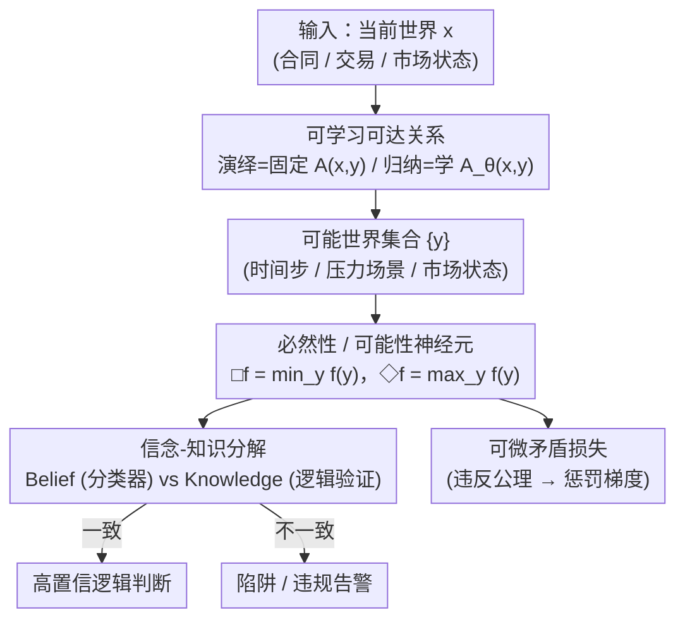

# Modal Logical Neural Networks for Financial AI

**会议**: ICLR 2026  
**arXiv**: [2603.12487](https://arxiv.org/abs/2603.12487)  
**代码**: [https://github.com/sulcantonin/torchmodal](https://github.com/sulcantonin/torchmodal)  
**领域**: 可解释性  
**关键词**: modal logic, neural networks, Kripke semantics, financial compliance, interpretable AI

## 一句话总结
提出模态逻辑神经网络（MLNN），将 Kripke 语义（必然/可能模态算子）集成到神经网络中，在金融合同安全审查、洗售合规和市场串谋检测中实现可审计的逻辑推理与深度学习性能的结合。

## 研究背景与动机

### 领域现状

**领域现状**：金融 AI 需要兼顾经验性能和可解释性/合规性。深度学习有性能但不可解释；符号逻辑可解释但难以处理非结构化数据。

**现有痛点**：现有方法要么将逻辑约束作为后处理验证（不保证训练过程中的合规性），要么将逻辑编码为硬编码规则（缺乏灵活性、无法学习隐含结构）。

**切入角度**：用模态逻辑的"必然"（□）和"可能"（◇）算子编码金融约束。必然性神经元在所有可达"可能世界"（时间步/压力场景/市场状态）上强制约束。

**核心 idea**：将模态逻辑的 Kripke 语义转化为可微神经网络层，通过可微矛盾损失在训练过程中强制逻辑公理。

## 方法详解

### 整体框架

MLNN 把模态逻辑的 Kripke 语义搬进神经网络：每个输入对应一个"当前世界"，经可达关系连到若干"可能世界"（时间步、压力场景或市场状态），必然性/可能性算子在这些世界上聚合，再由信念-知识两路给出可微的逻辑判断。框架提供两种工作模式——演绎模式固定可达关系（如时间逻辑里的"未来时刻"），直接用模态神经元编码已知约束；归纳模式则把可达关系本身当作可学习参数，从数据里发现信任网络、串谋结构等隐含拓扑。

### 关键设计

**1. 可学习可达关系：让模型自己学出谁能到达谁**

可达关系决定"当前世界"能看到哪些"可能世界"，是模态算子聚合的前提。演绎模式下它由领域知识固定（如时间逻辑里的"未来时刻"）；归纳模式下不再人工指定，而是由 $A_\theta(x,y) = \sigma\big((e_x^{\top} W e_y)/\tau\big)$ 学出来——$e_x, e_y$ 是世界嵌入，$W$ 是可学习的双线性权重，温度 $\tau$ 控制可达判定的软硬：$\tau$ 越小越接近 0/1 的硬连接。在金融数据上学到的 $\tau=0.02$ 几乎是硬约束，说明模型自发偏好严格的模态推理而非模糊的概率关联；这也让串谋检测里"谁信任谁"的网络结构直接从交易数据浮现出来（串谋者间信任权重 0.9997、非串谋者 0.00）。

**2. 必然性/可能性神经元（□/◇）：把"在所有可能世界都成立"变成可微算子**

有了可达世界，"压力情景下合同必须保持安全""任意未来时刻都不得违规"这类监管语句，本质是对这些世界的全称/存在量化。MLNN 用 $\square f(x) = \min_{y:\,A(x,y)} f(y)$ 实现必然性——对当前世界 $x$ 的所有可达状态 $y$ 取 $f$ 的最小值，只要有一个可达世界违反约束，最小值就被拉低，逻辑上的"全称量化"被自然翻译成数值上的下确界；对偶的可能性算子取最大值 $\Diamond f(x) = \max_{y:\,A(x,y)} f(y)$，对应"存在某个可能世界成立"。因为聚合用的是 min/max 而非硬判断，整条逻辑链能直接进入梯度优化，监管语句于是成为可训练的网络层而非事后检查。

**3. 信念-知识分解：区分"模型以为安全"和"逻辑验证安全"**

只看分类器的输出会漏掉表层信号背后的逻辑陷阱，于是 MLNN 把判断拆成 Belief（分类器主观认为的结果）和 Knowledge（经模态逻辑公理验证后成立的结果）两路。两者一致时给出高置信结论，不一致时则暴露风险——典型场景是标题写着"安全"、条款里却埋着陷阱的合同：纯分类器只看表层信号会判为安全（Belief 高），而 Knowledge 一侧在逻辑验证时发现公理被违反，于是触发"陷阱检测"。实验里 Belief-Knowledge 分离度达 0.995，这种显式分解正是模型能在合同陷阱检测上达到 100% 的来源。

### 损失函数 / 训练策略

训练目标在标准任务损失之外叠加一项可微矛盾损失：当中间表征违反逻辑公理（如必然性算子下仍存在不安全的可达世界）时，该项产生正的惩罚梯度，把不合规直接转化为训练信号。这使得合规约束在训练过程中被强制满足，而非依赖事后验证。

## 实验关键数据

### 主实验

| 应用 | 指标 | MLNN | 基线 |
|------|------|------|------|
| 合同安全审查 (CUAD) | F1 | 0.883 | - |
| 合同陷阱检测 | Accuracy | **100%** | 96.6% |
| 洗售合规 (RL) | 违规次数 | **0** | 1 |
| 市场串谋检测 | 信任权重(串谋者) | **0.9997** | - |
| 市场串谋检测 | 信任权重(非串谋) | **0.00** | - |

### 消融实验

| 分析 | 结果 |
|------|------|
| Belief-Knowledge 分离度 | 0.995（高分离表明有效区分验证知识与推测）|
| 解释分类 | 475 验证安全 / 155 陷阱检测 / 19 不确定 |
| 洗售合规后利润 | 12.86（vs 无约束 17.96，合规代价合理）|

### 关键发现
- MLNN 将监管要求转化为可微损失项——在训练过程中强制合规，而非事后验证
- 学到的 $\tau=0.02$ 说明金融领域需要严格的模态约束
- 合同陷阱检测 100% vs 96.6%——模态逻辑的信念-知识分解揭示了纯分类器遗漏的隐性风险

## 亮点与洞察
- **监管约束→可微损失**的范式转换：不是在模型外部检查合规，而是让不合规变成训练中的"梯度信号"
- **可学习可达关系**可以从数据中自动发现信任/串谋网络——归纳模态逻辑的实用价值

## 局限与展望
- 框架需要领域专家指定逻辑公理，自动化程度有限
- 仅在特定金融场景验证，通用性待扩展
- $\min$ 操作可能导致梯度问题

## 相关工作与启发
- **vs Logic Tensor Networks**：LTN 用一阶逻辑，MLNN 扩展到模态逻辑——可以推理"在所有可能场景下"
- **vs Constrained RL**：传统约束 RL 用拉格朗日乘子，MLNN 直接将约束编码为网络结构

## 评分
- 新颖性: ⭐⭐⭐⭐⭐ 首次将模态逻辑 Kripke 语义深度集成到神经网络
- 实验充分度: ⭐⭐⭐⭐ 三个金融应用场景，但缺乏大规模对比实验
- 写作质量: ⭐⭐⭐⭐ 逻辑严谨，但形式化门槛较高
- 价值: ⭐⭐⭐⭐⭐ 为可信 AI 提供了新的理论工具

<!-- RELATED:START -->

## 相关论文

- [\[ICLR 2026\] Addressing Divergent Representations from Causal Interventions on Neural Networks](addressing_divergent_representations_causal.md)
- [\[ICLR 2026\] SALVE: Sparse Autoencoder-Latent Vector Editing for Mechanistic Control of Neural Networks](salve_sparse_autoencoder-latent_vector_editing_for_mechanistic_control_of_neural.md)
- [\[CVPR 2026\] Hidden Monotonicity: Explaining Deep Neural Networks via their DC Decomposition](../../CVPR2026/interpretability/hidden_monotonicity_explaining_deep_neural_networks_via_their_dc_decomposition.md)
- [\[ACL 2026\] NOSE: Neural Olfactory-Semantic Embedding with Tri-Modal Orthogonal Contrastive Learning](../../ACL2026/interpretability/nose_neural_olfactory-semantic_embedding_with_tri-modal_orthogonal_contrastive_l.md)
- [\[ICLR 2026\] Cross-Modal Redundancy and the Geometry of Vision-Language Embeddings](cross-modal_redundancy_and_the_geometry_of_vision-language_embeddings.md)

<!-- RELATED:END -->
