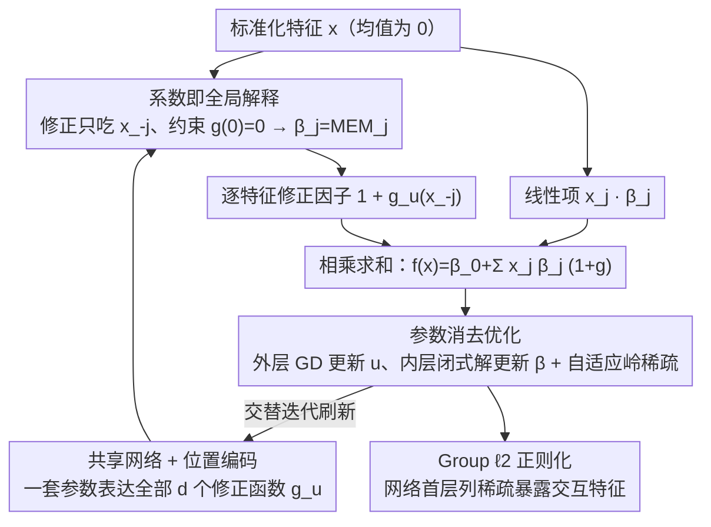

# NIMO: a Nonlinear Interpretable MOdel

**会议**: ICLR 2026  
**arXiv**: [2506.05059](https://arxiv.org/abs/2506.05059)  
**代码**: 无  
**领域**: 可解释机器学习  
**关键词**: interpretable model, marginal effects, linear regression, neural networks, feature effects

## 一句话总结

NIMO 提出一种混合模型 $y = \sum_j x_j \beta_j (1 + g_{\mathbf{u}_j}(\mathbf{x}_{-j}))$，在保留线性回归系数全局可解释性（通过均值边际效应 MEM）的同时，利用神经网络提供逐实例的非线性修正，并通过参数消去法高效联合优化线性系数和网络参数。

## 研究背景与动机

**准确性 vs 可解释性困境**：线性回归通过系数提供清晰的特征效应解释，但预测能力有限；神经网络预测强大但缺乏内在可解释性，被视为"黑箱"。

**后验解释的不可靠性**：SHAP、LIME 等后验解释方法依赖超参数选择，不保证保真度（fidelity）。

**已有混合方法的局限**：NAM 无法捕捉特征交互；LassoNet 全局解释性受限；IMN 为每个实例预测不同系数，丧失全局解释性。

**特征效应的重要性**：在医疗等高风险领域，需要同时回答局部问题（"对这个病人年龄增加如何影响风险"）和全局问题（"年龄总体上如何影响风险"）。

**优化挑战**：当线性系数 $\boldsymbol{\beta}$ 和神经网络参数 $\mathbf{u}$ 紧密耦合时，联合优化非 trivial。

## 方法详解

### 整体框架

NIMO 的出发点是普通线性回归，但给每个特征的系数乘上一个由"其它特征"决定的非线性修正因子，从而既保留 $\beta_j$ 的全局解释力、又获得逐实例的灵活性。完整模型写作 $f(\mathbf{x}) = \beta_0 + \sum_{j=1}^d x_j \beta_j (1 + g_{\mathbf{u}_j}(\mathbf{x}_{-j}))$：输入标准化后的特征，线性项 $x_j\beta_j$ 与神经网络产出的修正因子 $1+g$ 逐特征相乘再求和，得到预测 $f(\mathbf{x})$。训练时不直接联合优化彼此耦合的线性系数 $\boldsymbol{\beta}$ 与网络参数 $\mathbf{u}$，而是外层用梯度下降更新 $\mathbf{u}$、内层用闭式解刷新 $\boldsymbol{\beta}$，交替迭代直至收敛。整套设计始终绕着一个核心目标转：让系数 $\beta_j$ 严格等于均值边际效应 $\text{MEM}_j$，于是"读系数"就等价于"读全局特征效应"。

### 关键设计

**1. 系数即全局解释：靠两道约束把 $\beta_j$ 钉死成均值边际效应**

这是 NIMO 的理论卖点，由两道彼此衔接的约束共同保证。第一道是**排除自身特征**：若修正网络也吃进 $x_j$，对 $x_j$ 求边际效应时网络会贡献额外的、依赖样本的项，$\beta_j$ 就再也无法独立代表"$x_j$ 对 $y$ 的效应"。NIMO 强制每个 $g_{\mathbf{u}_j}$ 只接收 $\mathbf{x}_{-j}$，于是 $x_j$ 唯一的进入路径就是线性项 $x_j\beta_j$，非线性只负责刻画特征之间的交互如何放大或削弱第 $j$ 个系数。第二道是**零点约束** $g_{\mathbf{u}_j}(\mathbf{0})=0$：仅排除自身特征还不够，修正因子 $1+g$ 在一般点上仍会偏离 1、令边际效应随样本漂移；NIMO 把数据标准化到均值为零，并在前向传播中显式减去 $g_{\mathbf{u}}(\mathbf{0})$ 强制 $g$ 在原点取零。两道约束合在一起，使均值点 $\mathbf{x}=\mathbf{0}$ 处修正因子恰为 1、模型退化成纯线性，于是均值边际效应

$$\text{MEM}_j = \frac{\partial f}{\partial x_j}\Big|_{\mathbf{x}=\mathbf{0}} = \beta_j$$

精确成立——"系数即全局解释"不再是近似，而是被设计强制出来的等式。

**2. 共享网络 + 位置编码：让方法在高维下可行**

朴素实现要为每个特征配一个独立网络 $g_{\mathbf{u}_j}$，$d$ 一大参数量就爆炸、不可行。NIMO 改用单个共享网络 $g_\mathbf{u}$，再为每个特征索引附加位置编码作为输入来区分，从而用一套参数表达全部 $d$ 个修正函数。这把模型规模从随 $d$ 线性增长压回常数级，是它能跑到 50 维设置而不失稳的关键工程支撑，也让前一道可解释性约束在真实维度下仍然成立。

**3. 参数消去优化：用 profile likelihood 拆开耦合，并在闭式框架里实现稀疏**

$\boldsymbol{\beta}$ 与网络参数 $\mathbf{u}$ 紧密耦合时直接联合优化很不稳定。NIMO 借鉴 profile likelihood 思路：固定 $\mathbf{u}$ 时，关于 $\boldsymbol{\beta}$ 的子问题是带岭项的最小二乘，存在闭式解

$$\hat{\boldsymbol{\beta}}(\mathbf{u}) = (B_\mathbf{u}^T B_\mathbf{u} + \lambda I)^{-1} B_\mathbf{u}^T \mathbf{y}$$

其中 $B_\mathbf{u}$ 是把修正因子吸收进去后的设计矩阵。把这个解回代，目标函数就只剩 $\mathbf{u}$ 一个变量，外层用梯度下降优化 $\mathbf{u}$、内层每步用闭式解刷新 $\boldsymbol{\beta}$，高度耦合的联合优化被拆成干净的嵌套结构。稀疏却带来一个冲突：它需要的 Lasso（$\ell_1$ 惩罚）没有闭式解，会破坏上面的嵌套。NIMO 用 Grandvalet (1998) 的自适应岭回归代替 Lasso——把 $\ell_1$ 改写成逐特征重加权的 $\ell_2$ 惩罚，每一步仍是岭回归因而保留闭式解，而在最优点处可证明等价于 Lasso；实现上还支持 sub-$\ell_1$ 伪范数以减轻对大系数的过度收缩。这样既不破坏参数消去的闭式性，又能把无关特征的系数干净地压到零。

**4. Group $\ell_2$ 正则化：暴露特征级的交互稀疏**

线性系数只告诉我们"哪些特征有线性效应"，却看不出"哪些特征参与了交互"。NIMO 在共享网络第一层权重矩阵上，对每一列（对应一个输入特征）施加 group $\ell_2$ 惩罚；当某个特征对所有修正函数都无贡献时，整列权重被一起压零，等价于把它从非线性交互中剔除。这提供了线性系数之外的第二层可解释性，让读者既能读出线性效应、也能读出交互结构。

### 损失函数 / 训练策略

回归任务的目标是带稀疏惩罚的最小二乘 $\|\mathbf{y} - B_\mathbf{u}\boldsymbol{\beta}\|^2 + \lambda \|\boldsymbol{\beta}\|_1$，其中 $\ell_1$ 项通过上述自适应岭逐步逼近。分类任务则通过 IRLS（迭代重加权最小二乘）把对数似然近似为加权最小二乘，从而沿用同一套参数消去框架，并自然扩展到逻辑回归等 GLM。整体训练是一个两层循环：外层对网络参数 $\mathbf{u}$ 做梯度下降，内层对 $\boldsymbol{\beta}$ 用闭式解更新，二者交替直至收敛。

## 实验关键数据

### 主实验

合成回归数据集上的 MSE：

| 方法 | Setting 1 (5维) | Setting 2 (10维) | Setting 3 (50维) |
|------|---------|----------|----------|
| Lasso | 3.164 | 3.340 | 13.122 |
| NN | 1.109 | 1.482 | 13.718 |
| NAM | 3.427 | 5.126 | 16.543 |
| IMN | 0.137 | 1.188 | 6.308 |
| LassoNet | 0.078 | 2.612 | 1.738 |
| **NIMO** | **0.024** | **0.197** | **0.380** |

NIMO 在所有设置中大幅领先，50 维场景优势超过 4 倍。

### 消融实验

| 组件 | 影响 |
|------|------|
| 移除 $g_j$（纯线性） | 系数准确但拟合差 |
| 允许 $g_j$ 依赖 $x_j$ | 系数不可解释 |
| 移除零点约束 | MEM 不再等于 $\beta_j$ |
| 移除 group $\ell_2$ | 无法识别非交互特征 |
| 移除稀疏 | 无法正确恢复零系数 |

Toy example 验证（3维）：

| 指标 | NIMO | Lasso |
|------|------|-------|
| $\beta_1=3, \beta_2=-3$ 恢复 | 精确 | 精确 |
| $\beta_3=0$ 识别 | 正确为零 | 非零 |
| 非线性交互恢复 | 与真值吻合 | N/A |

### 关键发现

- 低数据量（200 样本）下仍鲁棒，得益于参数消去和正则化
- 纯线性验证中网络部分不干扰线性系数恢复
- MEM 特征排序与 SHAP 排序高度一致，但 NIMO 是内在的而非后验近似
- 在 diabetes、Boston、superconductivity 数据集上预测性能与最佳方法相当或更优

## 亮点与洞察

1. **设计优雅**：三个精巧约束（排除自身特征、零点约束、标准化）保证 MEM = $\beta$
2. **参数消去的巧妙**：profile likelihood 思想应用于混合模型优化
3. **多层次可解释性**：全局层面看 $\beta_j$、实例层面看 $h_j(\mathbf{x})$、交互层面看第一层权重稀疏模式
4. **与 GLM 自然扩展**：通过 IRLS 可直接应用于逻辑回归等 GLM
5. **自适应岭等价 Lasso**：利用经典结果在保持闭式解的同时实现稀疏

## 局限与展望

- 极高维 ($d > 1000$) 的可扩展性未验证
- 假设非线性修正来自其他特征交互，忽略了特征自身非线性效应
- 实验数据集规模较小（UCI），大规模数据表现未知
- 与 EBM、GAMI-Net 等更多可解释方法对比不足
- 目前仅支持表格数据

## 相关工作与启发

- **NAM (Agarwal et al., 2021)**：可加模型无交互 → NIMO 通过 $g_j(\mathbf{x}_{-j})$ 支持交互
- **LassoNet (Lemhadri et al., 2021)**：稀疏+非线性但全局解释性受限 → NIMO 兼具
- **IMN (Kadra et al., 2024)**：逐实例系数失去全局性 → NIMO 全局+局部统一
- **Grandvalet (1998)**：自适应岭等价 Lasso 的理论基础 → 融入 NIMO 优化
- **启发**：可推广到时间序列（时变系数）、因果推断（处理效应异质性修正）

## 评分

- **新颖性**: ⭐⭐⭐⭐ 模型设计巧妙，MEM=$\beta$ 的理论保证是核心创新
- **实验充分度**: ⭐⭐⭐ 合成+真实实验验证充分，但数据规模小
- **写作质量**: ⭐⭐⭐⭐⭐ 动机清晰、toy example 直观、理论与实验紧密结合
- **价值**: ⭐⭐⭐⭐ 为"准确且可解释"提供实用方案，高风险领域有强应用潜力

<!-- RELATED:START -->

## 相关论文

- [\[ICML 2026\] Prototype Transformer: Towards Language Model Architectures Interpretable by Design](../../ICML2026/interpretability/prototype_transformer_towards_language_model_architectures_interpretable_by_desi.md)
- [\[ICLR 2026\] Hidden Breakthroughs in Language Model Training](hidden_breakthroughs_in_language_model_training.md)
- [\[ACL 2026\] AdaptiveK: Complexity-Driven Sparse Autoencoders for Interpretable Language Model Representations](../../ACL2026/interpretability/adaptivek_complexity-driven_sparse_autoencoders_for_interpretable_language_model.md)
- [\[ICLR 2026\] Evolution of Concepts in Language Model Pre-Training](evolution_of_concepts_in_language_model_pre-training.md)
- [\[ICLR 2026\] Decomposing Representation Space into Interpretable Subspaces with Unsupervised Learning](decomposing_representation_space_into_interpretable_subspaces_with_unsupervised_.md)

<!-- RELATED:END -->
