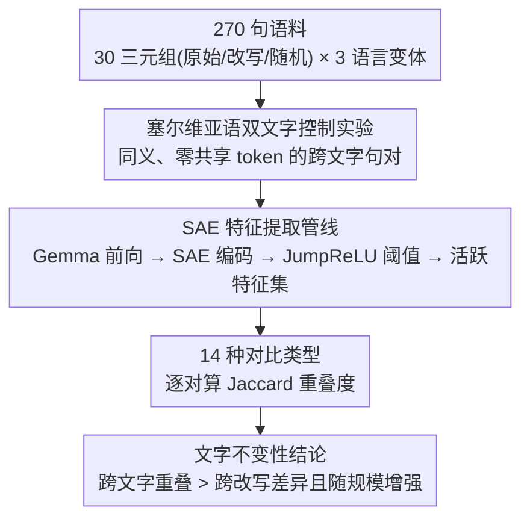

# One Language, Two Scripts: Probing Script-Invariance in LLM Concept Representations

**会议**: ICLR 2026  
**arXiv**: [2603.08869](https://arxiv.org/abs/2603.08869)  
**代码**: 无  
**领域**: LLM可解释性/多语言  
**关键词**: Sparse Autoencoders, 文字不变性, 塞尔维亚语双文字, 语义表示, 可解释性

## 一句话总结
利用塞尔维亚语双文字系统(拉丁/西里尔文)作为天然控制实验，探究Sparse Autoencoders(SAE)学到的特征是否捕获了超越表面token化的抽象语义：发现跨文字的相同句子激活高度重叠的SAE特征(Jaccard~0.58)，且切换文字造成的表征差异小于同文字内的改写差异，且此不变性随模型规模增强，表明SAE特征确实捕获了超越正字法的语义结构。

## 研究背景与动机

**领域现状**：SAE(Sparse Autoencoders)已成为机制可解释性的关键工具，可将神经网络激活分解为稀疏、可解释的特征。但一个基本问题未解答：SAE学到的特征到底代表抽象语义，还是绑定于文本的具体书写形式？

**现有痛点**：跨语言表征研究(多语BERT/XLM-R)虽然展示了跨语言迁移，但不同语言存在词汇、语法、文化差异，难以严格控制变量。Hindi-Urdu的跨文字研究因文字映射不完美而引入噪声。

**核心矛盾**：需要一个理想的控制实验——保持语义完全不变，只改变书写形式，同时确保token化完全不同。这样才能干净地测试SAE特征是否真正捕获语义。

**切入角度**：塞尔维亚语是极少数拥有活跃双文字系统的语言——拉丁文和西里尔文在日常生活中交替使用，存在确定性的无损字符映射。关键是：两种文字被tokenizer完全不同地分词，共享零个token。这是完美的控制实验。

**核心 idea**：塞尔维亚语双文字提供自然控制实验，证明了SAE特征捕获的是超越表面token化的抽象语义表征。

## 方法详解

### 整体框架
这篇论文要回答一个干净的问题：稀疏自编码器(Sparse Autoencoders, SAE)学到的特征代表的是抽象语义，还是绑在具体的书写形式上？为了把"语义"和"正字法"彻底拆开，作者借塞尔维亚语的双文字系统搭了一个天然控制实验——同一句话的拉丁文版和西里尔文版语义完全相同，却被 tokenizer 切成毫无重叠的两串 token。整条流程是：先准备 30 个句子三元组(原始/改写/随机) × 3 种语言变体(英文/塞尔维亚拉丁/塞尔维亚西里尔)共 270 个句子，并由双文字控制实验构造出"语义恒定、表面全变"的跨文字句对；再把每个句子喂进 Gemma 模型族(270M–27B)，在目标层取激活、过 SAE(65536 个特征)编码成活跃特征集；最后用 Jaccard 重叠度横扫 14 种对比类型，看跨文字、跨改写、跨语言各自的特征重合程度，从而判断 SAE 特征是否超越了表面 token 化。

### 关键设计

**1. 塞尔维亚语双文字作为控制实验：把语义恒定、表面全变的理想对照变成现实**

跨语言表征研究一直绕不开混杂因素——不同语言的词汇、语法、文化都在变，无法干净归因。塞尔维亚语的特殊之处在于它有一套活跃的双文字系统：拉丁文和西里尔文在日常生活里交替使用，二者之间存在确定性的无损字符映射。于是同一句话的两个文字版本语义完全一致(LaBSE 验证跨文字语义相似度 >0.95)，但 tokenizer 把它们切成共享零个 token 的两串序列。这样就构造出"语义恒定、所有表面特征(token 化)全变"的理想对照，确定性映射保证了零语义漂移，从根上消除了词汇/语法/文化的干扰。

**2. SAE 特征提取管线：把一个句子映射成一组可比对的活跃特征**

为了量化"两句话激活了多重叠的特征"，需要先把句子统一映射成特征集合。管线是：句子经 tokenizer 切分后送入 Gemma 前向传播，取目标层最后一个 token 的 hidden state，过 SAE 编码器得到 65536 维激活，再用 JumpReLU 阈值($\tau=0.1$)筛出活跃特征，得到特征集 $F(s) = \{i : a_i > \tau\}$。这里用 last-token pooling 而非 mean pooling 是因为实验验证前者更稳健；固定阈值 $\tau=0.1$ 对应 JumpReLU 的标准设置。

**3. 14 种对比类型的系统设计：用多层次对照把"文字不变性"和混杂因素分开**

光看一两个跨文字对比说服力不够，得用一组层层递进的对照确认重叠确实由语义驱动。作者对每对句子算 Jaccard 相似度

$$J(s_1, s_2) = \frac{|F(s_1) \cap F(s_2)|}{|F(s_1) \cup F(s_2)|}$$

这个值从 0(无重叠)到 1(完全相同)，每种对比类型在 30 个句子对上取平均、并跨所有模型和层汇报。在此之上按维度铺开 14 种对比：基线层是同文字内的原始 vs 改写(语义相似)、原始 vs 随机(语义无关)；核心测试层是跨文字原始(只变文字)和跨文字改写(文字+措辞都变)；噪声层是跨文字随机和跨语言随机。把这些放在一起，就能看清跨文字的高重叠到底是语义对齐的结果，还是别的混杂因素带来的假象。

## 实验关键数据

### 主实验：跨文字表征不变性(所有模型平均)

| 对比类型 | 平均Jaccard相似度 |
|---------|-----------------|
| 跨文字原始(同句不同文字) | 0.58 |
| 跨文字改写(不同改写不同文字) | 0.59 |
| 跨文字交叉改写 | 0.47 |
| 跨文字随机 | 0.28 |
| 跨语言随机 | 0.19 |

### 消融：模型规模效应

| 模型 | 跨文字原始 | 跨文字随机 | 差值(信号-噪声) |
|------|-----------|-----------|---------------|
| Gemma-270M | 0.501 | 0.421 | 0.080 |
| Gemma-1B | 0.537 | 0.324 | 0.213 |
| Gemma-4B | 0.571 | 0.253 | 0.318 |
| Gemma-12B | 0.624 | 0.233 | 0.391 |
| Gemma-27B | 0.649 | 0.211 | 0.438 |

### 关键发现
- **文字变化 < 改写变化**：跨文字原始(0.58)高于同文字改写(0.54)，说明改变文字比改变措辞造成更小的表征差异——SAE特征优先编码语义而非正字法
- **语义层次清晰**：跨文字原始(0.58) >> 跨文字交叉改写(0.47) >> 跨文字随机(0.28) >> 跨语言随机(0.19)，完美符合语义相似度预期
- **规模效应显著**：跨文字原始从270M的0.50提升到27B的0.65，同时随机基线从0.42降到0.21——更大模型发展出更robust的文字无关表征
- **反驳记忆假说**：跨文字交叉改写(拉丁原始vs西里尔改写)在训练数据中几乎不会共现，但仍有0.47的overlap，说明是真正的语义对齐而非记忆

## 亮点与洞察
- **塞尔维亚语双文字作为通用评估范式**：这是一个极其优雅的控制实验设计——利用自然语言的特殊性质消除了所有混杂变量。可以成为评估任何表征学习方法是否捕获抽象语义的标准测试
- **"文字变化<改写变化"**是非常反直觉且有力的发现：完全不同的token序列却比同文字的改写更相似，有力证明SAE特征超越了token层面
- **规模效应的双向性**：大模型不仅增加了跨文字相似度(真正的语义对齐)，还降低了随机基线(更好的特征稀疏性)——两个方向同时改善
- **方法极简但洞察深刻**：不需要复杂的模型或训练，仅靠精心设计的对比实验就得出了关于LLM表征本质的重要结论

## 局限与展望
- 仅测试Gemma模型族，其他架构(LLaMA/GPT)和不同训练方法的SAE可能不同
- 仅30个句子三元组，规模和领域覆盖有限
- 仅测量特征重叠，未建立因果关系——需要activation patching/feature ablation验证共享特征是否真正驱动跨文字理解
- 塞尔维亚语的确定性映射是理想情况，其他多文字语言(日文汉字/假名)映射更复杂
- 识别哪些具体的SAE特征最具文字不变性可能揭示可解释的语义锚点

## 相关工作与启发
- **vs 多语BERT研究(Pires et al.)**: 多语BERT的跨语言迁移可能受词汇重叠影响。塞尔维亚双文字完全消除了这个混杂因素
- **vs Hindi-Urdu研究**: Hindi-Urdu文字映射不完美(词汇差异/文化差异)。塞尔维亚的确定性映射提供了更干净的控制
- **vs SAE可解释性研究(Bricken/Cunningham)**: 之前的SAE研究主要在单语言英文上。本文首次从跨文字角度评估SAE特征的语义抽象性

## 评分
- 新颖性: ⭐⭐⭐⭐⭐ 塞尔维亚双文字作为控制实验的idea极其优雅，是这类研究的理想测试
- 实验充分度: ⭐⭐⭐ 5个模型规模覆盖充分，但数据集太小(30句)且仅一个模型族
- 写作质量: ⭐⭐⭐⭐⭐ 实验设计清晰，结论推导严谨
- 价值: ⭐⭐⭐⭐ 对理解LLM表征本质有重要贡献，提出了可复用的评估范式

<!-- RELATED:START -->

## 相关论文

- [\[ACL 2026\] Rhetorical Questions in LLM Representations: A Linear Probing Study](../../ACL2026/interpretability/rhetorical_questions_in_llm_representations_a_linear_probing_study.md)
- [\[ICLR 2026\] Dynamic Reflections: Probing Video Representations with Text Alignment](dynamic_reflections_probing_video_representations_with_text_alignment.md)
- [\[ICLR 2026\] Semantic Regexes: Auto-Interpreting LLM Features with a Structured Language](semantic_regexes_auto-interpreting_llm_features_with_a_structured_language_of_re.md)
- [\[AAAI 2026\] Concepts from Representations: Post-hoc Concept Bottleneck Models via Sparse Decomposition of Visual Representations](../../AAAI2026/interpretability/concepts_from_representations_post-hoc_concept_bottleneck_models_via_sparse_deco.md)
- [\[ICLR 2026\] Evolution of Concepts in Language Model Pre-Training](evolution_of_concepts_in_language_model_pre-training.md)

<!-- RELATED:END -->
