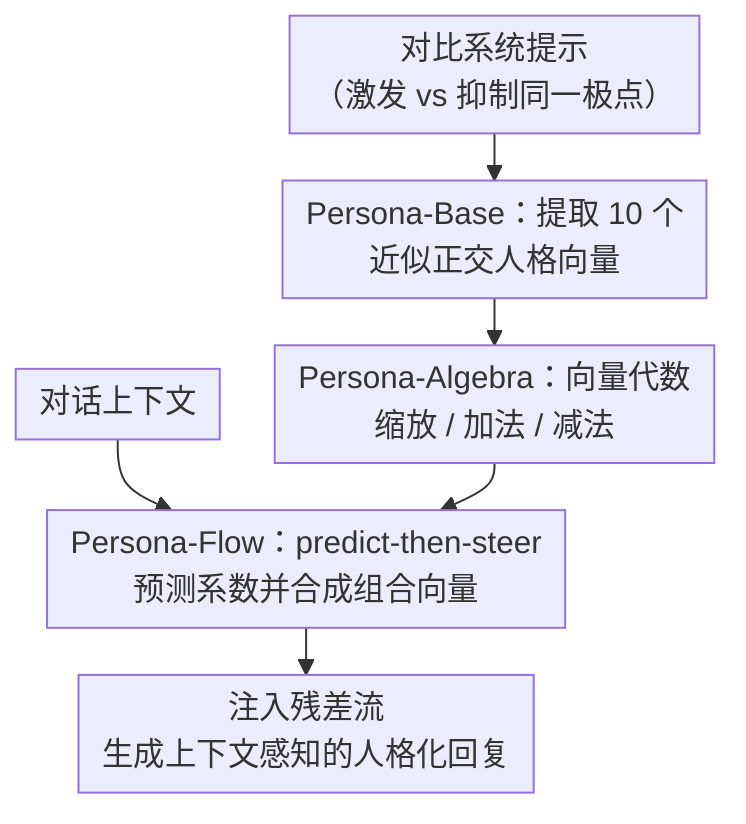

# PERSONA: Dynamic and Compositional Inference-Time Personality Control via Activation Vector Algebra

**会议**: ICLR 2026  
**arXiv**: [2602.15669](https://arxiv.org/abs/2602.15669)  
**代码**: [GitHub](https://github.com/) (论文声明公开)  
**领域**: 机器人  
**关键词**: personality control, activation steering, vector algebra, inference-time, Big Five

## 一句话总结

提出 PERSONA 框架，通过在激活空间中提取近似正交的人格向量并进行向量代数运算（缩放、加法、减法），实现免训练的动态组合式人格控制，在 PersonalityBench 上达到 9.60 分，几乎匹配 SFT 上界 9.61。

## 研究背景与动机

1. LLM 人格控制在医疗、教育和社会模拟中至关重要，但现有方法存在明显缺陷

**Prompting 方法**（如简单提示词、P²归纳）不稳定且不一致，难以精确控制人格表达

**微调方法**（SFT / LoRA）需要大量计算资源，每种人格配置都要独立训练
4. 更根本的问题：现有方法将人格视为静态和整体式的，无法捕捉人类行为特征的动态性和组合性
5. 核心洞察：人格特征在模型的表示空间中表现为可提取的、近似正交的方向，支持代数运算
6. 这将人格控制问题从文本工程或梯度优化转化为高维空间中的向量算术问题

## 方法详解

### 整体框架

PERSONA 把人格控制重新表述成高维激活空间里的向量算术：先从模型残差流中提取出 Big Five（OCEAN）十个极点的近似正交方向向量当作"原子"，再用缩放、加法、减法这些代数运算把它们组合成想要的人格，最后在推理时根据对话上下文动态决定每个维度该用多大的系数并注入残差流。整个流程完全免训练，三个核心模块 Persona-Base、Persona-Algebra、Persona-Flow 沿"造原子 → 做组合 → 动态调"一路串起来，分别解决"怎么拿到向量""向量怎么算""推理时怎么按情境用"三个问题；配套的 Persona-Evolve 基准则提供 800 个多轮对话场景来检验动态人格表达。

### 关键设计

**1. Persona-Base：把抽象人格提炼成可操作的方向向量**

人格本身是抽象的行为倾向，没法直接当作控制旋钮，所以第一步要给它找到表示空间里的几何对应物。PERSONA 采用对比激活分析（contrastive activation analysis）：对同一维度的两个极点（例如外向 vs 内向）各写若干组激发与抑制的对比系统提示，分别采集模型在正、负条件下某层残差流的激活，取两者的均值差作为该极点的方向向量 $v_l$。这样得到的十个向量（OCEAN 五维 × 正负两极）构成人格控制的"原子"，余弦相似度热力图显示它们之间近似正交、且对立极点对呈强负相关，说明每个方向确实编码了独立的特征语义，为后续的代数组合提供了一组干净、互不串扰的基。

**2. Persona-Algebra：用向量代数实现可预测的组合控制**

有了正交的原子向量，组合人格就不再需要重新训练或改写提示，而是直接在向量层面做算术。论文定义并验证了三类运算：标量乘法 $\alpha \cdot v$ 控制单个特征的强度，向量加法（如 $v_{outgoing} + v_{compassionate}$）把多个特征叠加成复合人格，向量减法（如 $v_{outgoing} - v_{solitary}$）则抑制不想要的倾向。为了证明这些运算"算得准"，作者把 BFI-44 人格问卷改编成行为评估，发现引导系数与对应维度得分高度线性，Pearson 相关系数在大多数特征上超过 0.9——也就是说想让模型外向一点，调大 $\alpha$ 就能拿到成比例的行为变化，这种线性可预测性正是把控制问题交给代数的底气所在。

**3. Persona-Flow：推理时按上下文动态调制人格**

静态地固定一套系数无法应对真实对话里不断变化的情境，Persona-Flow 用 predict-then-steer（先预测、再引导）两阶段机制逐轮解决这一点。第一阶段分析当前对话上下文，为每个 OCEAN 维度预测一个调整系数 $\alpha_i \in [-2, +2]$；第二阶段只对超过阈值（$|\alpha_i| > 0.5$）的维度合成组合向量

$$v_{composite} = \sum_{i \in OCEAN} \alpha_i \cdot v_i$$

并在最优层注入残差流，从而在不依赖任何预设脚本的情况下实现上下文感知的实时人格调节——情境相关的特征被增强、冲突的特征被抑制。由于调制只发生在前向激活上，它既保留了 Persona-Algebra 的组合性又获得了动态性，是 PERSONA 区别于以往静态、整体式方法的关键。

### 损失函数 / 训练策略

整个方法完全免训练（training-free），不涉及任何梯度更新。所有控制都归结为推理时在残差流上的一次加法：

$$h_l \leftarrow h_l + \alpha \cdot v_l$$

其中 $v_l$ 是从最优层提取的人格向量，$\alpha$ 为引导系数，正负号分别放大或抑制相应的特征极，绝对值大小决定调制强度。

## 实验关键数据

### 主实验

| 方法 | Mean Score↑ | Variance↓ | 训练需求 |
|------|------------|-----------|----------|
| PERSONA-Base | **9.60** | 0.74 | 免训练 |
| NPTI | 9.43 | 0.49 | 免训练 |
| P² | 9.43 | 0.83 | 免训练 |
| Simple Prompt | 8.39 | 0.96 | 免训练 |
| PAS | 6.93 | 1.71 | 免训练 |
| ActAdd | 8.20 | 2.10 | 免训练 |
| SFT (上界) | 9.61 | 0.49 | 需微调 |

### 消融实验

| 模型 | TA | RC | RA | IF | Overall |
|------|----|----|----|----|---------|
| Qwen3-4B | 92.2 | 90.6 | 92.4 | 49.1 | **90.8** |
| Qwen2.5-14B | 84.8 | 86.4 | 84.8 | 59.3 | 85.4 |
| Llama-3.1-8B | 84.9 | 81.4 | 85.6 | 57.2 | 83.5 |
| Qwen2.5-7B | 84.7 | 84.4 | 85.0 | 61.4 | 83.4 |
| Ministral-8B | 74.3 | 73.2 | 74.2 | 48.0 | 73.2 |

### 关键发现

1. 免训练方法 PERSONA-Base（9.60）几乎匹配 SFT 上界（9.61），且方差更高但可接受
2. 向量的标量乘法与 BFI-44 维度分数呈强线性关系，证实人格特征的线性可编辑性
3. 部分特征存在不对称引导效应：与模型安全训练冲突的特征（如 self-interested）即使高系数也难以激活
4. 在 MMLU/TruthfulQA 上 Persona-Flow 保持或略微提升模型通用能力，不产生副作用
5. 更大模型容量增强人格控制能力：Qwen2.5 系列从 3B→14B 整体胜率从 78.4% 提升到 85.4%

## 亮点与洞察

1. **极致简洁的方法**：完全免训练，仅通过向量加减法实现 SFT 级人格控制，计算开销极低
2. **几何视角的突破**：将人格控制从"文本工程"转化为"向量算术"，揭示了 LLM 表示空间的可解释结构
3. **组合性 + 动态性**：通过 Persona-Flow 的 predict-then-steer 机制，首次实现上下文感知的实时人格调制
4. **正交性验证扎实**：通过余弦相似度热力图和因果干预实验验证向量间的独立性
5. **Persona-Evolve 基准**构建了 800 个多轮对话场景，填补了动态人格评估的空白

## 局限与展望

1. **不对称引导效应**：与安全对齐冲突的特征难以激活（如 self-interested 得分仅 20.8），限制了完全自由的人格控制
2. **Information Fidelity 指标偏低**（48-61%），表明维持事实准确性同时调整人格仍是挑战
3. **向量提取依赖特定模型**：当前使用 Qwen2.5-7B 提取向量，跨模型迁移方案尚不完善
4. **Persona-Flow 的额外推理开销**：predict-then-steer 需要额外的中间推理，增加延迟
5. 目前仅在 Big Five 框架下验证，能否扩展到更细粒度的人格维度有待探索

## 相关工作与启发

- **Representation Engineering**（Rimsky et al., 2024; Turner et al., 2023）：为激活引导提供方法论基础
- **NPTI**（Deng et al., 2025）：基于神经元的人格控制方法，但不支持组合操作
- **ActAdd**（Turner et al., 2023）：残差流修改的先驱，但人格控制不够精确（方差 2.10）
- 启发：这种向量代数视角可能推广到其他 LLM 行为控制（如风格、知识注入、安全对齐）

## 评分

- **新颖性**: ⭐⭐⭐⭐⭐ 将人格控制问题转化为向量代数运算的视角非常新颖，Persona-Flow 动态控制机制也是首创
- **实验充分度**: ⭐⭐⭐⭐ 多模型、多基准评估充分，但部分指标（IF）表现一般
- **写作质量**: ⭐⭐⭐⭐⭐ 论文结构清晰，从提取到代数到动态控制的递进逻辑非常流畅
- **价值**: ⭐⭐⭐⭐⭐ 免训练方法匹配 SFT 上界，在人格控制领域具有里程碑意义，实用价值极高

<!-- RELATED:START -->

## 相关论文

- [\[ICLR 2026\] SALVE: Sparse Autoencoder-Latent Vector Editing for Mechanistic Control of Neural Networks](salve_sparse_autoencoder-latent_vector_editing_for_mechanistic_control_of_neural.md)
- [\[NeurIPS 2025\] Dynamic Features Adaptation in Networking: Toward Flexible Training and Explainable Inference](../../NeurIPS2025/interpretability/dynamic_features_adaptation_in_networking_toward_flexible_training_and_explainab.md)
- [\[ICLR 2026\] Dynamic Reflections: Probing Video Representations with Text Alignment](dynamic_reflections_probing_video_representations_with_text_alignment.md)
- [\[ICML 2026\] Adaptive Querying with AI Persona Priors](../../ICML2026/interpretability/adaptive_querying_with_ai_persona_priors.md)
- [\[ICLR 2026\] Beyond Linear Probes: Dynamic Safety Monitoring for Language Models](beyond_linear_probes_dynamic_safety_monitoring_for_language_models.md)

<!-- RELATED:END -->
